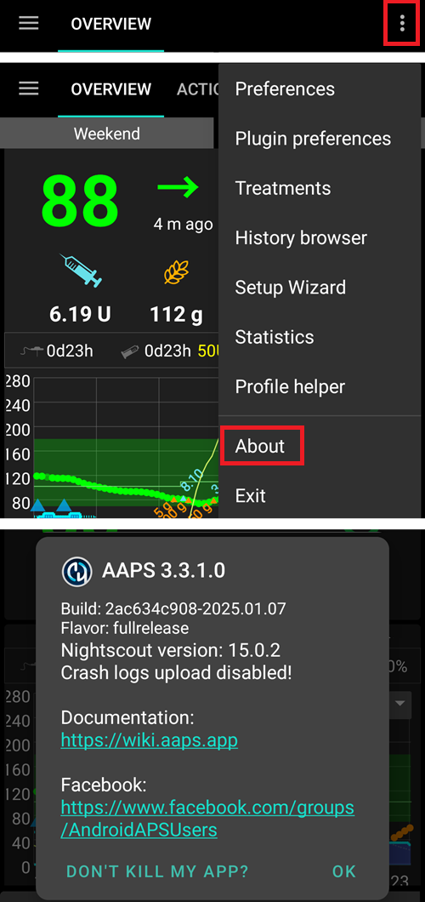

# Aggiorna a una nuova versione o ramo

## Costruisci te stesso invece di scaricare

**AAPS** non è disponibile per il download, a causa delle norme relative ai dispositivi medici. È legale costruire l'app per il proprio uso, ma non devi darne una copia ad altri! Vedi la pagina [FAQ](../UsefulLinks/FAQ.md) per i dettagli.

## Note importanti
* Aggiorna alla nuova versione di **AAPS** appena possibile dopo che una nuova versione è stata rilasciata.
* Quando è disponibile una nuova versione, nell'app **AAPS** stessa, riceverai una notifica informativa sulla nuova versione.
* La nuova versione sarà anche annunciata su Facebook al momento del rilascio.
* A seguito della pubblicazione, leggi in dettaglio le [note di rilascio](ReleaseNotes.md), e chiarisci eventuale domande con la communità, su Facebook o Discord, prima di procedere con l'aggiornamento.

  ```{note}
  Nel caso in cui desideri costruire **AAPS** su un nuovo computer: copia il tuo file keystore nel nuovo computer. Quindi segui la procedura [costruzione iniziale di **AAPS**](../SettingUpAaps/BuildingAaps.md) invece di questa guida. Con l'unica differenza che: invece di creare un nuovo keystore, puoi selezionare quello che hai copiato sul nuovo computer.
  ```

## Panoramica per l'aggiornamento a una nuova versione di AAPS

```{contents} Steps for updating to a new version of AAPS
:depth: 1
:local: true
```

In caso di problemi, vedi la pagina separata per la [risoluzione dei problemi Android Studio](../GettingHelp/TroubleshootingAndroidStudio).

### Esporta le tue impostazioni

Esporta le tue impostazioni dalla versione **AAPS** installata sul tuo telefono. Potresti non averne bisogno, ma prevenire è meglio che curare.

Vedi la pagina [Esporta & importa le impostazioni](ExportImportSettings.md) se non ti ricordi come farlo.

### Controlla la tua versione di Android Studio

La versione minima richiesta è specificata nelle [Istruzioni per la Costruzione](#Building-APK-recommended-specification-of-computer-for-building-apk-file). Se la tua versione è più vecchia, [aggiorna Android Studio](#Building-APK-install-android-studio) prima!

(Update-to-new-version-update-your-local-copy)=
### Aggiorna la tua copia locale

```{admonition} WARNING
:class: warning
If you update from versions prior to 2.8.x, please follow the instructions to do a [New clone](../SettingUpAaps/BuildingAaps.md), as this guide will not work for you!
```

* Apri il tuo progetto AAPS esistente con Android Studio. Potrebbe essere necessario selezionare il tuo progetto. (Doppio) clicca sul progetto AAPS.

  

* Nella barra di menu di Android Studio, seleziona Git -> Fetch

   

* Vedrai un messaggio nell'angolo in basso a destra che Fetch ha avuto successo.

   

* Nella barra di menu, ora seleziona Git -> Pull

   

* Lascia tutte le opzioni come sono (origin/master) e seleziona Pull

   

* Attendi mentre il download è in corso, vedrai questo come informazione nella barra in basso. Quando sarà fatto, vedrai un messaggio di successo.

  ```{note}
  Il numero di file aggiornati potrebbe essere diverso! Questa non è un'indicazione
  ```

   

* Gradle Sync verrà eseguito per scaricare alcune dipendenze. Attendi finché non sarà finito.

  

### Controlla la versione JVM

Questo controllo è particolarmente racommandato se hai già costruito una versione precedente di **AAPS** sullo stesso computer.

Controlla nelle [Istruzioni di Costruzione](#Building-APK-recommended-specification-of-computer-for-building-apk-file) le versioni necessarie per JVM e Gradle, corrispondenti alla versione **AAPS** che stai costruendo. Quindi segui i passaggi descritti in [Gradle JVM incompatibile](#incompatible-gradle-jvm) per assicurarti di utilizzare la versione corretta.

(Update-to-new-version-build-the-signed-apk)=
### Costruisci l'APK Firmato

Il tuo codice sorgente è ora la versione corrente rilasciata, e tutti i prerequisiti sono stati verificati. È tempo di costruire l'apk firmato come descritto nella sezione [costruisci l'apk firmato](#Building-APK-generate-signed-apk).

(Update-to-new-version-transfer-and-install)=

### Trasferisci e installa l'apk
Devi trasferire l'apk al telefono in modo da poterla installare.

```{note}
Se hai completato la build con lo stesso set di chiavi esistente in Android Studio, non è necessario disinstallare l'applicazione esistente sul telefono. Quando installi l'apk, segui le istruzioni per installare gli aggiornamenti.
Per altri scenari come la creazione di un nuovo set di chiavi in Android Studio per il tuo apk firmato, è necessario disinstallare la vecchia app prima di installare l'apk. **Assicurati di esportare le tue impostazioni!**
```

Vedi le istruzioni per [trasferire e installare AAPS](../SettingUpAaps/TransferringAndInstallingAaps.md)

(Update-to-new-version-check-aaps-version-on-phone)=
### Controlla la versione di AAPS sul telefono

Dopo aver installato il nuovo apk, è possibile controllare la versione AAPS sul telefono facendo clic sul menu a tre punti in alto a destra e poi su Informazioni su. Dovresti vedere la versione attuale.



Controlla le [note di rilascio](../Maintenance/ReleaseNotes.md) se ci sono istruzioni specifiche dopo l'aggiornamento.

## Risoluzione Dei Problemi

Se qualcosa va storto, non farti prendere dal panico.

Fai un respiro!

Quindi vedi nella pagina separata [risoluzione dei problemi Android Studio](../GettingHelp/TroubleshootingAndroidStudio) se il problema è già documentato!

Se hai bisogno di ulteriore aiuto, contatta gli altri utenti **AAPS** su [Facebook](https://www.facebook.com/groups/AndroidAPSUsers) o [Discord](https://discord.gg/4fQUWHZ4Mw).