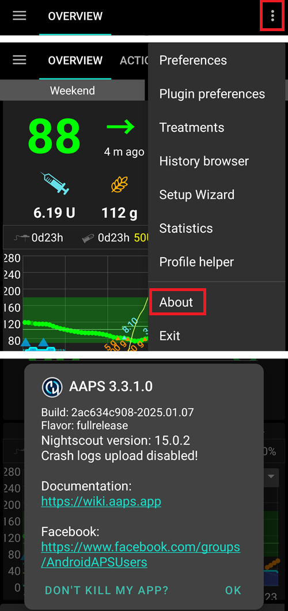

# Aggiorna a una nuova versione o ramo

## Costruisci te stesso invece di scaricare

**AAPS** non è disponibile per il download, a causa delle norme relative ai dispositivi medici. È legale costruire l'app per il proprio uso, ma non devi darne una copia ad altri! Vedi la pagina [FAQ](../UsefulLinks/FAQ.md) per i dettagli.

## Note importanti
* Aggiorna alla nuova versione di **AAPS** appena possibile dopo che una nuova versione è stata rilasciata.
* Quando è disponibile una nuova versione, nell'app **AAPS** stessa, riceverai una notifica informativa sulla nuova versione.
* La nuova versione sarà anche annunciata su Facebook al momento del rilascio.
* Dopo il rilascio, leggi le [Note di Rilascio](ReleaseNotes.md) in dettaglio e chiarisci eventuali dubbi con la community su Facebook o Discord, prima di procedere con l'aggiornamento.
* Non dimenticare di esportare le impostazioni di __AAPS__.

## Aggiornare AAPS con browser build

Se hai già costruito la tua app AAPS con il metodo Browser Build, segui [queste istruzioni](./UpdateBrowserBuild.md).

## Aggiornare AAPS con Android Studio

Segui [queste istruzioni.](./UpdateComputerBuild.md).

## Aggiornare AAPS con la riga di comando

Usa le [stesse istruzioni](../SettingUpAaps/CLIBuild.md) utilizzate per costruire AAPS in precedenza, ma scarica le nuove modifiche con git.

(Update-to-new-version-check-aaps-version-on-phone)=
### Controlla la versione di AAPS sul telefono

Controlla le [note di rilascio](../Maintenance/ReleaseNotes.md) se ci sono istruzioni specifiche dopo l'aggiornamento.

Dopo aver installato il nuovo apk:

- puoi verificare la versione di __AAPS__ sul tuo telefono cliccando sul menu a tre punti in alto a destra e poi su "Informazioni" (come mostrato nella schermata qui sotto). È possibile visualizzare la versione corrente di __AAPS__;
- assicurati che le impostazioni di importazione siano state eseguite;
- esegui una 'sincronizzazione completa' in __NSClient__ per assicurarti che __AAPS__ stia lavorando con dati accurati e completi; e
- controlla le impostazioni di __AAPS__ in __Preferenze__ e assicurati che siano ancora corrette.

