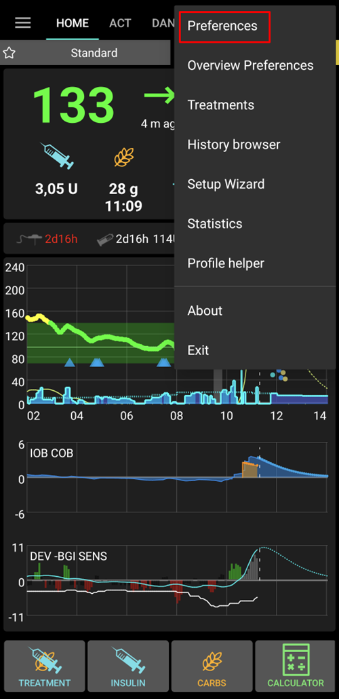
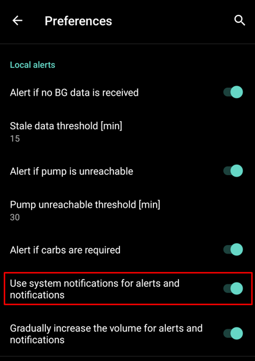
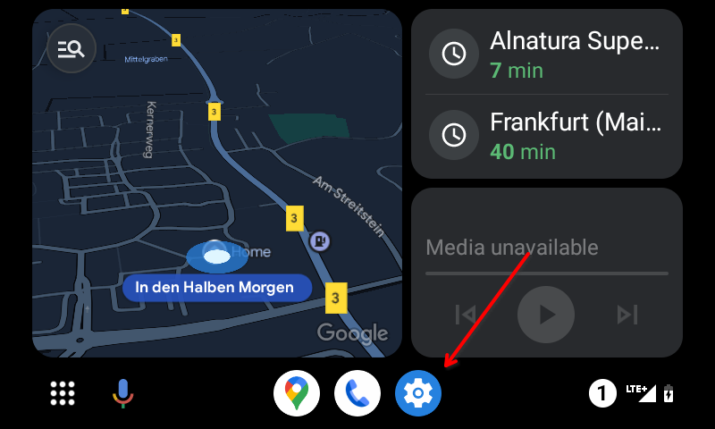
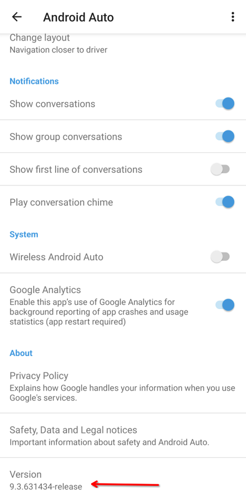
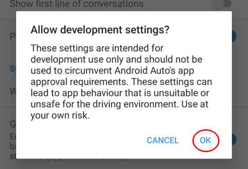
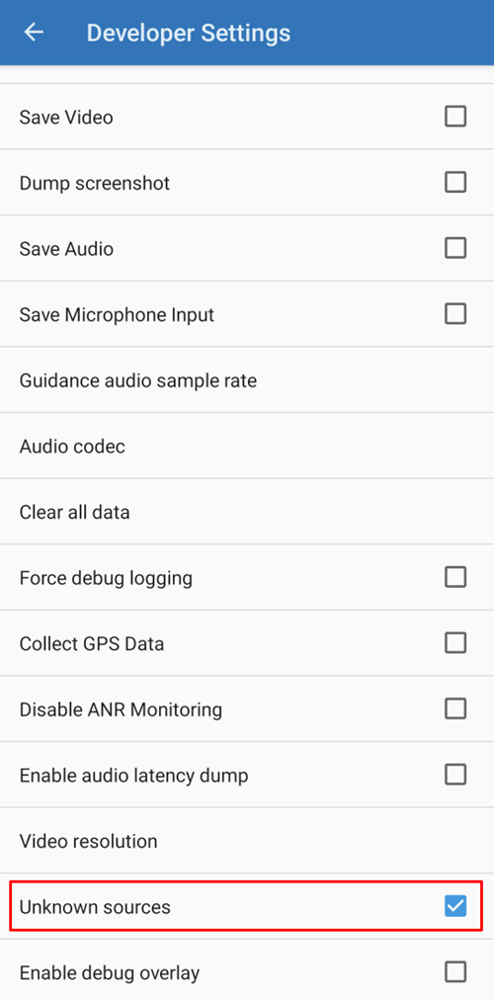
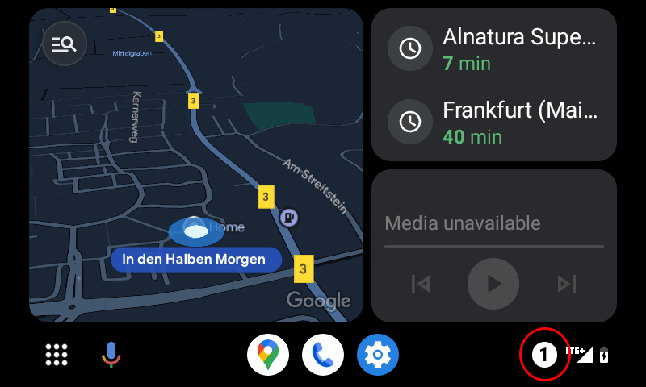

# Android Auto

**AAPS** è in grado di inviarti informazioni sul tuo stato attuale come messaggio, direttamente in Android Auto nella tua auto.


```{admonition} version and last change information
:class: dropdown
data dell'ultima modifica: 07/05/2023

versioni utilizzate per la documentazione:

* AAPS 3.2.0-dev-i
* Android Auto: 9.3.631434-release
```

## Requisiti

**AAPS** utilizza una funzionalità di Android Auto che consente di instradare i messaggi delle app sul cellulare verso il display dell'audio Auto in auto.

Ciò significa che:

* Devi configurare **AAPS** per usare le notifiche di sistema per avvisi e notifiche e
* Poiché **AAPS** è un'app non ufficiale, consenti l'uso di "sorgenti sconosciute" con Android Auto.


## Usa le notifiche di sistema in AAPS per avvisi e notifiche

Apri il menu a 3 punti in alto a destra della schermata principale di **AAPS** e seleziona **Preferenze**



In **Avvisi locali** attiva **Usa notifiche di sistema per avvisi e notifiche**



Verifica ora di ricevere le notifiche da **AAPS** sul telefono prima di avvicinarti alla tua auto!


## Consenti l'uso di "sorgenti sconosciute" con Android Auto.

Poiché **AAPS** non è un'app ufficiale di Android Auto, le notifiche devono essere attivate per le "sorgenti sconosciute" in Android Auto. Questo avviene tramite l'uso della modalità sviluppatore, che ti mostreremo qui.

Vai alla tua auto e connetti il cellulare con il sistema audio dell'auto.

Ora dovresti vedere una schermata simile a questa.



Premi sull'icona delle **impostazioni** per avviare la configurazione.

Scorri fino alla fine della pagina e seleziona **vedi altro nel telefono**.


Ora attiveremo la modalità sviluppatore sul cellulare.

La prima schermata è così. Scorri fino alla fine della pagina.


Qui vedi la versione di Android Auto elencata. Tocca 10 volte (dieci) sulla versione di Android Auto. Con questa combinazione nascosta hai ora abilitato la modalità sviluppatore.



Conferma di voler abilitare la modalità sviluppatore nella finestra di dialogo modale "Consentire le impostazioni di sviluppo?".



Nelle **impostazioni sviluppatore** abilita le "Sorgenti sconosciute".



Ora puoi uscire dalla modalità sviluppatore se vuoi. Tocca il menu a tre punti in alto a destra per farlo.

## Mostra le notifiche in auto

Tocca l'**icona del numero** sul lato inferiore destro di Android Auto nella tua auto.



I tuoi dati CGM verranno mostrati come segue:


## Risoluzione dei problemi:
* Se non vedi la notifica, controlla se hai [consentito ad AAPS di mostrare le notifiche](#use-system-notifications-in-aaps-for-alerts-and-notifications) in Android e se [Android Auto ha i diritti di accesso alle notifiche](#allow-the-use-of-unknown-sources-with-android-auto).
