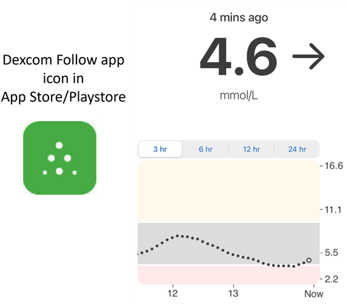
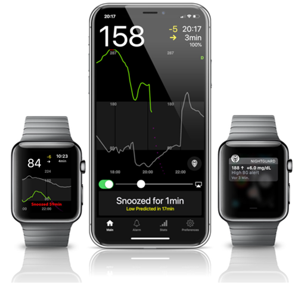
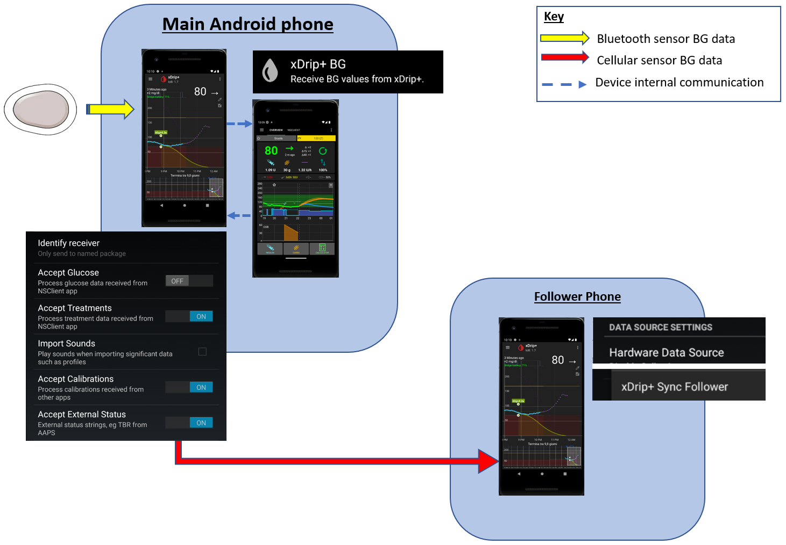
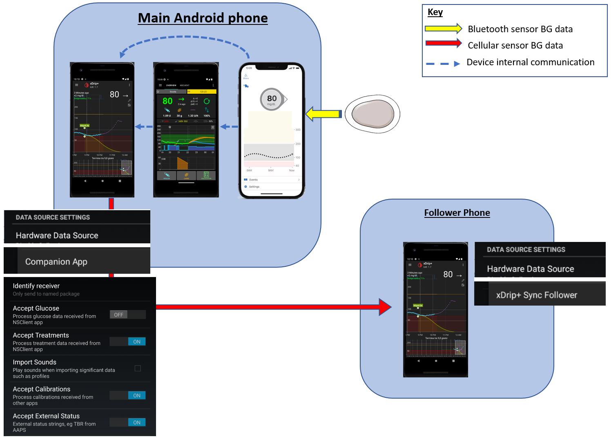
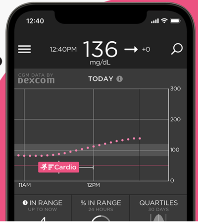
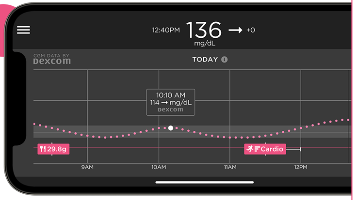
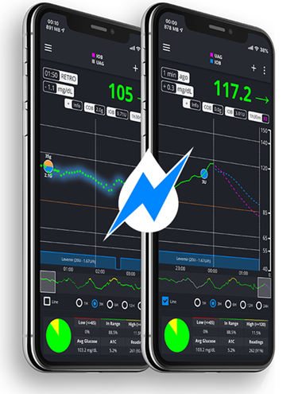
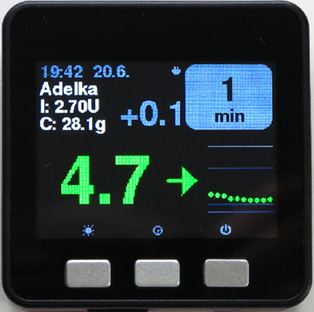
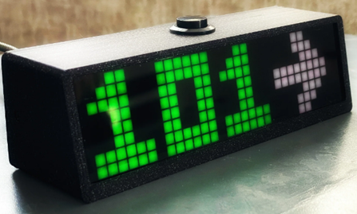
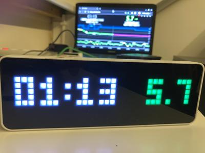

# Seguire AAPS (senza interazione con il sistema AAPS)

Oltre alle possibilità disponibili per controllare _e_ seguire **AAPS** da remoto descritte in [controllo remoto](../RemoteFeatures/RemoteControl.md), ci sono diverse app e dispositivi aggiuntivi sviluppati dalla community per seguire semplicemente i valori (livelli di glucosio e altre informazioni), senza interagire con **AAPS**.

Una buona panoramica delle numerose opzioni disponibili per seguire **AAPS** si trova nella pagina [Nightscout follower](https://nightscout.github.io/nightscout/downloaders/#).

```{contents} Table of contents
:depth: 1
:local: true
```

Le strategie più comuni usate in combinazione con **AAPS** sono spiegate in dettaglio di seguito.

## App per smartphone

```{contents} These are some of the main “follower” apps used by **AAPS** users. All of these apps are “free”: 
:depth: 1
:local: true
```

### Dexcom Follow ([Android](https://play.google.com/store/apps/details?id=com.dexcom.follow.region2.mgdl) e [iOS](https://apps.apple.com/fr/app/dexcom-follow-mg-dl-dxcm2/id1032203080))



* Dexcom Follow è compatibile con un'ampia gamma di dispositivi (sia Android che iPhone). Dexcom Follow può essere usato anche se non stai usando l'app Dexcom ufficiale per ricevere i dati del sensore.

* Molti caregiver conoscono Dexcom Follow, preferendo la sua interfaccia chiara a qualcosa di più complicato.

* Dexcom Follow è ottimo per insegnanti/nonni e persone che sanno molto poco del diabete e dei livelli di zucchero. Ha avvisi personalizzabili (livello glicemico, suono da riprodurre ecc.). Gli allarmi possono essere completamente disattivati se necessario, il che è molto utile se hai un sensore che è ancora in fase di stabilizzazione e genera molte false ipoglicemie.

#### Configurare Dexcom Follow: guida pratica

Se usi l'app Dexcom non ufficiale BYODA per ricevere i dati del sensore, potresti essere in grado di inviare inviti ai follower dall'interno dell'app BYODA.

In xDrip+ the invite request will just result in the message “invite not sent”. You cannot send invite emails to Dexcom followers anymore from third-party apps.

Devi installare l'app Dexcom ufficiale, inviare l'invito e poi disinstallare l'app ufficiale.

I passaggi da seguire sono i seguenti:

1) Installa l'app "Dexcom" ufficiale su _qualsiasi_ smartphone (Android/iPhone); può essere il telefono del follower, se è più comodo. 2) Accedi con il tuo nome utente e password Dexcom; questi sono gli stessi dati di accesso che useresti per Dexcom Clarity, se sei già un cliente Dexcom/Clarity. Se non hai un account Dexcom, c'è la possibilità di crearne uno nuovo in questo momento. 3) Scorri i menu di introduzione. 4) Aggiungi "nessun codice" per il codice del sensore. 5) In Numero di serie trasmettitore seleziona "inserisci manualmente" e inserisci qualsiasi codice trasmettitore valido (usa uno dei tuoi codici trasmettitore scaduti, se ne conosci uno, in modo da non interferire con il funzionamento del tuo trasmettitore attuale; seguono un formato specifico di certi numeri e lettere: "NLNNNL" e usano solo certe combinazioni, quindi è più facile usarne uno che sai già essere valido). 6) Una volta che l'app sta cercando il trasmettitore e il sensore, potrai invitare i follower: seleziona i tre piccoli puntini in alto a sinistra dell'app e aggiungi un nuovo follower. Puoi usarlo anche se uno dei tuoi follower ha cambiato telefono e ha bisogno di un nuovo invito; qui puoi eliminarlo dalla lista dei follower e inviare nuovamente una email di invito da usare sul loro nuovo telefono. 7) Sul telefono del Follower, installa Dexcom Follow scaricandolo dall'App Store (iPhone) o da Play (Android). Configura l'app Dexcom Follow e ti verrà chiesto di aprire la tua email per trovare l'invito a diventare Follower. 8) Ora puoi eliminare l'app Dexcom G6 ufficiale.

Per Dexcom Follow, i dati del sensore vengono poi esportati dal telefono **AAPS** direttamente da BYODA o da xDrip+, a seconda dell'app che stai usando.


### [Nightguard](https://apps.apple.com/fr/app/nightguard/id1116430352) (iOS)



Pro (segnalati dagli utenti):

* Disponibile nell'[App Store](https://apps.apple.com/us/app/nightguard/id1116430352), interfaccia semplice e user-friendly.

* Pulsante di scorrimento o agitazione del telefono per posticipare gli allarmi a intervalli diversi che vanno da 5 minuti a 24 ore.

* Personalizza gli allarmi (avvisi alti, bassi, letture mancate quando non ci sono dati per 15-45 minuti).

* Salita/discesa rapida su 2-5 letture consecutive (a scelta). Puoi anche scegliere il delta tra due letture individuali.

* Posticipo intelligente: non avvisa se i livelli si stanno muovendo nella direzione giusta.

* C'è una scheda Cura che sembra consentirti di impostare un nuovo obiettivo temporaneo per una certa durata, eliminare l'obiettivo temporaneo o inserire carboidrati.

Contro (segnalati dagli utenti):

* Disponibile solo per iOS.

* Il TT viene mostrato come 5 mmol indipendentemente dal livello TT impostato.

* Non mostra mai la frequenza basale temporanea anche se mostra la TB.

### [Nightwatch](https://play.google.com/store/apps/details?id=se.cornixit.nightwatch) (Android)


* Nightwatch si presenta come un client Nightscout e monitora i livelli di glucosio Nightscout dell'utente su un telefono o tablet Android.

* L'app può essere scaricata da [Google Play](https://play.google.com/store/apps/details?id=se.cornixit.nightwatch) e visualizza i dati glicemici in tempo reale.

* L'utente può essere avvisato con allarmi alti e bassi rumorosi personalizzati.

* I dati glicemici possono essere visualizzati in mmol/L o mg/dL.

* Richiede Android 5.0 e versioni successive.

* Ha un'interfaccia scura, letture e pulsanti grandi, progettata per l'uso notturno.

### xDrip+ (Android)

Puoi usare xDrip+ come follower.

#### Con Nightscout

Imposta xDrip+ come Follower di Nightscout. Riceverai glicemia e trattamenti, ma non la basale.


#### Senza Nightscout - sorgente dati glicemici xDrip+

Se la sorgente dati **AAPS** è xDrip+ (o se xDrip+ può ricevere glicemia anche da un'altra app come BYODA, Juggluco, ...) puoi usarlo dal telefono master per condividere dati con i follower xDrip+, mostrando glicemia, trattamenti e frequenze basali.



#### Senza Nightscout - app companion xDrip+

Se la sorgente dati **AAPS** non è xDrip+ ma puoi visualizzare i dati glicemici dalla sorgente dati dell'app Companion, puoi usarla dal telefono master per condividere dati con i follower xDrip+, mostrando glicemia, trattamenti e frequenze basali.



### xDrip4iOS (iOS)


xDripSwift è stato creato portando l'app xDrip originale su iOS ed è evoluto in "xDrip per iOS" scritto **xDrip4iOS**.

```{admonition} Further detail about how to attempt to obtain the original **xDrip4iOS** app
:class: dropdown
Il [gruppo Facebook xDrip4iOS](https://www.facebook.com/groups/853994615056838/announcements) è il principale supporto della community per xDrip4iOS e Shuggah. **xDrip4iOS** può connettersi a molti sistemi e trasmettitori CGM diversi e visualizzare valori di glicemia, grafici e statistiche, oltre a fornire allarmi. Può anche caricare su Nightscout o agire come [app follower per Nightscout](https://xdrip4ios.readthedocs.io/en/latest/connect/follower/). 

"Come posso ottenere **xDrip4iOS** sul mio iPhone?"
Ci sono due opzioni:

1. Se hai un Mac e un account Apple Developer (99 EUR/USD all'anno), puoi compilare il tuo xDrip4iOS [seguendo le istruzioni](https://xdrip4ios.readthedocs.io/en/latest/install/build/).

Se vuoi, puoi poi diventare un "releaser" e [condividere una Personal Testflight xDrip4iOS](https://xdrip4ios.readthedocs.io/en/latest/install/personal_testflight/) con un massimo di altre 100 persone per aiutarle.

2. Iscriviti al [gruppo Facebook xDrip4iOS](https://www.facebook.com/groups/853994615056838/announcements) e leggi i post in evidenza per i metodi attuali per ottenere l'app. **Non dovresti chiedere un invito all'app** (leggi le regole del gruppo).
```


"Cos'è **Shuggah**?" Un gruppo di sviluppatori ucraini ha copiato il codice del progetto xDrip4iOS (condiviso pubblicamente su GitHub) e lo ha pubblicato sull'App Store con un account aziendale. La versione Shuggah non è in alcun modo gestita dagli sviluppatori di xDrip4iOS.

Il [gruppo Facebook xDrip4iOS](https://www.facebook.com/groups/853994615056838/announcements) supporta xDrip4iOS e le app abbinate per Apple Watch.

### [Sugarmate](https://apps.apple.com/fr/app/sugarmate/id1111093108) (iOS)






[Sugarmate](https://sugarmate.io/) è disponibile per il download su iPhone dall'App Store. Sugarmate è compatibile con:
* Apple iPhone (richiede la versione software 13.0 o successiva)
* Apple iPad (richiede la versione software 13.0 o successiva)
* Google Android (salva l'app web sulla schermata principale)

È stato segnalato da utenti di Sugarmate che può essere utilizzato con Apple CarPlay negli USA per visualizzare le letture del glucosio durante la guida. Non è ancora stato stabilito se questo sia possibile nei paesi fuori dagli USA. Se conosci maggiori informazioni, aggiungi i dettagli qui nella documentazione completando una pull-request (link) che è rapida e facile da fare.


### [Spike](https://spike-app.com/) (iOS)



Spike può essere usato come ricevitore principale o come app follower, fornendo glicemia, allarmi, IOB e altro ancora.

Il sito web e l'app non sono più sviluppati. Il supporto può essere trovato su [Facebook](https://www.facebook.com/groups/1973791946274873) e [Gitter](https://gitter.im/SpikeiOS/Lobby).

## Smartwatch per il **Monitoraggio di AAPS** (dati completi del profilo o solo glucosio) dove **AAPS** è in esecuzione su un telefono.

Vedi [qui](../Getting-Started/Watches.md).


## Dispositivi per seguire AAPS

```{contents} Devices include:
:depth: 1
:local: true
```

### M5 stack



L'M5Stack è una piccola scatola che può essere programmata per molte applicazioni; il progetto di Martin [M5Stack NightscoutMon](https://github.com/mlukasek/M5_NightscoutMon/wiki) visualizza i valori di glucosio del sensore, i trend, IOB e COB. È in una scatola di plastica, dotata di un display a colori, uno slot per scheda micro SD, 3 pulsanti, un altoparlante e una batteria interna. È un ottimo monitor della glicemia ed è relativamente facile da configurare se hai un account Nightscout. Gli utenti di solito lo usano sul Wi-Fi di casa, ma alcuni utenti riferiscono di usarlo come display quando vanno in moto, facendolo funzionare tramite un hotspot Wi-Fi del telefono.

### Sugarpixel

SugarPixel è un dispositivo per il sistema di avvisi del display secondario del glucosio per il monitoraggio continuo del glucosio che si connette all'app Dexcom o Nightscout sullo smartphone dell'utente. Il dispositivo visualizza le letture della glicemia in tempo reale. Questo monitor CGM hardware beneficia di avvisi audio a tono casuale (incredibilmente forti), avvisi vibrazione per le persone con problemi di udito, opzioni di visualizzazione personalizzabili e monitoraggio multi-utente nativo.




* SugarPixel ha più opzioni di visualizzazione in mg/dL e mmol/L per soddisfare le esigenze dell'utente con valori di glucosio codificati a colori.
* La visualizzazione standard mostra glicemia, freccia di tendenza e Delta. Il Delta è la variazione + o - rispetto all'ultima lettura.
* SugarPixel può essere personalizzato per l'uso con bassa luminosità con la visualizzazione glicemia e ora, per vedere la lettura della glicemia dell'utente e l'ora attuale sul comodino.
* La visualizzazione cromatica di SugarPixel utilizza l'intero display per mostrare un singolo colore che rappresenta il valore della glicemia. Ciò consente all'utente di vedere le letture della glicemia a distanza attraverso la finestra mentre è fuori a giocare in giardino, sul patio o in piscina.
* La visualizzazione Big BG è utile per gli utenti del comodino che indossano occhiali o lenti a contatto.

### Orologio Nightscout su Ulanzi TC001

**Nightscout Clock** è un software open source in esecuzione sul dispositivo **Ulanzi TC001**. Si connette ai server Dexcom o Nightscout e visualizza le letture della glicemia in tempo reale.



* L'orologio supporta sia le unità mmol/L che mg/dL e include allarmi acustici.
* Sono disponibili diverse visualizzazioni; vedi [Github nightscout-clock](https://github.com/ktomy/nightscout-clock?tab=readme-ov-file#more-information-for-people-who-needs-it) per una panoramica.
* La configurazione del dispositivo richiede solo pochi semplici passaggi. Una volta configurato, richiede solo alimentazione e Wi-Fi per funzionare.
* Il dispositivo Ulanzi TC001 è significativamente più economico del SugarPixel.
* Il software con le istruzioni di installazione si trova su [Github nightscout-clock](https://github.com/ktomy/nightscout-clock?tab=readme-ov-file).
* È sviluppato e mantenuto da Artiom Kenibasov, che offre supporto nel [gruppo Facebook AAPS Users](https://www.facebook.com/groups/cgminthecloud/posts/8776932509094594/).

### PC (TeamViewer)
Alcuni utenti trovano utile uno strumento di accesso remoto completo come [TeamViewer](https://www.teamviewer.com/) per la risoluzione avanzata dei problemi da remoto.
