# Controllo remoto di AAPS
Ci sono quattro strumenti molto efficaci per gestire **AAPS** da remoto:

1) [Comandi SMS](#RemoteControl_SMS-Commands) (il telefono follower può essere Android o iOS), 2) [AAPSClient](#RemoteControl_aapsclient) (il telefono follower è Android) 3) [Nightscout](#RemoteControl_nightscout) (Android, iOS o altro computer/dispositivo). 4) [Smartwatch](#RemoteControl_smartwatches) (Android)

I primi tre sono più adatti ai caregiver/genitori, ma gli smartwatch sono molto utili sia per i caregiver/genitori **che** per gli adulti con diabete stessi.

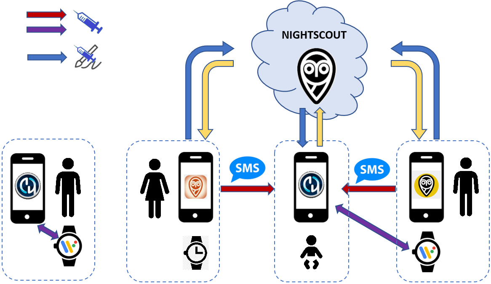

(RemoteControl_SMS-Commands)=

## 1) Comandi SMS

Consulta la pagina dedicata ai [Comandi SMS](../RemoteFeatures/SMSCommands.md).

(RemoteControl_aapsclient)=
## 2) AAPSClient

**AAPSClient** ha un aspetto molto simile ad **AAPS** stesso, offrendo al caregiver schede che eseguiranno comandi da remoto in **AAPS**:

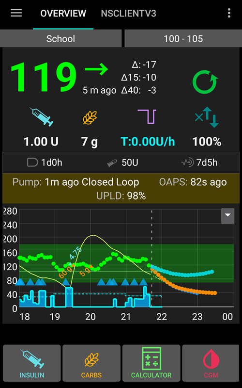

### Informazioni su AAPSClient e AAPSClient2

Ci sono 2 versioni dell'apk che possono essere installate, **AAPSClient** e **AAPSClient2**, che hanno una differenza sottile ma importante come spiegato di seguito.

Se un caregiver necessita di una seconda copia di **AAPSClient** per controllare da remoto un paziente aggiuntivo con un account Nightscout, dovrebbe installare **AAPSClient2** in aggiunta ad **AAPSClient**. **AAPSClient 2** consente a un singolo caregiver di installare l'apk **AAPSClient** due volte sullo stesso telefono follower per avere accesso simultaneo e controllo remoto di due pazienti diversi.

Per distinguere le due app, alcuni elementi hanno un colore di sfondo diverso: giallo per **AAPSClient**, blu per **AAPSClient2**. Questi elementi sono l'icona dell'app, il widget e la sezione stato **AAPS** nell'app stessa.  Nota: l'opacità dello sfondo del widget è personalizzabile.   Note : opacity of the widget background is customizable.

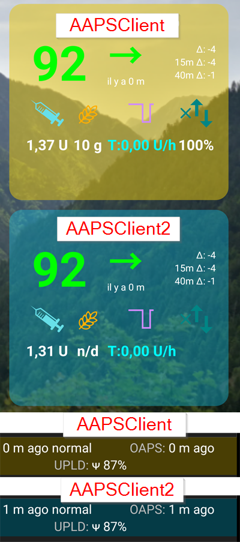

### Download e installazione

**AAPSClient** può essere installato su un singolo telefono o su più telefoni follower (ad esempio il telefono follower del genitore 1 e quello del genitore 2) in modo che entrambi i caregiver abbiano accesso e possano controllare da remoto il telefono **AAPS** del paziente.

Per scaricare **AAPSClient**, naviga verso il [repository Github](https://github.com/nightscout/AndroidAPS/releases/) e clicca sull'asset **"app-AAPSClient-release_x.x.x.x"** (potrebbe essere una versione più recente rispetto a quella mostrata nello screenshot):

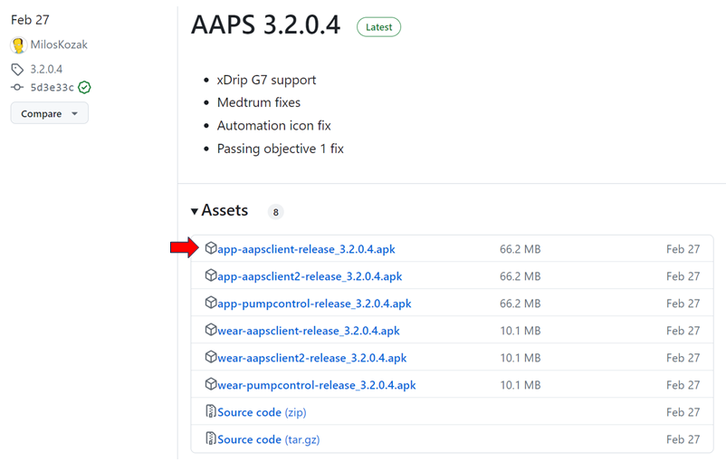

Poi vai su _downloads_ nel tuo computer. Su Windows, _downloads_ apparirà nella barra destra:

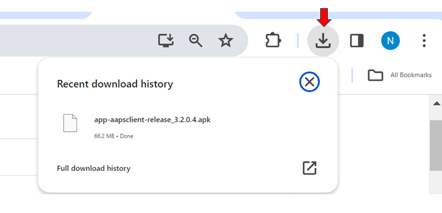

Una volta scaricato, clicca su _mostra nella cartella_ per individuare il file.

L'apk **AAPSClient** ora può essere:

Trasferito tramite cavo USB sul telefono follower; oppure Trascinato nella cartella Google Drive e poi aggiunto al telefono follower cliccando sul file "app-AAPSClient-release".

Se hai bisogno di **AAPS** per te stesso e di **AAPSClient** per monitorare qualcun altro, dovrai compilare **AAPSClient** tu stesso invece di scaricarlo dal repository Github come descritto sopra. Il motivo è che non puoi installare sia **AAPS** che **AAPSClient** sullo stesso telefono, firmati con chiavi diverse.  Per compilare **AAPSClient** tu stesso, segui lo stesso processo della [compilazione regolare di AAPS](../SettingUpAaps/BuildingAaps.md).   To build **AAPSClient** yourself, follow the same process as [regular AAPS build](../SettingUpAaps/BuildingAaps.md). Nella pagina **Genera Bundle o APK App Firmato**, seleziona **aapsclientRelease** invece di **fullRelease**.

### Sincronizzazione - Configurazione di AAPSClient e AAPS (per la versione 3.2.0.0 e successive)

Una volta installato l'apk __AAPSClient__ sul telefono follower, l'utente deve assicurarsi che le 'Preferenze' nel Generatore di Configurazione siano configurate correttamente e allineate con __AAPS__ per Nightscout 15 (vedi le Note di Rilascio [qui](../Maintenance/UpdateToNewVersion)). L'esempio seguente fornisce indicazioni di sincronizzazione per NSClient e NSClientV3 usando Nightscout15, ma ci sono altre opzioni disponibili con __AAPS__ (ad es. xDrip+).

All'interno della 'Sincronizzazione' situata in 'Generatore di Configurazione', l'utente può optare per entrambe le opzioni di sincronizzazione sia per __AAPS__ che per il telefono follower:

- Opzione 1: NSClient (anche noto come 'v1') - che sincronizza i dati dell'utente con Nightscout; oppure

- Opzione 2: NSClientV3 (anche chiamato 'v3') - che sincronizza i dati dell'utente con Nightscout usando l'API v3.

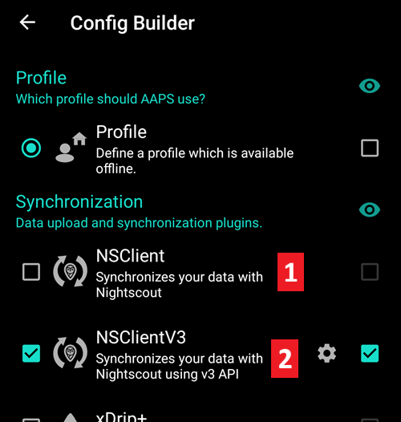

L'utente deve assicurarsi che __entrambi__ i telefoni AAPS e AAPS Client siano sincronizzati tra loro scegliendo una delle opzioni per v1 o v3:

Opzione 1: v1 per entrambi i telefoni:

- Inserisci il tuo URL Nightscout

- Inserisci il tuo segreto API

Opzione 2: v3 per entrambi i telefoni:

- Inserisci il tuo URL Nightscout nella scheda NSClientV3

- Inserisci il tuo token di accesso NS nella scheda 'Generatore di Configurazione'. Segui le note [qui](https://nightscout.github.io/nightscout/security/#create-a-token)

Se si selezionano i Websocket (che sono facoltativi), assicurarsi che siano attivati o disattivati per entrambi i telefoni __AAPS__ e __AAPSClient__. Attivare i Websocket in __AAPS__ e non in __AAPSClient__ (e viceversa) causerà solo il malfunzionamento di __AAPS__. L'abilitazione dei websocket consentirà una sincronizzazione più rapida con Nightscout ma potrebbe portare a un maggiore consumo della batteria del telefono.

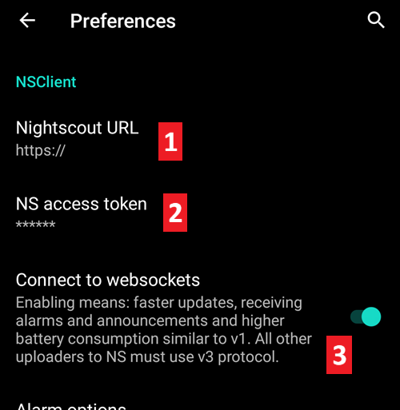

L'utente deve assicurarsi che sia __AAPSClient__ che __AAPS__ mostrino 'connesso' nella scheda 'NSClient' per ciascun telefono, e che 'Cambio Profilo' o 'Obiettivo Temporaneo' possano essere attivati correttamente in __AAPS__ una volta selezionati in __AAPSClient__.

L'utente deve anche assicurarsi che quando i carboidrati vengono inseriti in __AAPS__ o __AAPSClient__, i dati vengano automaticamente registrati nei 'Trattamenti' sia per __AAPSClient__ che per __AAPS__. In caso contrario, potrebbe indicare un malfunzionamento nella configurazione di __AAPS__ o __AAPSClient__ dell'utente.

### Risoluzione dei problemi di configurazione del 'token di accesso NS'

La configurazione precisa del 'token di accesso NS' può variare a seconda che il tuo provider Nightscout sia un sito ospitato a pagamento o meno.

Se hai difficoltà con **AAPS** v3 ad accettare il 'token di accesso NS' e stai usando un sito Nightscout ospitato a pagamento, potresti voler prima contattare il tuo provider Nightscout su come risolvere le difficoltà del 'token di accesso NS'. In caso contrario, contatta il gruppo **AAPS** ma verifica di aver seguito correttamente le note prima di farlo [qui](https://nightscout.github.io/nightscout/security/#create-a-token).

### Funzionalità di AAPSClient:

| Scheda / Hamburger      | Funzionalità                                                                                                                                                                                                                                                |
| ----------------------- | ----------------------------------------------------------------------------------------------------------------------------------------------------------------------------------------------------------------------------------------------------------- |
| Scheda **Azione**       | - Cambio Profilo  - Cambio Stato Loop  - Obiettivo Temporaneo - Controllo glicemia - Inserimento sensore CGM - Nota - Esercizio - Annuncio - Domanda? - Browser cronologia |
| Scheda **Cibo**         |                                                                                                                                                                                                                                                             |
| Scheda **Trattamenti**  | - Controlla i trattamenti erogati inclusi bolo e carboidrati inseriti                                                                                                                                                                                       |
| Scheda **Manutenzione** | - Esporta e Importa Impostazioni                                                                                                                                                                                                                            |
| Scheda **Profilo**      | - Creare un nuovo profilo - Cambio profilo                                                                                                                                                                                                         |

**AAPSClient** consente al caregiver di effettuare molte delle regolazioni consentite direttamente in **AAPS** (esclusi i boli di insulina) da remoto, tramite la rete mobile o Internet. I principali vantaggi di **AAPSClient** sono la velocità e la facilità con cui i caregiver/genitori possono usarlo per controllare da remoto **AAPS**. __AAPSClient__ _può_ essere molto più veloce rispetto all'inserimento dei Comandi SMS, se si invia un comando che richiederebbe l'autenticazione. I comandi inseriti in **AAPSClient** vengono caricati su Nightscout. Affinché le azioni eseguite in **AAPSClient** vengano effettivamente eseguite in **AAPS**, le impostazioni di NSClient devono consentire di ricevere tali ordini. Vedi la [sezione Sincronizzazione delle preferenze NSClient](#Preferences-nsclient-synchronization).

Il controllo remoto tramite **AAPSClient** è consigliato solo se la sincronizzazione funziona correttamente (_cioè_ non vedi modifiche indesiderate ai dati come l'auto-modifica di TT, TBR ecc.); vedi le [note di rilascio per la Versione 2.8.1.1](#important-hints-2-8-1-1) per ulteriori dettagli.

### AAPSClient con opzioni smartwatch

Uno smartwatch può essere uno strumento molto utile per aiutare a gestire **AAPS** con i bambini. Sono possibili un paio di configurazioni diverse. Se **AAPSClient** è installato sul telefono del caregiver, l'app [**AAPSClient WearOS**](https://github.com/nightscout/AndroidAPS/releases/) può essere scaricata e installata su uno smartwatch compatibile collegato al telefono del genitore. Mostrerà la glicemia attuale, lo stato del loop e consentirà l'inserimento di carboidrati, obiettivi temporanei e cambi di profilo. NON consentirà di effettuare boli dall'app WearOS. Puoi leggere di più sugli Smartwatch [qui](#4-smartwatches).

(RemoteControl_nightscout)=
## 3) Nightscout

Oltre ad essere un server "nel Cloud", c'è anche un'app **Nightscout** dedicata che può essere scaricata direttamente dall'App Store sul tuo iPhone. Se hai un telefono follower Android, non esiste un'app Nightscout dedicata ed è meglio usare [**AAPSClient**](#2-aapsclient), oppure, se vuoi solo seguire e non inviare trattamenti, puoi scaricare e installare l'app [Nightwatch](https://play.google.com/store/apps/details?id=se.cornixit.nightwatch) dal Play Store.

Una volta installata l'app **Nightscout** sul tuo iPhone, apri l'app e segui le istruzioni di configurazione, inserendo il tuo indirizzo Nightscout (vedi sotto, a sinistra). La forma di questo può variare a seconda di come è ospitato il tuo Nightscout. (_ad es._ http://tuoindirizzoqui.herokuapp.com). Poi inserisci il tuo segreto API Nightscout (vedi sotto, a destra). Se non ti viene chiesta la password API, devi inserirla cliccando sul lucchetto in cima all'app:

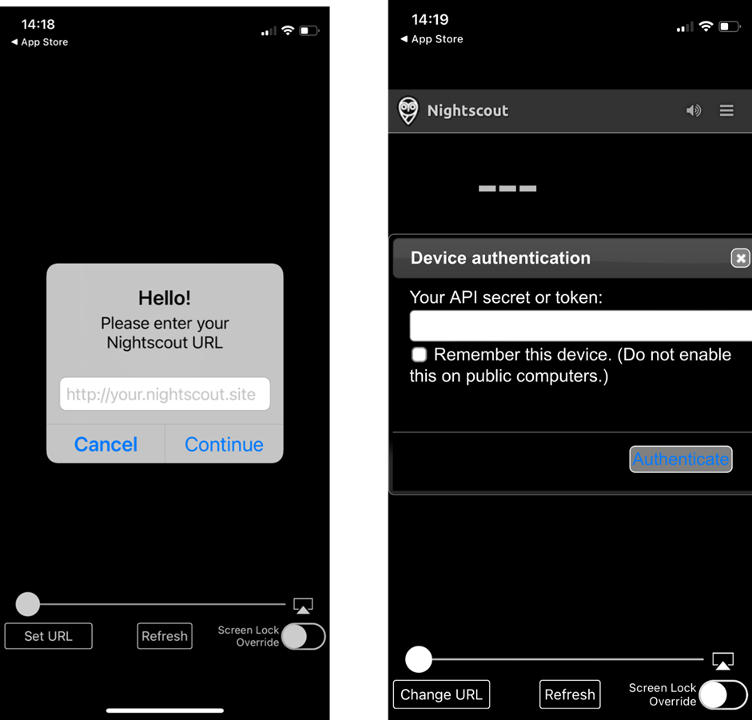

Ulteriori informazioni sulla configurazione sono disponibili direttamente da [Nightscout](https://nightscout.github.io/nightscout/discover/)

Quando accedi per la prima volta, avrai una visualizzazione molto semplice. Personalizza le opzioni di visualizzazione selezionando l'"hamburger" in alto a destra e scorrendo verso il basso:

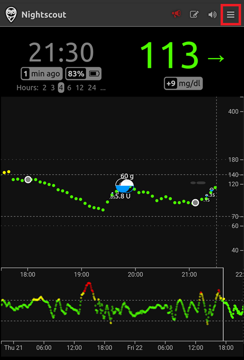

Scorri verso il basso fino a "Impostazioni". Potresti voler cambiare la "scala" in "lineare" poiché il valore predefinito per la visualizzazione della glicemia è logaritmico, e in "rendi basale" seleziona "predefinito" in modo che la basale del microinfusore appaia.

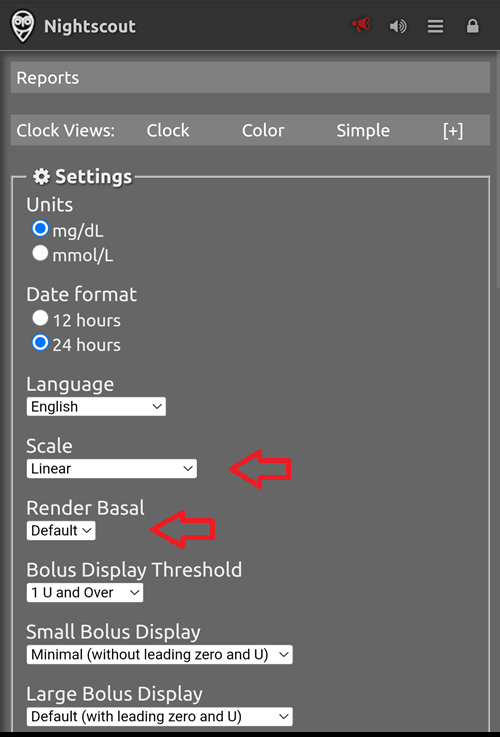

Seleziona le opzioni desiderate. Deseleziona gli allarmi se usi un'app alternativa per gli allarmi.

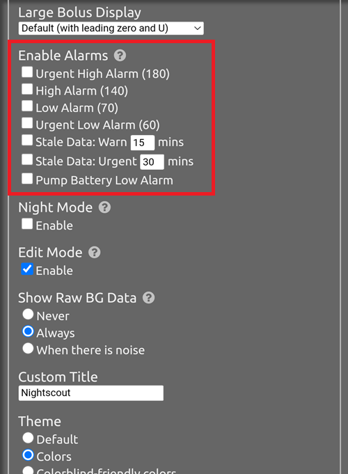

Continua a scorrere verso il basso fino ad arrivare a "mostra plugin".

Devi assicurarti che "careportal" sia selezionato e puoi anche selezionare varie altre metriche (le più utili sono: IOB, care portal, microinfusore, età cannula, età insulina, profilo basale e OpenAPS).

È importante: ora devi cliccare su "salva" in fondo affinché queste modifiche abbiano effetto.

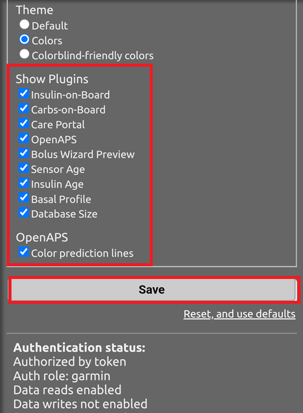

Dopo aver premuto "salva", l'app tornerà alla schermata principale di Nightscout che assomiglierà a questa:

1. Valore attuale del glucosio
2. Informazioni sullo stato del sistema AAPS - tocca le singole schede sullo schermo per visualizzare maggiori dettagli. Aggiungi o rimuovi queste opzioni di visualizzazione usando il menu hamburger.
3. Traccia recente del glucosio con trattamenti (carboidrati, boli) visualizzati
4. Traccia del glucosio a lungo termine
5. Menu "Hamburger" per impostare le opzioni di visualizzazione, generare report, modificare profili e strumenti di amministrazione Nightscout
6. Menu "**+**" per inserire trattamenti da inviare ad AAPS.
7. Seleziona il periodo di tempo diverso da visualizzare
8. Profilo della basale insulinica
9. Linea verde = glucosio storico Linee blu = glucosio previsto

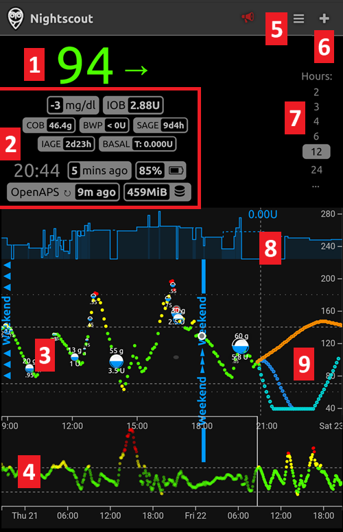

Guardando più in dettaglio il menu in alto a sinistra dell'app Nightscout:

1. Modifica retrospettiva del Careportal
2. Attiva/disattiva allarmi
3. Hamburger - per impostare le preferenze
4. Careportal - Registra trattamento - per inviare modifiche ad AAPS

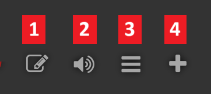

C'è un'enorme quantità di informazioni sullo stato del sistema **AAPS** nelle schede grigie (e ancora più informazioni vengono rivelate se tocchi la scheda) in questa schermata:

1. Tendenza glicemia ultimi 5 min
2. Bolus wizard preview
3. Premi su Basale per vedere il tuo profilo attuale e le informazioni sulla basale
4. Tempo dall'ultima lettura CGM in AAPS
5. **Microinfusore**: insulina, % batteria e quando AAPS si è connesso l'ultima volta
6. Ultima volta che AAPS si è aggiornato - se è più lunga di 5 min potrebbe indicare un problema di connessione tra il telefono AAPS e il microinfusore/CGM
7. Premi su IOB per vedere la divisione tra insulina basale e da bolo
8. Età insulina nel serbatoio
9. Età cannula
10. Stato della batteria del telefono AAPS
11. Dimensione del tuo database. Se diventa troppo piena (solo DIY Nightscout - i servizi ospitati ignorano) potresti iniziare ad avere problemi di connettività. Puoi eliminare dati per ridurre la dimensione del numero negli strumenti di amministrazione (tramite hamburger).

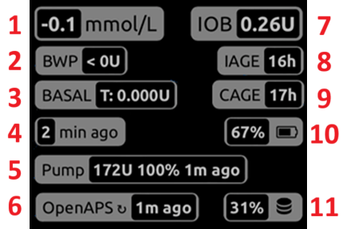

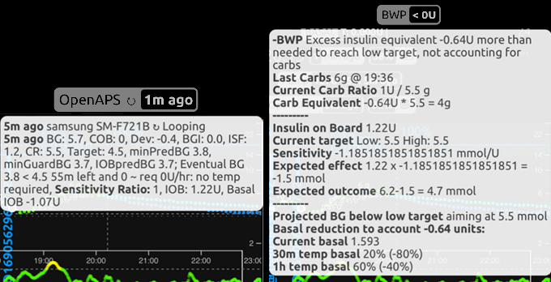

Premi "aggiorna" in fondo alla pagina per chiudere il popup.

### Invio trattamenti tramite l'app Nightscout ad AAPS

Per configurare l'invio di trattamenti dall'app **Nightscout** ad **AAPS**, sul telefono AAPS principale, vai nella scheda **AAPSClient** nell'app **AAPS**. Apri il menu a punti sulla destra e apri le Preferenze AAPSClient - sincronizzazione e seleziona le opzioni rilevanti in questo menu. Impostalo per ricevere i diversi comandi (obiettivi temporanei, ecc.) e anche per sincronizzare i profili. Se le cose non sembrano sincronizzarsi, torna alla scheda AAPSClient e seleziona "sincronizzazione completa" e aspetta alcuni minuti.

Nightscout sul tuo iPhone ha tutte le stesse funzioni di Nightscout sul tuo PC. Ti consente di inviare molti comandi ad **AAPS**, ma non ti consente di inviare boli di insulina.

### Annullamento dell'insulina negativa per evitare ipo ripetute

Sebbene tu non possa effettivamente somministrare insulina con un bolo, puoi tuttavia "annunciare" insulina tramite Nightscout come "bolo di correzione", anche se non viene erogata. Poiché AAPS ora tiene conto di quel bolo di insulina fittizio, annunciare insulina fa sì che AAPS sia _meno aggressivo_, il che può essere utile per annullare l'insulina negativa e prevenire le ipoglicemie nel caso in cui il tuo profilo sia stato troppo aggressivo (ad esempio a causa di un esercizio precedente). Vorrai verificare questo per te stesso in presenza del telefono **AAPS**, nel caso in cui la tua configurazione **Nightscout** sia diversa.

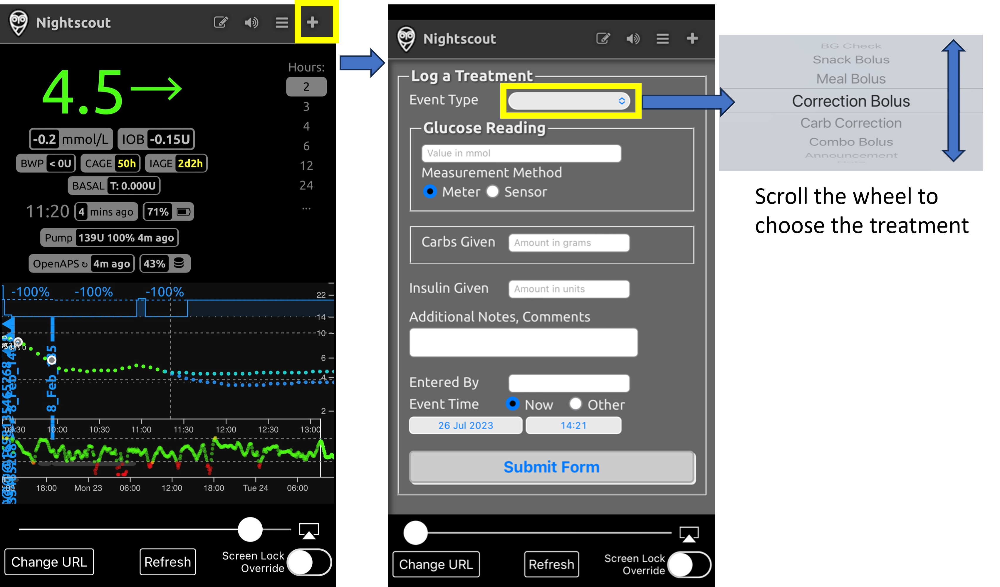

Alcuni dei comandi **Nightscout** più utili sono descritti nella tabella seguente.

#### Tabella dei comandi Nightscout

| Trattamenti più comunemente usati                                  | Funzione, esempio di quando il comando è utile                                                                                                                                                                                                |
| ------------------------------------------------------------------ | --------------------------------------------------------------------------------------------------------------------------------------------------------------------------------------------------------------------------------------------- |
| **Bolo di correzione**                                             | Consente di annunciare **ma <u>non</u> somministrare** insulina. Molto utile per annullare l'insulina negativa e prevenire un'ipoglicemia, ad esempio nel mezzo della notte, se il profilo è stato troppo aggressivo.       |
| **Correzione carboidrati**                                         | Annuncia carboidrati ora                                                                                                                                                                                                                      |
| **Obiettivo temporaneo** **Annulla obiettivo temporaneo** | Consente di impostare e annullare obiettivi temporanei. Nota che l'annullamento non funziona sempre; in questo caso puoi impostare un nuovo target per un breve periodo (2 min) che poi tornerà al target normale. |
| **Cambio profilo**                                                 | Consente di controllare il profilo attualmente in esecuzione, e passare a un altro profilo, permanentemente o per un tempo definito (min).                                                                                  |

| Comandi meno usati                                                                                                               | Funzione, esempio di quando il comando è utile                                                                                                                                                 |
| -------------------------------------------------------------------------------------------------------------------------------- | ---------------------------------------------------------------------------------------------------------------------------------------------------------------------------------------------- |
| **BG check**                                                                                                                     | Invia un controllo glicemia ad AAPS.                                                                                                                                                           |
| **Bolo spuntino** **Bolo pasto** **Bolo combinato**                                                            | Può annunciare carboidrati (più proteine e grassi)  da 60 min nel passato a 60 min nel futuro. Il bolo combinato consente anche l'annuncio dell'insulina contemporaneamente. |
| **Annuncio** **Nota** **Domanda** **Esercizio** **Open APS offline** **Avviso DAD** | Aggiungi queste note informative (DAD = avviso cane diabetico).                                                                                                                                |
| **Cambio sito microinfusore** **Cambio batteria** **Cambio cartuccia insulina**                                | Announces these pump changes.                                                                                                                                                                  |
| **Avvio sensore CGM** **Inserimento sensore CGM** **Stop sensore CGM**                                         | Annuncia questi cambi del CGM.                                                                                                                                                                 |
| **Inizio basale temporanea** **Fine basale temporanea**                                                                 | Più utile nel loop aperto.                                                                                                                                                                     |

Leggi di più sulle opzioni **Nightscout** [qui](https://nightscout.github.io/)

### Suggerimenti per ottenere il massimo dall'app Nightscout

1). Se rimani "bloccato" su una pagina e vuoi tornare alla schermata principale, clicca semplicemente su "aggiorna" (in basso al centro) e questo ti riporterà alla homepage di **Nightscout** con il grafico della glicemia.

Per vedere il profilo attualmente in esecuzione sul telefono, premi le varie icone sulla schermata sopra il grafico. Ulteriori informazioni (rapporto carboidrati attuale, sensibilità e fuso orario ecc.) possono essere viste premendo "basale" e "OpenAPS" fornisce informazioni sul profilo e sul target attuale ecc. Sia la % di batteria del telefono che la % di batteria del microinfusore possono essere monitorate. BWP fornisce informazioni su cosa l'algoritmo pensa accadrà in futuro, dato IOB e COB.

#### Altre icone nel menu: cosa significa la matita (modifica)?

Puoi (tecnicamente) usare la matita di modifica per spostare o eliminare boli o trattamenti di correzione dalle ultime 48 ore.

Ulteriori informazioni [qui](https://nightscout.github.io/nightscout/discover/#edit-mode-edit)

Sebbene questo potrebbe essere potenzialmente utile per eliminare i carboidrati annunciati (ma non somministrati con bolo), in pratica attualmente non funziona bene con **AAPS** e raccomandiamo di apportare modifiche del genere direttamente tramite l'app **AAPS**.

(RemoteControl_smartwatches)=
## 4) Smartwatch

### Opzione 1) Controllo di AAPS da un orologio Wear OS

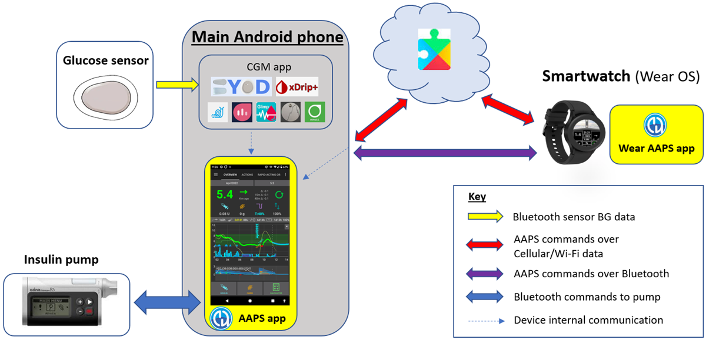

Una volta che hai [configurato **AAPS** sul tuo orologio](../WearOS/BuildingAapsWearOS.md), i dettagli dettagliati sui quadranti dello smartwatch e sulle loro funzioni si trovano in [Funzionamento di Wear AAPS su uno Smartwatch](../WearOS/WearOsSmartwatch.md).

Come breve panoramica, le seguenti funzioni possono essere attivate dallo smartwatch:

* impostare un obiettivo temporaneo

* usare il calcolatore bolo (le variabili di calcolo possono essere definite nelle impostazioni del telefono)

* somministrare eCarb

* somministrare un bolo (insulina + carboidrati)

* impostazioni orologio

* stato

* check pump status

* controllare lo stato del loop

* controllare e cambiare profilo, CPP (Profilo Percentuale Circadiano = spostamento orario + percentuale)

* mostrare TDD (Dose Totale Giornaliera = bolo + basale al giorno)

* Bolo remoto dove il caregiver e il bambino con T1D si trovano in luoghi diversi (questo è possibile per l'orologio **AAPS** e il telefono **AAPS** a condizione che entrambi i dispositivi siano collegati alla rete)

#### Comunicazione dai caregiver all'orologio usando altre app (come WhatsApp)

È possibile aggiungere app aggiuntive all'orologio, come WhatsApp, per la messaggistica (ad esempio) tra caregiver e bambini. È importante avere UN SOLO account Google associato al telefono, altrimenti l'orologio non trasferirà questi dati. Devi avere 13 anni o più per avere un account Samsung, e questo deve essere configurato con lo stesso indirizzo email usato sul telefono Android.

Un video che spiega come configurare WhatsApp per la messaggistica sull'orologio Galaxy 4 (non puoi ottenere la piena funzionalità di WhatsApp) è mostrato [qui](https://gorilla-fitnesswatches.com/how-to-get-whatsapp-on-galaxy-watch-4/)

Effettuare regolazioni sia nell'app **Galaxy wearable** sul telefono **AAPS** che sull'orologio rende possibile che i messaggi WhatsApp si annuncino con una leggera vibrazione, e che il messaggio WhatsApp venga visualizzato sopra il quadrante esistente.

### Opzione 2) **AAPS** sull'orologio, per il controllo remoto di **AAPS** su un telefono

Similmente all'utilizzo di un telefono follower con AAPSClient, Nightscout o Comandi SMS, uno smartwatch può essere usato per controllare **AAPS** da remoto e fornire dati completi del profilo. Una differenza fondamentale rispetto all'utilizzo di un telefono follower è che il collegamento smartwatch-telefono **AAPS** avviene tramite Bluetooth e non richiede un codice di autenticazione. Come nota a margine, se sia lo smartwatch che il telefono **AAPS** collegati tramite Bluetooth sono anche su una rete Wi-Fi/dati cellulare, l'orologio interagirà anche con il telefono **AAPS**, dando un raggio di comunicazione più lungo. Ciò include la somministrazione remota di un bolo dove il caregiver con l'orologio **AAPS** e il bambino con T1D (con il telefono **AAPS**) si trovano in luoghi diversi, il che può essere utile quando il bambino con T1D è a scuola.

Uno smartwatch di controllo remoto è quindi spesso utile in qualsiasi situazione in cui:

a) I comandi **AAPSClient**/Nightscout/**SMS** non possono funzionare; oppure

b) L'utente desidera evitare la necessità del codice di autenticazione (come richiesto per il telefono follower con l'inserimento di dati, la selezione di TT o l'inserimento di carboidrati).

Uno smartwatch deve avere il software **Android wear** (idealmente 10 o superiore) per poter controllare **AAPS**. Controlla le specifiche tecniche dell'orologio e consulta la [pagina Telefoni](../Getting-Started/Phones.md). Cerca, o chiedi nei gruppi Facebook/Discord di **AAPS** se non sei sicuro.

Guide specifiche su come configurare **AAPS** sul popolare [Samsung Galaxy Watch 4 (40mm) sono disponibili di seguito. L'orologio [Garmin](https://apps.garmin.com/en-US/apps/a2eebcac-d18a-4227-a143-cd333cf89b55?fbclid=IwAR0k3w3oes-OHgFdPO-cGCuTSIpqFJejHG-klBTm_rmyEJo6gdArw8Nl4Zc#0) è anche una scelta popolare. Se hai esperienza nella configurazione di un diverso smartwatch che pensi sarebbe utile ad altri, aggiungilo in queste pagine [modifica la documentazione](../SupportingAaps/HowToEditTheDocs.md) per condividere le tue scoperte con la più ampia community **AAPS**.

### Opzione 3) AAPSClient su un orologio per il controllo remoto di **AAPS** su un telefono

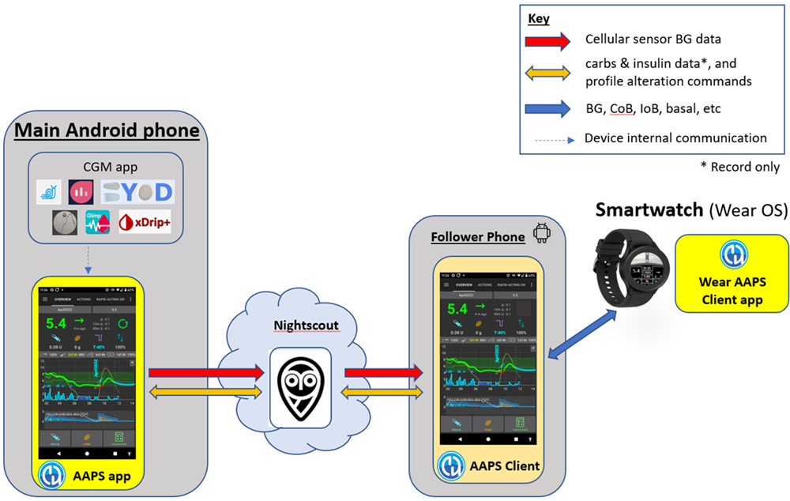

Il software per l'orologio, l'apk Wear di **AAPSClient**, può essere scaricato direttamente da [Github](https://github.com/nightscout/AndroidAPS/releases/).

Per scaricare il software, clicca sull'app richiesta (in questo screenshot, funzionerebbero sia **wear-aapsclient-release_3.2.0.1** che **wear-aapsclient2-release_3.2.0.1**; ci sono due versioni nel caso tu abbia bisogno di una copia per un secondo orologio del caregiver):

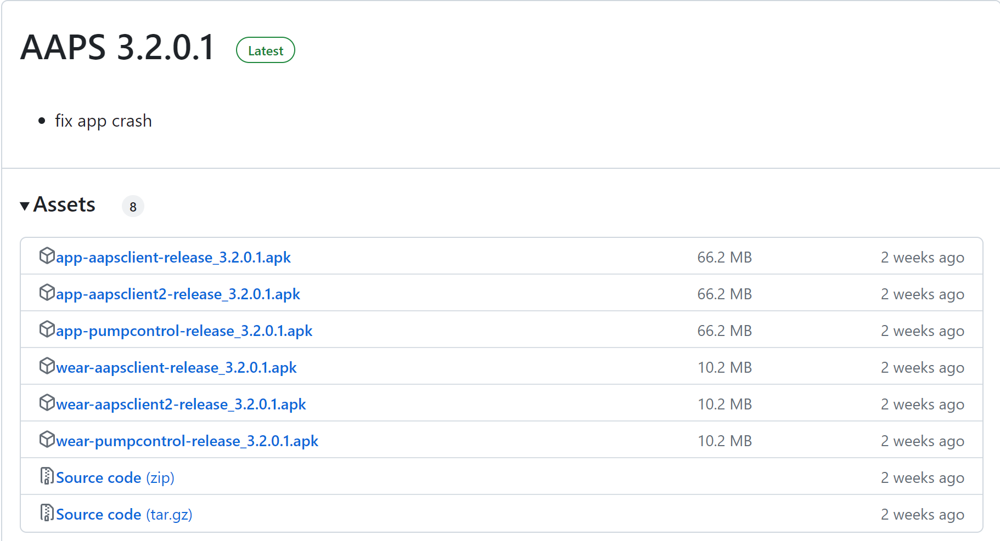

Poi "salva come" e salva il file in un luogo conveniente sul tuo computer:

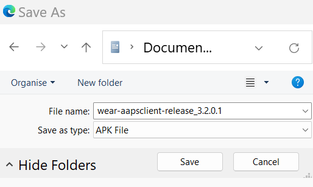

L'apk wear di **AAPSClient** può essere trasferito sul tuo telefono e caricato sull'orologio nello stesso modo dell'app Wear di **AAPS**, come descritto in [Trasferimento dell'app Wear sul tuo telefono AAPS](#remote-control-transferring-the-aaps-wear-app-onto-your-aaps-phone)  

