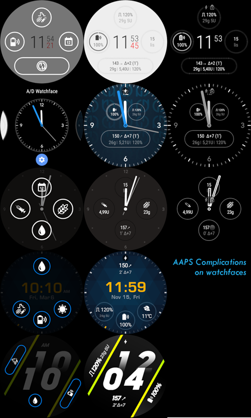
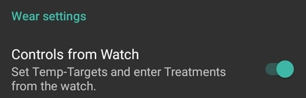

# Funzionamento di AAPS tramite il tuo smartwatch Wear OS

(Watchfaces-aaps-watchfaces)=

## Quadranti AAPS

```{warning}
I quadranti AAPS sono disponibili per smartwatch Wear OS con livello API da 28 a 33.
Le modifiche di Wear OS 5 hanno bloccato i quadranti: possono essere utilizzate solo le complicazioni.
```

Ci sono diversi quadranti tra cui scegliere che sono inclusi nella versione base dell'APK Wear di AAPS. Questi quadranti includono delta medio, IOB, frequenza basale temporanea attualmente attiva e profili basali e un grafico delle letture CGM.

Alcune azioni disponibili sui quadranti sono:

* Doppio tocco sulla glicemia per accedere al menu AAPS
* Doppio tocco sul grafico della glicemia per cambiare la scala temporale del grafico

## Configurazione

Abilita il modulo Wear nel [Generatore di Configurazione > Sincronizzazione](../SettingUpAaps/ConfigBuilder.md).

Usa le Preferenze Wear per definire quali variabili devono essere considerate nel calcolo del bolo dato tramite il tuo orologio (cioè tendenza a 15 min, COB...).

Se vuoi somministrare boli ecc. dall'orologio, nelle "Impostazioni Wear" devi abilitare "Controlli dall'orologio".


Tramite la scheda Wear o il menu hamburger (in alto a sinistra dello schermo, se la scheda non è visualizzata) puoi:

* Rinviare tutti i dati. Può essere utile se l'orologio non era connesso per un po' di tempo e vuoi inviare le informazioni all'orologio.
* Aprire le impostazioni sul tuo orologio direttamente dal telefono.

Assicurarsi che le notifiche di AAPS non siano bloccate sull'orologio. La conferma di un'azione (ad esempio bolo, obiettivo temporaneo) arriva tramite una notifica che dovrai scorrere e spuntare.

## Accesso al menu principale di AAPS

Per accedere al menu principale di AAPS puoi usare una delle seguenti opzioni:

* double tap on your BG value
* seleziona l'icona AAPS nel menu delle applicazioni dell'orologio
* tocca la complicazione AAPS (se configurata per il menu)

## Impostazioni (nell'orologio)

Per accedere alle impostazioni del quadrante, entra nel menu principale di AAPS, scorri verso l'alto e seleziona "Impostazioni".

La stella piena indica lo stato abilitato (**On**), e l'icona della stella vuota indica che l'impostazione è disabilitata (**Off**):


### Parametri companion AAPS

* **Vibra al bolo** (predefinito `On`):
* **Unità per le azioni** (predefinito `mg/dl`): se **On** le unità per le azioni sono `mg/dl`, se **Off** l'unità è `mmol/l`. Usato quando si imposta un TT dall'orologio.

(Watchfaces-watchface-settings)=

### Impostazioni del quadrante

* **Mostra data** (predefinito `Off`): nota, la data non è disponibile su tutti i quadranti
* **Mostra IOB** (predefinito `On`): Visualizza o meno il valore IOB (l'impostazione per il valore dettagliato è nei parametri Wear di AAPS)
* **Mostra COB** (predefinito `On`): Visualizza o meno il valore COB
* **Mostra Delta** (predefinito `On`): Visualizza o meno la variazione della glicemia degli ultimi 5 minuti
* **Mostra DeltaMedio** (predefinito `On`): Visualizza o meno la variazione media della glicemia degli ultimi 15 minuti
* **Mostra batteria telefono** (predefinito `On`): Batteria del telefono in %. Rosso se sotto il 30%.
* **Mostra batteria Rig** (predefinito `Off`): La batteria Rig è una sintesi della batteria del telefono, della batteria del microinfusore e della batteria del sensore (generalmente il valore più basso dei 3)
* **Mostra frequenza basale** (predefinito `On`): Visualizza o meno la frequenza basale attuale (in U/h o in % se TBR)
* **Mostra stato loop** (predefinito `On`): mostra quanti minuti sono trascorsi dall'ultima esecuzione del loop (le frecce attorno al valore diventano rosse se superiore a 15 min)
* **Mostra glicemia** (predefinito `On`): Visualizza o meno l'ultimo valore della glicemia
* **Mostra freccia di direzione** (predefinito `On`): Visualizza o meno la freccia di tendenza della glicemia
* **Mostra Da** (predefinito `On`): mostra quanti minuti fa è stata l'ultima lettura.
* **Scuro** (predefinito `On`): Puoi passare da sfondo nero a sfondo bianco (tranne per i quadranti Cockpit e Steampunk)
* **Evidenzia basali** (predefinito `Off`): Migliora la visibilità della frequenza basale e delle basali temporanee
* **Separatore corrispondente** (predefinito `Off`): Per i quadranti AAPS, AAPSv2 e AAPS(Large), mostra sfondo contrastante per il separatore (**Off**) o abbina il separatore con il colore di sfondo (**On**)
* **Intervallo temporale grafico** (predefinito `3 ore`): puoi selezionare nel sottomenu l'intervallo temporale massimo del tuo grafico tra 1 ora e 5 ore.

### Impostazione interfaccia utente

* **Design di input**: con questo parametro, puoi selezionare la posizione dei pulsanti "+" e "-" quando inserisci comandi per AAPS (TT, Insulina, Carboidrati...)


### Parametri specifici del quadrante

#### Quadrante Steampunk

* **Granularità Delta** (predefinito `Medium`)


#### Circle WF

* **Numeri grandi** (predefinito `Off`): Aumenta la dimensione del testo per migliorare la visibilità
* **Cronologia ad anello** (predefinito `Off`): Visualizza graficamente la cronologia della glicemia con anelli grigi all'interno dell'anello verde dell'ora
* **Cronologia ad anello chiaro** (predefinito `On`): Cronologia ad anello più discreta con un grigio più scuro
* **Animazioni** (predefinito `On`): Quando abilitato, su orologio che supporta le animazioni e non in modalità risparmio energetico a bassa risoluzione, il cerchio del quadrante sarà animato

### Impostazioni comandi

* **Wizard nel menu** (predefinito `On`): Consente l'interfaccia wizard nel menu principale per inserire carboidrati e impostare il bolo dall'orologio
* **Riempimento nel menu** (predefinito `Off`): Consente l'azione Riempimento/Carica dall'orologio
* **Target singolo** (predefinito `On`):
  * `On`: imposti un singolo valore per il TT
  * `Off`: imposti il target basso e alto per il TT

* **Percentuale wizard** (predefinito `Off`): Consente la correzione del bolo dal wizard (valore inserito in percentuale prima della notifica di conferma)

(Watchfaces-complications)=

## Complicazioni

_Complicazione_ è un termine dell'orologeria tradizionale, dove descrive un'aggiunta al quadrante principale - come un'altra piccola finestra o sotto-quadrante (con data, giorno della settimana, fase lunare, ecc.). Wear OS 2.0 porta quella metafora per consentire ai fornitori di dati personalizzati, come meteo, notifiche, contatori fitness e altro, di essere aggiunti a qualsiasi quadrante che supporti le complicazioni.

L'app AAPS Wear OS supporta le complicazioni dalla versione `2.6` e consente a qualsiasi quadrante di terze parti che supporta le complicazioni di essere configurato per visualizzare i dati relativi ad AAPS (glicemia con la tendenza, IOB, COB, ecc.).

Le complicazioni servono anche come **collegamento rapido** alle funzioni di AAPS. Toccandole puoi aprire menu e dialoghi correlati ad AAPS (a seconda del tipo di complicazione e della configurazione).



### Tipi di complicazioni

L'app AAPS Wear OS fornisce solo dati grezzi, secondo formati predefiniti. Spetta al quadrante di terze parti decidere dove e come visualizzare le complicazioni, inclusi layout, bordo, colore e carattere. Tra i molti tipi di complicazioni Wear OS disponibili, AAPS usa:

* `SHORT TEXT` - Contiene due righe di testo, 7 caratteri ciascuna, a volte indicate come valore ed etichetta. Di solito viene visualizzato all'interno di un cerchio o di una piccola pillola - una sotto l'altra, o affiancate. È una complicazione molto limitata in spazio. AAPS cerca di rimuovere i caratteri non necessari per adattarsi: arrotondando i valori, rimuovendo gli zeri iniziali e finali dai valori, ecc.
* `LONG TEXT` - Contiene due righe di testo, circa 20 caratteri ciascuna. Di solito viene visualizzato all'interno di un rettangolo o di una pillola lunga - una sotto l'altra. Viene usato per maggiori dettagli e stato testuale.
* `RANGED VALUE` - Usato per valori di un intervallo predefinito, come una percentuale. Contiene un'icona, un'etichetta e di solito viene visualizzato come quadrante del progresso circolare.
* `LARGE IMAGE` - Immagine di sfondo personalizzata che può essere usata (quando supportata dal quadrante) come sfondo.

### Configurazione delle complicazioni

Per aggiungere una complicazione al quadrante, configurala premendo a lungo e cliccando l'icona dell'ingranaggio in basso. A seconda di come il quadrante specifico le configura - clicca sui segnaposto o entra nel menu di configurazione del quadrante per le complicazioni. Le complicazioni di AAPS sono raggruppate nella voce di menu AAPS.

Quando si configurano le complicazioni sul quadrante, Wear OS presenterà e filtrerà l'elenco delle complicazioni che possono essere inserite nel posto di complicazione selezionato sul quadrante. Se le complicazioni specifiche non si trovano nell'elenco, è probabilmente a causa del tipo che non può essere usato per il posto indicato.

### Complicazioni fornite da AAPS

AAPS fornisce le seguenti complicazioni:


* **BR, CoB e IoB** (`SHORT TEXT`, apre _Menu_): Visualizza _Frequenza Basale_ sulla prima riga e _Carboidrati Attivi_ e _Insulina Attiva_ sulla seconda riga.
* **Glicemia** (`SHORT TEXT`, apre _Menu_): Visualizza il valore _Glicemia_ e la freccia di _tendenza_ sulla prima riga e _età della misurazione_ e _delta glicemia_ sulla seconda riga.
* **CoB e IoB** (`SHORT TEXT`, apre _Menu_): Visualizza _Carboidrati Attivi_ sulla prima riga e _Insulina Attiva_ sulla seconda riga.
* **CoB Dettagliato** (`SHORT TEXT`, apre _Wizard_): Visualizza i _Carboidrati Attivi_ correnti sulla prima riga e i carboidrati pianificati (futuri, eCarb) sulla seconda riga.
* **Icona CoB** (`SHORT TEXT`, apre _Wizard_): Visualizza il valore _Carboidrati Attivi_ con un'icona statica.
* **Stato Completo** (`LONG TEXT`, apre _Menu_): Mostra la maggior parte dei dati contemporaneamente: valore _Glicemia_ e freccia di _tendenza_, _delta glicemia_ ed _età della misurazione_ sulla prima riga. Sulla seconda riga _Carboidrati Attivi_, _Insulina Attiva_ e _Frequenza Basale_.
* **Stato Completo (invertito)** (`LONG TEXT`, apre _Menu_): Stessi dati del _Stato Completo_ standard, ma le righe sono invertite. Può essere usato nei quadranti che ignorano una delle due righe in `LONG TEXT`.
* **IoB Dettagliato** (`SHORT TEXT`, apre _Bolo_): Visualizza _Insulina Attiva_ totale sulla prima riga e la suddivisione di _IoB_ per la parte _Bolo_ e _Basale_ sulla seconda riga.
* **Icona IoB** (`SHORT TEXT`, apre _Bolo_): Visualizza il valore _Insulina Attiva_ con un'icona statica.
* **Batteria Uploader/Telefono** (`RANGED VALUE`, apre _Stato_): Visualizza la percentuale della batteria del telefono AAPS (uploader), come riportato da AAPS. Visualizzato come indicatore percentuale con un'icona della batteria che riflette il valore riportato. Potrebbe non aggiornarsi in tempo reale, ma quando altri dati AAPS importanti cambiano (di solito: ogni ~5 minuti con una nuova misurazione _Glicemia_).

Inoltre, ci sono tre complicazioni di tipo `LARGE IMAGE`: **Sfondo scuro**, **Sfondo grigio** e **Sfondo chiaro**, che visualizzano lo sfondo AAPS statico.

### Impostazioni relative alle complicazioni

* **Azione tocco complicazione** (predefinito `Default`): Decide quale finestra di dialogo viene aperta quando l'utente tocca la complicazione:
  * _Default_: azione specifica per il tipo di complicazione _(vedi elenco sopra)_
  * _Menu_: menu principale AAPS
  * _Wizard_: wizard bolo - calcolatore bolo
  * _Bolo_: inserimento diretto del valore del bolo
  * _eCarb_: finestra di dialogo configurazione eCarb
  * _Stato_: sottomenu stato
  * _Nessuno_: Disabilita l'azione tocco sulle complicazioni AAPS
* **Unicode nelle complicazioni** (predefinito `On`): Quando `On`, la complicazione utilizzerà caratteri Unicode per simboli come `Δ` Delta, `⁞` separatore puntini verticale o `⎍` simbolo Frequenza Basale. La visualizzazione di questi dipende dal carattere tipografico, e può essere molto specifica del quadrante. Questa opzione consente di disattivare i simboli Unicode (`Off`) quando necessario - se il carattere utilizzato dal quadrante personalizzato non supporta questi simboli - per evitare glitch grafici.

(WearOsSmartwatch-wear-os-tiles)=

## Riquadri Wear OS

I Riquadri Wear OS forniscono un facile accesso alle informazioni e alle azioni degli utenti per svolgere le operazioni. I riquadri sono disponibili solo sugli smartwatch Android con Wear OS versione 2.0 e superiori.

I riquadri ti consentono di accedere rapidamente alle azioni sull'applicazione AAPS senza passare per il menu del quadrante. I riquadri sono facoltativi e possono essere aggiunti e configurati dall'utente.

I riquadri vengono usati "accanto" a qualsiasi quadrante. Per accedere a un riquadro, quando abilitato, scorri da destra a sinistra sul tuo quadrante per mostrarli.

Nota: i riquadri non mantengono lo stato effettivo dell'app AAPS sul telefono e faranno solo una richiesta, che deve essere confermata sull'orologio prima di essere applicata.


## Come aggiungere i riquadri

Prima di usare i riquadri, devi attivare "Controllo dall'orologio" nelle impostazioni "Wear OS" di Android APS.



A seconda della versione Wear OS, del marchio e dello smartphone, ci sono due modi per abilitare i riquadri:

1. Sul tuo orologio, dal quadrante;
   - Scorri da destra a sinistra finché non raggiungi "+ Aggiungi riquadri"
   - Seleziona uno dei riquadri.
2. Sul tuo telefono apri l'app companion per il tuo orologio.
   - Per Samsung apri "Galaxy Wearable", o per altri marchi "Wear OS"
   - Nel clic sulla sezione "Riquadri", seguito dal pulsante "+ Aggiungi"
   - Trova il riquadro AAPS che vuoi aggiungere selezionandolo. 
   - L'ordine dei riquadri può essere modificato trascinando e rilasciando.

Il contenuto dei riquadri può essere personalizzato premendo a lungo su un riquadro e cliccando il pulsante "Modifica" o "icona ingranaggio".


### Riquadro APS(Azioni)

Il riquadro azioni può contenere da 1 a 4 pulsanti di azione definiti dall'utente. Per configurarlo, premi a lungo il riquadro, che mostrerà le opzioni di configurazione. Azioni simili sono disponibili anche tramite il menu standard dell'orologio.

Le azioni supportate nel riquadro Azioni possono richiedere all'app AAPS sul telefono:

* **Calc**: esegui un calcolo del bolo, basato sull'input di carboidrati e facoltativamente una percentuale [1]
* **Trattamento**: richiedi sia l'erogazione di insulina che l'aggiunta di carboidrati
* **Insulina**: richiedi l'erogazione di insulina inserendo le unità di insulina
* **Carboidrati**: aggiungi carboidrati (estesi)
* **Annulla**: per fermare l'obiettivo temporaneo corrente


[1] Tramite il menu Wear OS, imposta l'opzione "Percentuale calcolatore" su "ON" per mostrare l'input percentuale nel calcolatore bolo. La percentuale predefinita è basata sulle impostazioni del telefono nella sezione "Panoramica" ["Eroga questa parte del risultato del wizard bolo %"](#Preferences-deliver-this-part-of-bolus-wizard-result). Quando l'utente non fornisce una percentuale, viene usato il valore predefinito del telefono. Configura gli altri parametri per il calcolatore bolo nell'app del telefono tramite "Preferenze" "Impostazioni wizard".


### Riquadro AAPS(Obiettivo Temporaneo)

Il riquadro Obiettivo Temporaneo può richiedere un obiettivo temporaneo basato sui preset del telefono AAPS. Configura il tempo e gli obiettivi preset tramite le impostazioni dell'app del telefono andando in "Preferenze", "Panoramica", ["Obiettivi Temporanei predefiniti"](#Preferences-default-temp-targets) e imposta la durata e gli obiettivi per ciascun preset. Configura le azioni visibili sul riquadro tramite le impostazioni del riquadro. Premi a lungo il riquadro per mostrare le opzioni di configurazione e seleziona da 1 a 4 opzioni:

* **Attività**: per lo sport
* **Trattamento**: richiedi sia l'erogazione di insulina che l'aggiunta di carboidrati
* **Insulina**: richiedi l'erogazione di insulina inserendo le unità di insulina
* **Manuale**: imposta un obiettivo temporaneo personalizzato e la durata
* **TempT**: imposta un obiettivo temporaneo personalizzato e la durata


### Riquadro AAPS(WizardRapido)

Il riquadro WizardRapido può contenere da 1 a 4 pulsanti di azione wizard rapida, definiti con l'app del telefono [2]. Vedi [WizardRapido](#Preferences-quick-wizard). Puoi impostare pasti standard (carboidrati e metodo di calcolo per il bolo) da visualizzare sul riquadro a seconda dell'ora del giorno. Ideale per i pasti/spuntini più comuni che si mangiano durante il giorno. Puoi specificare se i pulsanti del wizard rapido verranno mostrati sul telefono, sull'orologio o su entrambi. Nota: il telefono può mostrare solo un pulsante del wizard rapido alla volta. La configurazione del wizard rapido può anche specificare una percentuale personalizzata dell'insulina per il bolo. La percentuale personalizzata ti consente di variare, ad esempio, spuntino al 120%, colazione ad assorbimento lento all'80% e trattamento dello zucchero per ipo allo 0%.


[2] Wear OS limita la frequenza di aggiornamento dei riquadri a una sola volta ogni 30 secondi. Quando noti che le modifiche sul telefono non vengono riflesse sul riquadro, considera: aspettare 30 secondi, usare il pulsante "Rinvia tutti i dati" dalla sezione Wear OS di AAPS, o rimuovere il riquadro e aggiungerlo di nuovo. Per cambiare l'ordine dei pulsanti WizardRapido, trascina un elemento su o giù.


## Sempre attivo

La lunga durata della batteria degli smartwatch Android Wear OS è una sfida. Alcuni smartwatch durano fino a 30 ore prima di ricaricarsi. Il display dovrebbe essere spento per un risparmio energetico ottimale quando non è in uso. La maggior parte degli orologi supporta il display "Sempre attivo".

Dalla versione 3 di AAPS, possiamo usare una "UI semplificata" durante la modalità sempre attivo. Questa UI contiene solo la glicemia, la direzione e l'ora. Questa UI è ottimizzata per l'energia con aggiornamenti meno frequenti, mostrando meno informazioni e accendendo meno pixel per risparmiare energia sui display OLED.

La modalità UI semplificata è disponibile per i quadranti: AAPS, AAPS V2, Home Big, Digital Style, Steampunk e Cockpit. La UI semplificata è opzionale e viene configurata tramite le impostazioni del quadrante. (Tieni premuto il quadrante e clicca su "modifica" o sull'icona dell'ingranaggio) Seleziona la configurazione "Semplifica UI" e impostala su "Durante la ricarica" o "Sempre attivo e in carica".

### Modalità notturna

Durante la ricarica, sarebbe utile se il display potesse rimanere "sempre attivo" e mostrare la tua glicemia durante la notte. Tuttavia, i quadranti standard sono troppo luminosi e hanno troppe informazioni, e i dettagli sono difficili da leggere con occhi assonnati. Pertanto, abbiamo aggiunto un'opzione per il quadrante per semplificare la UI solo durante la ricarica quando impostato nella configurazione.

La modalità UI semplificata è disponibile per i quadranti: AAPS, AAPS V2, Home Big, Digital Style, Steampunk e Cockpit. La UI semplificata è opzionale e viene configurata tramite le impostazioni del quadrante. (Tieni premuto il quadrante e clicca su "modifica" o sull'icona dell'ingranaggio) Seleziona la configurazione "Semplifica UI" e impostala su "Sempre attivo" o "Sempre attivo e in carica".

Le opzioni sviluppatore Android consentono all'orologio di rimanere sveglio durante la ricarica. Per rendere disponibili le opzioni sviluppatore, consulta la [documentazione ufficiale](https://developer.android.com/training/wearables/get-started/debugging). Imposta "Rimani sveglio durante la ricarica" su "on" nelle opzioni sviluppatore.

Nota: non tutti i display gestiscono bene la modalità sempre attivo. Può causare burn-in dello schermo, specialmente sui display OLED più vecchi. Gli orologi generalmente attenuano il display per evitare il burn-in; controlla il manuale dell'utente, la casa produttrice o Internet per avere consigli.


## Snooze Alert shortcut

È possibile creare una scorciatoia per silenziare gli avvisi/allarmi di AAPS. Silenziare il suono tramite il tuo orologio è comodo e più veloce senza raggiungere il telefono. Nota: devi ancora controllare il messaggio di allarme sul telefono e gestirlo di conseguenza, ma puoi farlo dopo. Quando il tuo orologio ha due pulsanti, puoi assegnare un tasto al programma `AAPS Silenzia Avviso`.

Per collegare il pulsante sul Samsung Watch 4 vai a `Impostazioni > Funzionalità avanzate > Personalizza pulsanti > Doppia pressione > AAPS Silenzia Avviso`

### Silenzia xDrip

Quando usi xDrip e hai xDrip installato sull'orologio, la scorciatoia 'AAPS Silenzia Avviso' silenzia anche qualsiasi allarme xDrip.


## Suggerimenti per le prestazioni e la durata della batteria

Gli orologi Wear OS sono dispositivi con grandi vincoli di energia. La dimensione della cassa dell'orologio limita la capacità della batteria inclusa. Anche con i recenti progressi sia hardware che software, gli orologi Wear OS richiedono ancora la ricarica quotidiana.

Se la durata della batteria è inferiore a un giorno (dall'alba al tramonto), ecco alcuni suggerimenti per risolvere i problemi.

Le principali aree che richiedono energia sono:

* Display attivo con retroilluminazione accesa (per LED) o in modalità intensità massima (per OLED)
* Rendering sullo schermo
* Comunicazione radio tramite Bluetooth

Poiché non possiamo compromettere la comunicazione (abbiamo bisogno di dati aggiornati) e vogliamo avere i dati più recenti visualizzati, la maggior parte delle ottimizzazioni può essere fatta nell'area del _tempo di visualizzazione_:

* I quadranti stock sono generalmente meglio ottimizzati rispetto a quelli personalizzati scaricati dallo store.
* È meglio usare quadranti che limitano la quantità di dati visualizzati in modalità inattiva/attenuata.
* Fai attenzione quando si combinano altre complicazioni, come widget meteo di terze parti o altri che utilizzano dati da fonti esterne.
* Inizia con quadranti più semplici. Aggiungi una complicazione alla volta e osserva come influenzano la durata della batteria.
* Cerca di usare il tema **Scuro** per i quadranti AAPS e [**Separatore corrispondente**](#watchface-settings). Sui dispositivi OLED limiterà la quantità di pixel accesi e limiterà il burnout.
* Controlla cosa funziona meglio sul tuo orologio: quadranti stock AAPS o altri quadranti con Complicazioni AAPS.
* Osserva per alcuni giorni, con profili di attività diversi. La maggior parte degli orologi attiva il display quando si guarda, si muove e altri trigger correlati all'utilizzo.
* Controlla le impostazioni di sistema globali che influenzano le prestazioni: notifiche, timeout retroilluminazione/display attivo, quando il GPS è attivato.
* Controlla l'[elenco di telefoni e orologi testati](#Phones-list-of-tested-phones) e [chiedi alla community](../GettingHelp/WhereCanIGetHelp.md) le esperienze di altri utenti e la durata della batteria riportata.
* **Non possiamo garantire che i dati visualizzati sul quadrante o sulla complicazione siano aggiornati**. Alla fine, spetta a Wear OS decidere quando aggiornare un quadrante o una complicazione. Anche quando l'app AAPS richiede un aggiornamento, il sistema potrebbe decidere di posticipare o ignorare gli aggiornamenti per conservare la batteria. In caso di dubbio e batteria scarica sull'orologio, controlla sempre con l'app AAPS principale sul telefono.

(Watchfaces-troubleshooting-the-wear-app)=

## Risoluzione dei problemi dell'app Wear:

*  Abilita il debug ADB nelle Opzioni sviluppatore (sull'orologio), connetti l'orologio via USB e avvia l'app Wear una volta in Android Studio.
*  Se le Complicazioni non aggiornano i dati, controlla prima se i quadranti AAPS funzionano affatto.

## Quadranti personalizzati AAPS aggiuntivi disponibili

[Qui](../ExchangeSiteCustomWatchfaces/index.md) puoi scaricare file Zip con quadranti personalizzati creati da altri utenti.

## Crea il tuo quadrante

Se vuoi creare il tuo quadrante, segui la [guida qui](../ExchangeSiteCustomWatchfaces/CustomWatchfaceReference.md).

Una volta creato un quadrante personalizzato, puoi condividere il tuo quadrante personalizzato **AAPS** con altri; il file zip può essere caricato nella cartella "ExchangeSiteCustomWatchfaces" tramite una Pull Request in Github. Durante il merge della pull request, il team di documentazione estrarrà il file CustomWatchface.png e lo prefisserà con il nome del file Zip.

