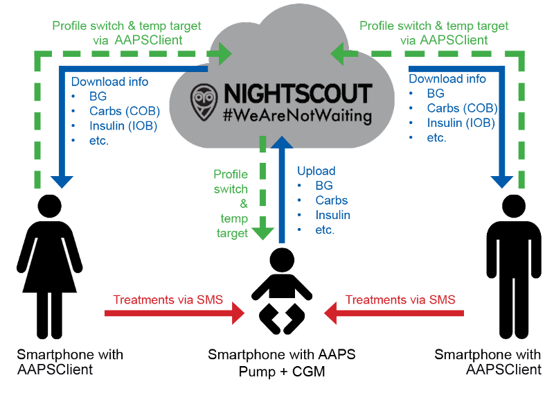

# Monitoraggio remoto

__AAPS__ offre diverse funzionalità per il monitoraggio remoto dei bambini con diabete di tipo 1 e facilita anche i comandi remoti che inviano istruzioni ad __AAPS__ a distanza. Allo stesso modo, __AAPSClient__ può essere usato per il monitoraggio remoto per seguire __AAPS__ del tuo partner o di un amico.

## Funzioni

- Il microinfusore del bambino è controllato dal telefono del bambino tramite __AAPS__.
- I caregiver possono seguire da remoto tutti i dati rilevanti come i livelli di glucosio, i carboidrati attivi, l'insulina attiva ecc. utilizzando l'**apk AAPSClient** sul loro telefono, che deve essere un telefono Android. Le impostazioni modificate in __AAPS__ si sincronizzeranno con __AAPSClient__ e viceversa.
- I caregiver possono ricevere allarmi utilizzando l'**app xDrip+ in modalità follower** sul loro telefono Android, se la modalità companion di xDrip è configurata.
- Il controllo remoto di __AAPS__ tramite [Comandi SMS](../RemoteFeatures/SMSCommands.md) è protetto dall'autenticazione a due fattori.
- Il controllo remoto tramite __AAPSClient__ è consigliato solo se la sincronizzazione funziona correttamente (cioè non si vedono modifiche indesiderate ai dati come l'auto-modifica di TT, TBR ecc.); consulta le [note di rilascio per la Versione 2.8.1.1](#important-hints-2-8-1-1) per ulteriori dettagli. Tuttavia, la sincronizzazione è meno probabile che sia un problema se l'utente utilizza l'ultima versione di __AAPS__ e __AAPSClient__ con NSClientv3/Nightscout15.

## Strumenti e app per il monitoraggio remoto

- [Nightscout](https://nightscout.github.io/) nel browser web (principalmente visualizzazione dati)
- There are 2 apps:  [AAPSClient & AAPSClient2 to download](https://github.com/nightscout/AndroidAPS/releases/). __AAPSClient__ apk is a stripped down version of __AAPS__ capable of following somebody, making __Profile Switches__, setting __TTs__ and entering carbs. AAPSClient dovrebbe essere usato se il caregiver desidera installare l'apk due volte sullo stesso telefono per seguire 2 persone diverse (es. due bambini con diabete di tipo 1 ciascuno con il proprio account Nightscout).
- Dexcom Follow se si utilizza l'app Dexcom originale (solo valori glicemici)
- [xDrip+](../CompatibleCgms/xDrip.md) in modalità follower (principalmente valori glicemici e **allarmi**)
- [Sugarmate](https://sugarmate.io/) o [Spike](https://spike-app.com/) su iOS (principalmente valori glicemici e **allarmi**)
- Alcuni utenti trovano utile uno strumento di accesso remoto completo come [TeamViewer](https://www.teamviewer.com/) per la risoluzione avanzata dei problemi da remoto

## Opzioni smartwatch

Uno smartwatch può essere uno strumento molto utile per aiutare a gestire __AAPS__ con bambini con T1D. Sono possibili un paio di opzioni diverse:

- Opzione 1 - Se __AAPSClient__ è installato sul telefono del caregiver, l'[app AAPSClient WearOS](https://github.com/nightscout/AndroidAPS/releases/) può essere installata su uno smartwatch compatibile collegato al telefono del caregiver. Mostrerà la glicemia attuale, lo stato del loop e permetterà l'inserimento di carboidrati, Obiettivi Temporanei e cambi di Profilo. NON permetterà di effettuare boli dall'app WearOS.
- Opzione 2 - In alternativa, l'[app AAPS WearOS](../WearOS/WearOsSmartwatch.md) può essere compilata e installata su uno smartwatch compatibile, collegato al telefono del bambino ma indossato dal genitore. Include tutte le funzioni elencate sopra, oltre alla possibilità di somministrare boli di insulina. Ciò consente al caregiver di somministrare insulina senza dover rimuovere il telefono del bambino da dove viene tenuto.

## Cose da considerare

- Considera il ritardo temporale tra master e follower dovuto ai tempi di upload e download, e al fatto che il telefono master di __AAPS__ eseguirà l'upload solo dopo l'esecuzione del loop.
- Qual è il tuo piano di emergenza quando il controllo remoto non funziona (_es._ problemi di rete o connessione Bluetooth persa)?  Considera sempre cosa succederà con **AAPS** se improvvisamente non riesci a inviare un nuovo comando. **AAPS** sovrascrive la basale del microinfusore, l'ISF e l'ICR con i valori del profilo corrente. Usa solo cambi di profilo temporanei (_es._ con una durata temporale impostata) se si passa a un profilo insulinico più aggressivo, nel caso in cui la connessione remota venga interrotta. Il microinfusore tornerà al profilo originale quando scade il tempo.
