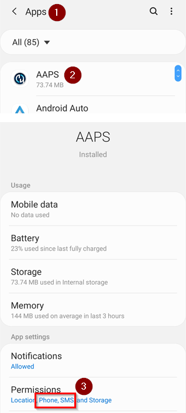
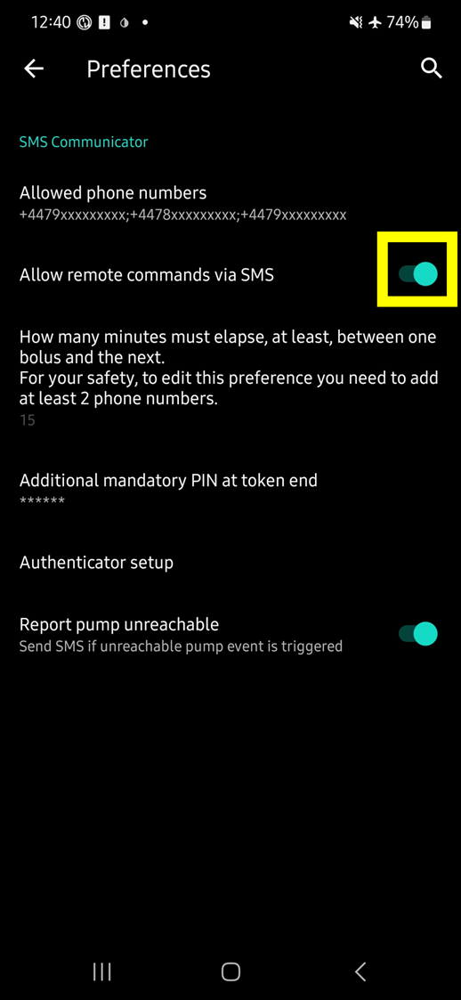
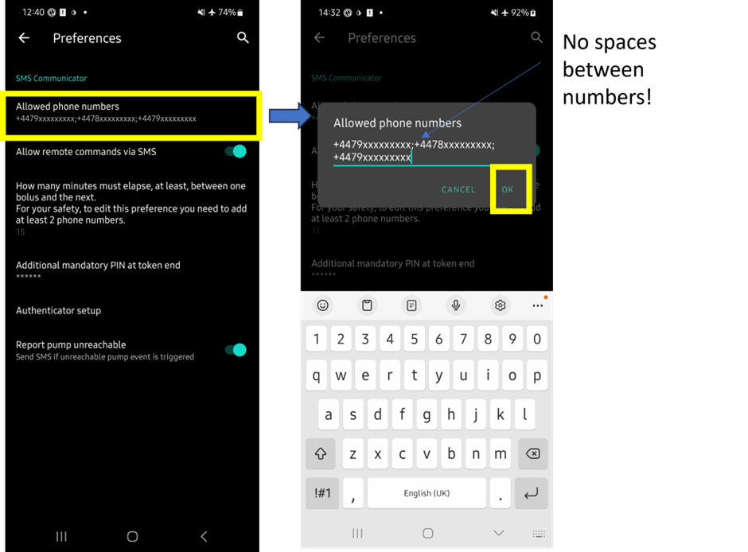
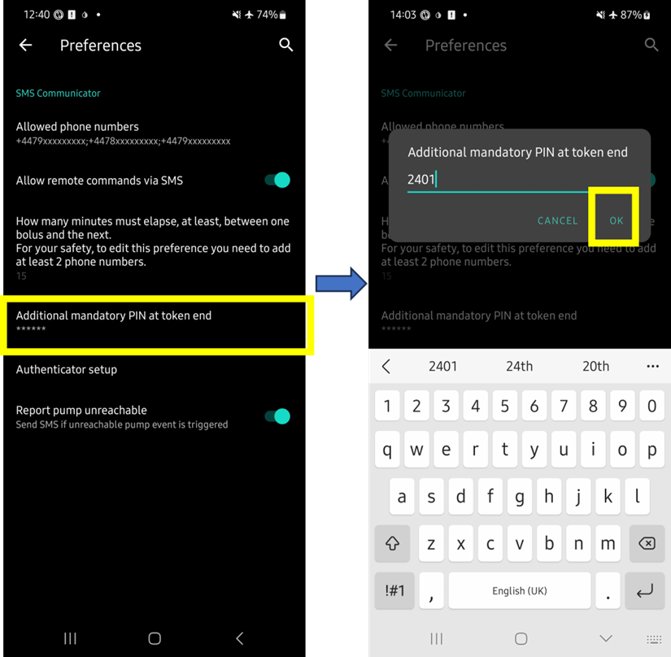
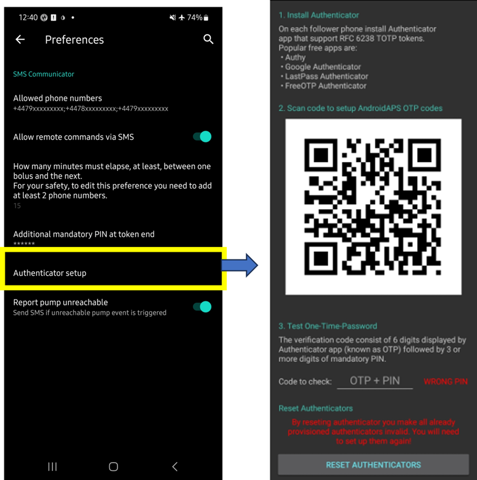
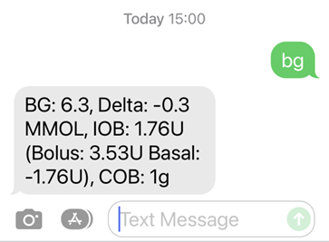
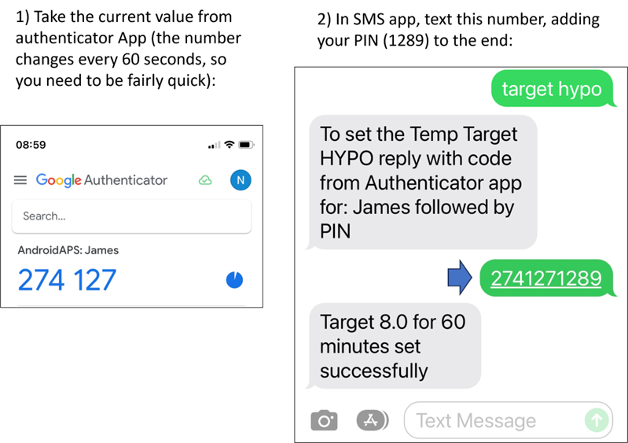
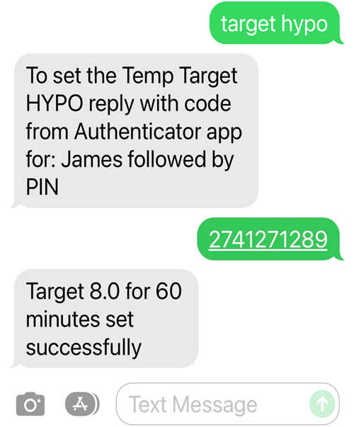
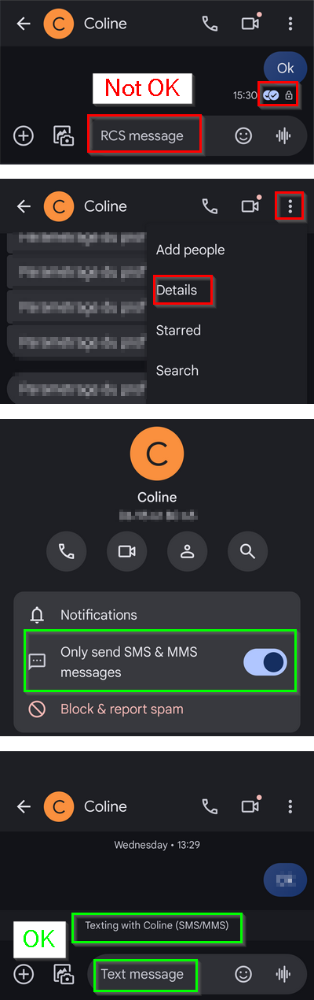
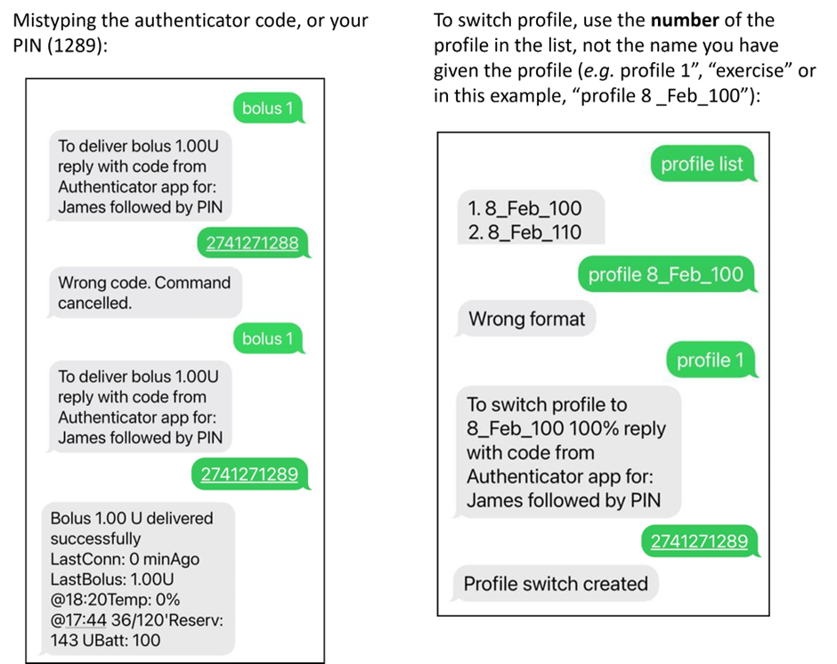

# Comandi SMS

```{contents} Table of contents
:depth: 2
```

La maggior parte delle regolazioni degli obiettivi temporanei, il monitoraggio di **AAPS** ecc. può essere effettuata sull'[app **AAPSClient**](../RemoteFeatures/RemoteMonitoring.md) su un telefono Android con connessione internet. I boli, tuttavia, non possono essere somministrati tramite **AAPSClient**, ma puoi usare i comandi SMS. Se usi un iPhone come follower e quindi non puoi usare l'app **AAPSClient**, sono disponibili ulteriori comandi SMS.

**I comandi SMS sono davvero utili:**
1. Per il controllo remoto di routine

2. Se vuoi somministrare insulina da remoto

3. In una zona con scarsa ricezione internet, dove i messaggi di testo riescono a passare, ma la ricezione dati/internet del telefono è limitata. Questo è molto utile quando si va in aree remote (es. campeggio, sci).

4. Se gli altri metodi di controllo remoto (Nightscout/AAPSClient) non funzionano temporaneamente

## Prima la sicurezza

Se abiliti **SMS Communicator** in **AAPS**, considera che il telefono configurato per dare comandi remoti potrebbe essere rubato e/o usato da qualcun altro. Blocca sempre il telefono con almeno un PIN. Si consiglia vivamente una password forte e/o il blocco biometrico, e assicurati che sia diversa dalla password Master APK (la password necessaria per esportare le impostazioni **AAPS**).

Inoltre, si consiglia di consentire un [secondo numero di telefono](#SMSCommands-authorized-phone-numbers) per i comandi SMS. In questo modo, puoi usare il secondo numero per [disabilitare](#SMSCommands-other) il comunicatore SMS nel caso in cui il tuo telefono remoto principale venga compromesso.

Il ritardo temporale minimo predefinito tra i comandi bolo è di 15 minuti. Per motivi di sicurezza, devi aggiungere almeno due numeri di telefono autorizzati per ridurre questo a un ritardo temporale più breve. Se provi a somministrare un bolo da remoto entro 15 minuti dal bolo precedente, riceverai la risposta "Bolo remoto non disponibile. Riprova più tardi."

AAPS ti informerà anche tramite messaggio di testo se i tuoi comandi remoti, come un bolo o un cambio di profilo, sono stati eseguiti. È consigliabile configurarlo in modo che i testi di conferma vengano inviati ad almeno due numeri di telefono diversi, nel caso in cui uno dei telefoni riceventi venga rubato.

**Se somministri boli tramite Comandi SMS, devi inserire i carboidrati separatamente (secondo SMS, AAPSClient, Nightscout...)!** Se non lo fai, l'IOB sarebbe corretto con un COB troppo basso, portando potenzialmente a un bolo di correzione non eseguito poiché **AAPS** presume che tu abbia troppa insulina attiva.

Per i comandi sensibili, è necessario usare un'app di autenticazione con una password monouso basata sul tempo per aumentare la sicurezza.

Se vuoi rimuovere la possibilità di un telefono del caregiver di inviare comandi SMS, usa il pulsante di emergenza "[Reimposta autenticatori](#sms-commands-authenticator-setup)" in **AAPS** o invia il comando SMS "[SMS stop](#SMSCommands-other)". Reimpostando gli autenticatori rendi non validi TUTTI i telefoni dei caregiver. Dovrai configurarli di nuovo.

## Configurazione dei comandi SMS

```{contents} The overall process is as follows
:depth: 1
:local: true
```

(sms-commands-authenticator-setup)=
### Configurazione dell'autenticatore

Viene usata l'autenticazione a due fattori per migliorare la sicurezza.

Sul telefono del caregiver, scarica (dall'App Store o Google Play) e installa un'app Authenticator. Le app gratuite più diffuse sono:
  - [Authy](https://authy.com/download/)
  - Google Authenticator - [Android](https://play.google.com/store/apps/details?id=com.google.android.apps.authenticator2) / [iOS](https://apps.apple.com/de/app/google-authenticator/id388497605)
  - [LastPass Authenticator](https://lastpass.com/auth/)
  - [FreeOTP Authenticator](https://freeotp.github.io/)

Queste app Authenticator producono una password a 6 cifre monouso con limite di tempo, simile all'online banking o agli acquisti mobili. Puoi usare un'app Authenticator alternativa, purché supporti i token TOTP RFC 6238. Microsoft Authenticator non funziona.

### Controlla le impostazioni del telefono

Sul tuo telefono, vai su **App > AAPS > Autorizzazioni**. Assicurati che **SMS** e **Telefono** siano consentiti.



### Sincronizzazione data e ora

L'ora su entrambi i telefoni deve essere sincronizzata. La migliore pratica è impostarla automaticamente dalla rete. Le differenze di orario potrebbero portare a problemi di autenticazione.

Su entrambi il telefono **AAPS** e il telefono del caregiver, controlla che la data e l'ora siano sincronizzate. Esattamente come farlo dipende dal tuo dispositivo specifico; potrebbe essere necessario provare diverse impostazioni.

Esempio (per Samsung S23): **Impostazioni > Gestione generale > Data e ora**: assicurati che **Data e ora automatiche** sia selezionato.

Alcune opzioni potrebbero essere disattivate, a causa della necessità dell'amministratore tramite un account familiare se il telefono è stato configurato come account figlio. Questa impostazione di data e ora è chiamata "imposta automaticamente" su un iPhone del caregiver/genitore. Se non sei sicuro di aver sincronizzato i telefoni, non preoccuparti; puoi configurare i comandi SMS e risolvere i problemi in seguito se sembra che stia causando problemi (chiedi aiuto se necessario).

### Impostazioni AAPS

Ora che le impostazioni del telefono sono state controllate, nell'app **AAPS** stessa, vai su [Generatore di Configurazione > Generale](../SettingUpAaps/ConfigBuilder.md) per abilitare il modulo **SMS Communicator**.

Vai alle Preferenze per SMS Communicator.

Abilita "consenti comandi remoti tramite SMS":



(SMSCommands-authorized-phone-numbers)=
#### Numeri di telefono autorizzati

Inserisci il/i numero/i di telefono del caregiver. Includi il prefisso internazionale ed escludi il primo "0" del numero di telefono, come mostrato in questi esempi:
* Numero UK: +447976304596
* Numero US: +11234567890
* Numero FR: +33612344567
* _ecc._

Nota che il "+" davanti al numero potrebbe essere o non essere richiesto in base alla tua posizione. Per determinarlo, invia un testo di esempio che mostrerà il formato ricevuto nella scheda SMS Communicator.

Se hai più di un numero di telefono da aggiungere, separali con punti e virgola, **SENZA spazio tra i numeri** (questo è fondamentale!). Seleziona "OK":



#### Minuti tra i comandi bolo

- Puoi definire il ritardo minimo tra due boli emessi tramite SMS.
- Per motivi di sicurezza devi aggiungere almeno due numeri di telefono autorizzati per modificare questo valore.

#### PIN aggiuntivo obbligatorio alla fine del token

Per motivi di sicurezza, il codice di risposta deve essere seguito da un PIN. Scegli un PIN che tu (e qualsiasi altro caregiver) utilizzerete alla fine del codice dell'autenticatore quando viene inviato il comando SMS.

I requisiti del PIN sono:

* 3-6 cifre
* non le stesse cifre (_es._ 1111 o 1224)
* non numeri sequenziali (_es._ 1234)



#### Configurazione dell'autenticatore

* Segui le istruzioni passo dopo passo sullo schermo.
* Apri l'app autenticatore installata sul _telefono del caregiver_, configura una nuova connessione e
* Usa il telefono del caregiver per scansionare il codice QR fornito da **AAPS**, quando richiesto.
* Testa la password monouso dall'app autenticatore sul telefono del caregiver seguita dal tuo PIN:

Esempio:
* Il token dall'app autenticatore è 457051
* Il tuo PIN obbligatorio è 2401
* Codice da verificare: 4570512401

Se l'inserimento è corretto, il testo rosso "PIN ERRATO" cambierà automaticamente in un verde "OK". **Non c'è nessun pulsante da premere!** Il processo è ora completo, non c'è nessun pulsante "OK" da premere dopo aver inserito il codice:



Ora dovresti essere configurato con i comandi SMS.

Usa il pulsante "Configurazione autenticatore > Reimposta autenticatori" se vuoi rimuovere gli autenticatori configurati. (Reimpostando l'autenticatore rendi non validi TUTTI gli autenticatori già configurati. Dovrai configurarli di nuovo.)

## Utilizzo dei comandi SMS

### Primi passi con i comandi SMS

1) Per verificare di aver configurato tutto correttamente, testa la connessione digitando "bg" come messaggio SMS dal telefono del caregiver al telefono **AAPS**. Dovresti ricevere una risposta simile a quella mostrata qui:



Se non ricevi alcuna risposta, controlla la sezione [Risoluzione dei problemi](#SMSCommands-troubleshooting) qui sotto.

2) Ora prova un comando SMS che richiede l'autenticatore, _ad esempio_ "target hypo". Il telefono del caregiver riceverà un testo in risposta, chiedendoti di inserire la **password dell'autenticatore a sei cifre** dall'app autenticatore, seguita dal **PIN** segreto aggiuntivo noto solo ai caregiver/follower (una stringa di dieci cifre in totale, assumendo che il tuo PIN sia di soli 4 cifre).

Quando provi a inviare un comando SMS per la prima volta, fallo in presenza del telefono **AAPS**, per vedere come funziona:



Il telefono del caregiver riceverà un SMS di risposta da **AAPS** per confermare se il comando SMS remoto è stato eseguito con successo.

Se il tuo comando è riuscito, riceverai una risposta per confermarlo. Se c'è un problema riceverai un messaggio di errore. Vedi [Risoluzione dei problemi](#SMSCommands-troubleshooting) di seguito per errori comuni.

**Suggerimento**: Può essere utile avere SMS illimitati nel tuo piano telefonico (per ogni telefono usato) se verranno inviati molti SMS.

### Somministrazione di boli pasto tramite comandi SMS

La somministrazione remota di boli di insulina può _solo_ essere effettuata tramite **Comandi SMS**; non può essere attivata tramite NightScout o AAPSClient. I carboidrati tuttavia possono essere annunciati tramite uno qualsiasi dei tre metodi. Non è possibile inviare sia i carboidrati che i comandi insulina in un singolo messaggio SMS. Questi comandi devono essere inviati separatamente come segue:

1) Invia il bolo di insulina (_ad esempio_ "bolus 2" comanderà un bolo di 2 unità) tramite comandi SMS equivale a usare l'icona "siringa" in **AAPS**. 2) Invia i carboidrati (_ad esempio_ "carbs 20" annuncerà 20g di carboidrati). Questo equivale a usare la scheda "carboidrati" in **AAPS**.

Per evitare le ipoglicemie, è una buona idea iniziare in modo conservativo, somministrando **meno insulina** di quanto sarebbe necessario in base al tuo rapporto carboidrati, perché non stai tenendo conto del livello di glucosio attuale o della tendenza del glucosio.

**L'ordine in cui invii questi comandi è importante**. Se annunci una grande quantità di carboidrati tramite qualsiasi metodo e hai gli SMB abilitati, **AAPS** potrebbe rispondere immediatamente dando un bolo parziale di insulina. Quindi, se poi provi a inviare un bolo di insulina _dopo_ aver annunciato i carboidrati, potresti avere un ritardo fastidioso e un messaggio "bolo in corso", e devi poi controllare cosa è stato somministrato come SMB. Oppure, se non ti accorgi che un SMB viene erogato, e il tuo bolo successivo ha anch'esso successo, potrebbe essere somministrata troppa insulina per il pasto complessivo. Pertanto, se si somministra un bolo per i pasti da remoto, invia sempre il bolo di insulina _prima_ dell'annuncio dei carboidrati. Se preferisci, puoi usare una combinazione di Nightscout o **AAPSClient** con i comandi SMS. I carboidrati possono essere annunciati tramite Nightscout senza alcuna autenticazione (vedi le istruzioni nella sottosezione qui sotto), e sono quindi più veloci dei comandi SMS.

(SMSCommands-commands)=
## Commands

```{contents} List of command groups
:depth: 1
:local: true
```

I comandi devono essere inviati in inglese; la risposta sarà nella tua lingua locale se la stringa di risposta è già [tradotta](#translations-translate-strings-for-AAPS-app). I comandi non sono sensibili alle maiuscole; puoi usare lettere minuscole o maiuscole.


Le **Tabelle Comandi SMS** di seguito mostrano tutti i possibili comandi SMS. I _Valori di esempio_ sono forniti per facilitare la comprensione. I comandi hanno la stessa gamma di valori possibili (target, percentuale profilo ecc.) che sono consentiti nell'app **AAPS** stessa.

(authentication-or-not)=
### Autenticazione o no?

Alcuni comandi SMS danno una risposta immediata, e alcuni comandi SMS richiedono una **autenticazione** forte tramite l'app Authenticator. Una semplice richiesta come "**glicemia**" (che richiede un aggiornamento sulla glicemia attuale) è rapida da digitare, non necessita di autenticazione e restituisce le informazioni sullo stato **AAPS** mostrate di seguito:


I comandi che richiedono maggiore sicurezza richiedono l'inserimento di un codice, ad esempio:



La colonna *Auth* nelle tabelle seguenti indica se è richiesta tale autenticazione forte per ciascun comando.

### Dati CGM

| Comando    | Auth | Funzione e *Risposta*                                                                                                                                                                                          |
| ---------- | ---- | -------------------------------------------------------------------------------------------------------------------------------------------------------------------------------------------------------------- |
| BG         | No   | Restituisce: ultima glicemia, delta, IOB (bolo e basale), COB<br/>*Ultima glicemia: 5.6 4 min fa, Delta: -0,2 mmol, IOB: 0.20U (Bolo: 0.10U Basale: 0.10U)*                                              |
| CAL 5.6/90 | Sì   | Calibrerà il CGM con un valore di 5.6/90<br/>(usa il valore appropriato per le tue unità di glucosio)<br/>Funziona solo se configurato correttamente in **AAPS**.<br/>*Calibrazione inviata* |

### Pump

| Comando              | Auth | Funzione e *Risposta*                                                                                     |
| -------------------- | ---- | --------------------------------------------------------------------------------------------------------- |
| PUMP                 | No   | Ultima conn: 1 min fa<br/>Temp: 0.00U/h @11:38 5/30min<br/>IOB: 0.5U Serbatoio: 34U Batt: 100 |
| PUMP DISCONNECT *30* | Sì   | Per disconnettere il microinfusore per *30* minuti                                                        |
| PUMP CONNECT         | Sì   | Pump reconnected                                                                                          |

### Basale

| Comando           | Auth | Funzione e *Risposta*                |
| ----------------- | ---- | ------------------------------------ |
| BASAL 0.3         | Sì   | Per avviare basale 0.3U/h per 30 min |
| BASAL 0.3 20      | Sì   | Per avviare basale 0.3U/h per 20 min |
| BASAL 30%         | Sì   | Per avviare basale 30% per 30 min    |
| BASAL 30% 50      | Sì   | Per avviare basale 30% per 50 min    |
| BASAL STOP/CANCEL | Sì   | Per fermare la basale temporanea     |


### Loop

| Comando           | Auth | Funzione e *Risposta*                                                                                                                                                                                                                       |
| ----------------- | ---- | ------------------------------------------------------------------------------------------------------------------------------------------------------------------------------------------------------------------------------------------- |
| LOOP STATUS       | No   | La risposta dipende dallo stato attuale:<br/> - *Loop è disabilitato* se il loop è disabilitato o LGS<br/> - *Loop è abilitato* se il loop è chiuso o aperto<br/> - *Sospeso (10 min)* se il loop è disconnesso o sospeso |
| LOOP STOP/DISABLE | Sì   | Il microinfusore tornerà alla frequenza basale pre-programmata.<br/>*Loop è stato disabilitato*                                                                                                                                       |
| LOOP START/ENABLE | Sì   | *Loop è stato abilitato*                                                                                                                                                                                                                    |
| LOOP SUSPEND 20   | Sì   | *Loop sospeso per 20 minuti*                                                                                                                                                                                                                |
| LOOP RESUME       | Sì   | *Loop ripreso*                                                                                                                                                                                                                              |
| LOOP CLOSED       | Sì   | *Modalità loop attuale: Loop Chiuso*                                                                                                                                                                                                        |
| LOOP LGS          | Sì   | *Modalità loop attuale: Sospensione per Glucosio Basso*                                                                                                                                                                                     |

### Bolo

Il bolo remoto non è consentito entro 15 min (questo valore è modificabile solo se vengono aggiunti 2 numeri di telefono) dall'ultimo comando bolo o dai comandi remoti! In questo caso, la risposta sarebbe *Bolo remoto non disponibile. Riprova più tardi.* Questa risposta viene inviata anche quando il microinfusore sta attualmente erogando un bolo.

| Comando              | Auth | Funzione e *Risposta*                                                                                                                      |
| -------------------- | ---- | ------------------------------------------------------------------------------------------------------------------------------------------ |
| BOLUS 1.2            | Sì   |                                                                                                                                            |
| BOLUS 0.60 MEAL      | Sì   | Eroga il bolo specificato di 0.60U<br/>**e** imposta il [Pasto Imminente TempTarget](#TempTargets-eating-soon-temp-target)           |
| CARBS 5              | Sì   | Per inserire 5g, senza bolo                                                                                                                |
| CARBS 5 17:35/5:35PM | Sì   | Per inserire 5g alle 17:35.<br/>Il formato dell'ora accettabile dipende<br/>dall'impostazione dell'ora (12h/24h) sul telefono. |
| EXTENDED 2 120       | Sì   | Per avviare bolo esteso 2U per 120 min.<br/>Solo per [microinfusori compatibili](#screens-action-tab).                               |
| EXTENDED STOP/CANCEL | Sì   | Per fermare il bolo esteso                                                                                                                 |

### Profilo

| Comando        | Auth | Funzione e *Risposta*                                                                                                                              |
| -------------- | ---- | -------------------------------------------------------------------------------------------------------------------------------------------------- |
| PROFILE STATUS | No   | Profilo attuale e percentuale                                                                                                                      |
| PROFILE LIST   | No   | L'elenco attuale dei profili in **AAPS**, ad es.:<br/>1. Profilo1<br/> 2. Profilo2                                                     |
| PROFILE 1      | Sì   | Per passare al profilo 1 nell'elenco.<br/>Usa i numeri restituiti da **PROFILE LIST**,<br/>non i nomi dei profili come li hai salvati. |
| PROFILE 2 30   | Sì   | Per passare al Profilo2 al 30%                                                                                                                     |

### Obiettivi Temporanei

| Comando                   | Auth | Funzione e *Risposta*                                   |
| ------------------------- | ---- | ------------------------------------------------------- |
| TARGET MEAL/ACTIVITY/HYPO | Sì   | Per impostare l'Obiettivo Temporaneo PASTO/ATTIVITÀ/IPO |
| TARGET STOP/CANCEL        | Sì   | Per annullare l'Obiettivo Temporaneo                    |


(SMSCommands-other)=
### Altro

| Comando            | Auth | Funzione e *Risposta*                                                                                                                                                                                                                                 |
| ------------------ | ---- | ----------------------------------------------------------------------------------------------------------------------------------------------------------------------------------------------------------------------------------------------------- |
| TREATMENTS REFRESH | No   | Aggiorna i trattamenti da NS                                                                                                                                                                                                                          |
| AAPSCLIENT RESTART | No   | Utile se noti un problema di comunicazione<br/>con Nightscout o **AAPSClient**                                                                                                                                                                  |
| RESTART            | No   | Riavvia AAPS. Utile se hai problemi che normalmente vengono risolti con un riavvio.                                                                                                                                                                   |
| SMS DISABLE/STOP   | No   | Per disabilitare il servizio SMS remoto rispondi con il codice Qualsiasi.<br/>Tieni presente che potrai riattivarlo direttamente<br/>solo dallo smartphone master **AAPS**.                                                               |
| HELP               | No   | Restituisce tutte le funzioni disponibili per la consultazione:<br/>glicemia, LOOP, TREATMENTS, ....<br/>Invia ulteriore comando ***HELP ***FUNZIONE****** per elencare<br/>tutte le opzioni disponibili in questa sezione. |
| HELP BOLUS         |      | *BOLUS 1.2<br/>BOLUS 1.2 MEAL*                                                                                                                                                                                                                  |

(SMSCommands-troubleshooting)=
## Risoluzione dei problemi e FAQ

```{contents} List of questions and issues
:depth: 1
:local: true
```

### Cosa _non_ possiamo fare con i comandi SMS?

1) **Non puoi impostare un cambio di profilo _temporaneo_** (quindi ad esempio, impostare "profilo esercizio" per 60 minuti), sebbene tu possa passare definitivamente a "profilo esercizio". I cambi di profilo temporanei possono invece essere impostati tramite Nightscout o AAPSClient.

2) **Non puoi annullare le automazioni** né **impostare target definiti dall'utente**, ma esistono soluzioni approssimative: Ad esempio, immagina che il target normale del profilo sia 5.5. Hai impostato un'automazione in AAPS, per impostare sempre un target alto di 7.0 tra le 14:30 e le 15:30 a causa di un corso di sport a scuola, e una condizione dell'automazione è che "non esiste nessun obiettivo temporaneo". Questa settimana ti è stato detto con breve preavviso che il corso di sport è stato annullato e sostituito da una sessione di pizza, ma tuo figlio è già a scuola con il telefono **AAPS**. Se l'obiettivo temporaneo alto di 7.0 viene avviato dall'automazione, e lo annulli (sul telefono **AAPS**, o da remoto) le condizioni dell'automazione sono ancora soddisfatte e **AAPS** imposterà semplicemente di nuovo il target alto, un minuto dopo.

**Se avessi accesso al telefono AAPS**, potresti deselezionare/modificare l'automazione, o se non vuoi farlo, potresti semplicemente impostare un nuovo obiettivo temporaneo di 5.6 per 60 min nella scheda Azioni o premendo sulla scheda del target. Questo impedirebbe all'automazione di impostare il target alto di 7.0.

**Se non hai accesso al telefono AAPS** i comandi SMS possono essere usati per una correzione approssimativa: ad esempio, usando il comando "target meal" per impostare un target di 5.0 per 45 min (gli altri target predefiniti sono 8.0 per attività o ipo, vedi Tabella). Tuttavia, con i comandi SMS non puoi specificare un valore di target _specifico_ (di 5.6 per 60 minuti, ad esempio); dovresti usare **AAPSClient** o Nightscout per farlo.

### Cosa succede se cambio idea su un comando che ho appena inviato?

**AAPS** eseguirà solo il comando più recente. Quindi, se digiti "bolus 1.5", e poi, senza autenticare, invii un nuovo comando "bolus 1", ignorerà il precedente comando 1.5. **AAPS** invierà sempre al telefono del caregiver una risposta per confermare quale sia il comando SMS prima che ti venga chiesto di inserire il codice di autenticazione, nonché una risposta dopo l'azione.

### Perché non ho ricevuto una risposta a un comando SMS?

Potrebbe essere per uno di questi motivi:

1) Il messaggio non è arrivato al telefono (problemi di rete). 2) **AAPS** è ancora in fase di elaborazione della richiesta (_ad esempio_ un bolo, che può richiedere del tempo per essere erogato a seconda della velocità del bolo). 3) Il telefono **AAPS** non ha una buona connessione Bluetooth con il microinfusore quando viene ricevuto il comando, e il comando è fallito (di solito questo crea un allarme sul telefono **AAPS**).

### Nessuna risposta ai comandi SMS

Sul telefono del caregiver e/o sul telefono **AAPS**, prova a disabilitare le seguenti opzioni:
* **Invia come messaggio chat** 
* Se usi l'app Messaggi Android o l'app Google Messages, disabilita la messaggistica RCS:
  - apri la conversazione SMS specifica in Messaggi
  - Seleziona i puntini di opzione in alto a destra
  - seleziona "Dettagli"
  - Attiva "Invia solo messaggi SMS e MMS" 

### Errori nell'esecuzione dei comandi

Ci sono diversi possibili motivi per cui il comando potrebbe non riuscire:

* La configurazione dei comandi SMS non è completa/corretta
* Hai inviato un comando con un formato errato (come "disconnect pump 45" invece di "pump disconnect 45")
* Hai usato un codice autenticatore errato o scaduto (di solito è bene aspettare qualche secondo per un nuovo codice, se quello attuale sta per scadere)
* Il codice+PIN era corretto, ma c'è stato un ritardo nell'SMS in uscita/arrivo, il che ha portato **AAPS** a calcolare che il codice autenticatore era scaduto
* Il telefono **AAPS** è fuori portata/contatto con il microinfusore
* Il sistema è già occupato a erogare un bolo

Gli errori comuni sono mostrati negli esempi di seguito:



### Come posso fermare un comando una volta che è stato autenticato?

Non puoi. Tuttavia, puoi annullare un bolo inviato tramite SMS sul telefono **AAPS** stesso, semplicemente annullandolo nel popup del bolo, se sei abbastanza rapido. Molti comandi SMS (eccetto i boli e gli annunci di carboidrati) possono essere facilmente annullati, o possono essere intraprese azioni per mitigare gli effetti indesiderati se viene commesso un errore.

Per gli errori nei boli e negli annunci di carboidrati, puoi comunque agire. Ad esempio, se hai annunciato 20g di carboidrati ma tuo figlio ne mangia solo 10g e tu (o un caregiver presente) non riesci a eliminare il trattamento nel telefono **AAPS** direttamente, potresti impostare un obiettivo temporaneo alto, o impostare un profilo ridotto, per incoraggiare **AAPS** a essere meno aggressivo.

### SMS multipli

Se ricevi lo stesso messaggio ripetutamente (_ad esempio_ un cambio profilo) potresti aver accidentalmente impostato un loop con altre app. Potrebbe essere xDrip+, ad esempio. In tal caso, assicurati che xDrip+ (o qualsiasi altra app) non carichi i trattamenti su NightScout.

Se l'altra app è installata su più telefoni, assicurati di disattivare l'upload su tutti.

(sms-commands-too-many-messages)=
### Ricevo troppi messaggi di testo dai Comandi SMS. Posso ridurre la frequenza, o farli smettere?

L'uso dei comandi SMS può generare molti messaggi automatici dal telefono **AAPS** al telefono del caregiver. Riceverai anche messaggi, ad esempio "profilo basale nel microinfusore aggiornato" se hai impostato delle automazioni in **AAPS**. Può essere utile avere SMS illimitati nel tuo piano telefonico **AAPS** (e per ogni telefono del caregiver usato) se verranno inviati molti SMS, e disattivare le notifiche, gli allarmi o le vibrazioni SMS su tutti i telefoni. Non è possibile usare i comandi SMS e non ricevere questi aggiornamenti. Per questo motivo, potresti voler trovare un modo alternativo per comunicare direttamente con tuo figlio (se è abbastanza grande), invece degli SMS. Le app di comunicazione alternative comunemente usate dai caregiver **AAPS** includono Whatsapp, Lime, Telegram e Facebook Messenger.

È possibile disabilitare l'"SMS Profilo cambiato", quando il cambio profilo ha origine da Nightscout. Per farlo, crea un file denominato **esattamente** `do_not_send_sms_on_profile_change` nella directory `extra` della tua directory AAPS.
