(browser-build)=

# Browser build

Compilazione di AAPS tramite GitHub Actions.

**La versione minima di AAPS supportata è la 3.3.2.1.**

## Compilare autonomamente invece di scaricare

**L'app AAPS (un file apk) non è disponibile per il download a causa delle normative sui dispositivi medici. È legale compilare l'app per uso personale, ma non è consentito cederne una copia ad altri!**

Per i dettagli, consulta la [pagina FAQ](../UsefulLinks/FAQ.md).

(Building-APK-without-a-computer)=

## Requisiti hardware e software per la compilazione di AAPS

Si consiglia di utilizzare un dispositivo Android. È possibile utilizzare anche un computer o un dispositivo iOS.

Sarà necessario utilizzare più schede nel browser e passare da una all'altra. Esempio con Chrome:

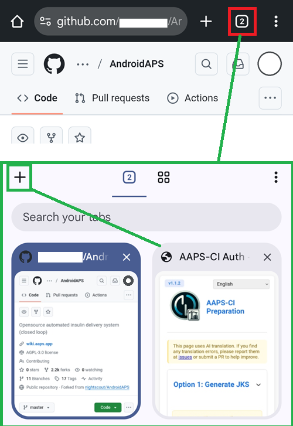

È inoltre necessario un account Google affinché l'app possa essere salvata su Google Drive.

```{note}
Questa guida presuppone che tutte le operazioni vengano eseguite con lo smartphone e il browser web Chrome.  
Sarà necessario passare da una scheda all'altra: iniziare con tutte le schede chiuse per evitare di perdersi durante i passaggi.
```

(github-fork)=

## 1. Fork personale di AAPS

Sarà necessario memorizzare in modo sicuro la chiave Android Java personale e le informazioni di Google Drive su GitHub (lo spiegheremo in seguito).

Poiché questa operazione non può essere eseguita all'interno del repository pubblico di AndroidAPS, è necessario creare una copia personale del codice sorgente (chiamata fork).

### Account GitHub

Se non hai ancora un account GitHub, devi [crearne uno](https://github.com/signup).  
Puoi registrarti con la tua e-mail o con Google. Segui il processo di registrazione e verifica.

Quando hai un account, [accedi a GitHub](https://github.com/login).

### Fork di AndroidAPS

Apri il repository ufficiale di AndroidAPS seguendo [questo link](https://github.com/nightscout/AndroidAPS).

Tocca l'icona fork. Verrà creata una copia all'interno del tuo account.

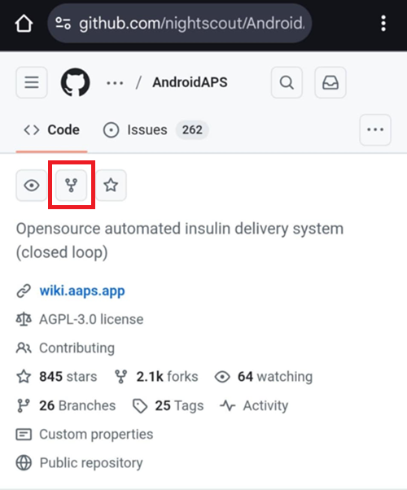

Scorri verso il basso nella schermata successiva e tocca **Create Fork**.

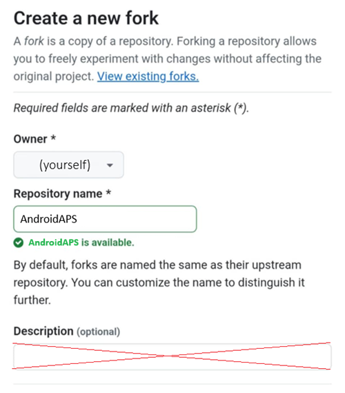

*Nota: puoi **deselezionare** "Copy the main branch only" se desideri compilare versioni per sviluppatori o personalizzazioni.*


```{note}
<<<<<<< Updated upstream
Forking a repository allows you to freely experiment with changes without affecting the original project. You cannot fork and you see this?</br></br>
=======
Non riesci a fare il fork e vedi questo?</br></br>
>>>>>>> Stashed changes
**`Create a new fork`**</br>
`A fork is a copy of a repository. View existing forks.`</br>
*`Required fields are marked with an asterisk (*).`*</br>
**`No available destinations to fork this repository.`**</br></br>
Ciò significa che hai già un fork esistente di AndroidAPS.</br>
Assicurati che sia aggiornato e prosegui con i Passi di preparazione.
```

```{warning}
**Non eliminare mai il tuo fork senza aver eseguito un backup dei tuoi segreti!**
```

GitHub ora mostra la tua copia personale di AndroidAPS. Lascia questa scheda del browser aperta.


(aaps-ci-preparation)=

## 2. Passi di preparazione

- Se stai compilando da un dispositivo Android, installa [File Manager Plus](https://play.google.com/store/apps/details?id=com.alphainventor.filemanager) dal Google Play Store.

```{admonition} File Manager Plus
:class: dropdown

:::{include} BrowserBuildFileManagerPlus.md
```

- Scarica il file di preparazione da qui: [aaps-ci-preparation.html](https://github.com/nightscout/aaps-ci-preparation/releases/download/release-v1.1.2/aaps-ci-preparation.html)

````{admonition} Note
:class: note

1. Se apri questa pagina dall'interno di un'app (tramite web view), il file HTML potrebbe non scaricarsi. raw:: html

    &nbsp;&nbsp;&nbsp;&nbsp;&nbsp;&nbsp;<a href="../_static/CI/aaps-ci-preparation.html" download>  aaps-ci-preparation.html</a>
```<!--crowdin:enable-->Please copy the URL and open it in your browser instead:
```text
https://github.com/nightscout/aaps-ci-preparation/releases/download/release-v1.1.2/aaps-ci-preparation.html
```
Or visit the latest release page:
```text
https://github.com/nightscout/aaps-ci-preparation/releases/latest
```

2.Backup copy hosted on this site:

 - If the external link is also unavailable, you can use this backup file to download.
Copia l'URL e aprilo nel browser:
>>>>>>> Stashed changes
```text
https://github.com/nightscout/aaps-ci-preparation/releases/download/release-v1.1.2/aaps-ci-preparation.html
```
Oppure visita la pagina dell'ultima versione:
```text
https://github.com/nightscout/aaps-ci-preparation/releases/latest
```

2.Copia di backup ospitata su questo sito:

 - Se anche il link esterno non è disponibile, puoi utilizzare questo file di backup per il download. Copia l'URL e aprilo nel browser:
>>>>>>> Stashed changes
```text
https://github.com/nightscout/aaps-ci-preparation/releases/download/release-v1.1.2/aaps-ci-preparation.html
```
Oppure visita la pagina dell'ultima versione:
```text
https://github.com/nightscout/aaps-ci-preparation/releases/latest
```

2.Copia di backup ospitata su questo sito:

 - Se anche il link esterno non è disponibile, puoi utilizzare questo file di backup per il download.
````
<<<<<<< Updated upstream AndroidAPS build requires private keys, that are stored in a Java KeyStore (JKS): - If this is your first time building AAPS (or you don't have a an Android Studio JKS), follow [AAPS-CI Option 1 – Generate JKS](#aaps-ci-option1) to complete the setup.
- - - - - - - - - - - Se vuoi utilizzare il tuo JKS (quello usato per una precedente compilazione di AAPS da computer in Android Studio), conosci la password e l'alias (key0), scegli [AAPS-CI Opzione 2 – Carica JKS esistente](#aaps-ci-option2).
</br>

```{warning}
La compilazione di AAPS con l'**Opzione 1** non consentirà di aggiornare la versione esistente di AAPS.
Sarà necessario:
1. [Esportare le impostazioni](#ExportImportSettings-Automating-Settings-Export) sullo smartphone.
2. Copiare o caricare il file delle impostazioni dallo smartphone in una posizione esterna (es. computer, servizio di archiviazione cloud…).
3. Generare una nuova versione dell'apk firmato come descritto nell'Opzione 1 e trasferirla sullo smartphone.
4. Disinstallare la versione precedente di AAPS sullo smartphone.
5. Installare la nuova versione di AAPS sullo smartphone.
6. [Importare le impostazioni](#ExportImportSettings-restoring-from-your-backups-on-a-new-phone-or-fresh-installation-of-aaps) per ripristinare gli obiettivi e la configurazione.
7. Ripristinare i dati da Nightscout.
```

- - - - - - - - - - - - - - - If this is your first time building AAPS (or you don't have a an Android Studio JKS), follow [AAPS-CI Option 1 – Generate JKS](#aaps-ci-option1) to complete the setup.

</br>

Una volta compilata, l'app AAPS verrà salvata nel tuo Google Cloud Drive.

(aaps-ci-option1)=
### AAPS-CI Opzione 1 – Genera JKS
 - Adatta ai nuovi utenti, a chi non ha un JKS, o a chi ha dimenticato la password o l'alias.
- Di seguito sono riportati esempi per più piattaforme.
- Seleziona la tua piattaforma nell'elenco: Android (scelta preferita), iOS o Computer.

```{tab-set}

:::{tab-item} Android
(aaps-ci-option1-android)=
:::{include} BrowserBuildO1A.md
:::  

:::{tab-item} iOS
(aaps-ci-ios-ipad)=
:::{include} BrowserBuildO1I.md
:::  

:::{tab-item} Computer
(aaps-ci-option1-computer)=
:::{include} BrowserBuildO1C.md
:::  

```

Salta la sezione successiva e continua [qui](#aaps-ci-google-drive-auth).

---

(aaps-ci-option2)=

### AAPS-CI Opzione 2 – Carica JKS esistente
 - Adatta agli utenti che hanno già un JKS e conoscono la password e l'alias del JKS  (Per `KEYSTORE_PASSWORD`, `KEY_ALIAS` e `KEY_PASSWORD`, inserire la password e l'alias effettivi in GitHub — quelli di Android Studio, vedi sotto dove li hai utilizzati.)

```{admonition} KEY + PASSWORDS
:class: dropdown


```

 - Di seguito sono riportati esempi per più piattaforme.
 - Seleziona la tua piattaforma nell'elenco: Android (scelta preferita) o Computer.


```{tab-set}

:::{tab-item} Android
(aaps-ci-option2-android)=
:::{include} BrowserBuildO2A.md
:::  

:::{tab-item} Computer
(aaps-ci-option2-computer)=
:::{include} BrowserBuildO2C.md
:::  

```

</br>

(aaps-ci-google-drive-auth)=

### AAPS-CI Autenticazione Google Drive

```{warning}
Indipendentemente dall'insieme di istruzioni seguito (opzione 1 o opzione 2), DEVI aggiungere l'autorizzazione Google Drive per utilizzare con successo il Browser Build.
```

Nota: se hai già seguito questa parte nel video, puoi saltare direttamente [qui](#github-build-apk).

Tornare alla scheda File Explorer Plus.

Scorrere verso il basso fino alla sezione Google Drive Auth e toccare Start Auth.


Selezionare il proprio account Google.


Scorrere verso il basso e accettare l'accesso. La pagina web ne ha bisogno per ottenere la chiave di autenticazione di Google Drive.

Toccare Continue.


Il campo `GDRIVE_OAUTH2` si compilerà automaticamente; toccare il pulsante Copy in alto.


Tornare alla scheda GitHub.

Scorrere verso il basso fino a Repository secrets e toccare New repository secret.

Se hai seguito l'Opzione 1, dovresti vedere questo:


Se hai seguito l'Opzione 2, ci saranno più chiavi:

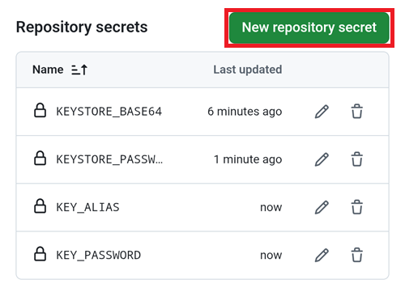

Nel campo Name, incollare il testo appena copiato. Usare una pressione prolungata sulla casella di testo per visualizzare il menu di incollaggio.


Passare alla scheda File Explorer Plus.

Toccare il secondo pulsante Copy.

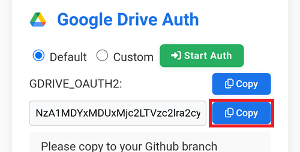

Tornare alla scheda GitHub.

1. Nel campo Secret, incollare il testo appena copiato. Usare una pressione prolungata sulla casella di testo per visualizzare il menu di incollaggio.

2. Toccare Add secret.

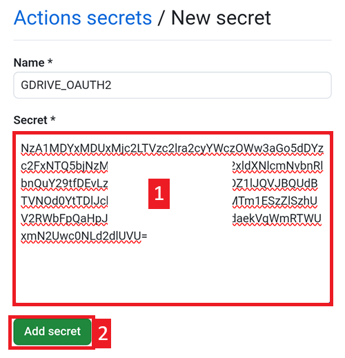

Ora dovresti avere due (opzione 1) o cinque (opzione 2) voci di segreti.

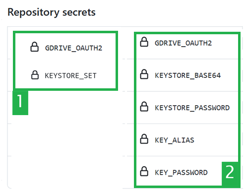

GitHub sarà ora in grado di salvare il file apk di AAPS nel tuo Google Drive, una volta compilato.

(github-build-apk)=
## AAPS-CI GitHub Actions per compilare l'APK di AAPS
 - Adatto agli utenti generici.

```{tab-set}

:::{tab-item} Wiki
:::{include} BrowserBuildCIS.md
:::  

:::{tab-item} Video
<div align="center" style="max-width: 360px; margin: auto; margin-bottom: 2em;">
  <div style="position: relative; width: 100%; aspect-ratio: 9/16;">
    <iframe
      src="https://www.dailymotion.com/embed/video/x9rdwms?autoplay=0&queue-enable=false&loop=1"
      style="position: absolute; top: 0; left: 0; width: 100%; height: 100%;"
      frameborder="0"
      allowfullscreen>
    </iframe>
  </div>
</div>
:::  

```

### Selezione della versione da compilare

**Solo le versioni di AAPS dalla 3.3.2.1 in su possono essere compilate con il metodo Browser.**


(variant)=

### Selezione della variante di compilazione

*Nota: sia l'app Android che l'app Android Wear verranno compilate automaticamente.*

  - Selezionare la variante necessaria:
    - fullRelease: Per l'uso regolare del microinfusore con tutte le funzionalità.
    - [aapsclientRelease, aapsclient2Release](#RemoteControl_aapsclient): Per i caregiver (richiede [Nightscout](../SettingUpAaps/Nightscout.md)).
    - pumpcontrolRelease: Per sostituire l'app/controller del microinfusore.

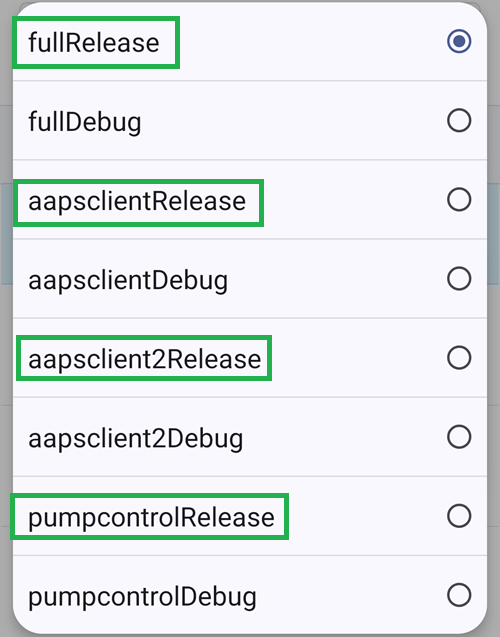

Le varianti che terminano con "Debug" indicano che l'APK verrà compilato in modalità debug, utile per gli sviluppatori per la risoluzione dei problemi.

<!-- If you want to test the items in a pull request has been moved to dev page /AdvancedOptions/DevBranch.md -->

(aaps-ci-troubleshooting)=
## Risoluzione dei problemi AAPS-CI

(aaps-ci-preparation-web)=
### Pagina web aaps-ci-preparation
  - Quando si apre aaps-ci-preparation.html tramite un file manager, viene avviato un server locale temporaneo sullo smartphone per visualizzare la pagina web e ricevere il token di aggiornamento Google.
  - Se viene visualizzata la schermata seguente, significa che si è stati inattivi per un po' e il file manager ha già chiuso il server locale.
  - Riaprire aaps-ci-preparation.html tramite l'app file manager e completare i passaggi rimanenti.

  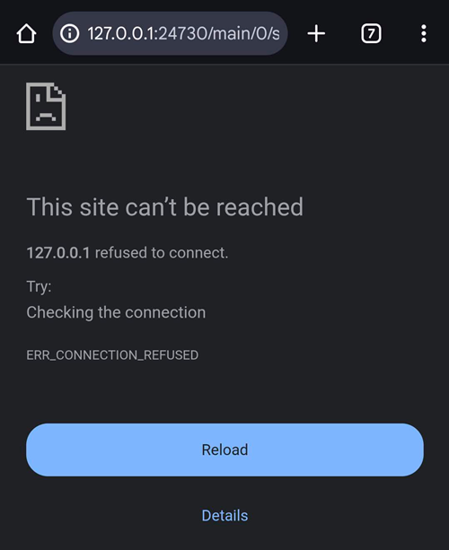

(aaps-ci-google-token-expired)=
### Token di aggiornamento Google scaduto
  - I token di aggiornamento Google OAuth2 scadono se non vengono utilizzati per 6 mesi e possono diventare non validi anche in altre condizioni (ad es. se si è cambiata la password dell'account Google o si è revocato manualmente l'accesso). Per maggiori dettagli, consultare la [documentazione Google OAuth2](https://developers.google.com/identity/protocols/oauth2).
  - Verrà visualizzato un errore che indica che il token di accesso non è valido, come mostrato di seguito:

  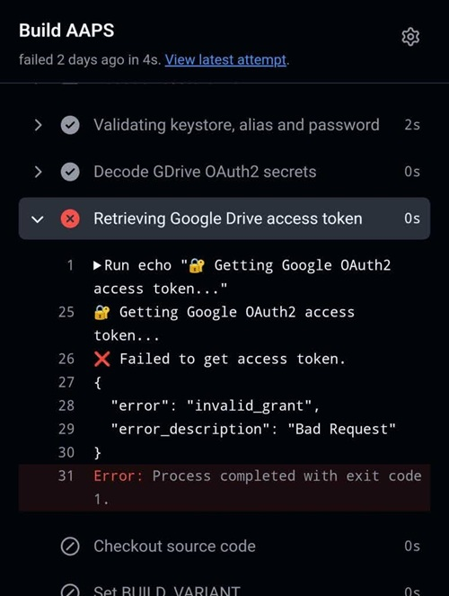

  - Se la compilazione fallisce a causa di un token di aggiornamento Google scaduto o revocato, sarà necessario ripetere i passaggi [Autenticazione Google Drive](#aaps-ci-google-drive-auth) per ottenere un nuovo token `GDRIVE_OAUTH2` e aggiornare il segreto nel repository GitHub, quindi rieseguire il workflow di compilazione.

(aaps-ci-disable-software)=
### Disabilitare il software che potrebbe interferire con la verifica OAUTH
  - Disabilitare qualsiasi VPN o app di sicurezza (firewall, antimalware, …) sullo smartphone prima di tentare di ottenere la chiave OAUTH.

(aaps-ci-actions-permission)=
### Verificare le impostazioni dei permessi di GitHub Actions
  - Assicurarsi che le policy di GitHub Actions siano impostate su "Allow all actions and reusable workflows" (Settings → Actions → General).

  

`actions/checkout@v4` e `actions/setup-java@v4` non sono autorizzati per l'uso in `xxxxx/AndroidAPS`. Le azioni in questo workflow devono essere: all'interno di un repository di proprietà di `xxxxx`

--------

```{warning}
Le personalizzazioni di solito non sono necessarie. Queste informazioni sono fornite solo a titolo informativo.
```

(github-cherry-pick)=

## Per aggiungere un commit specifico al branch, utilizzare cherry-pick.

  

  - Use workflow from Branch: Inserire il nome del branch a cui si desidera applicare il cherry-pick.
  - Upstream Repository: Inserire il nome del repository da cui si desidera applicare il cherry-pick.
  - Commit SHA: Inserire il commit SHA da applicare con cherry-pick (come hash del commit git).
  - Select Build Variant: [variante](variant)

(ci-keystore-export)=
## Esportazione CI KeyStore

Per esportare il keystore memorizzato, utilizzare questo metodo.

Questo script esporterà le informazioni sul keystore precedentemente configurato (dall'Opzione 1 o dall'Opzione 2) come file ZIP protetto da password nella directory `/AAPS/KeyStore` del Google Drive.

```{warning}
Prima di utilizzare questo metodo di esportazione, assicurarsi che le impostazioni del keystore e di Google Drive siano state completate.
```

### Passaggi:

1. **Aggiungere il segreto della password ZIP:**
   - Vai su **Settings** → **Secrets and variables** → **Actions** del tuo repository.
   - Fare clic su **New repository secret**.
   - Nel campo **Name**, inserire: `ZIP_PASSWORD`
   - Nel campo **Secret**, inserire la password di crittografia ZIP personalizzata.
   - Utilizzare solo lettere e numeri inglesi per la password (nessun simbolo speciale).
   - Fare clic su **Add secret**.

   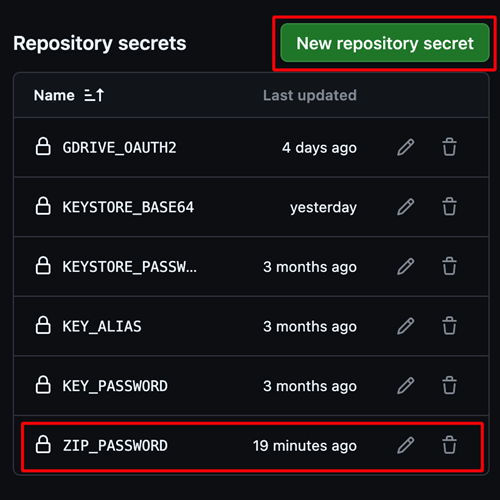

2. **Eseguire il workflow di esportazione:**
   - Andare alla scheda **Actions** del repository.
   - Selezionare **CI KeyStore Export**.
   - Fare clic su **Run workflow**.
   - Il file ZIP del keystore esportato verrà salvato su Google Drive.

   

   