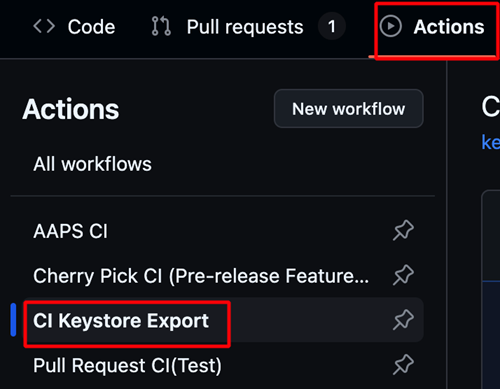
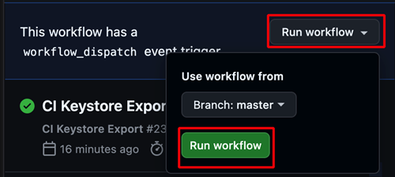

(browser-build)=

# Browser build

Building AAPS with GitHub Actions.

**Minimum AAPS version supported is 3.3.2.1.**

## Build yourself instead of download

**The AAPS app (an apk file) is not available for download, due to regulations around medical devices. It is legal to build the app for your own use, but you must not give a copy to others!**

See [FAQ page](../UsefulLinks/FAQ.md) for details.

(Building-APK-without-a-computer)=

## Device and software specifications for building AAPS

We recommend using an Android device. You can also use a computer or an iOS device.

You will need to use multiple tabs in your browser, and switch from one to the other. Example Chrome:


You also need a Google account so that the app can be saved in your Google Drive.

```{note}
This wiki assumes you're performing all operations with your cellular phone and the Chrome web browser.  
You will need to jump from tab to tab: start with all tabs closed to avoid losing yourself when switching from one to another.
```

(github-fork)=

## 1. AAPS personal fork

You will need to secretly store your personal Android Java Key and Google Drive information in GitHub (later in the process, we will explain how).

Since this cannot be done inside the public repository of AndroidAPS, you need to make your personal copy of the source code (called a fork).

### GitHub account

You need to [create a GitHub account](https://github.com/signup) if you don't have one yet.  
You can sign up with your email, or you can sign up with Google. Follow the registration and verification process.

When you have an account, [sign in to GitHub](https://github.com/login).

### Fork AndroidAPS

Open the official AndroidAPS repository following [this link](https://github.com/nightscout/AndroidAPS).

Tap on the fork icon. This will create a copy inside your own account.


Scroll down the next screen and tap **Create Fork**.


*Note: you can **unselect** "Copy the main branch only" if you will want to build developers versions or customizations.*


GitHub now displays your personal copy of AndroidAPS. Leave this web browser tab open.


(aaps-ci-preparation)=

## 2. Preparation Steps

- If you are building from an Android device, install [File Manager Plus](https://play.google.com/store/apps/details?id=com.alphainventor.filemanager) from the Google Play store.

```{admonition} File Manager Plus
:class: dropdown

:::{include} BrowserBuildFileManagerPlus.md
```

- Download the preparation file from here: [aaps-ci-preparation.html](https://github.com/nightscout/aaps-ci-preparation/releases/download/release-v1.1.2/aaps-ci-preparation.html)

````{admonition} Note
:class: note

1. If you open this page from within an app (via a web view), the HTML file may not download. Please copy the URL and open it in your browser instead:
```text
https://github.com/nightscout/aaps-ci-preparation/releases/download/release-v1.1.2/aaps-ci-preparation.html
```
Or visit the latest release page:
```text
https://github.com/nightscout/aaps-ci-preparation/releases/latest
```

2.Backup copy hosted on this site:

 - If the external link is also unavailable, you can use this backup file to download.
<!--crowdin:disable-->

```{eval-rst}
.. raw:: html

    &nbsp;&nbsp;&nbsp;&nbsp;&nbsp;&nbsp;<a href="../_static/CI/aaps-ci-preparation.html" download>  aaps-ci-preparation.html</a>
```
<!--crowdin:enable-->
````
AndroidAPS build requires private keys, that are stored in a Java KeyStore (JKS):
- If this is your first time building AAPS (or you don't have a an Android Studio JKS), follow [AAPS-CI Option 1 – Generate JKS](aaps-ci-option1) to complete the setup.
</br>

```{warning}
Building AAPS with **Option 1** will not allow you to upgrade your existing AAPS.
You will need to:
1. [Export settings](#ExportImportSettings-Automating-Settings-Export) on your phone.
2. Copy or upload the settings file from your phone to an external location (i.e. your computer, cloud storage service…).
3. Generate a new version of the signed apk as described in Option 1 and transfer it to your phone.
4. Uninstall previous AAPS version on your phone.
5. Install new AAPS version on your phone.
6. [Import settings](#ExportImportSettings-restoring-from-your-backups-on-a-new-phone-or-fresh-installation-of-aaps) to restore your objectives and configuration.
7. Restore your data from Nightscout.
```

- If you want to use your own JKS (the one you used on a previous build of AAPS from a computer in Android Studio), you know its password and alias (key0), please choose [AAPS-CI Option 2 – Upload Existing JKS](aaps-ci-option2).

</br>

The AAPS app will be saved in your Google Cloud drive once built.

(aaps-ci-option1)=
### AAPS-CI Option 1 – Generate JKS
 - Suitable for first-time users, or those without a JKS, or who have forgotten the password or alias.
- Here are examples using multiple platforms below.
- Select your platform in the list below, between Android (preferred choice), iOS or Computer.

```{tab-set}

:::{tab-item} Android
(aaps-ci-option1-android)=
:::{include} BrowserBuildO1A.md
:::  

:::{tab-item} iOS
(aaps-ci-ios-ipad)=
:::{include} BrowserBuildO1I.md
:::  

:::{tab-item} Computer
(aaps-ci-option1-computer)=
:::{include} BrowserBuildO1C.md
:::  

```

Skip the next section and continue [here](#aaps-ci-google-drive-auth).

---

(aaps-ci-option2)=

### AAPS-CI Option 2 – Upload Existing JKS
 - Suitable for users who already have a JKS and know the JKS password and alias  (For `KEYSTORE_PASSWORD`, `KEY_ALIAS`, and `KEY_PASSWORD`, enter your actual password and alias in GitHub - those from Android Studio, see below where you used them.)

```{admonition} KEY + PASSWORDS
:class: dropdown


```

 - Here are examples using multiple platforms below.
 - Select your platform in the list below, between Android (preferred choice) or Computer.


```{tab-set}

:::{tab-item} Android
(aaps-ci-option2-android)=
:::{include} BrowserBuildO2A.md
:::  

:::{tab-item} Computer
(aaps-ci-option2-computer)=
:::{include} BrowserBuildO2C.md
:::  

```

(aaps-ci-google-drive-auth)=

### AAPS-CI Google Drive Auth

Note: If you already followed this part in the video, you can now skip to [here](#github-build-apk).

Return to the File Explorer Plus tab.

Scroll down to the Google Drive Auth section and tap Start Auth.


Select your Google account.


Scroll down and accept the access. The web page needs it to obtain the Google Drive authentication key.

Tap Continue.


The `GDRIVE_OAUTH2` field will populate, tap the top Copy button.


Switch back to the GitHub tab.

Scroll down to Repository secrets and tap New repository secret.

If you followed Option 1 you should see this:


If you followed Option 2 there will be more keys:


In the Name field, paste the text you just copied. Use a long touch on the text box to show the paste menu.


Switch to the File Explorer Plus tab.

Tap the second Copy button.


Switch back to the GitHub tab.

1. In the Secret field, paste the text you just copied. Use a long touch on the text box to show the paste menu.

2. Tap Add secret.


GitHub will now be able to store the AAPS apk file in your Google Drive, once built.

(github-build-apk)=
## AAPS-CI GitHub Actions to Build the AAPS APK
 - Suitable for general users.

```{tab-set}

:::{tab-item} Wiki
:::{include} BrowserBuildCIS.md
:::  

:::{tab-item} Video
<div align="center" style="max-width: 360px; margin: auto; margin-bottom: 2em;">
  <div style="position: relative; width: 100%; aspect-ratio: 9/16;">
    <iframe
      src="https://www.dailymotion.com/embed/video/x9rdwms?autoplay=0&queue-enable=false&loop=1"
      style="position: absolute; top: 0; left: 0; width: 100%; height: 100%;"
      frameborder="0"
      allowfullscreen>
    </iframe>
  </div>
</div>
:::  

```

### Build Version selection

**Only AAPS versions from 3.3.2.1 and above will build with the Browser method.**


(variant)=

### Build Variants selection

*Note: both Android and Android Wear apps will be built automatically.*

  - Select the variant you need:
    - fullRelease: For regular pump usage with full functionality.
    - [aapsclientRelease, aapsclient2Release](#RemoteControl_aapsclient): For caregivers (requires [Nightscout](../SettingUpAaps/Nightscout.md))。
    - pumpcontrolRelease: To replace your pump app/controller


Variants ending with “Debug” indicates that the APK will be built in debug mode, which is useful for developers for troubleshooting.

<!-- If you want to test the items in a pull request has been moved to dev page /AdvancedOptions/DevBranch.md -->

(aaps-ci-troubleshooting)=
## AAPS-CI Troubleshooting

(aaps-ci-preparation-web)=
### aaps-ci-preparation web page
  - When you open aaps-ci-preparation.html using a file manager, it will start a temporary local server on your phone to display the webpage and receive the Google refresh token.
  - If you see the screen below, it means you have been inactive for a while, and the file manager has already shut down the local server.
  - Please reopen aaps-ci-preparation.html using the file manager app and complete the remaining steps.

  

(aaps-ci-disable-software)=
### Disable Software That May Interfere With OAUTH Verification
  - Disable any VPN or security app (firewall, antimalware,...) on the phone before trying to get the OAUTH key.

(aaps-ci-actions-permission)=
### Check GitHub Actions Permission Settings
  - Make sure GitHub Actions policies are set to “Allow all actions and reusable workflows” (Settings → Actions → General).

  

`actions/checkout@v4` and `actions/setup-java@v4` are not allowed to be used in `xxxxx/AndroidAPS`. Actions in this workflow must be: within a repository owned by `xxxxx`

--------

```{warning}
Customizations are usually not necessary. This is for your information ony.
```

(github-cherry-pick)=

## If you want to add a specific commit to your branch, please use cherry-pick.

  

  - Use workflow from Branch: Please enter the branch name you want to cherry-pick to.
  - Upstream Repository: Please enter the repository name you want to cherry-pick from.
  - Commit SHA: Please enter the commit SHA you want to cherry-pick.(like git commit hash)
  - Select Build Variant: [variant](variant)

(ci-keystore-export)=
## CI KeyStore Export

If you want to export your stored keystore, use this method.

This script will export your previously configured keystore information (from Option 1 or Option 2) as a password-protected ZIP file to the `/AAPS/KeyStore` directory in your Google Drive.

```{warning}
Before using this export method, make sure your keystore and Google Drive settings have been completed.
```

### Steps:

1. **Add ZIP Password Secret:**
   - Go to your repository's **Settings** → **Secrets and variables** → **Actions**
   - Click **New repository secret**
   - In the **Name** field, enter: `ZIP_PASSWORD`
   - In the **Secret** field, enter your custom ZIP encryption password
   - Use only English letters and numbers for the password (no special symbols)
   - Click **Add secret**

   

2. **Run Export Workflow:**
   - Go to the **Actions** tab in your repository
   - Select **CI KeyStore Export**
   - Click **Run workflow**
   - The exported keystore ZIP file will be saved to your Google Drive

   

   