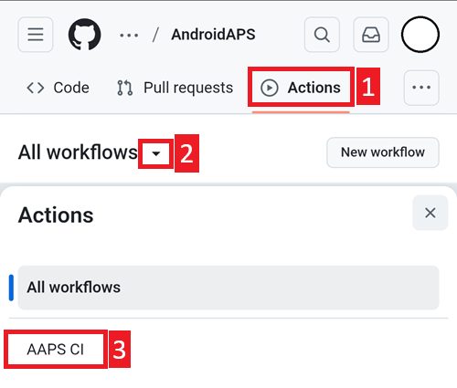
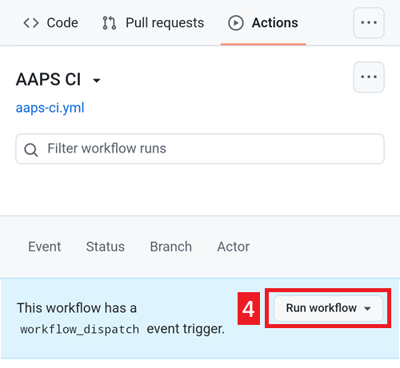
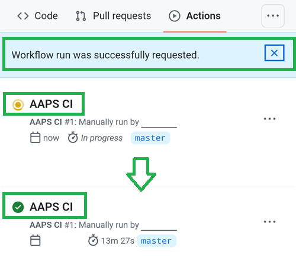
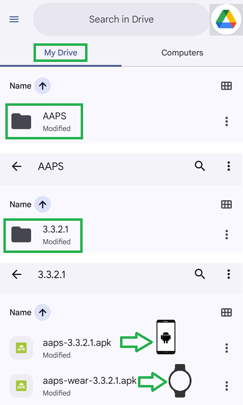

### Eseguire il workflow per costruire l'APK firmato

1. Nel tuo fork di AndroidAPS su GitHub, selezionare Actions.
2. Espandere All Workflows.
3. Selezionare AAPS-CI

4. Scorrere verso il basso e toccare Run Workflow.

5. Selezionare il branch da distribuire (master), la [variante](#browserbuild-variant) (fullRelease) e toccare Run Workflow.

6. Verrà visualizzato il messaggio "Workflow run was successfully requested". Aggiornare la pagina del browser per monitorare l'avanzamento della build. Al termine dell'azione, AAPS CI mostrerà un segno di spunta verde. La nuova versione di AndroidAPS è stata compilata con successo.

### Installare l'APK di AAPS

1. Aprire Google Drive.
2. Navigare nella cartella AAPS, selezionare la cartella della nuova versione: troverete sia la versione per smartphone che quella per Android Wear.

