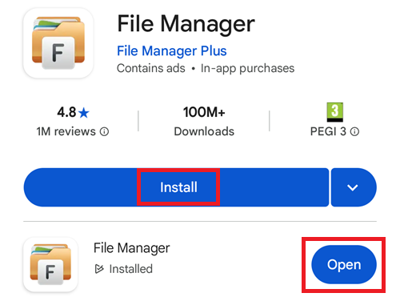
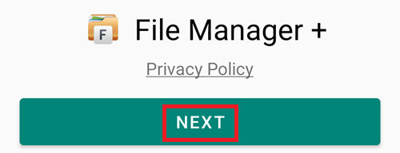
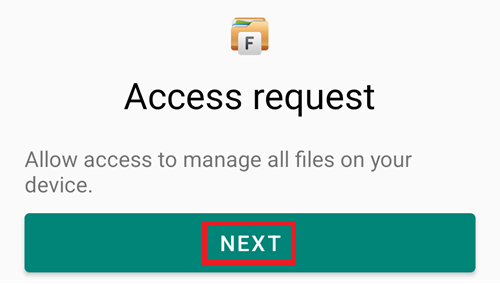
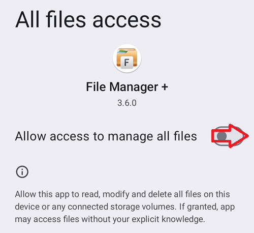
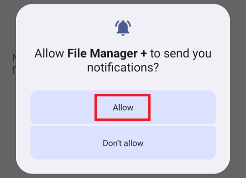
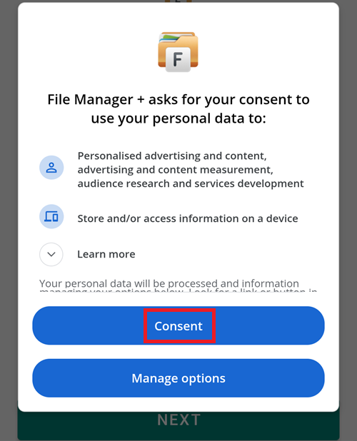

Installa [File Manager Plus](https://play.google.com/store/apps/details?id=com.alphainventor.filemanager) dal Google Play Store.

L'app è necessaria per la fase preliminare e puoi eliminarla dal tuo telefono una volta che hai compilato e installato AAPS con successo.

Verifica che questa sia l'app corretta e tocca Installa, poi Apri.

Tap Next to accept the Privacy Policy.

Tap Next to allow the app to access the phone files.

Switch to enable access to all files.

Allow File Manager + notifications.

Consent to profiling.

