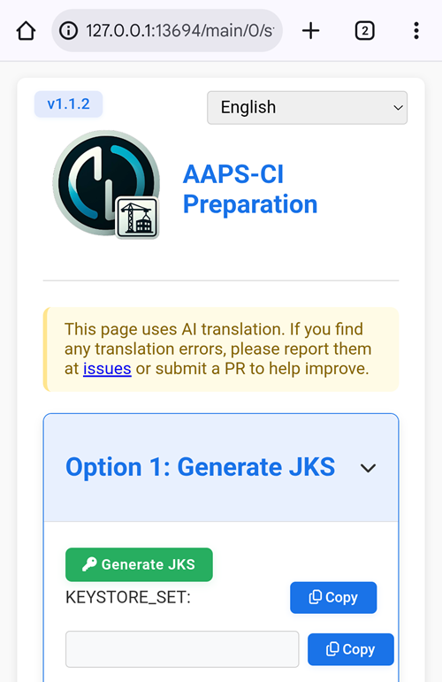
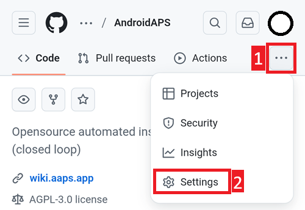
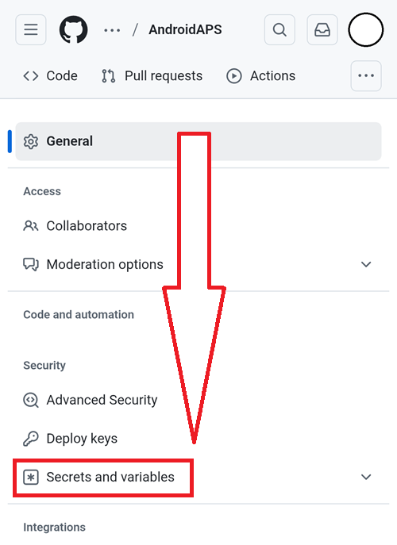
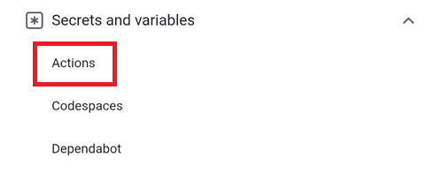
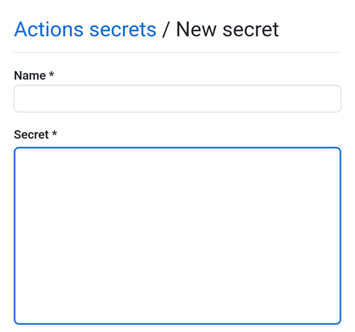
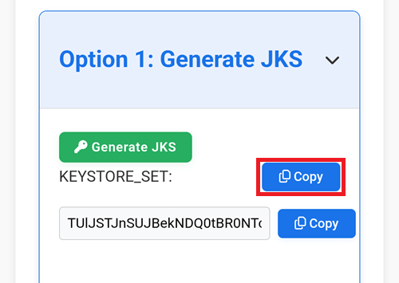
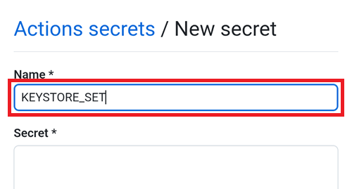
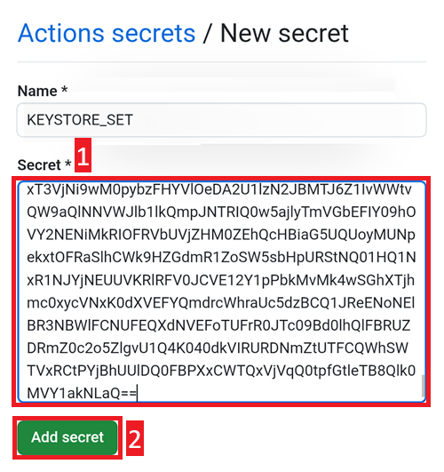

### Apri il file di aiuto per la preparazione CI

Con File Manager+, apri il file `aaps-ci-preparation-html` scaricato in precedenza.

Seleziona Download.

Cerca questo file, toccalo per aprirlo, aprilo con Chrome, tocca Solo una volta.

Si aprirà in questo modo.

Seleziona Genera JKS. Il campo qui sotto si popolerà con dei caratteri.

Tieni questa scheda aperta.

### Crea un nuovo segreto in GitHub

Torna alla scheda del browser GitHub: la tua copia personale di AndroidAPS.

1. In alto a destra, tocca il pulsante `...`
2. Seleziona Impostazioni nell'elenco

Scorri verso il basso fino a Sicurezza e seleziona Segreti e variabili.

Ora seleziona Azioni

Scorri verso il basso fino a Segreti del repository e tocca Nuovo segreto del repository

Vedrai questa finestra di dialogo (scorri verso il basso se non è visibile).

Lascia la scheda aperta così.

Passa alla scheda File Explorer Plus.

Tocca il pulsante Copia in alto.

Torna alla scheda GitHub.

Nel campo Nome, incolla il testo appena copiato. Usa un tocco lungo sulla casella di testo per mostrare il menu di incolla.

Passa alla scheda File Explorer Plus.

Tocca il secondo pulsante Copia.

Torna alla scheda GitHub.

1. Nel campo Segreto, incolla il testo appena copiato. Usa un tocco lungo sulla casella di testo per mostrare il menu di incolla.

2. Tocca Aggiungi segreto.

Verifica che il segreto sia stato aggiunto, scorri verso il basso per confermare.

