### Copy your Android Studio key in your Google Cloud drive.

Sul tuo computer, cerca il file keystore usato per compilare AAPS. Ha l'estensione `.jks`.

Trascinalo in [Google Drive](https://drive.google.com/drive/my-drive), tramite il browser o il tuo Google Drive mappato.

Open File Manager Plus and select Cloud.

Add a Cloud location.

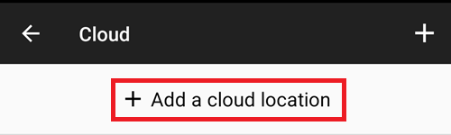

Choose Google Drive.

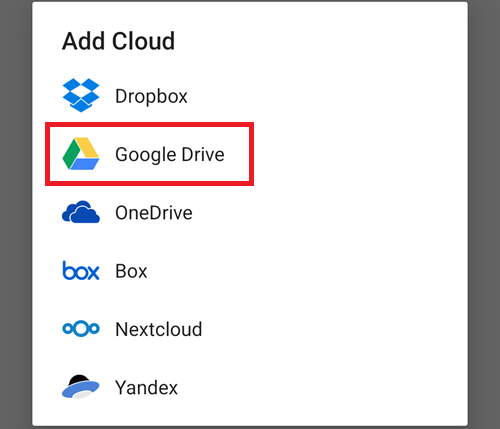

Select your Google Drive account email. Tap OK.

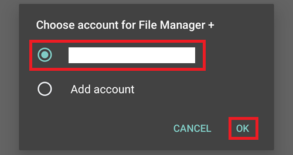

Your Google Cloud drive should display its contents. Ora torna alla home page dell'app.

### Open the CI preparation help file

Apri il file `aaps-ci-preparation-html` scaricato in precedenza.

Select Downloads.

And search for this file, tap it to open it, open it with Chrome, tap Just once.

It will open like this.

Scroll down to Option 2: Upload Existing JKS. Espandi l'interfaccia.

Select Choose File.

Pick your KeyStore file from your Google Drive files.

The field below will populate.

Keep this tab open.

### Crea un nuovo segreto in GitHub

Torna alla scheda GitHub nel browser: la tua copia personale di AndroidAPS.

1. In alto a destra, tocca il pulsante `...`
2. Seleziona Impostazioni nell'elenco

Scroll down to Security and select Secrets and variables.

Now select Actions

Scroll down to Repository secrets and tap New repository secret

You will see this dialog (scroll down if it's not visible).

Leave the tab opened like this.

Passa alla scheda File Explorer Plus.

Tocca il pulsante Copia in alto.

Switch back to the GitHub tab.

Nel campo Nome, incolla il testo appena copiato. Usa una pressione prolungata sulla casella di testo per visualizzare il menu di incolla.

Switch to the File Explorer Plus tab.

Tocca il secondo pulsante Copia.

Switch back to the GitHub tab.

1. Nel campo Segreto, incolla il testo appena copiato. Usa una pressione prolungata sulla casella di testo per visualizzare il menu di incolla.

2. Tap Add secret.

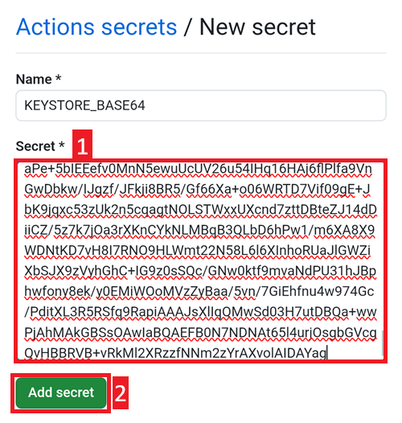

Check the secret has been added, scroll down to verify.

Add a new secret: tap the New repository secret button.

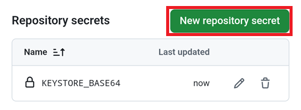

Switch to the File Explorer Plus tab.

Tocca il pulsante Copia in alto per copiare `KEYSTORE_PASSWORD`.

Nota: se preferisci digitare i nomi delle chiavi direttamente in GitHub, non hai bisogno di copiare/incollare. Se non sei sicuro di digitare esattamente lo stesso nome della chiave, procedi in questo modo. Nota che non dovresti lasciare `:` alla fine del nome della chiave.

Switch back to the GitHub tab.

1.  Incolla il nuovo nome della chiave.
2. Nel campo Segreto, inserisci la password del KeyStore (non lasciarla vuota).
3. Tap Add secret.

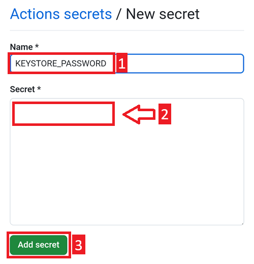

Check the secret has been added, scroll down to verify.

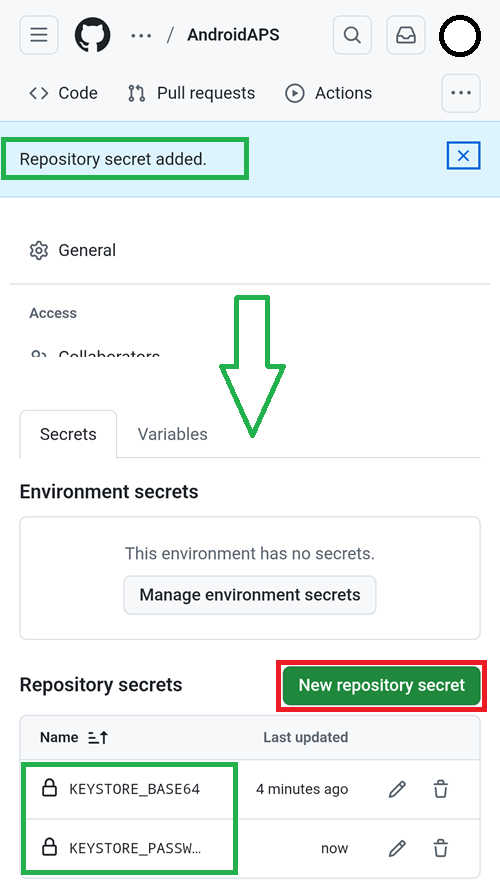

Tap the New repository secret button shown above.

Switch to the File Explorer Plus tab.

Tocca il pulsante Copia in alto per copiare `KEYSTORE_ALIAS`.

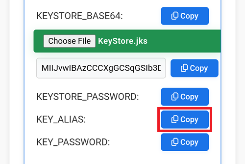

Switch back to the GitHub tab.

1.  Incolla il nuovo nome della chiave.
2. Nel campo Segreto, inserisci il tuo KeyStore Alias (di solito è `key0`, minuscolo con il numero zero, non la lettera O). Non lasciare che Android lo autocorrrechi.
3. Tap Add secret.

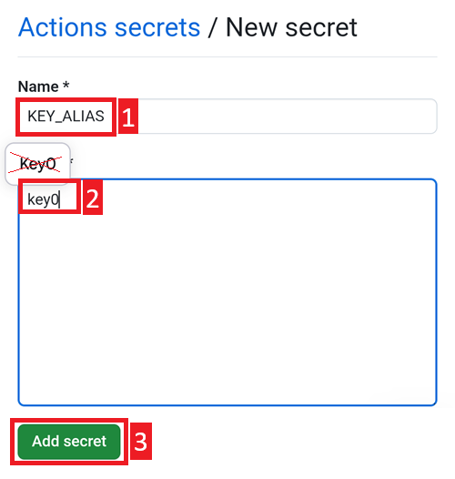

Check the secret has been added, scroll down to verify.

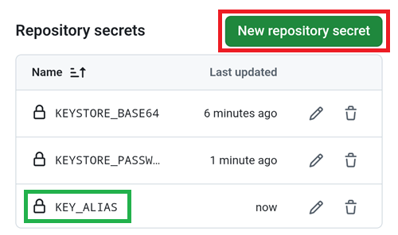

Tap the New repository secret button shown above.

Switch to the File Explorer Plus tab.

Tocca il pulsante Copia in alto per copiare `KEY_PASSWORD`.

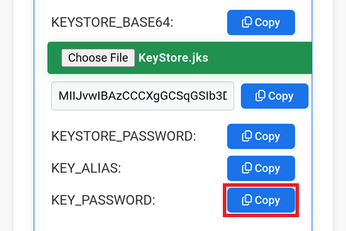

Switch back to the GitHub tab.

1.  Incolla il nuovo nome della chiave.
2. Nel campo Segreto, inserisci la password della chiave (non lasciarla vuota). Di solito è la stessa della password del KeyStore.
3. Tap Add secret.

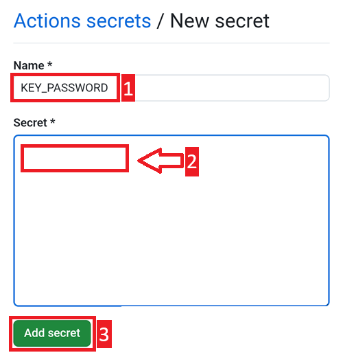

Check the secret has been added, scroll down to verify.
