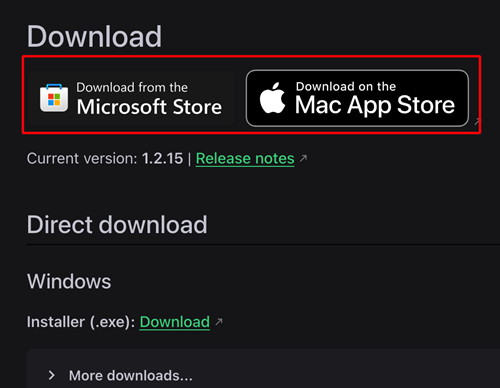
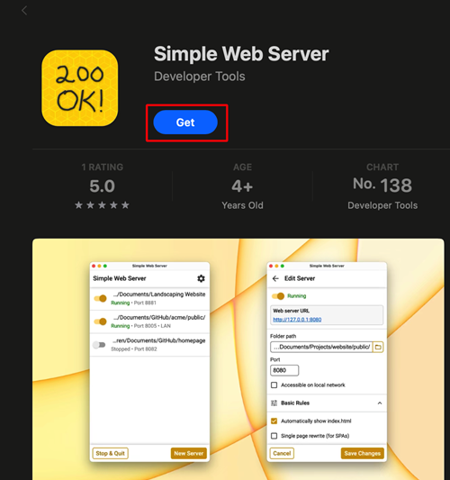
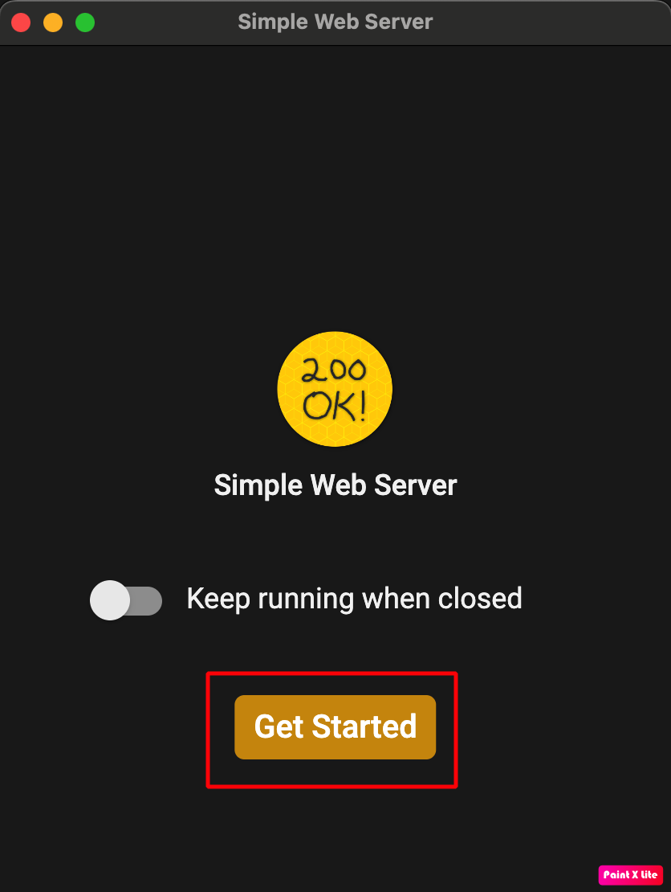
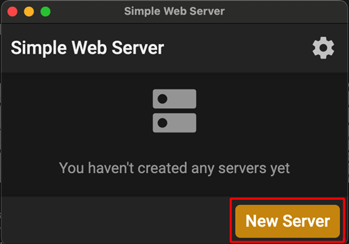
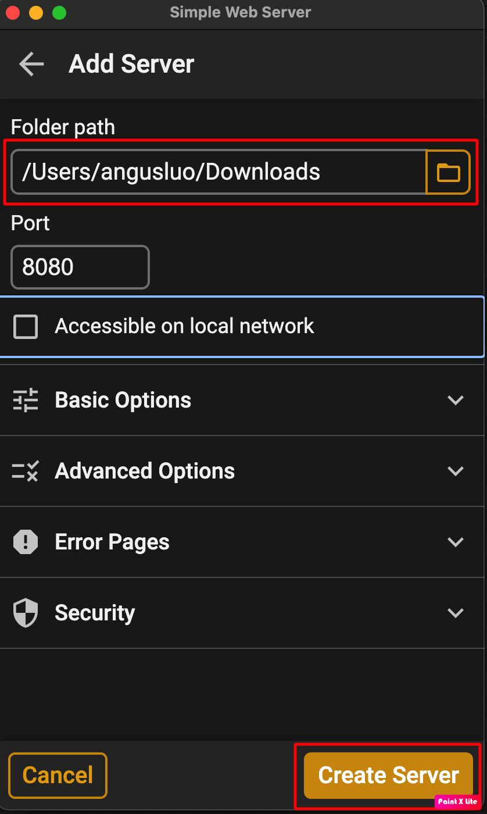
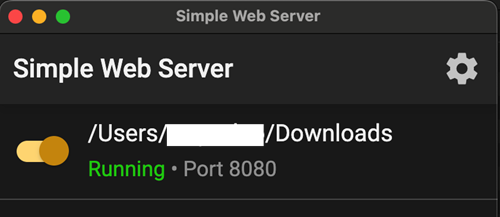

Utilizzare un computer (compatibile con Windows/Mac/Linux)

  

    <iframe
      src="https://www.dailymotion.com/embed/video/x9rdyc6?autoplay=0&queue-enable=false&loop=1"
      style="position: absolute; top: 0; left: 0; width: 100%; height: 100%;"
      frameborder="0"
      allowfullscreen>
    </iframe>
  

Installare Simple HTTP Server   Se si utilizza Windows o Mac, è possibile installarlo dallo store. Dopo aver cliccato sul link, verrà chiesto se consentire l'apertura. Scegliere Open Link.     

Esempio su Mac:

- get → install → open     

- Fare clic su Get Started     

- Fare clic su Get Server     

- In Folder Path, selezionare la cartella in cui si trova aaps-ci-preparation.html, quindi fare clic su Create Server.     

- La visualizzazione di questa schermata indica che il server è stato avviato.     

- Non chiudere Simple HTTP Server. Passare al browser e aprire   [http://127.0.0.1:8080/aaps-ci-preparation.html](http://127.0.0.1:8080/aaps-ci-preparation.html)  

- Per i passaggi successivi, fare riferimento al video sottostante, a partire dal minuto 2 e 18 secondi.  
  <!--crowdin: exclude-->
  

    

      <iframe
        src="https://www.dailymotion.com/embed/video/x9rdvt0?start=138&autoplay=0&queue-enable=false&loop=1"
        style="position: absolute; top: 0; left: 0; width: 100%; height: 100%;"
        frameborder="0"
        allowfullscreen>
      </iframe>
    

  

