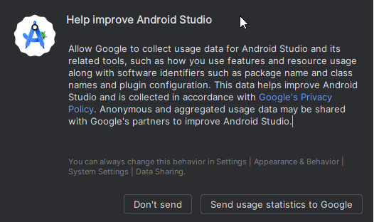
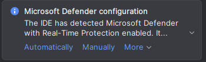

# Costruire AAPS

## Costruisci te stesso invece di scaricare

**L'app AAPS (un file apk) non è disponibile per il download, a causa delle normative sui dispositivi medici. È legale costruire l'app per il proprio uso, ma non devi darne una copia ad altri!**

Vedi la pagina [Domande frequenti](../UsefulLinks/FAQ.md) per i dettagli.


(Building-APK-recommended-specification-of-computer-for-building-apk-file)=
## Specifiche computer e software per la costruzione di AAPS

* Una versione specifica di **[Android Studio](https://developer.android.com/studio/)** potrebbe essere necessaria per costruire l'apk. Cfr. tabella sotto:

| Versione AAPS           | Versione<br/>Android Studio<br/>preferita | Versione Alternative<br/>Android Studio<br/> | Gradle | JVM |
| ----------------------- | ----------------------------------------------------- | -------------------------------------------------------- | ------ |:--- |
| 2.6.2                   | 3.6.1                                                 |                                                          | 5.6    | 11  |
| 2.8.2.1                 | 4.1.1                                                 |                                                          | 6.1    | 13  |
| [3.1.0.3](#version3100) | 2020.3.1                                              | up to Narwhal                                            | 7.3    | 17  |
| [3.2.0.4](#version3204) | Hedgehog (2023.1.1)                                   | up to Narwhal                                            | 8.2    | 17  |
| [3.3.1.3](#version3300) | Ladybug Feature Drop (2024.2.2)                       | up to Narwhal                                            | 8.10   | 21  |
| [3.3.2](#version3300)   | Meerkat (2024.3.1)                                    | Narwhal                                                  | 8.11   | 21  |

La "versione preferita" contiene già la versione JVM appropriata. La versione preferita è anche la versione minima che puoi usare per costruire **AAPS**. **NON PUOI** costruire su una versione più vecchia di quella "preferita". Se usi una versione diversa, potresti incontrare dei problemi con la versione JVM. Guarda la pagina [Risoluzione dei problemi Android Studio](#troubleshooting_androidstudio-uncommitted-changes) per aiutarti a risolverli. Se la tua versione attuale di Android Studio non è elencata nella tabella, è necessario aggiornarla prima.

La versione Gradle è legata al codice sorgente, otterrai sempre la versione corretta Gradle quando scarichi / aggiorni il codice sorgente. E menzionata qui solo per riferimento, non è necessario intervenire su di esso.

* I sistemi [Windows 32 bit](#troubleshooting_androidstudio-unable-to-start-daemon-process) non sono supportati da Android Studio. Tieni presente che sia **la CPU 64 bit che il sistema operativo a 64 bit sono condizioni obbligatorie.** Se il sistema NON soddisfa queste condizioni, è necessario cambiare il computer, il software, o l'intero sistema.

<table class="tg">
<tbody>
  <tr>
    <th class="tg-baqh">OS (solo 64 bit)</th>
    <td class="tg-baqh">Windows 8 o superiore</td>
    <td class="tg-baqh">Mac OS 10.14 o superiore</td>
    <td class="tg-baqh">Qualsiasi Linux che supporta Gnome, KDE o Unity DE;&nbsp;&nbsp;librerie GNU C 2.31 o versioni successive</td>
  </tr>
  <tr>
    <th class="tg-baqh"><p align="center">CPU (solo 64 bit)</th>
    <td class="tg-baqh">CPU di architettura x86_64; Intel Core di seconda generazione o più recente, o CPU AMD con supporto per <br><a href="https://developer.android.com/studio/run/emulator-acceleration#vm-windows" target="_blank" rel="noopener noreferrer"><span style="text-decoration:var(--devsite-link-text-decoration,none)">Windows Hypervisor</span></a></td>
    <td class="tg-baqh">Chip basati su ARM, o Intel Core di seconda generazione o più recenti con supporto per <br><a href="https://developer.android.com/studio/run/emulator-acceleration#vm-mac" target="_blank" rel="noopener noreferrer"><span style="text-decoration:var(--devsite-link-text-decoration,none)">Hypervisor.Framework</span></a></td>
    <td class="tg-baqh">CPU di architettura x86_64; Intel Core di seconda generazione o più recente, o processore AMD con supporto per la virtualizzazione AMD (AMD-V) e SSSE3</td>
  </tr>
  <tr>
    <th class="tg-baqh"><p align="center">Memoria</th>
    <td class="tg-baqh" colspan="3"><p align="center">Uguale o superiore a 8GB</td>
  </tr>
  <tr>
    <th class="tg-baqh"><p align="center">Disco fisso</th>
    <td class="tg-baqh" colspan="3"><p align="center">Almeno 30GB di spazio libero. SSD consigliato.</td>
  </tr>
  <tr>
    <th class="tg-baqh"><p align="center">Risoluzione</th>
    <td class="tg-baqh" colspan="3"><p align="center">1280 x 800 Minimo <br></td>
  </tr>
  <tr>
    <th class="tg-baqh"><p align="center">Internet</th>
    <td class="tg-baqh" colspan="3"><p align="center">Banda larga</td>
  </tr>
</tbody>
</table>

**E' fortemente consigliato (non obbligatorio) utilizzare un disco SSD (stato solido) invece di un HDD (meccanico) perché ci vorrà meno tempo per costruire il file apk di AAPS.**  Puoi comunque usare un disco fisso meccanico per costruire il file apk di **AAPS**. Se ne usi uno, il processo di costruzione può richiedere molto tempo, ma una volta che è iniziato, puoi lasciarlo in esecuzione incustodito.

## Aiuto e assistenza durante il processo di costruzione

Se incontri difficoltà nel processo di costruzione dell'app **AAPS**, consulta la sezione [**dedicata alla risoluzione dei problemi Android Studio**](../GettingHelp/TroubleshootingAndroidStudio).

Se pensi che qualcosa nelle istruzioni di costruzione sia sbagliato, mancante o confusionale, o ancora stai lottando, contatta il gruppo di utenti **AAPS** su [Facebook](https://www.facebook.com/groups/AndroidAPSUsers) o [Discord](https://discord.gg/4fQUWHZ4Mw). Se vuoi cambiare qualcosa te stesso (aggiornamento screenshot _etc_), ti preghiamo di inviare una [pull request (PR)](../SupportingAaps/HowToEditTheDocs.md).

## Guida passo-passo per costruire l'app AAPS

```{admonition} WARNING
:class: warning
Se hai costruito AAPS prima, non è necessario eseguire nuovamente tutti i passaggi.
Vai direttamente alla [guida per l'aggiornamento](../Maintenance/UpdateToNewVersion.md)!
```

```{contents} The overall steps for building the **AAPS** apk file
:depth: 1
:local: true
```

In questa guida troverete schermate di _esempi_ di costruzione dell'apk di **AAPS**. Perché **Android Studio** - il software che utilizziamo per costruire l'apk **AAPS** - viene regolarmente aggiornato, questi screenshot potrebbero non essere identici alla tua installazione, ma dovrebbero essere ancora possibili da seguire.

Dal momento che **Android Studio** viene eseguito su piattaforme Windows, Mac OS X e Linux, potrebbero esserci anche piccole differenze nelle fasi per le diverse piattaforme.

(install-git-if-you-dont-have-it)=
### Installa Git

```{admonition} Why Git? 
:class: dropdown

Git è conosciuto come un “_Versioning Control System_” (VCS).
Git è un programma che consente di tenere traccia delle modifiche nel codice e di collaborare con gli altri. Utilizzerai Git per fare una copia del codice sorgente **AAPS** dal sito GitHub al tuo computer locale. Quindi, utilizzerai Git sul tuo computer per creare l'applicazione **AAPS** (apk). 
```

(BuildingAaps-steps-for-installing-git)=
#### Passi per l'installazione di Git

1.  Verifica che non hai già installato **Git**. Puoi farlo digitando “git” nella barra di ricerca di Windows – se si vede **“Git bash”** o qualche altra forma di Git, è già installato e puoi andare direttamente su [installa Android Studio](#install-android-studio):


2. Se non hai installato Git, scarica e installa l'ultima versione per il tuo sistema dalla sezione "Download" [**qui**](https://git-scm.com/downloads). Qualsiasi recente versione di Git dovrebbe funzionare, seleziona la versione corretta in base al tuo sistema, Mac, Windows o Linux.

**Nota per gli utenti Mac:** la pagina web di Git ti guiderà anche ad installare un programma aggiuntivo chiamato "homebrew" per aiutare l'installazione. Se installi Git tramite homebrew, non è necessario modificare alcuna preferenza.

(Make_a_note_of_Git_path)=

* Durante l'installazione, quando ti verrà chiesto di "selezionare la cartella di destinazione" prendere nota di _dove viene installato_ Git (il **"percorso di installazione**") dovrai controllarlo nel passaggio successivo. Sarà qualcosa di simile a "C:\Program Files\Git\cmd\git.exe"

*  Mentre procedi nei diversi passaggi dell'installazione di Git, accetta tutte le opzioni predefinite.

*  Dopo l'installazione, se hai dimenticato di prendere nota di dove Git è stato installato, lo puoi trovare come segue: digita "git" nella barra di ricerca del PC, fai clic destro su "Git bash", seleziona "open file location" passa sopra l'icona "Git bash" con il mouse: rivelerà dove è installato.

* Riavvia il computer prima del passaggio successivo.

(Building-APK-install-android-studio)=
### Installa Android Studio

- **Devi rimanere online per tutti i passaggi successivi, perché Android Studio scaricherà diversi aggiornamenti**

```{admonition} What is Android Studio?
:class: dropdown
Android Studio è un programma che viene eseguito sul computer. Ti permette di scaricare il codice sorgente da internet (usando Git) e costruire delle app per smartphone (e smartwatch). Non puoi "rompere" la versione corrente di **AAPS** che sta girando su uno smartphone mentre costruisci una nuova app oppure la stai aggiornando sul tuo PC con Android Studio, si tratta di processi totalmente separati. 
```

Una delle cose più importanti quando installi Android Studio è di **essere paziente!** Durante l'installazione e la configurazione, Android Studio scarica una grande quantità di dati e richiederà tempo.

```{admonition} Different UI
:class: warning
Nota importante: Android Studio ha cambiato la sua interfaccia grafica nelle ultime versioni. Questa guida ti mostrerà i passi con la *nuova interfaccia* di "Ladybug". Se usi ancora la vecchia interfaccia grafica, sarebbe meglio cambiare Android Studio a quella nuova prima di seguire [queste istruzioni](NewUI).
```

La versione di studio Android è molto importante. Segui le istruzioni [sopra](#Building-APK-recommended-specification-of-computer-for-building-apk-file) per scegliere la versione corretta di Android Studio.

Scarica la versione attuale di [Android Studio](https://developer.android.com/studio) o una versione precedente dall' [**Archivi**](https://developer.android.com/studio/archive) e accetta gli accordi per il download.


Una volta completato il download, avvia l'applicazione scaricata per installarla sul computer. Potresti aver bisogno di accettare/confermare alcun avvertimento sulle app scaricate da Windows!

Installa Android Studio cliccando "Next", come mostrato nelle schermate seguenti. **Non** devi modificare le impostazioni suggerite!


Ora clicca su "Install":


Una volta completato, premi "Next"


Nell'ultimo passo, fai clic su "Finished" per avviare Android Studio per la prima volta.


Ti verrà chiesto se vuoi contribuire a migliorare Android Studio. Scegli l'opzione a tuo piacimento, non farà alcuna differenza per i passaggi successivi.



La schermata di benvenuto ti accoglierà all'installazione di Android Studio. Premi "Next".


Seleziona "Standard" come tipo di installazione.


Conferma nuovamente le impostazioni facendo clic su "Next".


Ora devi accettare gli accordi di licenza. Hai due sezioni (1 + 3) sul lato sinistro che devi selezionare una dopo l'altra e per ciascuna selezionare "Accept" (2 + 4) sul lato destro.

Quindi puoi cliccare sul pulsante "Finish" (5).


Alcuni pacchetti Android verranno scaricati e installati. Sii paziente e aspetta.

Una volta terminato, vedrai la schermata seguente, dove puoi di nuovo selezionare "Finish".


Ora vedrai la schermata di benvenuto di Android Studio.


(Building-APK-download-AAPS-code)=
### Scarica il codice AAPS

```{admonition} Why can it take a long time to download the AAPS code?
:class: a discesa

La prima volta che **AAPS** viene scaricata, Android Studio si collegherà via internet al sito di Github per scaricare il codice sorgente di **AAPS**. Questo dovrebbe richiedere circa un minuto. 

Android Studio userà **Gradle** (uno strumento di sviluppo per applicazioni Android) per identificare altri componenti necessari per costruire questi elementi sul computer. 
```

Nella schermata di benvenuto di Android Studio controlla che "**Progetti**" (1) sia evidenziato a sinistra.

Then click "**Clone Repository**" (2) on the right:


Ora diremo a Android Studio da dove ottenere il codice:


* "Repository URL" deve essere selezionato (impostazione predefinita) a sinistra (1).
* "Git" deve essere selezionato (impostazione predefinita) come controllo di versione (2).
* Ora copia questo indirizzo URL:
    ```
    https://github.com/nightscout/AndroidAPS.git
    ```
    e incollalo nella casella di testo dell'URL (3).

* Controllare che la cartella (predefinita) per salvare il codice clonato non esiste già sul computer (4). Puoi cambiarla in qualsiasi cartella, ma ricordati dove hai salvato il progetto!
* Ora clicca sul pulsante "Clone" (5).

```{admonition} INFORMATION
:class: informazioni
Prendi nota della cartella. È dove viene memorizzato il tuo codice sorgente!
```

Ora vedrai uno schermo che ti dice che il repository è in fase di clonazione:


Ad un certo punto, Android Studio si chiuderà e ricomincierà. Ti potrebbe essere chiesto se vuoi fidarti del progetto. Clicca su "Trust project":

  


Solo per gli utenti Windows: Se il firewall richiede l'autorizzazione, concedi l'accesso:

 

Dopo aver clonato il repository con successo, Android Studio aprirà il progetto clonato.

(NewUI)=
```{admonition} New UI
:class: informazioni
Android Studio ha cambiato la sua interfaccia grafica di recente. Le nuove installazioni di Android Studio utilizzano la nuova interfaccia per impostazione predefinita!

Solo se il tuo Android Studio sembra diverso, potrebbe essere necessario passare alla nuova interfaccia:
Fai clic sul menu hamburger in alto a sinistra, quindi seleziona **Impostazioni** (o **Preferenze** su computer Apple).
In **Appearance & Behaviour**, vai su **New UI** e spunta **Enable new UI**. Quindi riavvia Android Studio per iniziare a usarlo.

Se non trovi l'opzione **New UI** non ti preoccupare: la stai già utilizzando!
```


Quando Android Studio si è aperto, aspetta pazientemente (questo può richiedere alcuni minuti), e in particolare, **non** aggiorna il progetto come suggerito nel pop-up.

Android Studio avvierà automaticamente una "sincronizzazione del progetto Gradle", che richiederà un paio di minuti per finire. Lo puoi vedere (ancora) in esecuzione:


```{admonition} NEVER UPDATE GRADLE!
:class: warning

Android Studio potrebbe raccomandare di aggiornare il gradle. **Non aggiornare mai Gradle!** Genererà soltanto dei problemi supplementari.
```

Solo sui computer Windows: È possibile che avrai una notifica di Windows Defender: Clicca su **Automaticamente** e conferma, renderà la build più veloce!




Puoi lasciare andare la sincronizzazione gradle e proseguire con i passaggi successivi nel frattempo.

(Building-APK-set-git-path-in-preferences)=
### Imposta percorso di Git nelle preferenze di Android Studio

Ora diremo a Android studio dove trovare Git, che hai installato [prima](#install-git-if-you-dont-have-it).

* Solo per gli utenti Windows: Assicurati di aver riavviato il computer dopo che [hai installato Git](#install-git-if-you-dont-have-it). Altrimenti, riavvialo ora quindi riapri Android Studio

Nell'angolo in alto a sinistra di **Android Studio**, apri il menu hamburger e naviga in **File** > **Setting** (con Windows) o **Android Studio** > **Preferences** (con Mac). Aprirà la finestra successiva, clicca per espandere il menu a tendina chiamato **Version Control** (1) e seleziona **Git**


Controlla se **Android Studio** può trovare automaticamente il **percorso per l'eseguibile di Git**, facendo clic sul pulsante "Test" (1):


Se l'impostazione automatica è riuscita, la tua versione corrente di **Git** verrà visualizzata accanto al percorso.

   


Se **git.exe** non viene trovato automaticamente, oppure ottieni un errore cliccando su "Test" (1), puoi
* inserire manualmente il percorso che hai salvato [in precedenza](#BuildingAaps-steps-for-installing-git) o
* fare clic sull'icona della cartella (1) e navigare manualmente alla directory dove **git.exe** è stato installato [in precedenza](#BuildingAaps-steps-for-installing-git)
* Verifica le impostazioni con il pulsante **Test**!

  

(Building-APK-generate-signed-apk)=
### Costruisci l'APK AAPS "firmato"

```{admonition} Why does the AAPS app need to be "signed"?
:class: dropdown

Android richiede che ogni app sia _firmata_, per garantire che possa essere aggiornata successivamente solo dalla stessa fonte attendibile che ha rilasciato l'app originale. Per ulteriori informazioni su questo argomento, segui [questo link](https://developer.android.com/studio/publish/app-signing.html#generate-key). 

Per i nostri scopi, questo significa solo che generiamo un file di firma o "keystore" (chiavi) e lo usiamo quando costruiamo l'app **AAPS**.
```


**Importante: Assicurati che la sincronizzazione del gradle sia terminata con successo prima di procedere!**


Fare clic sul menu hamburger in alto a sinistra per aprire la barra dei menu. Seleziona **Build** (1), quindi seleziona **Generate Signed App Bundle / APK** (2)


Seleziona "APK" invece di "Android App Bundle" e clicca su "Next":


Nella schermata successiva, assicurati che "Module" sia impostato su "AAPS.app" (1).

(Building-APK-wearapk)=
```{admonition} INFORMATION!
:class: information
Se vuoi creare l'apk per il tuo smartwatch, devi selezionare AAPS.wear!
```


Clicca "Create new..." (2) per iniziare a creare il tuo keystore (chiavi).

```{admonition} INFORMATION!
:class: information
Dovrai solo creare il keystore una volta.
Se hai costruito AAPS prima, NON creare un nuovo keystore ma seleziona quello esistente e inserisci le sue password!
```

**_Nota:_** Il keystore è un file in cui vengono memorizzate le informazioni per la firma dell'app. È criptato e le informazioni sono protette con le password.


* Fai clic sul simbolo "cartella" (1) per selezionare il percorso del computer per il tuo keystore.

  **non** usare la cartella dove hai memorizzato il tuo codice sorgente, ma qualche altra cartella che userai per trasferirlo a un altro computer.

```{admonition} WARNING!
:class: warning
Prendi nota di dove è salvato il tuo keystore. Ne avrai bisogno quando costruirai il prossimo aggiornamento di AndroidAPS!
```

* Ora scegli una password semplice (e segnatela in un posto sicuro), inseriscila nella casella di password (2), e confermala (2).

  Le password per il keystore e la chiave non devono essere sofisticate. Se perdi la tua password in futuro, vedi la risoluzione dei problemi [chiave persa](#troubleshooting_androidstudio-lost-keystore).

* L'alias (3) predefinito per la tua chiave è "key0", lascialo cosi.

* Ora hai bisogno di una password per la tua chiave. Per mantenere semplice, se vuoi, puoi usare la stessa password che hai usato per il tuo keystore, sopra. Inserisci una password (4) e conferma.

```{admonition} WARNING!
:class: warning
Segna queste password! Ne avrai bisogno quando costruirai il prossimo aggiornamento di AndroidAPS!
```

* La validità è di 25 anni di default, lascialo così com'è.

* Inserisci il tuo nome e cognome (5). Non è necessario aggiungere altre informazioni, ma sei libero di farlo (6-7).

* Clicca su "OK" (8) per proseguire:


Nella pagina **Generate signed App Bundle or APK**, verrà visualizzato il percorso del tuo keystore. Ora reinserisci la password (1) e la password (2) del keystore e spunta la casella (3) per ricordare le password, in modo da non doverli entrare di nuovo la prossima volta che si costruisce l'apk (es. quando aggiorni a una nuova versione AAPS). Clicca "Next" (4):


Nella schermata successiva, seleziona la variante di build "fullRelease" (2) e clicca su "Create" (3). Devi ricordare la cartella visualizzata in (1), perché in seguito troverai il tuo file apk costruito proprio lì!

   

Android Studio ora costruirà l'apk **AAPS**. Mostrerà "Gradle Build running" (2) in basso a destra. Il processo richiede un po' di tempo, a seconda del computer e della connessione a internet, quindi **sii paziente!** Se vuoi guardare il progresso della build, clicca sul piccolo martello "build" (1) nella parte inferiore di Android Studio:


Ora puoi guardare il progresso della costruzione:


Android Studio mostrerà l'informazione "BUILD SUCCESSFUL" dopo che la costruzione è finita. Potresti vedere una notifica popup dove puoi cliccare "locate" per localizzare la cartella del file apk. Se te la sei persa, clicca sull'icona della notifica (1) e poi su **locate** (2) nella parte inferiore dello schermo per far apparire le notifiche:


**_Se la build non è andata a buon fine, fai riferimento alla sezione [Risoluzione dei problemi Android Studio](../GettingHelp/TroubleshootingAndroidStudio)._**

Nella casella Notifiche, clicca sul link blu "locate":

 Il file manager si aprirà e mostrerà il file apk che hai appena costruito.

   

Complimenti! Ora hai costruito il file apk di **AAPS**, trasferirai questo file sul tuo smartphone nella sezione successiva dei documenti.

```{tip}
Se pensi che potresti voler utilizzare uno smartwatch Android Wear in futuro, questo è il momento migliore per costruire l'apk AAPS Wear per essere sicuro che sarà sincronizzato con il tuo apk AAPS.
```

Passa alla fase successiva [Trasferimento e installazione di **AAPS**](../SettingUpAaps/TransferringAndInstallingAaps.md).


