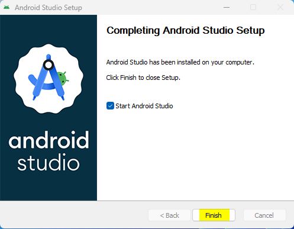
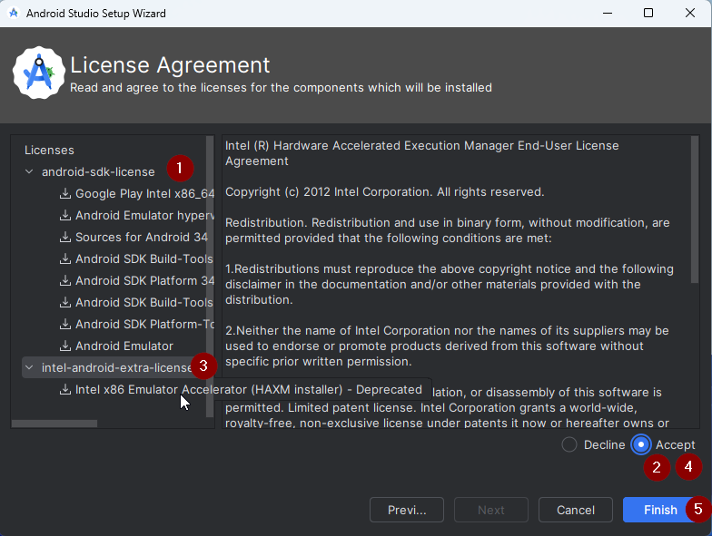

# Costruire AAPS

## Costruisci te stesso invece di scaricare

**L'app AAPS (un file apk) non è disponibile per il download, a causa delle normative sui dispositivi medici. È legale costruire l'app per il proprio uso, ma non devi darne una copia ad altri!**

Vedi la pagina [Domande frequenti](../UsefulLinks/FAQ.md) per i dettagli.


(Building-APK-recommended-specification-of-computer-for-building-apk-file)=
## Specifiche computer e software per la costruzione di AAPS

* Una versione specifica di **[Android Studio](https://developer.android.com/studio/)** potrebbe essere necessaria per costruire l'apk. Cfr. tabella sotto:

| Versione AAPS       | Versione<br/>Android Studio<br/>preferita | Versione Alternative<br/>Android Studio<br/>                                                            | Gradle | JVM |
| ------------------- | ----------------------------------------------------- | ------------------------------------------------------------------------------------------------------------------- | ------ |:--- |
| [3.2](#version3200) | Hedgehog (2023.1.1)                                   | Iguana (2023.2.1)<br/>Jellyfish (2023.3.1)<br/>Koala (2024.1.1)<br/>Ladybug (2024.2.1)<br/> | 8.2    | 19  |
| [3.3](#version3300) | Ladybug (2024.2.1)                                    |                                                                                                                     | 8.9    | 21  |

La "versione preferita" contiene già la versione JVM appropriata. Se usi una versione diversa, potresti incontrare dei problemi con la versione JVM. Guarda la pagina [Risoluzione dei problemi Android Studio](#troubleshooting_androidstudio-uncommitted-changes) per aiutarti a risolverli. Se la tua versione attuale di Android Studio non è elencata nella tabella, è necessario aggiornarla prima.

La versione Gradle è legata al codice sorgente, otterrai sempre la versione corretta Gradle quando scarichi / aggiorni il codice sorgente. E menzionata qui solo per riferimento, non è necessario intervenire su di esso.

* I sistemi [Windows 32 bit](#troubleshooting_androidstudio-unable-to-start-daemon-process) non sono supportati da Android Studio. Tieni presente che sia **la CPU 64 bit che il sistema operativo a 64 bit sono condizioni obbligatorie.** Se il sistema NON soddisfa queste condizioni, è necessario cambiare il computer, il software, o l'intero sistema.

<table class="tg">
<tbody>
  <tr>
    <th class="tg-baqh">OS (solo 64 bit)</th>
    <td class="tg-baqh">Windows 8 o superiore</td>
    <td class="tg-baqh">Mac OS 10.14 o superiore</td>
    <td class="tg-baqh">Qualsiasi Linux che supporta Gnome, KDE o Unity DE;&nbsp;&nbsp;librerie GNU C 2.31 o versioni successive</td>
  </tr>
  <tr>
    <th class="tg-baqh"><p align="center">CPU (solo 64 bit)</th>
    <td class="tg-baqh">CPU di architettura x86_64; Intel Core di seconda generazione o più recente, o CPU AMD con supporto per <br><a href="https://developer.android.com/studio/run/emulator-acceleration#vm-windows" target="_blank" rel="noopener noreferrer"><span style="text-decoration:var(--devsite-link-text-decoration,none)">Windows Hypervisor</span></a></td>
    <td class="tg-baqh">Chip basati su ARM, o Intel Core di seconda generazione o più recenti con supporto per <br><a href="https://developer.android.com/studio/run/emulator-acceleration#vm-mac" target="_blank" rel="noopener noreferrer"><span style="text-decoration:var(--devsite-link-text-decoration,none)">Hypervisor.Framework</span></a></td>
    <td class="tg-baqh">CPU di architettura x86_64; Intel Core di seconda generazione o più recente, o processore AMD con supporto per la virtualizzazione AMD (AMD-V) e SSSE3</td>
  </tr>
  <tr>
    <th class="tg-baqh"><p align="center">Memoria</th>
    <td class="tg-baqh" colspan="3"><p align="center">Uguale o superiore a 8GB</td>
  </tr>
  <tr>
    <th class="tg-baqh"><p align="center">Disco fisso</th>
    <td class="tg-baqh" colspan="3"><p align="center">Almeno 30GB di spazio libero. SSD consigliato.</td>
  </tr>
  <tr>
    <th class="tg-baqh"><p align="center">Risoluzione</th>
    <td class="tg-baqh" colspan="3"><p align="center">1280 x 800 Minimo <br></td>
  </tr>
  <tr>
    <th class="tg-baqh"><p align="center">Internet</th>
    <td class="tg-baqh" colspan="3"><p align="center">Banda larga</td>
  </tr>
</tbody>
</table>

**E' fortemente consigliato (non obbligatorio) utilizzare un disco SSD (stato solido) invece di un HDD (meccanico) perché ci vorrà meno tempo per costruire il file apk di AAPS.**  Puoi comunque usare un disco fisso meccanico per costruire il file apk di **AAPS**. Se ne usi uno, il processo di costruzione può richiedere molto tempo, ma una volta che è iniziato, puoi lasciarlo in esecuzione incustodito.

## Aiuto e assistenza durante il processo di costruzione

Se incontri difficoltà nel processo di costruzione dell'app **AAPS**, consulta la sezione [**dedicata alla risoluzione dei problemi Android Studio**](../GettingHelp/TroubleshootingAndroidStudio).

Se pensi che qualcosa nelle istruzioni di costruzione sia sbagliato, mancante o confusionale, o ancora stai lottando, contatta il gruppo di utenti **AAPS** su [Facebook](https://www.facebook.com/groups/AndroidAPSUsers) o [Discord](https://discord.gg/4fQUWHZ4Mw). Se vuoi cambiare qualcosa te stesso (aggiornamento screenshot _etc_), ti preghiamo di inviare una [pull request (PR)](../SupportingAaps/HowToEditTheDocs.md).

## Guida passo-passo per costruire l'app AAPS

```{admonition} WARNING
:class: warning
Se hai costruito AAPS prima, non è necessario eseguire nuovamente tutti i passaggi.
Vai direttamente alla [guida per l'aggiornamento](../Maintenance/UpdateToNewVersion.md)!
```

```{contents} The overall steps for building the **AAPS** apk file
:depth: 1
:local: true
```

In questa guida troverete schermate di _esempi_ di costruzione dell'apk di **AAPS**. Perché **Android Studio** - il software che utilizziamo per costruire l'apk **AAPS** - viene regolarmente aggiornato, questi screenshot potrebbero non essere identici alla tua installazione, ma dovrebbero essere ancora possibili da seguire.

Dal momento che **Android Studio** viene eseguito su piattaforme Windows, Mac OS X e Linux, potrebbero esserci anche piccole differenze nelle fasi per le diverse piattaforme.

(install-git-if-you-dont-have-it)=
### Installa Git

```{admonition} Why Git? 
:class: dropdown

Git è conosciuto come un “_Versioning Control System_” (VCS).
Git è un programma che consente di tenere traccia delle modifiche nel codice e di collaborare con gli altri. Utilizzerai Git per fare una copia del codice sorgente **AAPS** dal sito GitHub al tuo computer locale. Quindi, utilizzerai Git sul tuo computer per creare l'applicazione **AAPS** (apk). 
```

(BuildingAaps-steps-for-installing-git)=
#### Passi per l'installazione di Git

1.  Verifica che non hai già installato **Git**. Puoi farlo digitando “git” nella barra di ricerca di Windows – se si vede **“Git bash”** o qualche altra forma di Git, è già installato e puoi andare direttamente su [installa Android Studio](#install-android-studio):


2. Se non hai installato Git, scarica e installa l'ultima versione per il tuo sistema dalla sezione "Download" [**qui**](https://git-scm.com/downloads). Qualsiasi recente versione di Git dovrebbe funzionare, seleziona la versione corretta in base al tuo sistema, Mac, Windows o Linux.

**Nota per gli utenti Mac:** la pagina web di Git ti guiderà anche ad installare un programma aggiuntivo chiamato "homebrew" per aiutare l'installazione. Se installi Git tramite homebrew, non è necessario modificare alcuna preferenza.

(Make_a_note_of_Git_path)=

* Durante l'installazione, quando ti verrà chiesto di "selezionare la cartella di destinazione" prendere nota di _dove viene installato_ Git (il **"percorso di installazione**") dovrai controllarlo nel passaggio successivo. Sarà qualcosa di simile a "C:\Program Files\Git\cmd\git.exe"

*  Mentre procedi nei diversi passaggi dell'installazione di Git, accetta tutte le opzioni predefinite.

*  Dopo l'installazione, se hai dimenticato di prendere nota di dove Git è stato installato, lo puoi trovare come segue: digita "git" nella barra di ricerca del PC, fai clic destro su "Git bash", seleziona "open file location" passa sopra l'icona "Git bash" con il mouse: rivelerà dove è installato.

* Riavvia il computer prima del passaggio successivo.

(Building-APK-install-android-studio)=
### Installa Android Studio

- **Devi rimanere online per tutti i passaggi successivi, perché Android Studio scaricherà diversi aggiornamenti**

```{admonition} What is Android Studio?
:class: dropdown
Android Studio è un programma che viene eseguito sul computer. Ti permette di scaricare il codice sorgente da internet (usando Git) e costruire delle app per smartphone (e smartwatch). Non puoi "rompere" la versione corrente di **AAPS** che sta girando su uno smartphone mentre costruisci una nuova app oppure la stai aggiornando sul tuo PC con Android Studio, si tratta di processi totalmente separati. 
```

Una delle cose più importanti quando installi Android Studio è di **essere paziente!** Durante l'installazione e la configurazione, Android Studio scarica una grande quantità di dati e richiederà tempo.

```{admonition} Different UI
:class: warning
Nota importante: Android Studio ha cambiato la sua interfaccia grafica nelle ultime versioni. Questa guida ti mostrerà i passi con la *nuova interfaccia* di "Ladybug". Se usi ancora la vecchia interfaccia grafica, sarebbe meglio cambiare Android Studio a quella nuova prima di seguire [queste istruzioni](NewUI).
```

La versione di studio Android è molto importante. Segui le istruzioni [sopra](#Building-APK-recommended-specification-of-computer-for-building-apk-file) per scegliere la versione corretta di Android Studio.

Scarica la versione attuale di [Android Studio](https://developer.android.com/studio) o una versione precedente dall' [**Archivi**](https://developer.android.com/studio/archive) e accetta gli accordi per il download.


Una volta completato il download, avvia l'applicazione scaricata per installarla sul computer. Potresti aver bisogno di accettare/confermare alcun avvertimento sulle app scaricate da Windows!

Installa Android Studio cliccando "Next", come mostrato nelle schermate seguenti. **Non** devi modificare le impostazioni suggerite!


Ora clicca su "Install":


Una volta completato, premi "Next"


Nell'ultimo passo, fai clic su "Finished" per avviare Android Studio per la prima volta.



Ti verrà chiesto se vuoi contribuire a migliorare Android Studio. Scegli l'opzione a tuo piacimento, non farà alcuna differenza per i passaggi successivi.


La schermata di benvenuto ti accoglierà all'installazione di Android Studio. Premi "Next".


Seleziona "Standard" come tipo di installazione.


Conferma nuovamente le impostazioni facendo clic su "Next".


Ora devi accettare gli accordi di licenza. Hai due sezioni (1 + 3) sul lato sinistro che devi selezionare una dopo l'altra e per ciascuna selezionare "Accept" (2 + 4) sul lato destro.

Quindi puoi cliccare sul pulsante "Finish" (5).



Alcuni pacchetti Android verranno scaricati e installati. Sii paziente e aspetta.

Una volta terminato, vedrai la schermata seguente, dove puoi di nuovo selezionare "Finish".


Ora vedrai la schermata di benvenuto di Android Studio.


(Building-APK-download-AAPS-code)=
### Scarica il codice AAPS

```{admonition} Why can it take a long time to download the AAPS code?
:class: a discesa

La prima volta che **AAPS** viene scaricata, Android Studio si collegherà via internet al sito di Github per scaricare il codice sorgente di **AAPS**. Questo dovrebbe richiedere circa un minuto. 

Android Studio userà **Gradle** (uno strumento di sviluppo per applicazioni Android) per identificare altri componenti necessari per costruire questi elementi sul computer. 
```

Nella schermata di benvenuto di Android Studio controlla che "**Progetti**" (1) sia evidenziato a sinistra.

Quindi clicca su "**Get from VCS**" (2) a destra:


Ora diremo a Android Studio da dove ottenere il codice:


* "Repository URL" deve essere selezionato (impostazione predefinita) a sinistra (1).
* "Git" deve essere selezionato (impostazione predefinita) come controllo di versione (2).
* Ora copia questo indirizzo URL:
    ```
    https://github.com/nightscout/AndroidAPS.git
    ```
    e incollalo nella casella di testo dell'URL (3).

* Check the (default) directory for saving the cloned code exists on your computer and doesn't already exists (4). Puoi cambiarla in qualsiasi cartella, ma ricordati dove hai salvato il progetto!
* Ora clicca sul pulsante "Clone" (5).

```{admonition} INFORMATION
:class: informazioni
Prendi nota della cartella. È dove viene memorizzato il tuo codice sorgente!
```

Ora vedrai uno schermo che ti dice che il repository è in fase di clonazione:


Ad un certo punto, Android Studio si chiuderà e ricomincierà. Ti potrebbe essere chiesto se vuoi fidarti del progetto. Clicca su "Trust project":

  


Solo per gli utenti Windows: Se il firewall richiede l'autorizzazione, concedi l'accesso:

 

Dopo aver clonato il repository con successo, Android Studio aprirà il progetto clonato.

(NewUI)=
```{admonition} New UI
:class: informazioni
Android Studio ha cambiato la sua interfaccia grafica di recente. Le nuove installazioni di Android Studio utilizzano la nuova interfaccia per impostazione predefinita!

Solo se il tuo Android Studio sembra diverso, potrebbe essere necessario passare alla nuova interfaccia:
Fai clic sul menu hamburger in alto a sinistra, quindi seleziona **Impostazioni** (o **Preferenze** su computer Apple).
In **Appearance & Behaviour**, vai su **New UI** e spunta **Enable new UI**. Quindi riavvia Android Studio per iniziare a usarlo.

Se non trovi l'opzione **New UI** non ti preoccupare: la stai già utilizzando!
```


Quando Android Studio si è aperto, aspetta pazientemente (questo può richiedere alcuni minuti), e in particolare, **non** aggiorna il progetto come suggerito nel pop-up.

Android Studio avvierà automaticamente una "sincronizzazione del progetto Gradle", che richiederà un paio di minuti per finire. Lo puoi vedere (ancora) in esecuzione:


```{admonition} NEVER UPDATE GRADLE!
:class: warning

Android Studio might recommend updating the gradle system. **Never update gradle!** This will lead to difficulties.
```

Only on windows computers: You might get a notification about windows defender running: Click on **Automatically** and confirm, it will make the build run faster!


You can leave the gradle sync running and follow the next steps already.

(Building-APK-set-git-path-in-preferences)=
### Set Git path in Android Studio preferences

Now we will tell Android studio where to find Git, which you installed [earlier](#install-git-if-you-dont-have-it).

* Windows users only: Make sure you have restarted your computer after [installing Git](#install-git-if-you-dont-have-it). If not, restart now and re-open Android Studio

In the top left corner of **Android Studio**, open the hamburger menu and navigate to **File** > **Settings** (on Windows) or **Android Studio** > **Preferences** (on Mac). This opens the following window, click to expand the dropdown called **Version Control** (1) and select **Git**


Check if **Android Studio** can automatically locate the correct **Path to Git executable** automatically by clicking the button "Test" (1):


If the automatic setting is successful, your current version of **Git** will be displayed next to the path.

   


If you find that **git.exe** is not found automatically, or that clicking "Test" results in an error (1), you can either
* manually enter the path which you saved [earlier](#BuildingAaps-steps-for-installing-git), or
* click on the folder icon (1) and manually navigating to the directory where **git.exe** was installed [earlier](#BuildingAaps-steps-for-installing-git)
* Verify your settings with the **Test** button!

  

(Building-APK-generate-signed-apk)=
### Build the AAPS "signed" APK

```{admonition} Why does the AAPS app need to be "signed"?
:class: dropdown

Android requires each app to be _signed_, to ensure that it can only be updated later from the same trusted source that released the original app. For more information on this topic, follow [this link](https://developer.android.com/studio/publish/app-signing.html#generate-key). 

For our purposes, this just means that we generate a signing or "keystore" file and use it when we build the **AAPS** app.
```


**Important: Make sure the gradle sync is finished successfully before proceeding!**


Click the hamburger menu on the top left to open the menu bar. Select **Build** (1), then select **Generate Signed App Bundle / APK** (2)


Select "APK" instead of "Android App Bundle" and click "Next":


In the next screen, make sure that "Module" is set to "AAPS.app" (1).

(Building-APK-wearapk)=
```{admonition} INFORMATION!
:class: information
If you want to create the apk for your watch, you now need to select AAPS.wear!
```


Click "Create new..." (2) to start creating your key store.

```{admonition} INFORMATION!
:class: information
You will only need to create the keystore once.
If you have build AAPS before, do NOT create a new keystore but select your existing one and enter its passwords!
```

**_Note:_** The key store is a file in which the information for signing the app is stored. It is encrypted, and the information is secured with passwords.


* Click the "folder" symbol (1) to select a path on your computer for your key store.

  Do **not** use the directory where you stored your sourcecode but some directory that you would also transfer to a new computer.

```{admonition} WARNING!
:class: warning
Make sure to note down for yourself where your keystore is stored. You will need it when you build the next AndroidAPS update!
```

* Now choose a simple password (and make a note of it), enter it in the password box (2), and confirm it (2).

  The passwords for key store and key do not have to be sophisticated. If you lose your password in the future, see [troubleshooting for lost key store](#troubleshooting_androidstudio-lost-keystore).

* The default alias (3) for your key is "key0", leave this unchanged.

* You now need a password for your key. To keep it simple, if you want, you can use the same password you used for your keystore, above. Enter a password (4) and confirm it.

```{admonition} WARNING!
:class: warning
Note down these passwords! You will need them when you build the next AAPS update!
```

* The validity is 25 years by default, leave it as it is.

* Enter your first and last name (5). No other information needs to be added but you are free to do (6-7).

* Click "OK" (8) to continue:


On the **Generate signed App Bundle or APK** page, the path to your keystore will now be displayed. Now re-enter the Key Store password (1) and Key password (2), and tick the box (3) to remember passwords, so you don't have to enter them again next time you build the apk (i.e. when updating to a new AAPS version). Click "Next" (4):


On the next screen, select build variant "fullRelease" (2) and click "Create" (3). You should remember the directory displayed at (1), as later you will find your built apk file there!

   

Android Studio will now build the **AAPS** apk. It will show "Gradle Build running" (2) at the bottom right. The process takes some time, depending on your computer and internet connection, so **be patient!** If you want to watch the progress of the build, click on the small hammer "build" (1) at the bottom of Android Studio:


Now you can watch the building progress:


Android Studio will display the information "BUILD SUCCESSFUL" after build is finished. You may see a popup notification which you can click to select "locate". If you miss this, click on the notification icon (1) and then on **locate** (2) at the very bottom of the screen to bring up the Notifications:


**_If the build was not successful, refer to the [Android Studio Troubleshooting section](../GettingHelp/TroubleshootingAndroidStudio)._**

In the Notifications box, click on the blue link "locate":

 Your file manager will open and show you the build apk file that you have just built.

   

Congratulations! Now you have built the **AAPS** apk file, you will be transferring this file to your smartphone in the next section of the docs.

```{tip}
If you think you might want to use an Android Wear smartwatch in the future, this is the best time to build the AAPS Wear apk to be sure it will be synchronized with your AAPS apk.
```

Move to the next stage of [Transferring and Installing **AAPS**](../SettingUpAaps/TransferringAndInstallingAaps.md).


