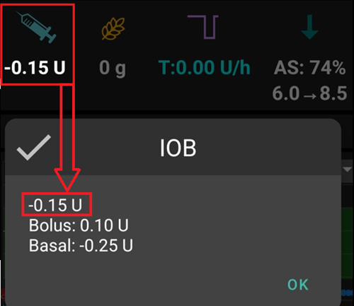
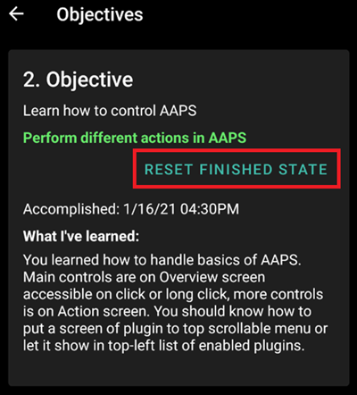

# Completare gli Obiettivi

**AAPS** ha una serie di **Obiettivi** che devono essere completati per aiutare l'utente a progredire dal loop aperto di base al loop chiuso ibrido e alla piena funzionalità di **AAPS**. Il completamento degli **Obiettivi** mira a garantire che tu abbia:

* Configurato tutto correttamente nella tua configurazione **AAPS**;
* Appreso le funzionalità essenziali di **AAPS**; e
* Una comprensione di base di ciò che il sistema può fare, per contribuire a instillare fiducia nell'uso di **AAPS**.

Quando **AAPS** viene installato per la prima volta, ogni obiettivo deve essere completato prima di passare a quello successivo. Nuove funzionalità verranno gradualmente sbloccate man mano che si avanza attraverso ogni **Obiettivo**.

**Gli Obiettivi da 1 a 8** ti guideranno dalla configurazione di **AAPS** sul tuo smartphone al loop chiuso ibrido "di base". Ci vorranno circa 6 settimane per completarli. Puoi procedere fino all'**Obiettivo 5** usando un microinfusore virtuale (e usando un altro metodo di somministrazione di insulina nel frattempo). **Gli Obiettivi da 9 a 11** sono progettati per testare le funzionalità più avanzate di **AAPS** con l'obiettivo di un migliore controllo del diabete e richiederanno fino a 3 mesi per essere completati, possibilmente di più. Ulteriori dettagli su una stima della suddivisione dei tempi sono disponibili qui: [Quanto tempo ci vorrà?](#preparing-how-long-will-it-take)

Oltre a progredire attraverso gli **Obiettivi**, se necessario, puoi anche rimuovere i tuoi progressi e [tornare a un obiettivo precedente](#go-back-in-objectives).

## Fai il backup delle tue impostazioni

```{admonition} Note
:class: note

Si raccomanda di esportare le impostazioni di **AAPS** dopo aver completato ogni **Obiettivo**!
```

Si raccomanda vivamente di [esportare le impostazioni](../Maintenance/ExportImportSettings.md) dopo aver completato ogni obiettivo per evitare di perdere i progressi fatti in **AAPS**. Questo processo di esportazione crea un **file delle impostazioni** (.json) che deve essere salvato in uno o più posti sicuri (es. Google Drive, hard disk, allegato email _ecc._). Questo garantisce che tutti i progressi fatti in **AAPS** vengano salvati. Se il tuo telefono viene perso o se elimini accidentalmente i tuoi progressi, il file json può essere ricaricato in **AAPS** importando un file delle impostazioni recente. Avere un file delle impostazioni di **backup** è necessario anche se è richiesto un nuovo smartphone **AAPS** per qualsiasi motivo (aggiornamento/perdita/rottura del telefono _ecc._)

Il file delle **impostazioni** salverà non solo i tuoi progressi attraverso gli **Obiettivi**, ma anche tutte le impostazioni di **AAPS** come il **bolo massimo** _ecc._

Gli **Obiettivi** dovranno essere riavviati dall'inizio se non hai un backup delle tue impostazioni e accade qualcosa al tuo smartphone **AAPS**. Progredire attraverso gli **Obiettivi** richiede tempo e dover completarli di nuovo perché ad esempio hai perso lo smartphone è una situazione da evitare.

(objectives-objective1)=
## Obiettivo 1: Configurare la visualizzazione e il monitoraggio, analizzare le basali e i rapporti

L'**Obiettivo 1** richiede all'utente di impostare la configurazione tecnica di base in **AAPS**. Nessun progresso può essere fatto finché questo passaggio non è stato completato.

- Seleziona il CGM/FGM corretto in [Generatore di configurazione > Sorgente glicemia](#Config-Builder-bg-source). Vedi [Sorgente glicemia](../Getting-Started/CompatiblesCgms.md) per ulteriori informazioni.
- Seleziona il microinfusore corretto in [Generatore di configurazione > Microinfusore](../SettingUpAaps/ConfigBuilder.md) per assicurarti che il tuo microinfusore possa comunicare con **AAPS**. Seleziona il **microinfusore virtuale** se stai usando un modello di microinfusore senza driver **AAPS** per il loop, o se vuoi lavorare attraverso i primi **Obiettivi** usando un altro sistema per la somministrazione di insulina. Vedi [microinfusore](../Getting-Started/CompatiblePumps.md) per ulteriori informazioni.
- Se usi Nightscout:
  - Segui le istruzioni nella pagina [Nightscout](../SettingUpAaps/Nightscout.md) per assicurarti che **Nightscout** possa ricevere e visualizzare i dati di **AAPS**.
  - Nota che l'URL in **NSClient** deve essere **_senza_ "/api/v1/"** alla fine - vedi [Preferenze > NSClient](#Preferences-nsclient).
- Se usi Tidepool:
  - Segui le istruzioni nella pagina [Tidepool](../SettingUpAaps/Tidepool.md) per assicurarti che **Tidepool** possa ricevere e visualizzare i dati di **AAPS**.

Nota - *Potrebbe essere necessario attendere la prossima lettura del sensore di glucosio prima che **AAPS** la riconosca.*

(objectives-objective2)=
## Obiettivo 2: Impara a controllare AAPS

L'**Obiettivo 2** richiede che vengano eseguite diverse 'attività' come mostrato nello screenshot qui sotto. Clicca sul testo arancione "Non ancora completato" per accedere alle cose da fare. Verranno forniti link per guidarti, nel caso in cui non hai ancora familiarità con un'azione specifica.


Le attività da completare per l'**Obiettivo 2** sono:
- Imposta il tuo **Profilo** al 90% per una durata di 10 minuti.
  - _Suggerimento_: Tieni premuto il nome del tuo Profilo nella schermata PANORAMICA. Ulteriori informazioni in [Cambio profilo e Percentuale profilo](../DailyLifeWithAaps/ProfileSwitch-ProfilePercentage.md).
  - _Nota_: **AAPS** non accetta tassi basali inferiori a 0,05U/h. Se il tuo **Profilo** include tassi di 0,06U/h o inferiori, sarà necessario creare un **Profilo** temporaneo con tassi basali più elevati prima di completare questa attività. Torna al tuo **Profilo** normale dopo aver completato questa attività.
- Simula "fare una doccia" [disconnettendo il tuo microinfusore](#AapsScreens-section-c-bg-loop-status) in **AAPS** per una durata di 1h.
  - _Suggerimento_: premi l'icona del loop nella schermata PANORAMICA per aprire il dialogo Loop.
- Termina "fare la doccia" riconnettendo il tuo microinfusore.
  - _Suggerimento_: premi l'icona "disconnesso" per aprire il dialogo loop.
- Imposta un [**Obiettivo Temporaneo**](../DailyLifeWithAaps/TempTargets.md) personalizzato con una durata di 10 minuti.
  - _Suggerimento_: premi la barra del target nella schermata PANORAMICA per visualizzare il dialogo dell'obiettivo temporaneo.
- Attiva il plugin **Azioni** nel [**Generatore di configurazione**](../SettingUpAaps/ConfigBuilder.md) per farlo apparire nella barra del menu superiore scorrevole.
  - _Suggerimento_: Vai al **Generatore di configurazione** e scorri verso il basso fino a Generale.
- Visualizza il contenuto del plugin **Loop**.
- [Scala il grafico della glicemia](#aaps-screens-main-graph) per poter guardare intervalli di tempo più grandi o più piccoli: alternando tra 6h, 12h, 18h 24h di dati passati.
  - _Suggerimento_: Tieni premuto sul grafico o usa la freccia in alto a destra.
- Verifica che la password master di AAPS sia impostata e sia nota.
  - Suggerimento: vedi [Preferenze > Protezione](#Preferences-protection).


(objectives-objective3)=
## Obiettivo 3: Dimostra la tua conoscenza

L'**Obiettivo 3** richiede all'utente di superare un esame a scelta multipla progettato per testare la tua conoscenza di **AAPS**.

Alcuni utenti trovano l'**Obiettivo 3** il più difficile da completare. Leggi i documenti di **AAPS** insieme alle domande. Se sei veramente bloccato dopo aver ricercato i documenti **AAPS**, cerca nel gruppo [Facebook](https://www.facebook.com/groups/AndroidAPSUsers) o [Discord](https://discord.gg/4fQUWHZ4Mw) "Obiettivo 3" (perché è probabile che la tua domanda sia già stata posta - e risposta dal gruppo). Questi gruppi possono fornire suggerimenti utili o reindirizzarti alla parte pertinente dei documenti **AAPS**.

Nel frattempo:
- Per ridurre il numero di notifiche/decisioni che ti vengono chieste (tassi basali temporanei) mentre sei in Loop Aperto, imposta un intervallo target ampio nel tuo **Profilo** _es._ 90 - 150 mg/dl o 5,0 - 8,5 mmol/l.
- Potresti voler impostare un limite superiore più ampio o anche disabilitare il Loop Aperto di notte.

Per procedere con l'**Obiettivo 3**, clicca sul testo arancione "**Non ancora completato**" per accedere alla domanda pertinente. Leggi attentamente ogni domanda e seleziona la/le tua/e risposta/e.

Per ogni domanda, potrebbe esserci più di una risposta corretta! Se viene selezionata una risposta errata, la domanda verrà bloccata per 1 ora prima di poter tornare a risponderla di nuovo. Tieni presente che l'ordine delle risposte potrebbe essere cambiato quando provi di nuovo a rispondere; questo per assicurarti di leggerle attentamente e di capire davvero la validità (o meno) di ciascuna risposta.

```{admonition}  __What happens if new question(s) are added to an Objective when I update to a newer version of AAPS?__
:class: Note
Di tanto in tanto vengono aggiunte nuove funzionalità ad **AAPS** che potrebbero richiedere l'aggiunta di una nuova domanda agli **Obiettivi**, in particolare all'**Obiettivo 3**. Di conseguenza, qualsiasi nuova domanda aggiunta all'**Obiettivo 3** sarà contrassegnata come "incompleta" perché **AAPS** richiederà di eseguire questa azione. Non preoccuparti, poiché ogni **Obiettivo** è indipendente, **non perderai la funzionalità esistente di AAPS**, a condizione che gli altri **Obiettivi** rimangano completati.
```

## Obiettivo 4: Iniziare con un loop aperto

Lo scopo dell'**Obiettivo 4** è riconoscere con quale frequenza **AAPS** valuterà il tasso basale dell'utente rispetto ai livelli di glucosio e raccomanderà aggiustamenti del tasso basale temporaneo. Come parte di questo **Obiettivo**, attiverai il loop aperto per la prima volta e accetterai 20 modifiche del tasso basale temporaneo proposte, applicandole manualmente sul tuo microinfusore se necessario. Osserverai anche l'impatto degli [**Obiettivi Temporanei**](../DailyLifeWithAaps/TempTargets.md). Se non hai ancora familiarità con l'impostazione di una modifica del tasso basale temporaneo in **AAPS**, consulta la [scheda **Azioni**](#screens-action-tab).

Tempo minimo per completare questo obiettivo: **7 giorni**. Questo è un tempo di attesa obbligatorio. Non è possibile procedere al prossimo **Obiettivo** anche se tutte le modifiche del tasso basale sono già state applicate.

- Seleziona Loop Aperto premendo e tenendo premuta l'[icona Loop](#AapsScreens-loop-status) in alto a destra nella schermata **Panoramica**.
- Applica manualmente almeno 20 dei suggerimenti di tasso basale temporaneo nell'arco di 7 giorni; inseriscili nel tuo microinfusore (fisico) e conferma in AAPS di averli accettati. Assicurati che questi aggiustamenti del tasso basale compaiano in **AAPS** e **Nightscout**.
- Usa gli [**Obiettivi Temporanei**](../DailyLifeWithAaps/TempTargets.md) quando necessario. Dopo aver trattato un'ipoglicemia, usa l'"obiettivo temporaneo per ipo" predefinito per evitare che il sistema corregga eccessivamente il rimbalzo.
- Se sei ancora in [Modalità Semplice](#preferences-simple-mode) a questo punto, ora è probabilmente un buon momento per disattivarla.

Per ridurre il numero di modifiche del tasso basale proposte mentre sei in Loop Aperto, puoi ancora usare i suggerimenti descritti nell'[**Obiettivo 3**](#objective-3-prove-your-knowledge). Inoltre, puoi modificare la percentuale minima per le modifiche del tasso basale raccomandate. Più alto è il valore, meno notifiche di modifica riceverai.


```{admonition} Note
:class: Note

Non devi eseguire ogni singola raccomandazione del sistema!
```
(objectives-objective5)=
## Obiettivo 5: Comprendi il tuo loop aperto, incluse le raccomandazioni di basale temporanea

Come parte dell'**Obiettivo 5** inizierai a capire come vengono derivate le raccomandazioni di basale temporanea. Questo include la [determinazione della logica basale](https://openaps.readthedocs.io/en/latest/docs/While%20You%20Wait%20For%20Gear/Understand-determine-basal.html), l'analisi dell'impatto osservando le [linee di previsione nella **Panoramica AAPS**](#aaps-screens-prediction-lines) (o Nightscout) e guardando i calcoli dettagliati mostrati nella tua scheda **OpenAPS**.

Tempo stimato per completare questo obiettivo: **7 giorni**.

Questo **Obiettivo** richiede di determinare e impostare il valore "U/h max a cui può essere impostata una basale temporanea" (max-basal) come descritto in [Funzionalità OpenAPS](#Open-APS-features-max-u-h-a-temp-basal-can-be-set-to). Questo valore può essere impostato in [Preferenze > OpenAPS SMB](#Preferences-openaps-smb-settings). Se stai ancora usando un microinfusore virtuale, assicurati che questa impostazione di sicurezza sia impostata sia in **AAPS** che nel tuo microinfusore.

Potresti voler impostare il tuo [target glicemia del **Profilo**](#profile-glucose-targets) più alto del solito fino a quando non ti senti a tuo agio con i calcoli e le impostazioni di **AAPS**. Potresti voler sperimentare aggiustando il tuo **target glicemia** nel tuo **Profilo** in un intervallo più stretto (diciamo 1 mmol/l [20 mg/dl] o meno di larghezza) e osservare il comportamento risultante.


```{admonition} If you have been using a virtual pump, change to a real insulin pump now!
:class: note

Se stai facendo loop aperto con un microinfusore virtuale **fermati qui**. Clicca su verifica alla fine di questo **Obiettivo** solo dopo aver cambiato all'uso di un microinfusore "reale" che eroga insulina.

```


(objectives-objective6)=
## Obiettivo 6: Iniziare a chiudere il loop con la Sospensione per Glicemia Bassa


```{admonition}  Closed loop will not correct high **BG** values in **Objective 6** as it is limited to **Low Glucose Suspend** only!
:class: Note
Dovrai ancora correggere i valori di glicemia alti da solo (manualmente con correzioni tramite microinfusore o penna)!
```

Come parte dell'**Obiettivo 6** chiuderai il loop e attiverai la sua modalità **Sospensione per Glicemia Bassa** (LGS) mentre il [max IOB](#Open-APS-features-maximum-total-iob-openaps-cant-go-over) è impostato a zero. Devi rimanere in modalità LGS per 5 giorni per completare questo **obiettivo**. Dovresti usare questo tempo per verificare che le impostazioni del tuo **Profilo** siano accurate e che gli eventi LGS non vengano attivati troppo spesso.

Tempo minimo per completare questo obiettivo: **5 giorni**. Questo è un tempo di attesa obbligatorio. Non puoi procedere al prossimo **Obiettivo** prima che questo tempo sia scaduto.

È fondamentale che le tue impostazioni correnti del **Profilo** (basale, ISF, IC) siano state ben testate prima di chiudere il loop in modalità **LGS**. Impostazioni del **Profilo** errate potrebbero costringerti in situazioni di ipoglicemia che devono essere trattate manualmente. Un **Profilo** accurato aiuterà a ridurre la necessità di trattamenti per glicemia bassa durante il periodo di 5 giorni.

**Se osservi ancora episodi di glicemia bassa frequenti o gravi, considera di ottimizzare il tuo DIA, basale, ISF e rapporti carboidrati.** Consulta il gruppo [Facebook](https://www.facebook.com/groups/AndroidAPSUsers) o [Discord](https://discord.gg/4fQUWHZ4Mw) dove vi è molta discussione su questo.


Durante l'**Obiettivo 6**, **AAPS** sostituirà l'impostazione maxIOB a zero. **Questa sostituzione terminerà quando si passerà all'Obiettivo 7.**

Ciò significa che quando sei nell'**Obiettivo 6**, se i livelli di glucosio del sensore stanno scendendo, **AAPS** ridurrà l'erogazione di insulina basale per te. Ma, se i livelli di glucosio del sensore stanno aumentando, **AAPS** aumenterà il tasso basale sopra il valore del **Profilo** solo se l'**IOB basale** è negativo come risultato di un precedente **LGS**. Altrimenti, **AAPS** non aumenterà la basale sopra il valore del tuo profilo corrente, anche se i livelli di glucosio stanno aumentando. Questa cautela serve per evitare ipoglicemie mentre stai imparando a usare **AAPS**.

**Di conseguenza, devi gestire i valori di glicemia elevati con correzioni manuali di insulina in bolo.**

- Se il tuo IOB è negativo (vedi screenshot qui sotto), una basale temporanea (TBR) > 100% può essere attivata nell'**Obiettivo 6**.



- Imposta il tuo intervallo target leggermente più alto del solito, solo per sicurezza e per aggiungere un margine di sicurezza.
- Abilita la modalità 'Sospensione per Glicemia Bassa' premendo e tenendo premuta l'icona Loop nell'angolo in alto a destra della schermata PANORAMICA e selezionando l'icona modalità Loop - LGS.
- Osserva le basali temporanee attive guardando il testo basale turchese nella schermata PANORAMICA o la rappresentazione basale turchese come parte del grafico PANORAMICA.
- Potresti temporaneamente sperimentare picchi dopo aver trattato ipoglicemie senza poter aumentare le basali in rimbalzo.

(objectives-objective7)=
## Obiettivo 7: Ottimizzare il loop chiuso, aumentare maxIOB sopra 0 e abbassare gradualmente i target glicemia

Per completare l'**Obiettivo 7** devi chiudere il loop e aumentare il tuo [maxIOB](#Open-APS-features-maximum-total-iob-openaps-cant-go-over). Il **maxIOB** è stato azzerato automaticamente nell'**Obiettivo 6**, a causa della modalità Sospensione per Glicemia Bassa. Questo non è più il caso. **AAPS** inizierà a usare il valore maxIOB definito per correggere i valori di glucosio elevati.

Tempo minimo per completare questo obiettivo: **1 giorno**. Questo è un tempo di attesa obbligatorio. Non è possibile procedere al prossimo **Obiettivo** fino a quando questo periodo di tempo non è scaduto.

- - Stay in **Closed Loop** over a period of 1 day. - Stay in **Closed Loop** over a period of 1 day.

- Aumenta lentamente il tuo 'IOB totale massimo che OpenAPS non può superare' (in OpenAPS chiamato 'max-iob') sopra 0, fino a quando non trovi le impostazioni che funzionano meglio per te.

La raccomandazione predefinita per questa impostazione è "**bolo pasto medio + 3x basale giornaliera massima**", dove "basale giornaliera massima" è il valore orario massimo in qualsiasi segmento di tempo della giornata.


Questa raccomandazione deve essere vista come un punto di partenza. Se usi questa regola ma stai riscontrando che AAPS eroga troppa insulina quando i livelli di glucosio aumentano, potresti dover:
* abbassare il valore "IOB totale massimo che OpenAPS non può superare";
* rivedere le impostazioni del tuo **Profilo**, facendo solo un aggiustamento alla volta.

In alternativa, se sei molto insulino-resistente, aumenta il valore **maxIOB** molto cautamente.

Una volta sicuro di quanto **maxIOB** si adatta ai tuoi schemi di loop, abbassa i tuoi **target glicemia** al livello desiderato.

(objectives-objective8)=
## Obiettivo 8: Aggiusta le basali e i rapporti se necessario, poi abilita Autosens

Come parte di questo **obiettivo**, rivisiterai le prestazioni del tuo **Profilo** e userai la funzionalità [Autosens](#Open-APS-features-autosens) come indicatore per impostazioni errate.

Tempo minimo per completare questo obiettivo: **7 giorni**. Questo è un tempo di attesa obbligatorio. Non è possibile procedere al prossimo **Obiettivo** fino a quando questo periodo di tempo non è scaduto.

Abilita [Autosens](../DailyLifeWithAaps/KeyAapsFeatures.md) per un periodo di 7 giorni e osserva la [linea bianca del grafico **Panoramica**](#AapsScreens-section-g-additional-graphs) che mostra la tua sensibilità insulinica aumentare o diminuire a causa dell'esercizio fisico o degli ormoni ecc. Tieni d'occhio la scheda del report OpenAPS che mostra **AAPS** che regola la sensibilità, le basali e i target di conseguenza. Tieni d'occhio la scheda report OpenAPS che mostra **AAPS** che regola di conseguenza la sensibilità, le basali e i target.

Questo è un buon momento per rivedere le impostazioni per il [Rilevamento Sensibilità](#Config-Builder-sensitivity-detection). Puoi visualizzare la tua sensibilità nella schermata principale in un [grafico aggiuntivo](#AapsScreens-section-g-additional-graphs).

Inoltre, puoi usare [Autotune](https://openaps.readthedocs.io/en/latest/docs/Customize-Iterate/autotune.html) come verifica unica per controllare che le tue basali rimangano accurate o fare un test basale tradizionale.

(objectives-objective9)=
## Obiettivo 9: Abilitare funzionalità oref1 aggiuntive per l'uso diurno, come il super micro bolus (SMB)

Nell'**Obiettivo 9**, affronterai e userai il **"Super Micro Bolus (SMB)"** come una funzionalità fondamentale. Dopo aver esaminato le letture obbligatorie avrai una buona comprensione di cosa sono gli SMB, come funzionano e perché la basale viene impostata temporaneamente a zero dopo che gli SMB vengono somministrati (zero-temping).

Tempo minimo per completare questo obiettivo: **28 giorni**. Questo è un tempo di attesa obbligatorio. Non puoi procedere al prossimo Obiettivo prima che questo tempo sia scaduto.

- La [sezione SMB in questa documentazione](#Open-APS-features-super-micro-bolus-smb) e la [copertura oref1 nella documentazione openAPS](https://openaps.readthedocs.io/en/latest/docs/Customize-Iterate/oref1.html) sono letture obbligatorie per comprendere **SMB** e il concetto di **zero-temping**.
- Una volta fatto, puoi [aumentare maxIOB](#Open-APS-features-maximum-total-iob-openaps-cant-go-over) per far funzionare gli **SMB** in modo più efficace. maxIOB ora include tutto l'**IOB**, non solo la basale accumulata. Questa soglia mette in pausa gli **SMB** finché l'IOB non scende sotto questo valore (_es._ **maxIOB** è impostato a 7U e viene somministrato un bolo di 8U per coprire un pasto: gli SMB verranno messi in pausa e non somministrati finché l'**IOB** non scende sotto 7U). Un buon punto di partenza è impostare **maxIOB** = **bolo pasto medio + 3x basale giornaliera massima** dove "basale giornaliera massima" è il valore orario massimo in qualsiasi segmento di tempo della giornata. Vedi l'[obiettivo 7](#objective-7-tuning-the-closed-loop-raising-maxiob-above-0-and-gradually-lowering-bg-targets) come riferimento.
- Valuta il tasso di assorbimento dei carboidrati e considera di modificare il parametro "min_5m_carbimpact" in [Preferenze > Impostazioni di assorbimento > min_5m_carbimpact](#Preferences-min_5m_carbimpact) se lo trovi troppo lento o troppo veloce.

(objectives-objective10)=
## Obiettivo 10: Automazione

Le **Automazioni** diventano disponibili quando viene avviato l'**Obiettivo 10**.

Tempo minimo per completare questo obiettivo: **28 giorni**. Questo è un tempo di attesa obbligatorio. Non puoi procedere al prossimo Obiettivo prima che questo tempo sia scaduto.

Leggi prima la pagina di documentazione [Automazione](../DailyLifeWithAaps/Automations.md).

Configura la regola di automazione più semplice; ad esempio attiva una notifica Android in pochi minuti:
- Seleziona la scheda notifica
- Dal menu a 3 punti in alto a destra, seleziona aggiungi regola
- Dai un nome all'attività "La mia prima notifica automatica"
- "modifica" "condizione"
  - clicca sul simbolo "+" per aggiungere il primo trigger
  - seleziona "Ora" e "OK"; verrà creata una voce predefinita OGGI ORA:MINUTO
  - clicca sulla parte MINUTO per modificare l'orario in modo che si attivi tra qualche minuto. Poi clicca ok per chiudere
  - clicca "ok" per chiudere la schermata Trigger
- "AGGIUNGI" un'"Azione"
  - seleziona "Notifica", "OK"
  - clicca "Notifica" per modificare il messaggio, inserisci qualcosa come "La mia prima automazione"
- Attendi che l'orario attivi la notifica (nota che a seconda del tuo telefono, potrebbe essere in ritardo di qualche minuto)

Puoi poi sperimentare configurando un'**Automazione** più utile. La pagina di documentazione fornisce alcuni esempi e puoi cercare screenshot di "Automazione" nel gruppo [Facebook](https://www.facebook.com/groups/AndroidAPSUsers). C'è anche un canale dedicato nella community [Discord](https://discord.gg/4fQUWHZ4Mw).

Ad esempio, se mangi la stessa cosa a colazione alla stessa ora ogni mattina prima di scuola/lavoro, puoi creare un'**Automazione** come "target-pre-colazione" per impostare un **Obiettivo Temporaneo** leggermente più basso 30 minuti prima di fare colazione. In tal caso, la tua condizione includerà probabilmente "orario ricorrente" che consiste nel selezionare giorni specifici della settimana (lunedì, martedì, mercoledì, giovedì, venerdì) e un orario specifico (06:30). L'azione consisterà in "Avvia obiettivo temporaneo" con un valore target più basso del solito e una durata di 30 minuti.

(CompletingTheObjectives-go-back-in-objectives)=
## Torna agli obiettivi

Se vuoi tornare indietro negli **Obiettivi** per qualsiasi motivo puoi farlo cliccando su "cancella completato".


