<!-- Android Studio Build, FKA Computer Build. Preserve filenames to avoid breaking URLs. -->

# Android Studio Build

Questo è il metodo tradizionale per compilare la tua app AAPS.

Puoi compilare l'app senza un computer utilizzando il metodo [Browser Build](./BrowserBuild.md).

## Compilare autonomamente invece di scaricare

**L'app AAPS (un file apk) non è disponibile per il download a causa delle normative sui dispositivi medici. È legale compilare l'app per uso personale, ma non è consentito cederne una copia ad altri!**

Per i dettagli, consulta la [pagina FAQ](../UsefulLinks/FAQ.md).

---

(Building-APK-recommended-specification-of-computer-for-building-apk-file)=
## Requisiti hardware e software per la compilazione di AAPS

* Potrebbe essere necessaria una versione specifica di **[Android Studio](https://developer.android.com/studio/)** per compilare l'apk. Vedere la tabella seguente:

| Versione AAPS           | Versione preferita<br/>Android Studio | Versione alternativa<br/>Android Studio | Gradle | JVM |
| ----------------------- | ------------------------------------------- | --------------------------------------------- | ------ |:--- |
| 2.6.2                   | 3.6.1                                       |                                               | 5.6.4  | 11  |
| 2.8.2.1                 | 4.1.1                                       |                                               | 6.1.1  | 13  |
| [3.1.0.3](#version3100) | 2020.3.1                                    | up to Quail 1                                 | 7.3.3  | 17  |
| [3.2.0.4](#version3204) | Hedgehog (2023.1.1)                         | up to Quail 1                                 | 8.2    | 17  |
| [3.3.1.3](#version3300) | Ladybug Feature Drop (2024.2.2)             | up to Quail 1                                 | 8.10   | 21  |
| [3.3.2](#version3300)   | Meerkat (2024.3.1)                          | up to Quail 1                                 | 8.11.1 | 21  |
| [3.3.2.1](#version3321) | Narwhal (2025.1.2)                          | up to Quail 1                                 | 8.13   | 21  |
| [3.4.2.2](#version3422) | Panda 2 (2025.32)                           | up to Quail 1                                 | 9      | 21  |

La "versione preferita" è già fornita con la versione appropriata di JVM. La versione preferita è anche la versione minima con cui è possibile compilare **AAPS**. **Non** sarà possibile compilare con una versione più vecchia di quella "preferita". Se si utilizza una versione diversa, potrebbero verificarsi problemi relativi alla versione di JVM. Per risolvere questi problemi, consultare la pagina [Risoluzione dei problemi di Android Studio](#troubleshooting_androidstudio-uncommitted-changes). Se la versione attuale di Android Studio non è elencata nella tabella, è necessario aggiornarla prima.

La versione di Gradle è collegata al codice sorgente: si otterrà sempre la versione corretta di Gradle scaricando/aggiornando il codice sorgente. Viene menzionata qui solo come riferimento; non è necessario intervenire.

* I [sistemi Windows a 32 bit](#troubleshooting_androidstudio-unable-to-start-daemon-process) non sono supportati da Android Studio. Tieni presente che sia la **CPU a 64 bit che il sistema operativo a 64 bit sono condizioni obbligatorie.** Se il sistema non soddisfa questa condizione, è necessario sostituire l'hardware, il software o l'intero sistema.

<table class="tg">
<tbody>
  <tr>
    <th class="tg-baqh">OS (solo 64 bit)</th>
    <td class="tg-baqh">Windows 8 o superiore</td>
    <td class="tg-baqh">Mac OS 10.14 o superiore</td>
    <td class="tg-baqh">Qualsiasi Linux che supporti Gnome, KDE o Unity DE;&nbsp;&nbsp;GNU C Library 2.31 o successiva</td>
  </tr>
  <tr>
    <th class="tg-baqh"><p align="center">CPU (solo 64 bit)</th>
    <td class="tg-baqh">Architettura CPU x86_64; Intel Core di 2a generazione o più recente, o CPU AMD con supporto per un <br><a href="https://developer.android.com/studio/run/emulator-acceleration#vm-windows" target="_blank" rel="noopener noreferrer"><span style="text-decoration:var(--devsite-link-text-decoration,none)">Windows Hypervisor</span></a></td>
    <td class="tg-baqh">Chip basati su ARM, o Intel Core di 2a generazione o più recente con supporto per <br><a href="https://developer.android.com/studio/run/emulator-acceleration#vm-mac" target="_blank" rel="noopener noreferrer"><span style="text-decoration:var(--devsite-link-text-decoration,none)">Hypervisor.Framework</span></a></td>
    <td class="tg-baqh">Architettura CPU x86_64; Intel Core di 2a generazione o più recente, o processore AMD con supporto per AMD Virtualization (AMD-V) e SSSE3</td>
  </tr>
  <tr>
    <th class="tg-baqh"><p align="center">RAM</th>
    <td class="tg-baqh" colspan="3"><p align="center">16 GB o più</td>
  </tr>
  <tr>
    <th class="tg-baqh"><p align="center">Disco</th>
    <td class="tg-baqh" colspan="3"><p align="center">Almeno 30 GB di spazio libero. Si consiglia SSD.</td>
  </tr>
  <tr>
    <th class="tg-baqh"><p align="center">Risoluzione</th>
    <td class="tg-baqh" colspan="3"><p align="center">Minimo 1280 x 800 <br></td>
  </tr>
  <tr>
    <th class="tg-baqh"><p align="center">Internet</th>
    <td class="tg-baqh" colspan="3"><p align="center">Banda larga</td>
  </tr>
</tbody>
</table>

**Si raccomanda vivamente (non obbligatoriamente) di utilizzare un SSD (Solid State Disk) invece di un HDD (Hard Disk Drive) per ridurre i tempi di compilazione del file apk di AAPS.** È comunque possibile utilizzare un HDD. In tal caso, il processo di compilazione potrebbe richiedere molto tempo, ma una volta avviato è possibile lasciarlo procedere senza supervisione.

## Aiuto e supporto durante il processo di compilazione

In caso di difficoltà durante la compilazione dell'app **AAPS**, esiste una sezione dedicata alla [**risoluzione dei problemi di Android Studio**](../GettingHelp/TroubleshootingAndroidStudio.md); consultarla prima.

Se si ritiene che qualcosa nelle istruzioni di compilazione sia errato, mancante o confuso, o se si sta ancora riscontrando difficoltà, contattare il gruppo di utenti **AAPS** su [Facebook](https://www.facebook.com/groups/AndroidAPSUsers) o [Discord](https://discord.gg/4fQUWHZ4Mw). Se vuoi modificare qualcosa tu stesso (aggiornare screenshot _ecc._), invia una [pull request (PR)](../SupportingAaps/HowToEditTheDocs.md).

## Guida passo-passo per la compilazione dell'app AAPS

```{admonition} WARNING
:class: warning
Se hai già compilato AAPS in precedenza, non è necessario ripetere tutti i seguenti passaggi.
Passa direttamente alla [guida all'aggiornamento](../Maintenance/UpdateToNewVersion.md)!
```

```{contents} The overall steps for building the **AAPS** apk file
:depth: 1
:local: true
```

In questa guida troverai screenshot _di esempio_ relativi alla compilazione del file apk di **AAPS**. Poiché **Android Studio** — il software utilizzato per compilare l'apk di **AAPS** — viene aggiornato regolarmente, questi screenshot potrebbero non essere identici alla tua installazione, ma dovrebbero comunque essere seguibili.

Poiché **Android Studio** funziona su Windows, Mac OS X e Linux, potrebbero esserci anche lievi differenze nei passaggi per le diverse piattaforme.

(install-git-if-you-dont-have-it)=
### Installare Git

```{admonition} Why Git? 
:class: dropdown

Git è noto come "_Sistema di controllo delle versioni_" (VCS).\
Git è un programma che consente di tracciare le modifiche al codice e di collaborare con altri. Utilizzerai Git per creare una copia del codice sorgente di **AAPS** dal sito GitHub sul tuo computer locale. Poi utilizzerai Git sul tuo computer per compilare l'applicazione **AAPS** (apk). 
```

(BuildingAaps-steps-for-installing-git)=
#### Passaggi per l'installazione di Git

1.  Verifica di non avere già **Git** installato. Puoi farlo digitando "git" nella barra di ricerca di Windows – se vedi **"Git bash"** o qualsiasi altra forma di Git, è già installato e puoi passare direttamente a [installare Android Studio](#install-android-studio):


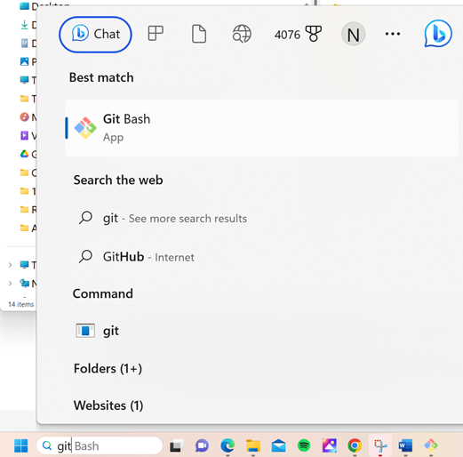

2. Se Git non è installato, scarica e installa l'ultima versione per il tuo sistema dalla sezione "Download" su [**qui**](https://git-scm.com/downloads). Qualsiasi versione recente di Git dovrebbe funzionare; seleziona la versione corretta per il tuo sistema: Mac, Windows o Linux.

**Nota per gli utenti Mac:** la pagina web di Git ti guiderà anche nell'installazione di un programma aggiuntivo chiamato "homebrew" per facilitare l'installazione. Se installi Git tramite homebrew, non è necessario modificare alcuna preferenza.

(Make_a_note_of_Git_path)=

* Durante l'installazione, quando ti viene chiesto di "selezionare la destinazione", prendi nota di _dove_ Git viene installato (il "**percorso di installazione**"): ti servirà per verificarlo nel passaggio successivo. Sarà qualcosa di simile a "C:\Program Files\Git\cmd\git.exe"

*  Mentre procedi attraverso i vari passaggi dell'installazione di Git, accetta tutte le opzioni predefinite.

*  Dopo l'installazione, se hai dimenticato di prendere nota di dove Git è stato installato, puoi trovarlo come segue: digita "git" nella barra di ricerca del PC, fai clic con il tasto destro su "Git bash", seleziona "apri percorso file" e passa il mouse sull'icona "Git bash" per vedere dove è installato.

* Riavvia il computer prima di procedere al passaggio successivo.

(Building-APK-install-android-studio)=
### Installare Android Studio

- **Dovrai essere connesso a internet per tutto il tempo durante i seguenti passaggi, poiché Android Studio scarica diversi aggiornamenti**

```{admonition} What is Android Studio?
:class: dropdown
Android Studio è un programma che viene eseguito sul tuo computer. Ti consente di scaricare codice sorgente da internet (usando Git) e di compilare app per smartphone (e smartwatch). Non puoi "danneggiare" una versione di **AAPS** attualmente in esecuzione su uno smartphone compilando un'app nuova o aggiornata sul PC con Android Studio: si tratta di processi completamente separati. 
```

Una delle cose più importanti durante l'installazione di Android Studio è **avere pazienza!** Durante l'installazione e la configurazione, Android Studio scarica molti elementi, il che richiede tempo.

```{admonition} Different UI
:class: warning
Nota importante: Android Studio ha cambiato la sua interfaccia nelle ultime versioni. Questa guida mostra i passaggi con la *nuova interfaccia* in "Ladybug". Se utilizzi ancora la vecchia interfaccia, potresti voler passare alla nuova interfaccia seguendo [queste istruzioni](NewUI).
```

La versione di Android Studio è molto importante. Consulta le [istruzioni sopra](#Building-APK-recommended-specification-of-computer-for-building-apk-file) per scegliere la versione corretta di Android Studio.

Scarica la [versione attuale di Android Studio](https://developer.android.com/studio) o una versione precedente dagli [**Archivi**](https://developer.android.com/studio/archive) e accetta i contratti di download.


Una volta completato il download, avvia l'applicazione scaricata per installarla sul computer. Potrebbe essere necessario accettare/confermare alcuni avvisi sulle app scaricate da Windows!

Installa Android Studio facendo clic su "Next", come mostrato negli screenshot seguenti. **Non** è necessario modificare alcuna impostazione!

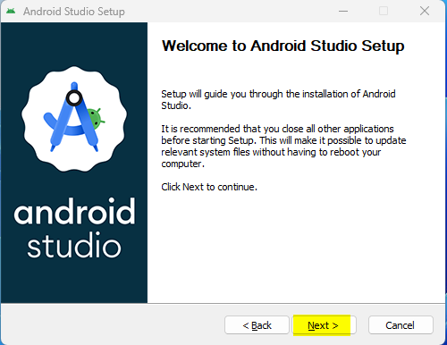

Se vuoi risparmiare spazio su disco, puoi deselezionare Android Virtual Device: non viene utilizzato per compilare **AAPS**.


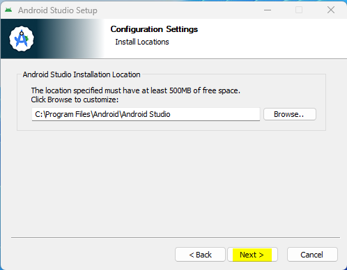

Ora fare clic su "Install":

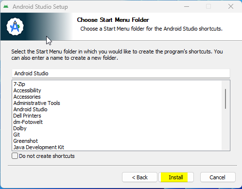

Al termine, premere "Next"

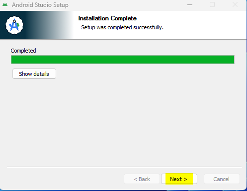

Nell'ultimo passaggio, fare clic su "Finished" per avviare Android Studio per la prima volta.

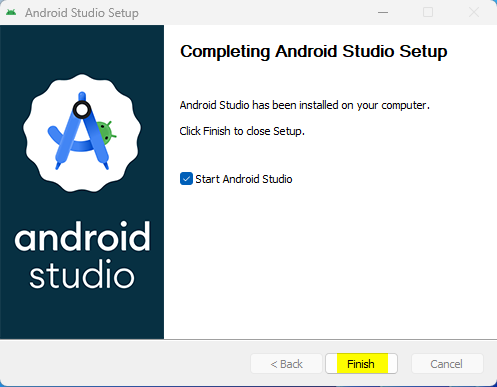

Verrà chiesto se si desidera contribuire al miglioramento di Android Studio. Scegliere l'opzione preferita, non avrà alcun impatto sui passaggi successivi.


La schermata di benvenuto accoglie all'installazione di Android Studio. Premere "Next".

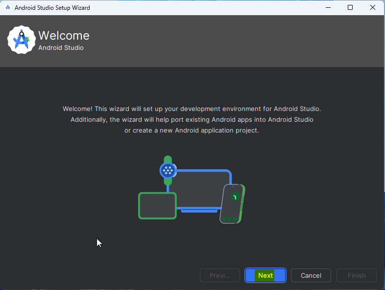

Selezionare "Standard" come tipo di installazione.

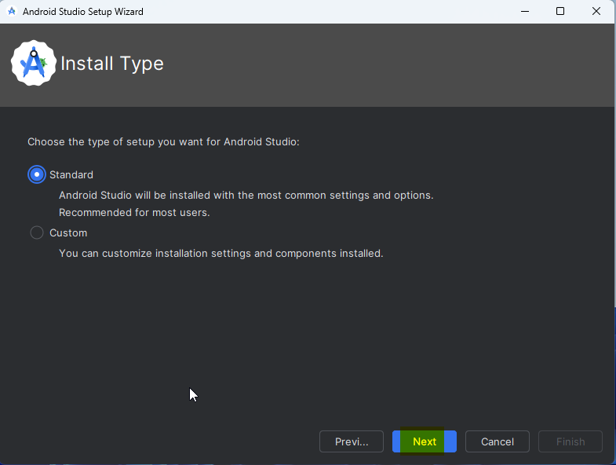

Verificare le impostazioni facendo di nuovo clic su "Next".

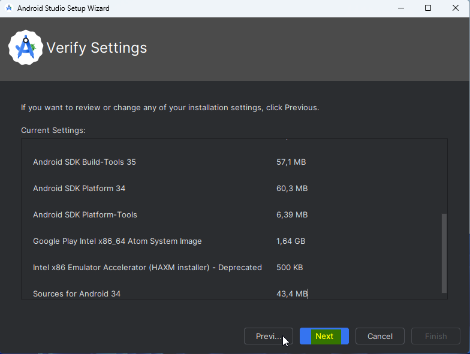

Ora è necessario accettare i contratti di licenza. Ci sono due sezioni (1 + 3) sul lato sinistro che devono essere selezionate una alla volta e per ognuna occorre selezionare "Accept" (2 + 4) sul lato destro.

Poi è possibile fare clic sul pulsante "Finish" (5).


Alcuni pacchetti Android verranno ora scaricati e installati. Avere pazienza e attendere.

Al termine, verrà visualizzata la schermata seguente dove è possibile selezionare nuovamente "Finish".


Verrà ora visualizzata la schermata di benvenuto di Android Studio.


(Building-APK-download-AAPS-code)=
### Scaricare il codice di AAPS

```{admonition} Why can it take a long time to download the AAPS code?
:class: dropdown

La prima volta che **AAPS** viene scaricato, Android Studio si connetterà a internet al sito GitHub per scaricare il codice sorgente di **AAPS**. Ciò dovrebbe richiedere circa 1 minuto. 

Android Studio utilizzerà poi **Gradle** (uno strumento di sviluppo per app Android) per identificare gli altri componenti necessari per compilare questi elementi sul computer. 
```

Nella schermata di benvenuto di Android Studio, verificare che "**Projects**" (1) sia evidenziato a sinistra.

Poi fare clic su "**Clone Repository**" (2) a destra:

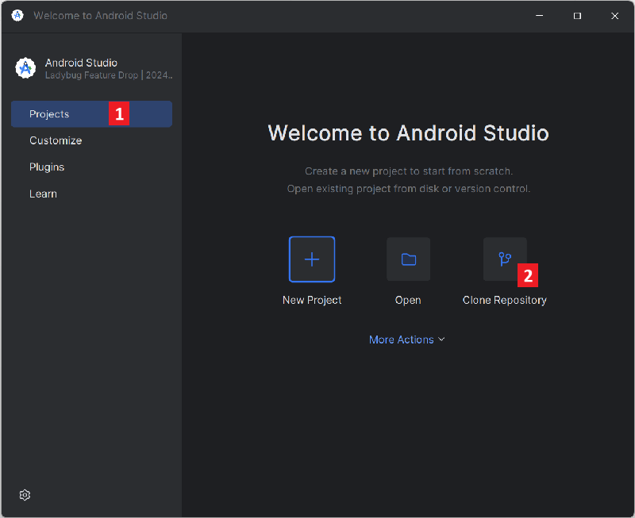

Indicheremo ora ad Android Studio dove trovare il codice:


* "Repository URL" dovrebbe essere selezionato (per impostazione predefinita) a sinistra (1).
* "Git" dovrebbe essere selezionato (per impostazione predefinita) come sistema di controllo delle versioni (2).
* Ora copia questo URL:
    ```
    https://github.com/nightscout/AndroidAPS.git
    ```
    e incollalo nella casella URL (3).

* Verifica che la directory (predefinita) per salvare il codice clonato non esista già sul computer (4). Puoi cambiarla con un'altra directory, ma ricorda dove l'hai salvata!
* Ora fai clic sul pulsante "Clone" (5).

```{admonition} INFORMATION
:class: information
Prendi nota della directory. È lì che viene memorizzato il codice sorgente!
```

Verrà ora visualizzata una schermata che indica che il repository è in fase di clonazione:


A un certo punto, Android Studio si chiuderà e si riaprirà. Potrebbe essere chiesto se si vuole considerare attendibile il progetto. Fare clic su "Trust project":

  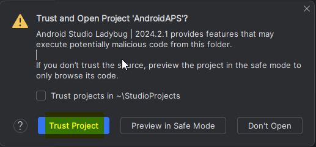


Solo per gli utenti Windows: se il firewall richiede un'autorizzazione, concedere l'accesso:

 

Dopo che il repository è stato clonato con successo, Android Studio aprirà il progetto clonato.

(NewUI)=
```{admonition} New UI
:class: information
Android Studio ha recentemente aggiornato la propria interfaccia. Le nuove installazioni di Android Studio utilizzano la nuova interfaccia per impostazione predefinita!

Solo se Android Studio appare diverso, potrebbe essere necessario passare alla nuova interfaccia:
Fare clic sul menu hamburger in alto a sinistra, quindi selezionare **Settings** (o **Preferences** sui computer Apple).
In **Appearance & Behaviour**, andare su **New UI** e selezionare **Enable new UI**. Poi riavviare Android Studio per iniziare a utilizzarla.

Se non si trova l'opzione **New UI** non preoccuparsi: la si sta già utilizzando!
```


Quando Android Studio si apre, attendere con pazienza (potrebbero volerci alcuni minuti) e, in particolare, **non** aggiornare il progetto come suggerito nel pop-up.

Android Studio avvierà automaticamente una "Sincronizzazione progetto Gradle", che richiederà qualche minuto. È possibile vedere che è ancora in esecuzione:

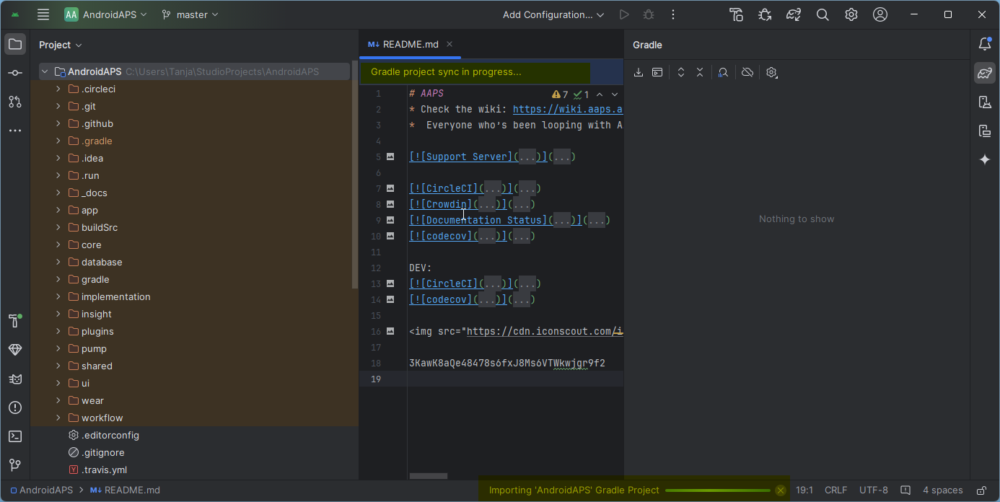

```{admonition} NEVER UPDATE GRADLE!
:class: warning

Android Studio potrebbe raccomandare di aggiornare il sistema Gradle. **Non aggiornare mai Gradle!** Questo causerebbe difficoltà.
```

Solo sui computer Windows: potresti ricevere una notifica su Windows Defender in esecuzione: fare clic su **Automatically** e confermare; in questo modo la compilazione sarà più veloce!

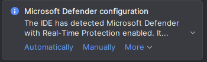


È possibile lasciare la sincronizzazione Gradle in esecuzione e seguire già i passaggi successivi.

(Building-APK-set-git-path-in-preferences)=
### Impostare il percorso Git nelle preferenze di Android Studio

Ora indicheremo ad Android Studio dove trovare Git, che hai installato [precedentemente](#install-git-if-you-dont-have-it).

* Solo per utenti Windows: assicurati di aver riavviato il computer dopo [aver installato Git](#install-git-if-you-dont-have-it). In caso contrario, riavvia ora e riapri Android Studio.

Nell'angolo in alto a sinistra di **Android Studio**, apri il menu hamburger e naviga su **File** > **Settings** (su Windows) o **Android Studio** > **Preferences** (su Mac). Si aprirà la finestra seguente; fare clic per espandere il menu a discesa **Version Control** (1) e selezionare **Git**.


Verifica se **Android Studio** riesce a individuare automaticamente il corretto **Percorso dell'eseguibile Git** facendo clic sul pulsante "Test" (1):


Se l'impostazione automatica ha successo, verrà visualizzata la versione attuale di **Git** accanto al percorso.

   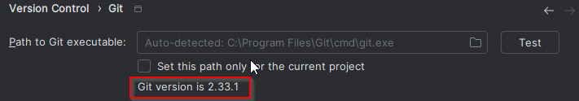


Se **git.exe** non viene trovato automaticamente o se facendo clic su "Test" si verifica un errore (1), è possibile:
* inserire manualmente il percorso salvato [in precedenza](#BuildingAaps-steps-for-installing-git), oppure
* fare clic sull'icona della cartella (1) e navigare manualmente fino alla directory in cui è stato installato **git.exe** [in precedenza](#BuildingAaps-steps-for-installing-git).
* Verificare le impostazioni con il pulsante **Test**!

  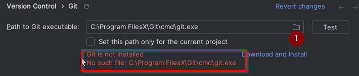

(Building-APK-generate-signed-apk)=
### Compilare l'APK "firmato" di AAPS

```{admonition} Why does the AAPS app need to be "signed"?
:class: dropdown

Android richiede che ogni app sia _firmata_, per garantire che possa essere aggiornata in seguito solo dalla stessa fonte attendibile che ha rilasciato l'app originale. Per ulteriori informazioni su questo argomento, segui [questo link](https://developer.android.com/studio/publish/app-signing.html#generate-key). 

Per i nostri scopi, questo significa semplicemente che generiamo un file di firma, o "keystore", e lo utilizziamo quando compiliamo l'app **AAPS**.
```


**Importante: assicurarsi che la sincronizzazione Gradle sia terminata con successo prima di procedere!**


Fare clic sul menu hamburger in alto a sinistra per aprire la barra dei menu. Selezionare **Build** (1), quindi **Generate Signed App Bundle / APK** (2).


Selezionare "APK" invece di "Android App Bundle" e fare clic su "Next":

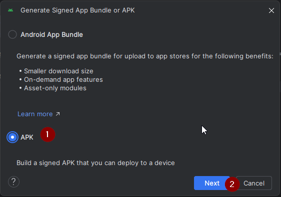

Nella schermata successiva, assicurarsi che "Module" sia impostato su "AAPS.app" (1).

(Building-APK-wearapk)=
```{admonition} INFORMATION!
:class: information
Se si desidera creare l'apk per lo smartwatch, è necessario selezionare AAPS.wear!
```


Fare clic su "Create new..." (2) per iniziare a creare il keystore.

```{admonition} INFORMATION!
:class: information
Sarà necessario creare il keystore una sola volta.
Se hai già compilato AAPS in precedenza, NON creare un nuovo keystore ma seleziona quello esistente e inserisci le sue password!
```

**_Nota:_** Il keystore è un file in cui vengono memorizzate le informazioni per la firma dell'app. È crittografato e le informazioni sono protette da password.


* Fare clic sul simbolo "cartella" (1) per selezionare un percorso sul computer per il keystore.

  **Non** utilizzare la directory in cui è stato salvato il codice sorgente, ma una directory che verrà trasferita anche su un nuovo computer.

```{admonition} WARNING!
:class: warning
Assicurarsi di annotare dove viene salvato il keystore. Ne avrai bisogno quando compilerai il prossimo aggiornamento di AndroidAPS!
```

* Scegliere una password semplice (e annotarla), inserirla nella casella password (2) e confermarla (2).

  Le password per il keystore e per la chiave non devono essere complicate. In caso di smarrimento della password in futuro, consultare la sezione [risoluzione dei problemi per keystore perso](#troubleshooting_androidstudio-lost-keystore).

* L'alias predefinito (3) per la chiave è "key0"; lasciarlo invariato.

* Ora è necessaria una password per la chiave. Per semplicità, se lo si desidera, è possibile utilizzare la stessa password del keystore, inserita sopra. Inserire una password (4) e confermarla.

```{admonition} WARNING!
:class: warning
Annotare queste password! Ne avrai bisogno quando compilerai il prossimo aggiornamento di AAPS!
```

* La validità è di 25 anni per impostazione predefinita; lasciarla invariata.

* Inserire nome e cognome (5). Non è necessario aggiungere altre informazioni, ma sei libero di farlo (6-7).

* Fare clic su "OK" (8) per continuare:


Nella pagina **Generate signed App Bundle or APK**, verrà ora visualizzato il percorso del keystore. Reinserire la password del Key Store (1) e la password della Key (2), e selezionare la casella (3) per ricordare le password, in modo da non doverle inserire nuovamente la prossima volta che si compilerà l'apk (ad es. quando si aggiorna a una nuova versione di AAPS). Fare clic su "Next" (4):


Nella schermata successiva, selezionare la variante di compilazione "fullRelease" (2) e fare clic su "Create" (3). Ricordare la directory mostrata in (1), poiché lì si troverà il file apk compilato!

   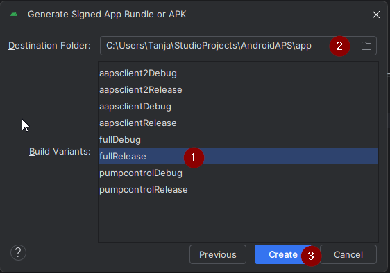

Android Studio compilerà ora l'apk di **AAPS**. In basso a destra verrà mostrato "Gradle Build running" (2). Il processo richiede del tempo a seconda del computer e della connessione internet; **avere pazienza!** Se si desidera monitorare l'avanzamento della compilazione, fare clic sul piccolo martello "build" (1) nella parte inferiore di Android Studio:

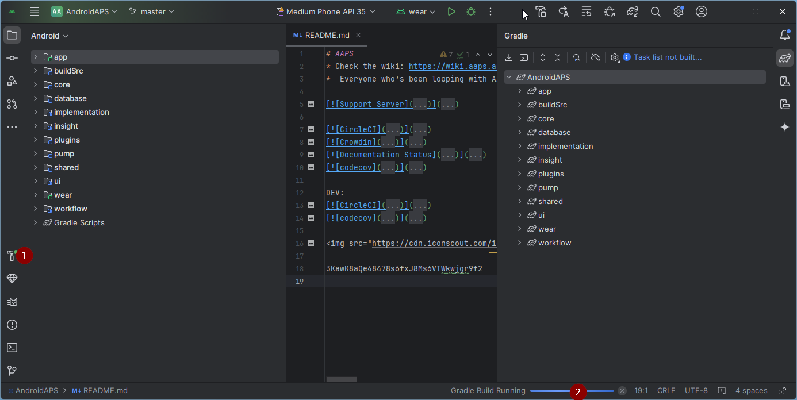

Ora è possibile vedere l'avanzamento della compilazione:


Android Studio mostrerà il messaggio "BUILD SUCCESSFUL" al termine della compilazione. Potrebbe apparire una notifica pop-up su cui fare clic per selezionare "locate". Se la si perde, fare clic sull'icona di notifica (1) e poi su **locate** (2) nella parte inferiore dello schermo per visualizzare le Notifiche:


**_Se la compilazione non è andata a buon fine, fare riferimento alla [sezione Risoluzione dei problemi di Android Studio](../GettingHelp/TroubleshootingAndroidStudio.md)._**

Nella casella Notifiche, fare clic sul link blu "locate":

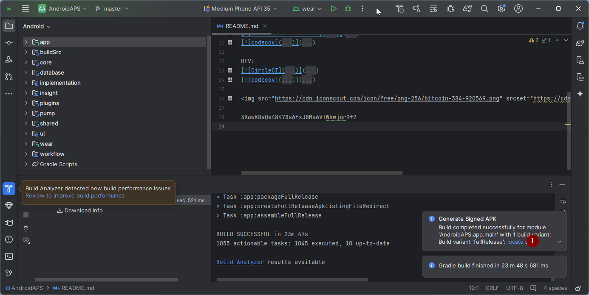 Il file manager si aprirà e mostrerà il file apk appena compilato.

   

Congratulazioni! Hai compilato il file apk di **AAPS**; nella prossima sezione della documentazione trasferirai questo file sullo smartphone.

```{tip}
Se pensi di voler utilizzare uno smartwatch Android Wear in futuro, questo è il momento migliore per compilare anche l'apk AAPS Wear, in modo che sia sicuramente sincronizzato con il tuo apk AAPS.
```

Passa alla fase successiva di [Trasferimento e installazione di **AAPS**](../SettingUpAaps/TransferringAndInstallingAaps.md).


