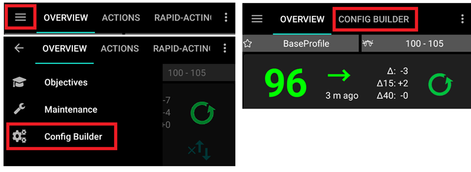
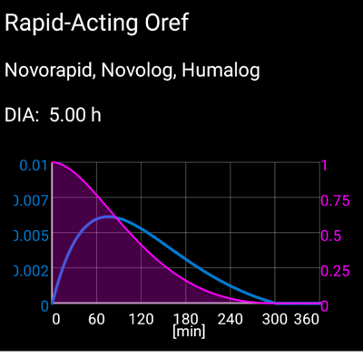
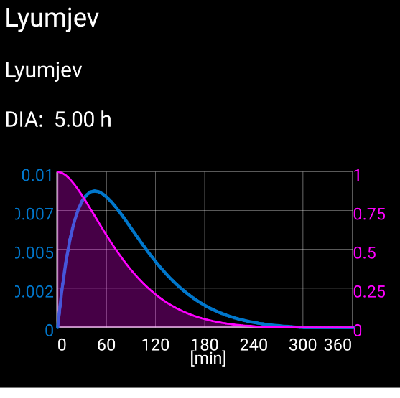
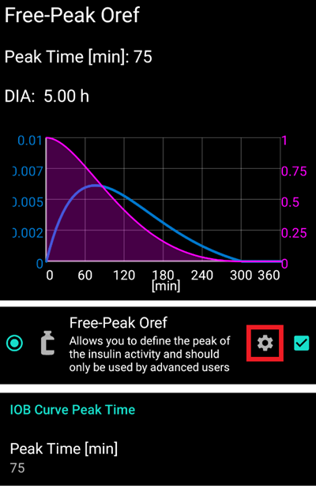
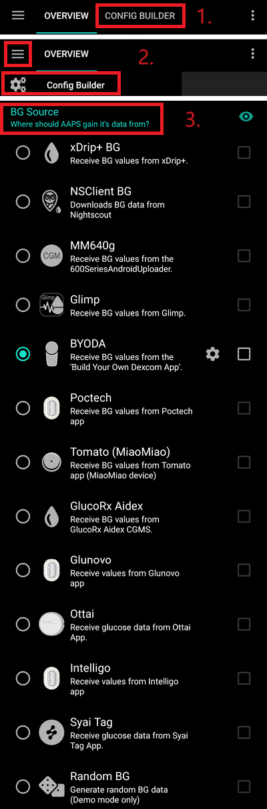

# Generatore di configurazione

A seconda delle impostazioni, puoi aprire il Generatore di configurazione tramite una scheda nella parte superiore della schermata di **AAPS** o tramite il menu hamburger.



Il **Generatore di configurazione** è la scheda dove attivi e disattivi le funzionalità modulari. Nell'immagine qui sotto, le caselle sul lato sinistro (A) ti permettono di selezionare quali moduli vuoi attivare. Per impostazione predefinita, quando si apre il Generatore di configurazione, le sezioni sono compresse per mostrare solo i plugin attivi. Clicca sulla freccia (G) per visualizzare tutte le opzioni disponibili. Le caselle sul lato destro (C) ti permettono di visualizzare i moduli attivi come scheda (E) in **AAPS**. Nel caso in cui la casella di destra non sia attivata, puoi raggiungere la funzione usando il menu hamburger (D) in alto a sinistra dello schermo. Vedi [Scheda o menu hamburger](#tab-or-hamburger-menu) di seguito.

Quando nel modulo sono disponibili impostazioni aggiuntive, puoi cliccare sull'ingranaggio (B) che ti porterà alle impostazioni specifiche nelle preferenze.


(Config-Builder-tab-or-hamburger-menu)=
## Tab or hamburger menu

Con la casella di controllo sotto il simbolo dell'occhio puoi decidere come aprire la sezione del programma corrispondente.


```{contents}
:backlinks: entry
:depth: 2
```

(ConfigBuilder_Profile)=

## Profilo

Questo modulo non può essere disabilitato in quanto è una parte fondamentale di **AAPS**.

Consulta [Il tuo profilo AAPS](../SettingUpAaps/YourAapsProfile.md) per una comprensione di base di ciò che è contenuto nel tuo **Profilo**.

(Config-Builder-insulin)=
## Insulina


Seleziona il tipo di insulina che stai usando.

Ulteriori informazioni per comprendere il Profilo insulinico come mostrato in **AAPS** [qui](#AapsScreens-insulin-profile).

### Differenze tra i tipi di insulina

* Le opzioni 'Rapid-Acting Oref', 'Ultra-Rapid Oref', 'Lyumjev' e 'Free-Peak Oref' hanno tutte una forma esponenziale.
* Per 'Rapid-Acting', 'Ultra-Rapid' e 'Lyumjev' il DIA è l'unica variabile che puoi regolare da solo, il tempo al picco è fisso.
* Free-Peak ti permette di regolare sia il DIA che il tempo al picco, e deve essere usato solo dagli utenti avanzati che conoscono gli effetti di queste impostazioni.
* Il [grafico della curva insulinica](#AapsScreens-insulin-profile) ti aiuta a capire le diverse curve.

#### Rapid-Acting Oref



* consigliato per Humalog, Novolog e Novorapid
* DIA = almeno 5.0h
* Max. Picco max = 75 minuti dopo l'iniezione (fisso, non regolabile)

#### Ultra-Rapid Oref


* consigliato per FIASP
* DIA = almeno 5.0h
* Max. Picco max = 55 minuti dopo l'iniezione (fisso, non regolabile)

(Config-Builder-lyumjev)=
#### Lyumjev



* profilo insulinico speciale per Lyumjev
* DIA = almeno 5.0h
* Max. Picco max = 45 minuti dopo l'iniezione (fisso, non regolabile)

#### Free Peak Oref



* Con il profilo "Free Peak Oref" puoi inserire individualmente il tempo al picco. Per farlo, clicca sull'ingranaggio per accedere alle impostazioni avanzate.
* Il DIA viene automaticamente impostato a 5 ore se non è specificato un valore più alto nel profilo.
* Questo profilo di effetto è consigliato se si usa un'insulina non supportata o un mix di insuline diverse.

(Config-Builder-bg-source)=
## BG Source
Seleziona la sorgente di glicemia che stai usando. Vedi la pagina [Sorgente glicemia](../Getting-Started/CompatiblesCgms.md) per ulteriori informazioni sulla configurazione.



* [xDrip+](../CompatibleCgms/xDrip.md)
* [NSClient BG](../CompatibleCgms/CgmNightscoutUpload.md) - solo se sai cosa stai facendo, vedi [Sorgente glicemia](../Getting-Started/CompatiblesCgms.md).
* [MM640g](../CompatibleCgms/MM640g.md)
* Glimp - solo la versione 4.15.57 e successive sono supportate
* [Build Your Own Dexcom App (BYODA)](#DexcomG6-if-using-g6-with-build-your-own-dexcom-app).
* [Poctech](../CompatibleCgms/PocTech.md)
* App Tomato per dispositivo MiaoMiao
* [App Glunovo](https://infinovo.com/) per il sistema CGM Glunovo
* [Ottai](../CompatibleCgms/OttaiM8.md)
* [Syai Tag](../CompatibleCgms/SyaiTagX1.md)
* Glicemia casuale: genera dati glicemia casuali (solo modalità Demo)

## Smoothing


Vedi [Livellamento dei dati di glicemia](../CompatibleCgms/SmoothingBloodGlucoseData.md).

(Config-Builder-pump)=
## Pump
Seleziona il microinfusore che stai usando. Vedi la pagina [Microinfusori compatibili](../Getting-Started/CompatiblePumps.md) per ulteriori informazioni sulla configurazione.

 

* [Dana R](../CompatiblePumps/DanaR-Insulin-Pump.md)
* Dana R Coreano (per il microinfusore DanaR domestico)
* Dana Rv2 (microinfusore DanaR con aggiornamento firmware non ufficiale)
* [Dana-i/RS](../CompatiblePumps/DanaRS-Insulin-Pump.md)
* [Accu Chek Insight](../CompatiblePumps/Accu-Chek-Insight-Pump.md)
* [Accu Chek Combo](../CompatiblePumps/Accu-Chek-Combo-Pump-v2.md)
* Omnipod per [Omnipod Eros](../CompatiblePumps/OmnipodEros.md)
* Dash per [Omnipod DASH](../CompatiblePumps/OmnipodDASH.md)
* [Medtronic](../CompatiblePumps/MedtronicPump.md)
* [Diaconn G8](../CompatiblePumps/DiaconnG8.md)
* [EOPatch2](../CompatiblePumps/EOPatch2.md)
* [Medtrum](../CompatiblePumps/MedtrumNano.md)
* [Equil 5.3](../CompatiblePumps/Equil5.3.md)
* Microinfusore virtuale: loop aperto - solo suggerimenti di **AAPS**
  * durante i primi passi con **AAPS**, durante i primi [obiettivi](../SettingUpAaps/CompletingTheObjectives.md)
  * per microinfusori che non hanno ancora un driver

(Config-Builder-sensitivity-detection)=

## Rilevamento sensibilità
Seleziona il tipo di rilevamento della sensibilità. Per ulteriori dettagli sui diversi modelli [leggi qui](../DailyLifeWithAaps/SensitivityDetectionAndCob.md). Analizzerà i dati storici al volo e farà aggiustamenti se rileva che stai reagendo più sensibilmente (o al contrario, più resistente) all'insulina del solito.  Ulteriori dettagli sull'algoritmo di sensibilità possono essere letti nella [documentazione OpenAPS](https://openaps.readthedocs.io/en/latest/docs/Customize-Iterate/autosens.html).

Puoi visualizzare la tua sensibilità nella schermata principale in un [grafico aggiuntivo](#AapsScreens-section-g-additional-graphs). Puoi visualizzare la tua sensibilità nella schermata principale selezionando SEN e guardando la linea bianca.  Nota: devi essere nell'[Obiettivo 8](#objectives-objective8) affinché il Rilevamento sensibilità/[Autosens](#Open-APS-features-autosens) regoli automaticamente la quantità di insulina erogata. Prima di raggiungere quell'obiettivo, la percentuale Autosens / la linea nel grafico viene visualizzata solo a scopo informativo.

### Impostazioni di assorbimento
Se usi Oref1 con **SMB** devi modificare **min_5m_carbimpact** a 8. Il valore viene usato solo durante le lacune nelle letture del **CGM** o quando l'attività fisica "consuma" tutta la glicemia che altrimenti farebbe decadere il COB da parte di **AAPS**. Nei momenti in cui [l'assorbimento dei carboidrati](../DailyLifeWithAaps/CobCalculation.md) non può essere calcolato dinamicamente in base alle reazioni del sangue, viene inserito un decadimento predefinito per i tuoi carboidrati. In sostanza, è un meccanismo di sicurezza.

(Config-Builder-aps)=
## APS
Seleziona l'algoritmo APS desiderato per gli aggiustamenti terapeutici. Puoi visualizzare il dettaglio attivo dell'algoritmo scelto nella scheda OpenAPS(OAPS).
* OpenAPS AMA
  * Advanced Meal Assist: algoritmo precedente non più consigliato.
  * In parole semplici, il vantaggio è che dopo un bolo pasto il sistema può aumentare la basale più rapidamente SE inserisci i carboidrati in modo affidabile.
* [OpenAPS SMB](#Open-APS-features-super-micro-bolus-smb)
  * Super Micro Bolus: l'algoritmo più recente consigliato per tutti gli utenti.
  * A differenza di AMA, SMB non usa tassi basali temporanei per controllare i livelli di glucosio, ma principalmente piccoli **Super Micro Bolus**.
  * Nota: si raccomanda di usare questo algoritmo fin dall'inizio, anche se non riceverai effettivamente SMB fino all'[Obiettivo 9](#objectives-objective9).

Se si passa dall'algoritmo AMA a SMB, _min_5m_carbimpact_ deve essere modificato manualmente a **8** (valore predefinito per SMB) in [Preferenze > Rilevamento sensibilità > Impostazioni Oref1 sensibilità](../SettingUpAaps/Preferences.md).

## Loop

Questo modulo non deve essere disabilitato in quanto è una parte fondamentale di **AAPS**.

## Constraints

### Obiettivi

**AAPS** ha un programma di apprendimento (una serie di obiettivi) che devi completare passo dopo passo. Questo dovrebbe guidarti in modo sicuro attraverso la configurazione di un sistema a circuito chiuso. Garantisce che tu abbia configurato tutto correttamente e che capisca esattamente cosa fa il sistema. Questo è l'unico modo in cui puoi fidarti del sistema.

Vedi la pagina [Obiettivi](../SettingUpAaps/CompletingTheObjectives.md) per ulteriori informazioni.

## Sincronizzazione

In questa sezione puoi scegliere se/dove vuoi che **AAPS** invii i tuoi dati.

### NSClient o NSClientV3

Può essere usato come [server di reportistica](../SettingUpAaps/SettingUpTheReportingServer.md) e/o per il [monitoraggio remoto](../RemoteFeatures/RemoteMonitoring.md), [controllo remoto](../RemoteFeatures/RemoteControl.md).

Vedi [Sincronizzazione con il server di reportistica](#SetupWizard-synchronization-with-the-reporting-server-and-more) per scegliere tra NSClient (v1) e NSClientV3.

### Tidepool

Può essere usato come [server di reportistica](../SettingUpAaps/SettingUpTheReportingServer.md).

Vedi [Tidepool](../SettingUpAaps/Tidepool.md).

### xDrip

Usato per **inviare** dati come i trattamenti a xDrip+.

### Open Humans

Vedi [Open Humans](../SupportingAaps/OpenHumans.md).

### Wear
Monitora e controlla **AAPS** usando il tuo smartwatch Android WearOS (vedi [pagina Watchfaces](../WearOS/WearOsSmartwatch.md)).

### Samsung Tizen

Trasmette i dati all'app G-Watch Wear di Samsung (SO Tizen).

### Garmin

Connessione al dispositivo Garmin (Fenix, Edge...)
## Trattamenti
Se visualizzi la scheda Trattamenti (Tratt.), puoi vedere i trattamenti che sono stati caricati su Nightscout.  Se vuoi modificare o eliminare una voce (es. hai mangiato meno carboidrati del previsto), seleziona 'Rimuovi' e inserisci il nuovo valore (modifica l'orario se necessario) tramite il [pulsante carboidrati nella schermata principale](#screens-bolus-carbs).

## Generale

### Panoramica

Questa è la [schermata principale](#AapsScreens-the-homescreen) di **AAPS** e non può essere disabilitata.

#### Mostra campo note nei dialoghi di trattamento
Scegli se vuoi avere un campo note durante l'inserimento dei trattamenti o meno.

#### Indicatori di stato
Scegli se vuoi avere [indicatori di stato](#Preferences-status-lights) nella panoramica per l'età della cannula, l'età dell'insulina, l'età del sensore, l'età della batteria, il livello del serbatoio o il livello della batteria. Quando viene raggiunto il livello di avviso, il colore dell'indicatore di stato passerà al giallo. L'età critica verrà mostrata in rosso.

#### Impostazioni avanzate
**Eroga questa parte del risultato del calcolatore bolo**: Quando si usano gli SMB, molte persone non somministrano un bolo pasto al 100% dell'insulina necessaria, ma solo una parte di essa (es. 75%) e lasciano che gli SMB con UAM (rilevamento pasti non presidiati) facciano il resto. In questa impostazione, puoi scegliere un valore predefinito per la percentuale con cui il calcolatore bolo dovrebbe calcolare. Se questa impostazione è al 75% e dovevi fare un bolo di 10U, il calcolatore bolo proporrà un bolo pasto di solo 7,5 unità.

**Abilita la funzionalità super bolo nel calcolatore** (È diverso dal *super micro bolus*!): Usare con cautela e non abilitare fino a quando non si capisce cosa fa veramente. In sostanza, la basale per le successive due ore viene aggiunta al bolo e viene attivato uno zero-temp di due ore. **Le funzioni di loop di AAPS saranno disabilitate - usare con cautela! Se usi SMB, le funzioni di loop di AAPS saranno disabilitate in base alle tue impostazioni in ["Minuti massimi di basale per limitare SMB a"](#Open-APS-features-max-minutes-of-basal-to-limit-smb-to); se non usi SMB, le funzioni di loop saranno disabilitate per due ore.** I dettagli sul super bolo si trovano [qui](https://www.diabetesnet.com/diabetes-technology/blue-skying/super-bolus).

(Config-Builder-actions)=
### Azioni

Una scheda che offre più pulsanti per eseguire [azioni](#screens-action-tab) in **AAPS**.

### Automazione

Una scheda per gestire le tue [Automazioni](../DailyLifeWithAaps/Automations.md), a partire dall'[Obiettivo 10](#objectives-objective10).

(Config-Builder-sms-communicator)=
### Comunicatore SMS
Consente ai caregiver remoti di controllare alcune funzionalità di **AAPS** via SMS, vedi [Comandi SMS](../RemoteFeatures/SMSCommands.md) per ulteriori informazioni sulla configurazione.

### Cibo
Visualizza i preset alimentari definiti nel database alimentare di Nightscout, vedi [Nightscout Readme](https://github.com/nightscout/cgm-remote-monitor#food-custom-foods) per ulteriori informazioni sulla configurazione.

Nota: le voci non possono essere usate nel calcolatore di **AAPS**. (Solo visualizzazione)

(Config-Builder-wear)=
### Wear
Monitora e controlla AAPS usando il tuo smartwatch Android Wear (vedi [pagina Watchfaces](../WearOS/WearOsSmartwatch.md)). Usa le impostazioni (ingranaggio) per definire quali variabili devono essere considerate nel calcolo del bolo effettuato tramite l'orologio (es. tendenza a 15 min, COB...).

Se vuoi fare boli ecc. dall'orologio, nelle "Impostazioni Wear" devi abilitare "Controlli dall'orologio".


Tramite la scheda Wear o il menu hamburger (in alto a sinistra dello schermo, se la scheda non è visualizzata) puoi:
* Inviare di nuovo tutti i dati. Può essere utile se l'orologio non è stato connesso per un po' e vuoi inviare le informazioni all'orologio.
* Aprire le impostazioni sull'orologio direttamente dal telefono.

### Autotune

Puoi abilitare Autotune, vedi [qui](../AdvancedOptions/Autotune.md).

### Manutenzione

Accedi a questa scheda per esportare / importare le impostazioni.

### Generatore di configurazione

Questa scheda corrente.