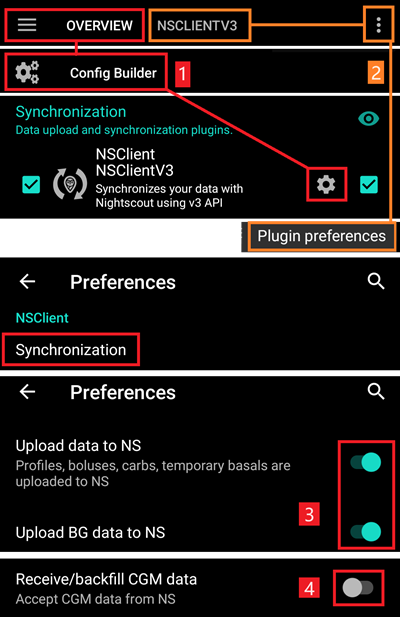
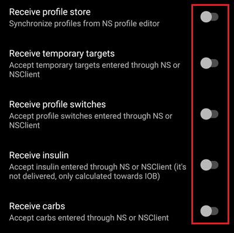
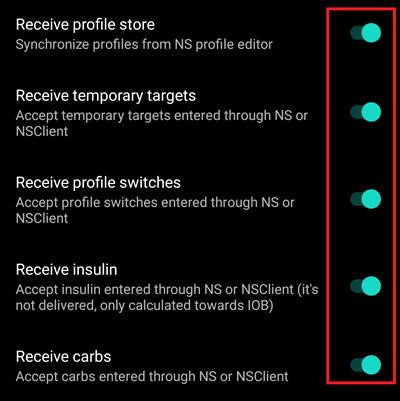
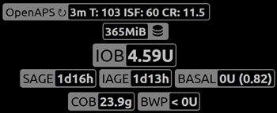

# Nightscout

(Nightscout-security-considerations)=
## Considerazioni sulla sicurezza

Oltre alla reportistica, Nightscout può essere usato anche per controllare AAPS. I.e. Ad esempio, puoi impostare obiettivi temporanei o aggiungere carboidrati futuri. Queste informazioni verranno ricevute da AAPS che agirà di conseguenza. Pertanto vale la pena pensare alla sicurezza del tuo sito Nightscout.

Usa la massima cautela se utilizzi Nightscout come sorgente dati di AAPS.

### Impostazioni Nightscout

Puoi negare l'accesso pubblico al tuo sito Nightscout usando i [ruoli di autenticazione](https://nightscout.github.io/nightscout/security): assicurati di condividere il tuo URL solo con un token `readable`, mai con un token `admin`.

Il `API_SECRET` di Nightscout è la password principale del tuo sito: non condividerla pubblicamente.

(Nightscout-aaps-settings)=
### Impostazioni AAPS

Puoi configurare AAPS per accettare i comandi di Nightscout (modifiche di profilo, trattamenti, ...) o disabilitarlo completamente.

* Accedi alle impostazioni del plugin NSClient o NSClientV3 con: 1) Vista principale -> Generatore di configurazione -> Sincronizzazione -> icona ingranaggio NSClient 2) scheda NSCLIENT -> menu a tre punti -> Preferenze plugin
* Abilita il caricamento di tutti i dati su Nightscout (3) poiché questo è ora il metodo standard, a meno che la sorgente dati glicemia non sia Nightscout.  
  Se la tua sorgente dati glicemia in AAPS è Nightscout, **non** abilitare il caricamento dei dati glicemia su NS (3).
* Non abilitare Ricevi/recupera dati (4) a meno che Nightscout non sia la tua sorgente dati glicemia.

#### Non sincronizzare da Nightscout

Disabilitare queste opzioni garantisce che nessuna modifica di Nightscout verrà usata da AAPS.

#### Accetta modifiche da Nightscout

L'abilitazione di queste opzioni ti consente di modificare in remoto le impostazioni di AAPS tramite Nightscout, come modifiche e cambio di profilo, obiettivi temporanei e aggiunta di carboidrati che verranno presi in considerazione da AAPS.  
Tieni presente che i trattamenti insulina verranno usati solo per calcoli come "Non somministrare bolo, registra solo".

### Ulteriori impostazioni di sicurezza

Mantieni il tuo telefono aggiornato come descritto in [prima la sicurezza](#preparing-safety-first).

(Nightscout-manual-nightscout-setup)=
## Configurazione manuale di Nightscout

Si presume che tu abbia già un sito Nightscout; in caso contrario, visita la pagina [Nightscout](http://nightscout.github.io/nightscout/new_user/) per le istruzioni complete sulla configurazione. Le istruzioni di seguito riguardano le impostazioni da aggiungere al tuo sito Nightscout.  Il tuo sito Nightscout deve essere almeno alla versione 15 per AAPS 3.2, quindi verifica di essere alla [versione più recente](https://nightscout.github.io/update/update/#updating-your-site-to-the-latest-version); altrimenti riceverai un messaggio di errore nell'app AAPS.

* [Modifica le tue variabili](https://nightscout.github.io/nightscout/setup_variables/#nightscout-configuration)

* Aggiungi o modifica le variabili come segue:
  * `ENABLE` = `careportal boluscalc food bwp cage sage iage iob cob basal dbsize pushover pump openaps`
  * `DEVICESTATUS_ADVANCED` = `true`
  * `SHOW_FORECAST` = `openaps`
  * `PUMP_FIELDS` = `reservoir battery clock`
  * Vari allarmi possono essere impostati per il [monitoraggio del microinfusore](https://github.com/nightscout/cgm-remote-monitor#pump-pump-monitoring); in particolare è consigliato impostare la % della batteria:
    * `PUMP_WARN_BATT_P` = `51`
    * `PUMP_URGENT_BATT_P` = `26`

* Salva le modifiche. Il tuo sito Nightscout dovrebbe ora consentire la visualizzazione delle pillole. Puoi forzare la visualizzazione predefinita aggiungendole in `SHOW_PLUGINS`.

  * `SHOW_PLUGINS` = `careportal boluscalc food bwp cage sage iage iob cob basal dbsize pushover pump openaps`

  

## Nightscout come SaaS a pagamento (Software as a Service)

Usa l'interfaccia web del provider per impostare le variabili. Se necessario, contatta il servizio di supporto del provider.
