# Preferenze

- **Apri le preferenze** cliccando il menu a tre punti in alto a destra nella schermata principale.


- Puoi passare direttamente alle preferenze per una determinata scheda (es. scheda microinfusore) aprendo quella scheda e cliccando su Preferenze plugin.


- I **sottomenu** possono essere aperti cliccando sul triangolo sotto il titolo del sottomenu.

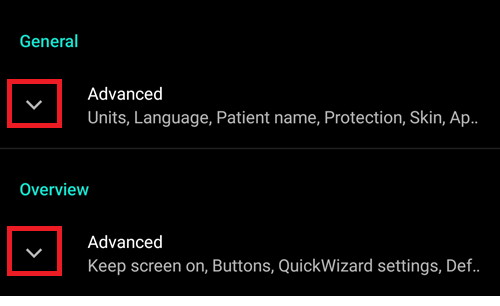

- Con il **filtro** nella parte superiore della schermata delle preferenze puoi accedere rapidamente a determinate preferenze. Inizia semplicemente a digitare parte del testo che stai cercando.


```{contents}
:backlinks: entry
:depth: 2
```

(Preferences-general)=
## Generale


**Unità**

- Imposta le unità su mmol/l o mg/dl in base alle tue preferenze.

**Lingua**

- Nuova opzione per usare la lingua predefinita del telefono (consigliata).

- Nel caso in cui tu voglia **AAPS** in una lingua diversa dalla lingua standard del tuo telefono, puoi scegliere tra una vasta varietà.

- Se usi lingue diverse, potresti a volte vedere una combinazione di lingue. Ciò è dovuto a un problema Android in cui la sostituzione della lingua Android predefinita a volte non funziona.
- Impostazione nascosta in [modalità semplice](#preferences-simple-mode).

(preferences-simple-mode)= **Modalità semplice**

La **modalità semplice** è attivata per impostazione predefinita quando installi **AAPS** per la prima volta. In **modalità semplice**, una quantità significativa di impostazioni è nascosta e le preferenze vengono sostituite da valori predefiniti. I [grafici aggiuntivi](#AapsScreens-section-g-additional-graphs) nella schermata principale sono anch'essi predefiniti. Dovresti disattivare la modalità semplice una volta che ti sei familiarizzato con l'interfaccia utente e le impostazioni di **AAPS**.

**Nome paziente**

- Può essere usato se devi differenziare tra più configurazioni (es. due bambini T1D nella tua famiglia).
- Visualizzato nel [Watchface Dual](../WearOS/WearOsSmartwatch.md).

(Preferences-skin)=
### Skin

Impostazione nascosta in [modalità semplice](#preferences-simple-mode).

Puoi scegliere tra quattro tipi di aspetto grafico:

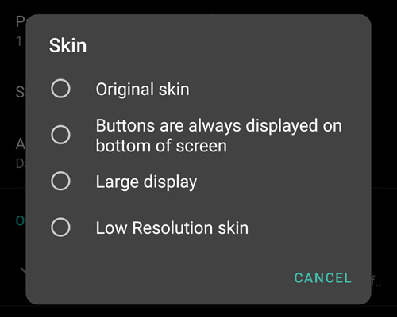

L'aspetto 'Low resolution' ha etichette più brevi e rimuove età/livello per avere più spazio disponibile su uno schermo a bassissima risoluzione.

La differenza tra gli altri aspetti dipende dall'orientamento dello schermo del telefono:

#### Orientamento verticale

- **Aspetto originale** e **I pulsanti sono sempre visualizzati in fondo allo schermo** sono identici
- **Display grande** ha un'altezza aumentata per tutti i grafici rispetto agli altri aspetti

#### Orientamento orizzontale

- Usando **Aspetto originale** e **Display grande**, devi scorrere verso il basso per vedere i pulsanti in fondo allo schermo

- **Display grande** ha un'altezza aumentata per tutti i grafici rispetto agli altri aspetti


(Preferences-protection)=
## Protection


(Preferences-master-password)=
### Password master

Obbligatoria per poter [esportare le impostazioni](../Maintenance/ExportImportSettings.md) poiché sono criptate dalla versione 2.7.

**La protezione biometrica potrebbe non funzionare sui telefoni OnePlus. Questo è un problema noto di OnePlus su alcuni telefoni.**

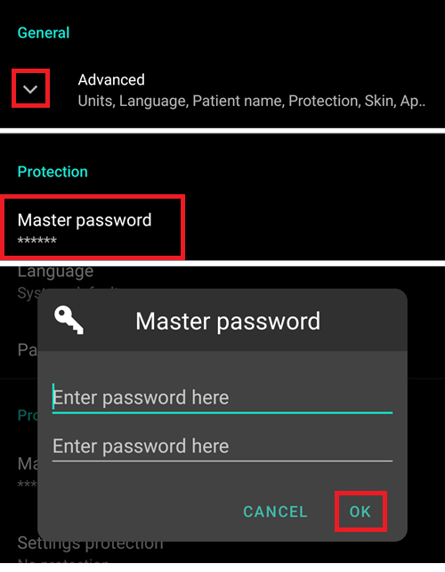

### Protezione delle impostazioni

- Proteggi le tue impostazioni con una password o l'autenticazione biometrica del telefono (es. [il bambino sta usando **AAPS**](../RemoteFeatures/RemoteMonitoring.md)). Se abiliti questa funzionalità, ti verrà richiesta l'autenticazione ogni volta che vuoi accedere a qualsiasi vista relativa alle Preferenze.

- La password personalizzata dovrebbe essere usata se vuoi usare la password master solo per proteggere le [impostazioni esportate](../Maintenance/ExportImportSettings.md) e usarne una diversa per modificare le preferenze.

- Se usi una password personalizzata, clicca sulla riga "Password impostazioni" per impostare la password come descritto [sopra](#Preferences-master-password).


### Protezione dell'applicazione

Se l'app è protetta, devi inserire la password o usare l'autenticazione biometrica del telefono per aprire **AAPS**.

**AAPS** si chiuderà immediatamente se viene inserita una password errata - ma continuerà a girare in background se era stata aperta con successo in precedenza.

### Protezione del bolo

- La protezione del bolo potrebbe essere utile se **AAPS** è usato da un bambino piccolo e [i boli vengono somministrati via SMS](../RemoteFeatures/SMSCommands.md).

- Nell'esempio qui sotto vedi la richiesta di protezione biometrica. Se l'autenticazione biometrica non funziona, clicca nello spazio sopra la richiesta bianca e inserisci la password master.


### Conservazione della password e del PIN

Definisci per quanto tempo (in secondi) le preferenze o le funzionalità di bolo rimangono sbloccate dopo aver inserito correttamente la password.

## Panoramica

Nella sezione **Panoramica**, puoi definire le preferenze per la schermata principale.

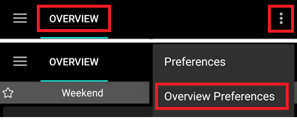

### Mantieni schermo acceso

L'opzione 'Mantieni schermo acceso' costringerà Android a mantenere sempre acceso lo schermo. Questo è utile per le presentazioni ecc. Ma consuma molta energia della batteria. Ma consuma molta energia della batteria. Pertanto, si raccomanda di collegare lo smartphone a un cavo del caricabatterie.

(Preferences-buttons)=
### Pulsanti

- Definisci quali pulsanti sono visibili nella parte inferiore della tua schermata principale.
- Impostazione nascosta in [modalità semplice](#preferences-simple-mode).


- Le opzioni **Incremento** ti permettono di definire la quantità per i tre pulsanti nei dialoghi carboidrati e insulina, per un inserimento facile.

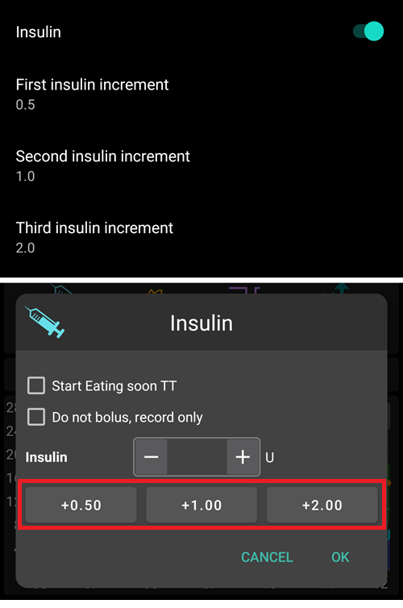


(Preferences-quick-wizard)=
### Quick Wizard

Crea pulsanti personalizzati per determinati pasti standard o snack che verranno visualizzati nella schermata principale. Utile per pasti standard consumati frequentemente.

Per ogni pulsante, definisci i carboidrati e il metodo di calcolo per il bolo. Poi definisci durante quale periodo di tempo il pulsante sarà visibile nella tua schermata principale - solo un pulsante per periodo. Il pulsante non sarà visibile se è al di fuori dell'intervallo di tempo specificato o se hai abbastanza IOB per coprire i carboidrati definiti nel pulsante Calcolatore rapido. Se vengono specificati orari diversi per i diversi pasti, avrai sempre il pulsante del pasto standard appropriato nella schermata principale, a seconda dell'ora del giorno.

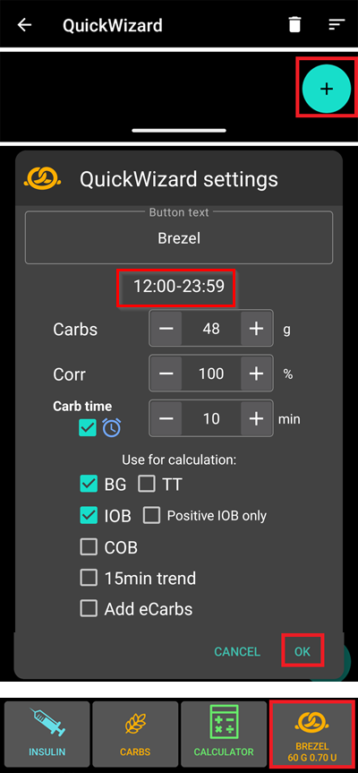

Se clicchi sul pulsante del calcolatore rapido, **AAPS** calcolerà e proporrà un bolo per quei carboidrati in base ai tuoi rapporti correnti (tenendo conto del valore di glicemia o dell'insulina attiva se configurato).

La proposta deve essere confermata prima che l'insulina venga erogata.

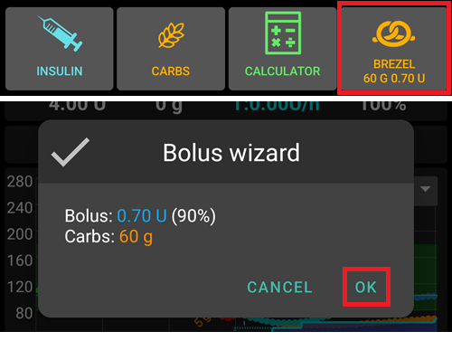

Solo un pulsante Calcolatore rapido può essere visualizzato alla volta. Se vuoi eseguirne uno diverso: tieni premuto il pulsante Calcolatore rapido attualmente visualizzato. Ti porterà all'elenco di tutte le opzioni del Calcolatore rapido. Per eseguirne uno, tieni premuto su di esso. Dovrai confermare prima dell'esecuzione.

(Preferences-default-temp-targets)=
### Obiettivi temporanei predefiniti

Impostazione nascosta in [modalità semplice](#preferences-simple-mode).

Gli [Obiettivi Temporanei (TT)](../DailyLifeWithAaps/TempTargets.md) ti permettono di cambiare il tuo target di glicemia per un determinato periodo di tempo. Quando imposti un TT predefinito, puoi facilmente cambiare il tuo target per attività, eating soon ecc.

Qui puoi modificare il target e la durata per ogni TT predefinito. I valori preimpostati sono:

* Eating soon: target 72 mg/dL / 4,0 mmol/l, durata 45 min
* Attività: target 140 mg/dL / 7,8 mmol/l, durata 90 min
* Ipo: target 125 mg/dL / 6,9 mmol/l, durata 45 min


Scopri come [attivare gli Obiettivi Temporanei qui](#TempTargets-where-can-i-select-a-temp-target).

### Quantità standard di insulina per riempimento/preparazione

Impostazione nascosta in [modalità semplice](#preferences-simple-mode).

Se vuoi riempire il tubo o preparare la cannula tramite **AAPS**, puoi farlo tramite la [scheda **Azioni**](#screens-action-tab).

I valori preimpostati possono essere definiti in questa finestra di dialogo. Scegli le quantità predefinite dei tre pulsanti nella finestra di dialogo riempimento/preparazione, a seconda della lunghezza del tuo catetere.

(Preferences-range-for-visualization)=
### Intervallo per la visualizzazione

Scegli i valori alti e bassi per il grafico glicemia nella panoramica di **AAPS** e nello smartwatch. È solo la visualizzazione, non l'intervallo target per la tua glicemia. Esempio: 70 - 180 mg/dl o 3,9 - 10 mmol/l


### Abbrevia i titoli delle schede

Impostazione nascosta in [modalità semplice](#preferences-simple-mode).

Utile per vedere più titoli di schede sullo schermo.

Ad esempio, la scheda 'OpenAPS AMA' diventa 'OAPS', 'OBIETTIVI' diventa 'OBJ' ecc.

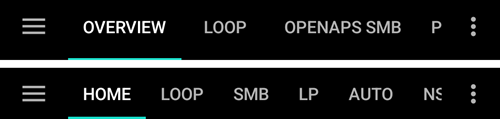

(Preferences-show-notes-field-in-treatments-dialogs)=
### Mostra campo note nei dialoghi di trattamento

Impostazione nascosta in [modalità semplice](#preferences-simple-mode).

Ti dà la possibilità di aggiungere brevi note di testo ai tuoi trattamenti (calcolatore bolo, carboidrati, insulina...)


(Preferences-status-lights)=
### Indicatori di stato

Impostazione nascosta in [modalità semplice](#preferences-simple-mode).

Gli indicatori di stato danno un avviso visivo per:

- Età sensore
- Livello batteria del sensore per certi lettori intelligenti (vedi [pagina schermate](#screens-sensor-level-battery) per i dettagli).
- Età insulina (giorni di utilizzo del serbatoio)
- Livello serbatoio (unità)
- Età cannula
- Età batteria microinfusore
- Livello batteria microinfusore (%)

Se la soglia di avviso viene superata, i valori verranno mostrati in giallo. Se la soglia critica viene superata, i valori verranno mostrati in rosso.

L'ultima opzione ti permette di importare quelle impostazioni da Nightscout se definite lì. Vedi la [documentazione Nightscout](https://nightscout.github.io/nightscout/setup_variables/#age-pills) per ulteriori informazioni.


(Preferences-deliver-this-part-of-bolus-wizard-result)=
### Eroga questa parte del risultato del calcolatore bolo

Imposta la [percentuale predefinita](#AapsScreens-section-j) del bolo calcolato quando si usa il calcolatore bolo.

Il valore predefinito è 100%: nessuna correzione. Anche impostando un valore diverso qui, puoi comunque cambiarlo ogni volta che usi il calcolatore bolo. Se questa impostazione è al 75% e dovevi fare un bolo di 10U, il calcolatore bolo proporrà un bolo pasto di sole 7,5 unità.

Quando si usano gli [SMB](#objectives-objective9), molte persone non somminstrano il 100% dell'insulina necessaria per il pasto, ma solo una parte di essa (es. 75%) e lasciano che gli SMB con UAM (Rilevamento pasti non presidiati) facciano il resto. Usare un valore inferiore al 100% qui può essere utile:
* per le persone con digestione lenta: inviare tutto il bolo in anticipo può causare ipoglicemia perché l'azione insulinica è più rapida della digestione.
* per lasciare più spazio ad **AAPS** per gestire da solo l'**aumento della glicemia**. In entrambi i casi, **AAPS** compenserà la parte mancante del bolo con gli SMB, se/quando ritenuto adeguato.

### Soglia di tempo per glicemia vecchia

Se l'ultima **glicemia** ricevuta è più vecchia di questa soglia, il calcolatore bolo offrirà per impostazione predefinita una dose al 100% invece dell'impostazione **Eroga questa parte del risultato del calcolatore bolo** sopra. Il motivo è che quando la **glicemia** manca, **AAPS** non sarà in grado di inviare la parte rimanente del bolo in seguito (il loop non è in esecuzione), il che porterebbe a una **glicemia** alta.

### Consulente bolo abilitato

Impostazione nascosta in [modalità semplice](#preferences-simple-mode).

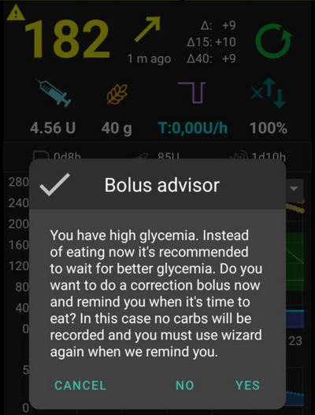

Quando abilitato, quando usi il calcolatore bolo mentre sei in iperglicemia, riceverai un avviso che ti chiede se vuoi fare un pre-bolo e mangiare più tardi, quando la tua **glicemia** torna nell'intervallo.

### Promemoria bolo abilitato

Impostazione nascosta in [modalità semplice](#preferences-simple-mode).

% todo

(Preferences-advanced-settings-overview)=
### Impostazioni avanzate (Panoramica)


#### Super bolo

Impostazione nascosta in [modalità semplice](#preferences-simple-mode).

Opzione per abilitare il superbolus nel calcolatore bolo.

Il [Super bolo](https://www.diabetesnet.com/diabetes-technology/blue-skying/super-bolus/) è un concetto per "prendere in prestito" un po' di insulina dalla basale nelle due ore successive per prevenire picchi. È diverso dal *super micro bolus*!

Usare con cautela e non abilitarlo fino a quando non si capisce cosa fa veramente. In sostanza, la basale per le successive due ore viene aggiunta al bolo e viene attivato uno zero-temp di due ore. **Le funzioni di loop di AAPS saranno disabilitate - usare con cautela! Se usi SMB, le funzioni di loop di **AAPS** saranno disabilitate in base alle tue impostazioni in ["Minuti massimi di basale per limitare SMB a"](#Open-APS-features-max-minutes-of-basal-to-limit-smb-to); se non usi SMB, le funzioni di loop saranno disabilitate per due ore.** I dettagli sul super bolo si trovano [qui](https://www.diabetesnet.com/diabetes-technology/blue-skying/super-bolus).

## Sicurezza dei trattamenti

(preferences-patient-type)=
### Tipo di paziente

- I limiti di sicurezza vengono impostati in base all'età che selezioni in questa impostazione.
- Se inizi a raggiungere questi limiti fissi (come il bolo massimo), è il momento di fare un passo avanti.
- È una cattiva idea selezionare un'età superiore a quella reale perché può portare a sovradosaggio inserendo il valore sbagliato nella finestra di dialogo dell'insulina (saltando il punto decimale, per esempio).
- Se vuoi conoscere i numeri effettivi per questi limiti di sicurezza codificati, scorri fino alla funzionalità dell'algoritmo che stai usando in [questa pagina](../DailyLifeWithAaps/KeyAapsFeatures.md).

### Bolo massimo consentito

- Definisce la quantità massima di insulina in bolo, in unità di insulina, che **AAPS** è autorizzato a erogare in una volta sola.
- Questa impostazione esiste come limite di sicurezza per prevenire l'erogazione di un bolo massiccio a causa di un inserimento accidentale o di un errore dell'utente.
- Si raccomanda di impostarlo su una quantità ragionevole che corrisponda approssimativamente alla quantità massima di insulina in bolo di cui potresti aver bisogno per un pasto o una dose di correzione.
- Questa restrizione si applica anche ai risultati del calcolatore bolo.

### Carboidrati massimi consentiti

- Definisce la quantità massima di carboidrati, in grammi, per cui il calcolatore bolo di **AAPS** è autorizzato a dosare.
- Questa impostazione esiste come limite di sicurezza per prevenire l'erogazione di un bolo massiccio a causa di un inserimento accidentale o di un errore dell'utente.
- Si raccomanda di impostarlo su una quantità ragionevole che corrisponda approssimativamente alla quantità massima di carboidrati di cui potresti aver bisogno per un pasto.

## Loop

A partire dalla [versione AAPS 3.4](#version3400), non è più possibile impostare la modalità loop qui. Vedi [Schermate AAPS > La schermata principale > Stato loop](#AapsScreens-loop-status) per cambiare la modalità loop ora.

(Preferences-minimal-request-change)=
### Modifica minima richiesta

Quando si usa il **Loop Aperto**, riceverai notifiche ogni volta che **AAPS** raccomanda di aggiustare il tasso basale. Per ridurre il numero di notifiche puoi usare un [intervallo target glicemia più ampio](#profile-glucose-targets) o aumentare la percentuale della modifica minima richiesta. Questo definisce la modifica relativa necessaria per attivare una notifica.

## Advanced Meal Assist (AMA) o Super Micro Bolus (SMB)

A seconda delle impostazioni in [Generatore di configurazione > APS](../SettingUpAaps/ConfigBuilder.md) puoi scegliere tra due algoritmi:

- [Advanced meal assist (OpenAPS AMA)](#Open-APS-features-advanced-meal-assist-ama) - stato dell'algoritmo nel 2017
- [Super Micro Bolus (OpenAPS SMB)](#Open-APS-features-super-micro-bolus-smb) - algoritmo più recente consigliato per i principianti

A partire dalla [**versione AAPS 3.3**](#version3300), la funzionalità [ISF Dinamico](../DailyLifeWithAaps/DynamicISF.md) è stata spostata come parte di OpenAPS SMB.

### OpenAPS AMA

Tutte le impostazioni per OpenAPS AMA sono descritte nella sezione dedicata in [Funzionalità chiave di AAPS > Advanced Meal Assist (AMA)](#Open-APS-features-advanced-meal-assist-ama).

(Preferences-openaps-smb-settings)=
### OpenAPS SMB

Tutte le impostazioni per OpenAPS SMB sono descritte nella sezione dedicata in [Funzionalità chiave di AAPS > Super Micro Bolus (SMB)](#Open-APS-features-super-micro-bolus-smb).

## Absorption settings

(Preferences-min_5m_carbimpact)=
### min_5m_carbimpact

Impostazione nascosta in [modalità semplice](#preferences-simple-mode).

L'algoritmo usa BGI (impatto sulla glicemia) per determinare quando i [carboidrati vengono assorbiti](../DailyLifeWithAaps/CobCalculation.md).

Nei momenti in cui l'assorbimento dei carboidrati non può essere calcolato dinamicamente in base alle reazioni del sangue, **AAPS** inserisce un decadimento predefinito per i tuoi carboidrati. In sostanza, è un meccanismo di sicurezza. Questo valore viene usato solo durante le lacune nelle letture del **CGM** o quando l'attività fisica "consuma" tutta la glicemia che altrimenti farebbe decadere il COB da parte di **AAPS**.

In parole semplici: L'algoritmo "sa" come dovrebbero *comportarsi* le glicemie quando sono influenzate dalla dose di insulina corrente ecc. Ogni volta che c'è una deviazione positiva dal comportamento previsto, alcuni carboidrati vengono assorbiti/decaduti. Ogni volta che c'è una deviazione positiva dal comportamento atteso, alcuni carboidrati vengono assorbiti/smaltiti. Grande cambiamento = molti carboidrati ecc.

Il min_5m_carbimpact definisce l'impatto predefinito sull'assorbimento dei carboidrati per 5 minuti. Per ulteriori dettagli vedi la [documentazione OpenAPS](https://openaps.readthedocs.io/en/latest/docs/While%20You%20Wait%20For%20Gear/preferences-and-safety-settings.html?highlight=carbimpact#min-5m-carbimpact).

Il valore standard per AMA è 5, per SMB è 8.

Il grafico COB nella schermata principale indica quando viene usato min_5m_impact mettendo un cerchio arancione in cima.

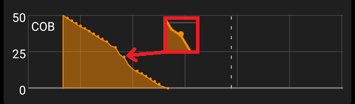

### Tempo massimo di assorbimento del pasto

Se mangi spesso pasti ad alto contenuto di grassi o proteine, dovrai aumentare il tempo di assorbimento del pasto.

### Impostazioni avanzate - rapporto autosens


- Definisci il rapporto minimo e massimo di [autosens](#Open-APS-features-autosens).
- Normalmente i valori standard (max. 1,2 e min. 0,7) non dovrebbero essere modificati.

## Pump

### BT Watchdog

Attiva BT watchdog se necessario (es. per i microinfusori Dana). Disattiva il Bluetooth per un secondo se non è possibile alcuna connessione al microinfusore. Questo può aiutare su alcuni telefoni dove lo stack Bluetooth si blocca.

## Pump settings

Le opzioni qui varieranno a seconda del driver del microinfusore selezionato in [Generatore di configurazione > Microinfusore](#Config-Builder-pump).  Accoppia e configura il tuo microinfusore secondo le [istruzioni relative al microinfusore](../Getting-Started/CompatiblePumps.md).

## Tidepool

Ulteriori informazioni sulla pagina dedicata [Tidepool](../SettingUpAaps/Tidepool.md).

(Preferences-nsclient)=
## NSClient

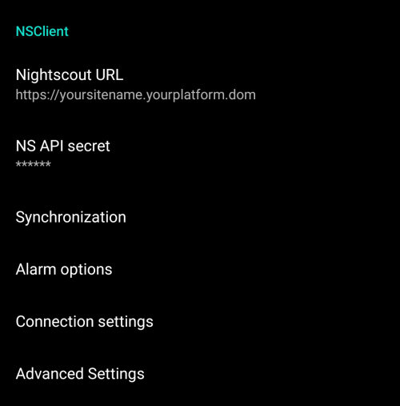

Protocollo di comunicazione originale, può essere usato con le versioni più vecchie di Nightscout.

- Imposta il tuo *URL Nightscout* (es. <https://nomesito.tuapiattaforma.dom>).
- **Assicurati che l'URL sia SENZA /api/v1/ alla fine.**
- Il *[segreto API](https://nightscout.github.io/nightscout/setup_variables/#api-secret-nightscout-password)* (una password di 12 caratteri registrata nelle variabili Nightscout).
- Ciò consente la lettura e la scrittura di dati tra il sito web Nightscout e **AAPS**.
- Controlla gli errori di battitura qui se sei bloccato nell'Obiettivo 1.

## NSClientV3


[Nuovo protocollo introdotto con AAPS 3.2.](#Important-comments-on-using-v3-versus-v1-API-for-Nightscout-with-AAPS) Più sicuro ed efficiente.

```{admonition} V3 data uploaders
:class: warning

Quando si usa NSClientV3, tutti i caricatori devono usare l'API V3. Poiché la maggior parte non è ancora compatibile, ciò significa **devi lasciare che **AAPS** carichi tutti i dati** (glicemia, trattamenti, ...) su Nightscout e disabilitare tutti gli altri caricatori se non sono conformi alla V3.
```

- Imposta il tuo *URL Nightscout* (es. <https://nomesito.tuapiattaforma.dom>).
- **Assicurati che l'URL sia SENZA /api/v1/ alla fine.**
- In Nightscout, crea un *[token Admin](https://nightscout.github.io/nightscout/security/#create-a-token)* (richiede [Nightscout 15](https://nightscout.github.io/update/update/) per usare l'API V3) e inseriscilo nel **token di accesso NS** (non il tuo segreto API!).
- Ciò consente la lettura e la scrittura di dati tra il sito web Nightscout e **AAPS**.
- Controlla gli errori di battitura qui se sei bloccato nell'Obiettivo 1.
- Lascia abilitata la connessione ai websocket (consigliato).

(Preferences-nsclient-synchronization)=
### Sincronizzazione


Le scelte di sincronizzazione dipenderanno dal modo in cui vuoi usare **AAPS**.

Puoi selezionare quali dati vuoi [caricare e scaricare su o da Nightscout](#Nightscout-aaps-settings).

### Alarm options

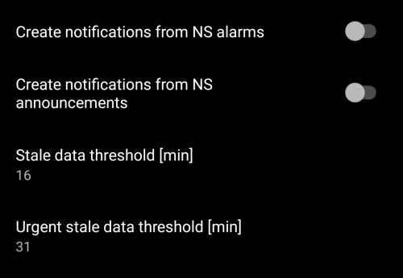

- Le opzioni di allarme ti permettono di selezionare quali allarmi Nightscout usare tramite l'app. **AAPS** suonerà un allarme quando un allarme Nightscout viene attivato.
- Per far suonare gli allarmi devi impostare i valori di allarme Urgente Alto, Alto, Basso e Urgente Basso nelle tue [variabili Nightscout](https://nightscout.github.io/nightscout/setup_variables/#alarms).
- Funzioneranno solo mentre hai una connessione a Nightscout e sono intesi per genitori/caregiver.
- Se hai la sorgente **CGM** sul tuo telefono (es. xDrip+ o BYODA), usa quegli allarmi invece degli allarmi Nightscout.
- Crea notifiche dagli [annunci](https://nightscout.github.io/nightscout/discover/#announcement) Nightscout replicherà gli annunci Nightscout nella barra delle notifiche di **AAPS**.
- Puoi modificare la soglia degli allarmi per dati obsoleti e dati urgentemente obsoleti quando non vengono ricevuti dati da Nightscout dopo un certo tempo.

### Impostazioni di connessione


- Le impostazioni di connessione definiscono quando la connessione Nightscout sarà abilitata.
- Limita il caricamento su Nightscout solo al Wi-Fi o anche a certi SSID Wi-Fi specifici.
- Se vuoi usare solo una rete Wi-Fi specifica puoi inserire il suo SSID Wi-Fi.
- Più SSID possono essere separati da punto e virgola.
- Per eliminare tutti gli SSID inserisci uno spazio vuoto nel campo.

(Preferences-advanced-settings-nsclient)=
### Impostazioni avanzate (NSClient)


Le opzioni nelle impostazioni avanzate sono autoesplicative.

## Comunicatore SMS

Ulteriori informazioni sulla pagina dedicata [Comandi SMS](../RemoteFeatures/SMSCommands.md).

## Automazione

Seleziona quale servizio di localizzazione usare:

- Usa localizzazione passiva: **AAPS** prende le posizioni solo se altre app le richiedono
- Usa localizzazione di rete: Posizione del tuo Wi-Fi
- Usa localizzazione GPS (Attenzione! Potrebbe causare un consumo eccessivo della batteria!)

## Local alerts

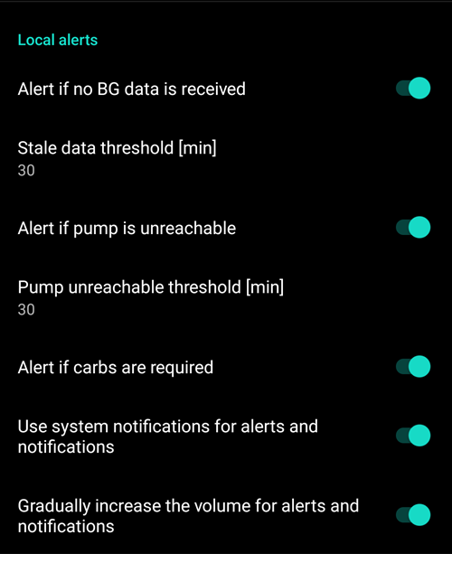

Le impostazioni sono autoesplicative.

(preferences-maintenance-settings)=
## Maintenance settings


**Destinatario email**: Il destinatario standard dei log è <logs@aaps.app>.

**Scelte dati**


Puoi aiutare a sviluppare ulteriormente **AAPS** inviando report di crash agli sviluppatori.

**Esportazioni impostazioni non presidiate**<br/> Abilitando questa funzione, consenti ad **AAPS** di eseguire esportazioni delle impostazioni senza l'intervento dell'utente. Per questo la password master viene archiviata in modo sicuro sul tuo telefono (solo) alla successiva esportazione manuale. La password archiviata verrà usata per un massimo di 4 settimane. Dopo 4 settimane riceverai una notifica che la password sta per scadere. Durante un periodo di grazia di 1 settimana, la password può essere aggiornata eseguendo manualmente l'esportazione delle impostazioni dal menu di manutenzione.

Dopo che il periodo di grazia di 1 settimana è scaduto, la password archiviata scade e qualsiasi esportazione automatica delle impostazioni verrà interrotta mentre viene notificato l'utente, chiedendo di reinserire la password.  Le [(**esportazioni automatiche delle impostazioni**)](../DailyLifeWithAaps/Automations.md#automating-preference-settings-export) verranno registrate negli elenchi 'Careportal' e 'Inserimento utente' di **AAPS** in Trattamenti.

Dopo aver abilitato questa opzione, assicurati di eseguire un'esportazione manuale delle impostazioni, dove ti verrà chiesta la password, in modo che **AAPS** possa archiviarla.

### File di log

AAPS salverà i log per la risoluzione dei problemi.

Non disabilitare questa funzione: aiuterà a capire le ragioni se qualcosa va storto.

Se hai bisogno di inviare i log agli sviluppatori, assicurati di compilare accuratamente il contenuto della mail per descrivere il problema. È preferibile inviare i log solo dopo essere stati invitati a farlo, in seguito a un [segnalazione di problema in GitHub](https://github.com/nightscout/AndroidAPS/issues).

Puoi trovare i log di AAPS nella memoria del telefono -> Android -> data -> info.nightscout.androidaps -> files.


(preferences-maintenance-logdirectory)=

### Impostazione della directory locale AAPS

This setting allows the user to choose a directory on their phone where **AAPS** will store preferences, logs, and other files. Maintenance settings also include the **AAPS** directory, which can be found directly under the Maintenance tab.


Si raccomanda vivamente di usare una directory direttamente nella voce principale della memoria del telefono. Il valore predefinito è AAPS.

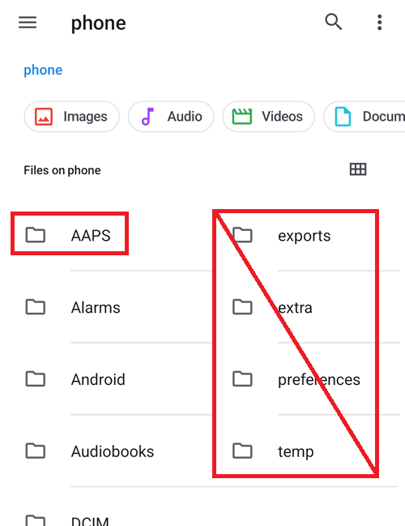

Se selezioni una sottodirectory di AAPS, vedrai un messaggio di errore. Tocca "OK" e riprova, selezionando la directory corretta (quella superiore). Non selezionare "IGNORA" a meno che tu non sappia chiaramente cosa stai facendo.

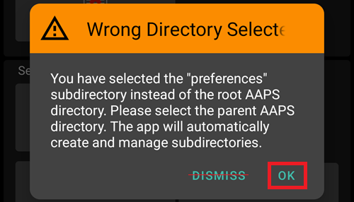

(preferences-maintenance-cloud)=

### Impostazione di una directory cloud

Puoi esportare le impostazioni, i log e i dati CSV su un servizio cloud.

1.  Seleziona Directory cloud
2. Seleziona il tuo servizio cloud
3. Abilita esportazione cloud

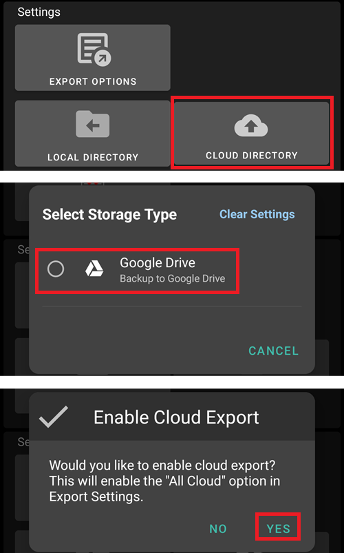

Puoi quindi definire quali dati verranno caricati nel cloud.


Puoi disabilitare l'esportazione cloud.

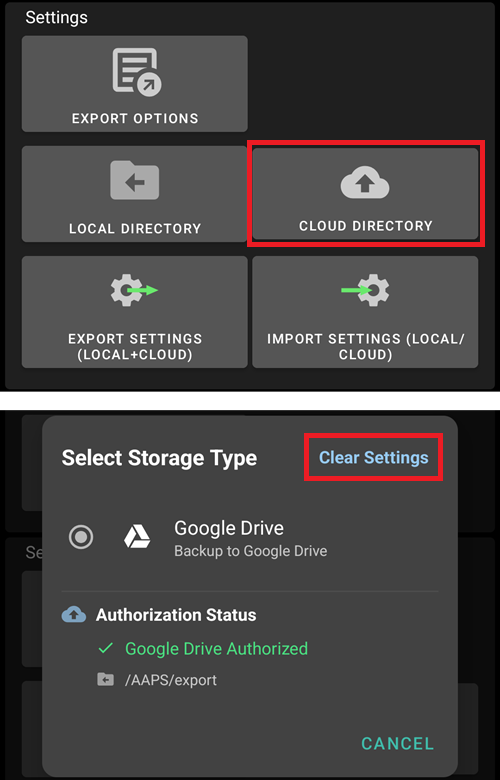

## Open Humans

Puoi aiutare la community donando i tuoi dati ai progetti di ricerca! I dettagli sono descritti nella [pagina Open Humans](../SupportingAaps/OpenHumans.md).

Nelle Preferenze, puoi definire quando i dati devono essere caricati
- solo se connesso al Wi-Fi
- solo se in carica
