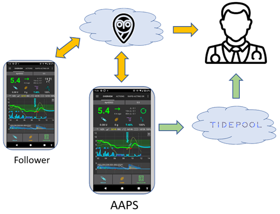

# Configurare il server di reportistica

Attualmente sono disponibili due server di reportistica per l'uso con **AAPS**:

- [Nightscout](https://nightscout.github.io/)
- [Tidepool](https://www.tidepool.org/)



Si raccomanda di usare Nightscout.

(SettingUpTheReportingServer-nightscout)=
## Nightscout

Nightscout è un'applicazione web che può registrare e visualizzare i dati del CGM e i dati di **AAPS** e crea report. È una piattaforma potente che è stata integrata in **AAPS** per molti anni. Consente agli utenti e ai caregiver di monitorare i dati sul diabete del paziente quasi in tempo reale (possono passare solo pochi secondi tra la ricezione dei dati e la loro disponibilità se c'è una connessione Internet sufficiente tra tutti i componenti coinvolti). Permette anche ai caregiver di inviare comandi remoti ad **AAPS**.

Nightscout è fornito come software open-source. Chiunque può creare e gestire un server Nightscout, utilizzando servizi gratuiti o a pagamento.

Ulteriori informazioni sono disponibili sul [sito web del progetto Nightscout](http://nightscout.github.io/).

### Opzione 1 - Configura il tuo server Nightscout da solo

La creazione del server di reportistica Nightscout può richiedere una o più applicazioni web-based che richiedono manutenzione. In order to have a completely free service, you may need to migrate your Nightscout site and data, if and when providers remove the free tier.

Una descrizione di come puoi configurare Nightscout con i vantaggi e gli svantaggi delle varie opzioni operative, inclusa una stima dei costi, può essere trovata [qui](https://nightscout.github.io/nightscout/new_user/#free-diy).

### Opzione 2 - Paga per un servizio Nightscout ospitato

Esistono anche opzioni da diversi provider che ospitano Nightscout per te, con una tariffa mensile. I costi sono gestibili e il vantaggio di un'opzione ospitata è che non è necessario essere esperti di IT o avere un'infrastruttura operativa.


Gli utenti Nightscout esistenti possono riconsiderare di tanto in tanto dove e come è ospitato il loro server Nightscout e passare a un'opzione diversa se diventa più adatta.

Alcuni servizi Nightscout ospitati sono elencati [qui](https://nightscout.github.io/nightscout/new_user/#vendors-comparison-table).

### Ulteriore configurazione di Nightscout

Una volta che la tua istanza Nightscout è attiva e funzionante, consulta la [pagina di configurazione Nightscout](../SettingUpAaps/Nightscout.md) per ulteriori considerazioni.

(SettingUpTheReportingServer-tidepool)=
## Tidepool

Tidepool è disponibile in **AAPS** solo dalla versione 3.2, rilasciata alla fine del 2023.

```{admonition} Tidepool with **AAPS** is only for reporting
:class: danger  
Poiché c'è un ritardo di tre ore tra l'acquisizione dei dati e la loro reportistica quando si usa **AAPS**, Tidepool non è adatto per condividere informazioni in tempo reale con i caregiver.  
D'altra parte, Tidepool può essere un'ottima soluzione per condividere report con l'endocrinologo del paziente se Nightscout non è una soluzione accettata.  
```

Tidepool è un progetto [open source](https://github.com/tidepool-org). Offre la possibilità di creare un account gratuito sui server Tidepool.

Ulteriori informazioni sulla configurazione di Tidepool con AAPS [qui](../SettingUpAaps/Tidepool.md).

```{admonition} **AAPS** has a the uploader for Tidepool integrated
:class: note
**Non** è necessario usare l'app uploader per Tidepool: **AAPS** caricherà glicemia, trattamenti e basale per te. È sufficiente avere un account personale con Tidepool. Non caricare i tuoi dati con lo strumento uploader Tidepool separato poiché questo porterà a valori duplicati.  
```

## Passo successivo

Una volta configurato il server di reportistica, puoi ora configurare un [account Google dedicato per l'uso con AAPS](../UsefulLinks/DedicatedGoogleAccountForAaps.md), oppure passare direttamente alla [costruzione dell'app AAPS](../SettingUpAaps/BuildingAaps.md). 