# Procedura guidata di configurazione AAPS

Quando avvii **AAPS** per la prima volta, sei guidato dalla "**Procedura guidata di configurazione**", per configurare rapidamente tutte le configurazioni di base della tua app in una volta sola. La **Procedura guidata di configurazione** ti guida, per evitare di dimenticare qualcosa di cruciale. Ad esempio, le **impostazioni dei permessi** sono fondamentali per configurare **AAPS** correttamente.

Tuttavia, non è obbligatorio avere tutto completamente configurato alla prima esecuzione della **Procedura guidata di configurazione** e puoi facilmente uscire dalla Procedura guidata e tornarci in seguito. Ci sono tre percorsi disponibili dopo la **Procedura guidata di configurazione** per ottimizzare/modificare ulteriormente la configurazione. Questi verranno spiegati nella prossima sezione. Quindi, va bene saltare alcuni punti nella Procedura guidata di configurazione, puoi facilmente configurarli in seguito.

Durante, e subito dopo l'uso della **Procedura guidata di configurazione**, potresti non notare cambiamenti osservabili significativi in **AAPS**. Per abilitare il tuo loop **AAPS**, devi seguire gli **Obiettivi** per abilitare funzionalità dopo funzionalità. Inizierai l'**Obiettivo 1** alla fine della Procedura guidata di configurazione. Sei tu il padrone di **AAPS**, non il contrario.

```{admonition} Preview Objectives
:class: note
Se sei curioso di conoscere la struttura degli obiettivi, leggi [Completare gli obiettivi](../SettingUpAaps/CompletingTheObjectives.md) ma poi torna qui per eseguire prima la Procedura guidata di configurazione.

```

Dall'esperienza precedente, siamo consapevoli che i nuovi utenti spesso si mettono sotto pressione per configurare **AAPS** il più velocemente possibile, il che può portare a frustrazione poiché si tratta di una grande curva di apprendimento.

Quindi, prenditi il tuo tempo per configurare il tuo loop; i vantaggi di un loop **AAPS** ben funzionante sono enormi.

```{admonition} Ask for Help
:class: note
Se c'è un errore nella documentazione o hai un'idea migliore su come spiegare qualcosa, puoi chiedere aiuto alla community come spiegato in [Connettiti con altri utenti](../GettingHelp/WhereCanIGetHelp.md).
```
## Messaggio di benvenuto

Questo è solo il messaggio di benvenuto che puoi saltare con il pulsante "AVANTI":


## Accordo di licenza

Nell'accordo di licenza per l'utente finale ci sono informazioni importanti sugli aspetti legali dell'utilizzo di **AAPS**. Leggilo attentamente.

Se non capisci o non puoi accettare il contratto di licenza per l'utente finale, non utilizzare **AAPS**!

Se capisci e accetti, clicca il pulsante "COMPRENDO E ACCETTO" e segui la Procedura guidata di configurazione:


## Permessi richiesti

**AAPS** ha bisogno di alcuni requisiti per funzionare correttamente.

Nella schermata seguente ti vengono poste diverse domande alle quali devi acconsentire per far funzionare **AAPS**. La Procedura guidata stessa spiega perché richiede l'impostazione pertinente.

In questa schermata, cerchiamo di fornire alcune informazioni aggiuntive di sfondo, tradurre il linguaggio più tecnico in linguaggio comune o spiegare il motivo. Continua a leggere di seguito per vedere ogni richiesta di autorizzazione.


### Notifications

Android richiede un'autorizzazione speciale per le app se vogliono inviarti notifiche.

Sebbene sia una buona funzionalità disabilitare le notifiche _es._ dalle app di social media, è essenziale che tu consenta ad **AAPS** di inviarti notifiche.

Clicca il primo pulsante "RICHIEDI AUTORIZZAZIONE":

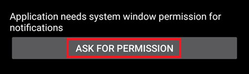

Seleziona l'app "AAPS":

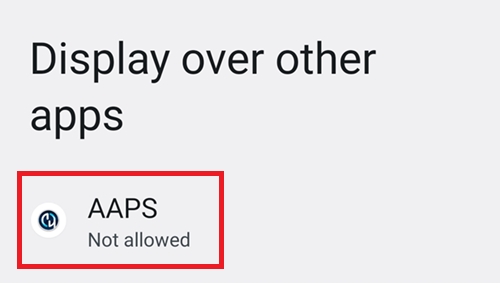

Abilita "Consenti la visualizzazione sopra altre app" spostando il cursore a destra:

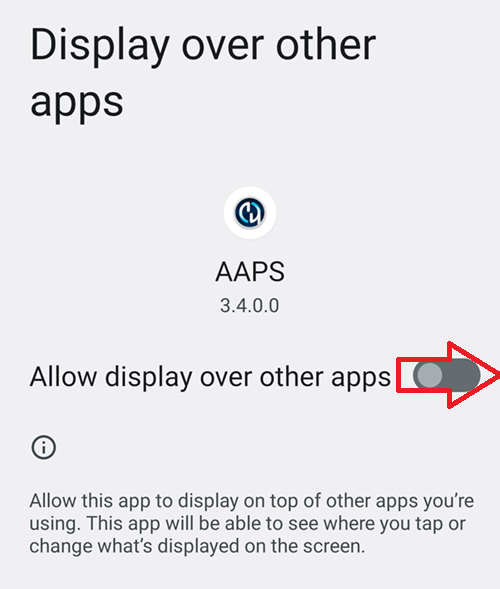

Il cursore dovrebbe apparire così se è abilitato:

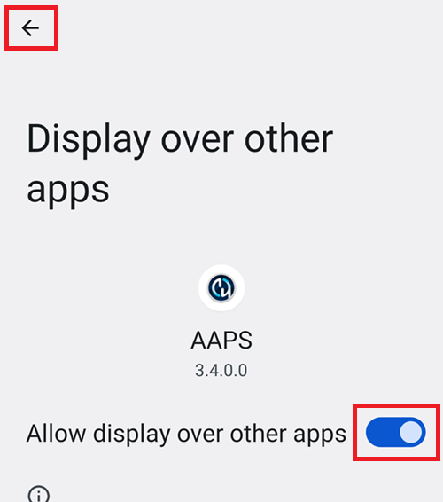

### Ottimizzazione batteria

Il consumo della batteria sugli smartphone è una considerazione importante, poiché le prestazioni delle batterie sono ancora piuttosto limitate. Pertanto, il sistema operativo Android sul tuo smartphone è restrittivo nell'autorizzare le applicazioni a girare e consumare tempo CPU, e quindi energia della batteria.

Tuttavia, **AAPS** deve girare regolarmente, _es._ per ricevere le letture del glucosio ogni pochi minuti e poi applicare l'algoritmo per decidere come gestire i tuoi livelli di glucosio, in base alle tue specifiche. Pertanto deve essere autorizzato a farlo da Android.

Lo fai confermando l'impostazione.

Clicca il secondo pulsante "RICHIEDI AUTORIZZAZIONE".


Seleziona "Consenti":


(setup-wizard-bluetooth-battery-optimisation)=
### Ottimizzazione batteria Bluetooth

Le versioni più recenti di Android hanno aggiunto l'ottimizzazione della batteria anche all'applicazione di sistema Bluetooth.

Oltre a disabilitare l'ottimizzazione della batteria per **AAPS**, probabilmente dovrai disabilitarla anche per l'app di sistema Bluetooth. La mancata esecuzione di ciò può portare a cadute della connessione al microinfusore e problemi.

***NOTA: La documentazione xDrip spiega come farlo qui: [documentazione xDrip](https://navid200.github.io/xDrip/docs/BluetoothBatteryOpt.html)***

Segui questi passaggi su Android 16; le altre versioni varieranno leggermente dagli screenshot forniti:

1. Apri le impostazioni Android e cerca **App**, e apri le impostazioni App.

   

2. Vedrai le impostazioni App, ma dobbiamo espandere per vedere tutte le app; clicca su **Vedi tutte le app** per espandere.

   

3. Poiché l'app Bluetooth è un'app di sistema, è nascosta per impostazione predefinita; dobbiamo mostrare le app di sistema. Clicca sui **tre punti (hamburger)** in alto a sinistra (1). Poi clicca su **Mostra sistema** (2).

   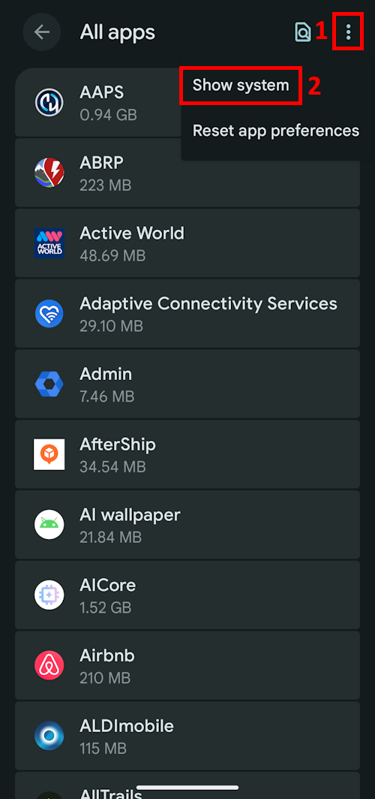

4. Cerca l'app `Bluetooth` e clicca su `Bluetooth` e/o `Legacy Bluetooth`; se entrambe sono presenti, assicurati di seguire la procedura per entrambe.

   ***NOTA: È sicuro ignorare il `Bluetooth MIDI Service`; non viene usato da AAPS***

           

   1. Su Android 12 clicca su `Batteria`, Android 13+ clicca su `Utilizzo batteria app`,

   )   

5. Su Android 12+ seleziona l'opzione `Senza restrizioni`; su Android 15+ devi espandere l'impostazione `Consenti utilizzo in background`; clicca sulla sezione evidenziata in rosso per farlo, poi segui il passaggio 6 per completare.

       

6. Su Android 16 seleziona `Senza restrizioni`

   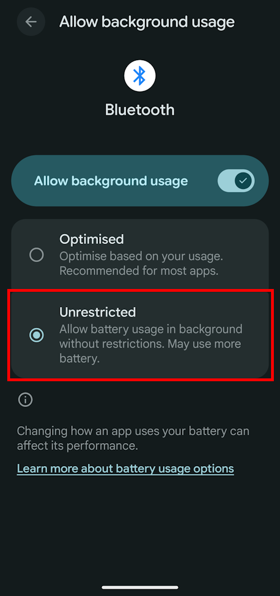

(SetupWizard-StoragePermission)=

### Permesso di archiviazione

**AAPS** ha bisogno di registrare informazioni nell'archiviazione permanente del tuo smartphone. L'archiviazione permanente significa che sarà disponibile anche dopo il riavvio del tuo smartphone. Altre informazioni vengono semplicemente perse, poiché non vengono salvate nell'archiviazione permanente.

Clicca il primo pulsante "RICHIEDI AUTORIZZAZIONE":

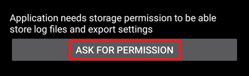

Clicca "Consenti":

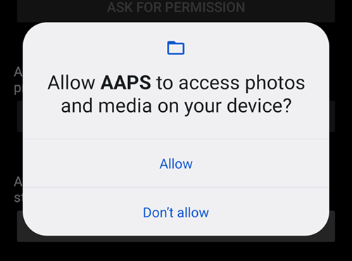

Clicca "Directory AAPS". Questo apre il filesystem sul tuo telefono e ti permette di scegliere dove vuoi che AAPS memorizzi le sue informazioni.


```{tip}
Si consiglia di scegliere la directory AAPS predefinita.</br>
**Non** selezionare una sottodirectory di AAPS.
```

La directory predefinita è **AAPS**, ma puoi usare qualsiasi directory dedicata che preferisci. Crea la directory se necessario, entra in essa e scegli "Usa questa cartella":


Conferma di voler concedere ad **AAPS** l'accesso alla directory selezionata:

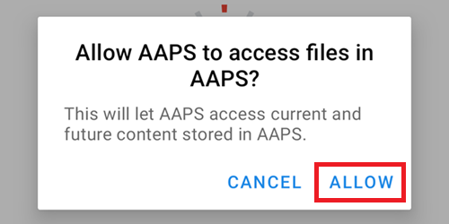

Clicca il pulsante "AVANTI":

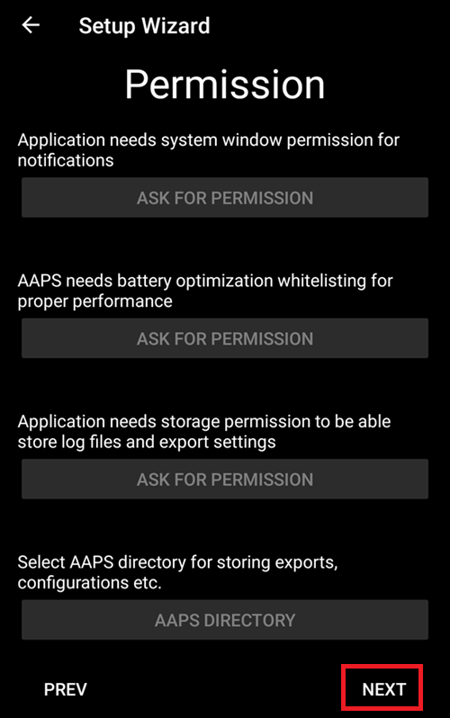

### Location

Android collega l'uso della comunicazione Bluetooth alla capacità di usare i servizi di localizzazione. Forse l'hai visto anche con altre app. È comune dover richiedere il permesso di localizzazione se vuoi accedere al Bluetooth.

**AAPS** usa il Bluetooth per comunicare con il tuo CGM e il microinfusore di insulina se sono direttamente controllati da **AAPS** e non da un'altra app usata da **AAPS**. I dettagli possono variare da configurazione a configurazione.

Clicca il primo pulsante "RICHIEDI AUTORIZZAZIONE":

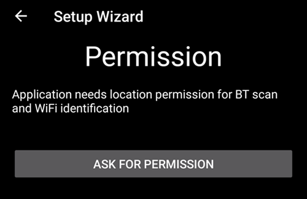

Questo è importante. Altrimenti **AAPS** non può funzionare correttamente.

Clicca "Durante l'utilizzo dell'app":

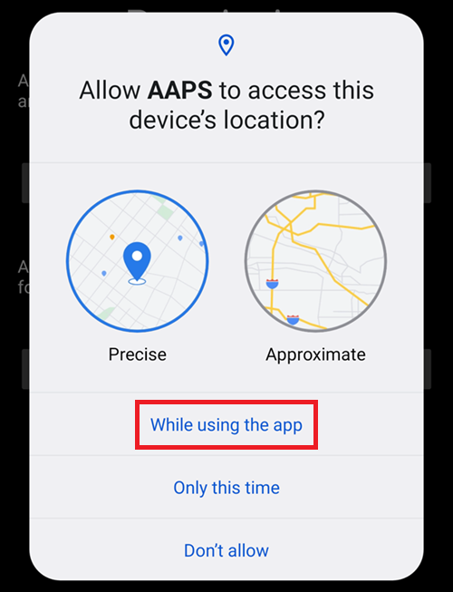

Clicca il secondo pulsante "RICHIEDI AUTORIZZAZIONE":

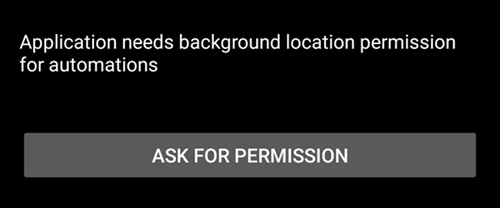

Seleziona "Consenti sempre".


Clicca il pulsante "AVANTI":

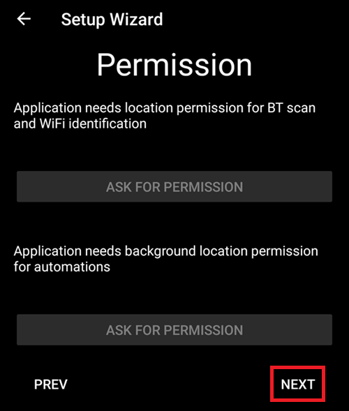

## Password master

Poiché la configurazione di **AAPS** contiene alcuni dati sensibili (_es._ API_KEY per accedere al tuo server Nightscout), è criptata da una password che puoi impostare qui.

La seconda frase è molto importante, **NON PERDERE LA TUA PASSWORD MASTER**. Annotala _es._ su Google Drive. Google Drive è un buon posto in quanto viene eseguito il backup da Google per te. Il tuo smartphone o PC potrebbe subire un crash e potresti non avere una copia effettiva. Se dimentichi la tua Password Master, può essere difficile recuperare la configurazione del profilo e i progressi attraverso gli **Obiettivi** in un secondo momento.

Dopo aver inserito la password due volte, clicca il pulsante "AVANTI":

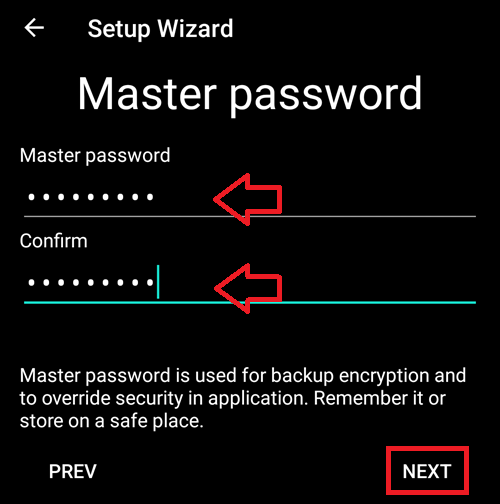

### Importa impostazioni

```{tip}
Importa il tuo ultimo file di impostazioni se presente.</br>
Puoi farlo anche dopo aver completato la procedura guidata.</br>
Se li hai già pronti, importarli ora sarà più veloce che ricreare il profilo.
```

Se la tua directory AAPS corrente contiene impostazioni, ti verrà chiesto se vuoi importarle.

Questo accadrà solo se hai disinstallato e reinstallato AAPS sullo stesso telefono.

Tocca AVANTI se non vuoi ripristinarle ora.

Tocca RIPRISTINA IMPOSTAZIONI per selezionare quale file ripristinare, poi AVANTI.


## Unità (mg/dL <-> mmol/L)

Seleziona se i tuoi valori di glucosio sono in mg/dL o mmol/L, poi clicca il pulsante "AVANTI":

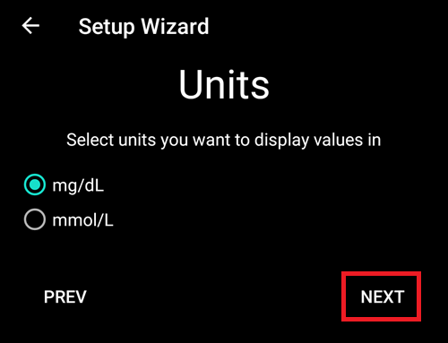

## Impostazioni di visualizzazione

 Qui selezioni l'intervallo per la visualizzazione del glucosio del sensore, che verrà mostrato come "nell'intervallo" tra i valori che hai impostato. Puoi lasciarlo ai valori predefiniti per ora e modificarlo in seguito.

I valori scelti riguardano solo la presentazione grafica del diagramma, e nient'altro.

Il tuo target di glucosio _es._ è configurato separatamente nel tuo profilo.

Il tuo intervallo per analizzare il TIR (tempo nell'intervallo) è configurato separatamente nel tuo server di reportistica.

Premi il pulsante "AVANTI":

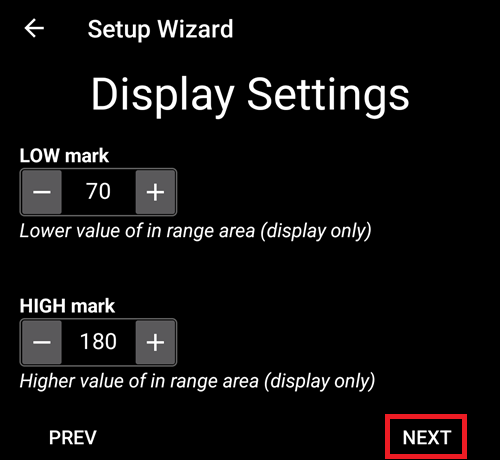

(SetupWizard-synchronization-with-the-reporting-server-and-more)=
## Sincronizzazione con il server di reportistica e altro

Qui stai configurando il caricamento dei dati sul tuo server di reportistica.

Puoi fare anche altre configurazioni qui, ma per la prima esecuzione ci concentreremo solo sul server di reportistica.

Se non riesci a configurarlo al momento, saltalo per ora. Puoi configurarlo in seguito.

Se selezioni un elemento qui nella casella di spunta a sinistra, a destra puoi poi spuntare la casella di visibilità (occhio), che posizionerà questo plugin nel menu superiore nella schermata principale di **AAPS**. Seleziona anche la visibilità se configuri il tuo server di reportistica a questo punto.

In questo esempio selezioniamo Nightscout come server di reportistica e lo configureremo.

```{admonition}  **NSClient** version
:class: Note

Clicca [qui](#version3200) per le note di rilascio di **AAPS** 3.2.0.0 che spiegano le differenze tra l'opzione superiore **NSClient** (questa è "v1", anche se non è esplicitamente etichettata) e la seconda opzione, **NSClient v3**.
```
Per Tidepool è ancora più semplice, poiché hai bisogno solo delle informazioni di accesso personali.

Dopo aver effettuato la selezione, premi il pulsante ingranaggio accanto all'elemento selezionato:


Qui stai configurando il server di reportistica Nightscout.

Clicca su "URL Nightscout":


Inserisci il tuo URL Nightscout che è il tuo server Nightscout personale. È solo un URL che hai configurato tu stesso, o che ti è stato fornito dal tuo provider di servizi per Nightscout.

Clicca il pulsante "OK":


Inserisci il tuo token di accesso Nightscout. Questo è il token di accesso per il tuo server Nightscout che hai configurato. Senza questo token, l'accesso non funzionerà.

Se non lo hai al momento, consulta la documentazione per la configurazione del server di reportistica nella documentazione di **AAPS**.

Dopo aver inserito il "**token di accesso Nightscout**" e cliccato "OK", clicca sul pulsante "Sincronizzazione":

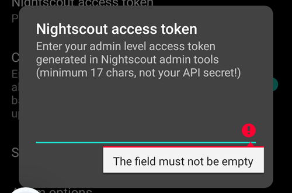

Seleziona "Carica dati su NS" se hai già configurato Nightscout nei passaggi precedenti della Procedura guidata di configurazione.

Se hai profili memorizzati su Nightscout e vuoi scaricarli in **AAPS**, abilita "Ricevi archivio profili":

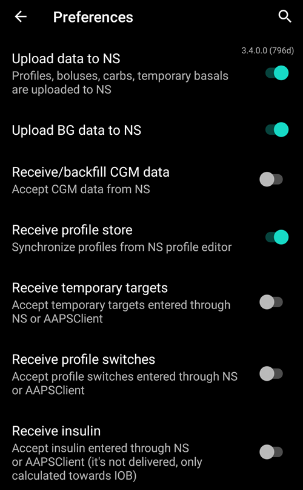


Torna alla schermata precedente e seleziona "Opzione allarme":


Per ora, lascia i pulsanti disabilitati. Abbiamo visitato questa schermata solo per farti conoscere le possibili opzioni che potresti configurare in futuro. Al momento non è necessario farlo.

Torna alla schermata precedente e seleziona "Impostazioni di connessione".

Qui puoi configurare come trasferire i tuoi dati al server di reportistica.

I caregiver devono abilitare "usa connessione cellulare" altrimenti lo smartphone che serve al dipendente/bambino non può caricare dati fuori dall'area Wi-Fi _es._ mentre va a scuola.

Gli altri utenti di **AAPS** possono disabilitare il trasferimento tramite connessione cellulare se vogliono risparmiare dati o batteria.

In caso di dubbio, lascia tutto abilitato.

Torna alla schermata precedente e seleziona "Impostazioni avanzate".

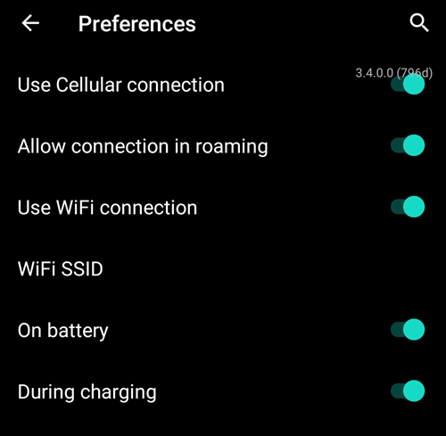

Abilita "Registra avvio app su NS" se vuoi ottenere questa informazione nel server di reportistica. Può aiutarti a sapere da remoto se e quando l'app è stata riavviata, particolarmente utile come caregiver.

Potrebbe essere interessante vedere se **AAPS** è ora configurato correttamente, ma in seguito di solito non è così importante essere in grado di vedere **AAPS** che si ferma o si avvia in Nightscout.

Abilita "Crea annunci dagli errori" e "Crea annunci dagli avvisi carboidrati richiesti".

Lascia "Rallenta caricamenti" disabilitato. Lo utilizzeresti solo in circostanze insolite, ad esempio se devono essere trasferite molte informazioni al server Nightscout e il server Nightscout è lento nell'elaborare questi dati.

Torna due volte, all'elenco dei plugin e seleziona "AVANTI" per andare alla schermata successiva:

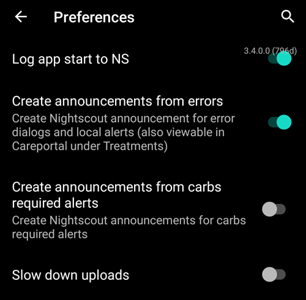

## Nome paziente

Qui puoi impostare il tuo nome in **AAPS**.

Può essere qualsiasi cosa. Serve solo per differenziare gli utenti.

Per semplicità inserisci solo nome e cognome.

Premi "AVANTI" per andare alla schermata successiva.


## Tipo di paziente

Qui selezioni il tuo "Tipo di paziente" che è importante, poiché il software **AAPS** ha limiti diversi, a seconda dell'età del paziente. Questo è importante per ragioni di sicurezza.

Qui è anche dove configuri il **bolo massimo consentito** per un pasto. Cioè, il bolo più grande che devi somministrare per coprire i tuoi pasti tipici. È una funzionalità di sicurezza che aiuta a evitare un sovradosaggio accidentale quando fai il bolo per i pasti.

Il secondo limite è simile nel concetto, ma riguarda l'apporto massimo di carboidrati previsto.

Dopo aver impostato questi valori, premi "AVANTI" per andare alla schermata successiva:


## Insulina usata

Seleziona il tipo di insulina usata nel microinfusore.

I nomi dell'insulina dovrebbero essere autoesplicativi.

```{admonition} Don't use the "Free-Peak Oref" unless you know what you are doing
:class: danger
Per gli utenti avanzati o per studi medici esiste la possibilità di definire con "Free-Peak Oref" un profilo personalizzato di come agisce l'insulina. Non utilizzarlo a meno che tu non sia un esperto; di solito i valori predefiniti funzionano bene per ogni insulina di marca.
```

Premi "AVANTI" per andare alla schermata successiva:


## Sorgente della glicemia

Seleziona la sorgente di glicemia che stai usando. Leggi la documentazione per la tua [sorgente glicemia](../Getting-Started/CompatiblesCgms.md).

Poiché sono disponibili diverse opzioni, non spieghiamo la configurazione per tutte qui. Stiamo usando xDrip+ nel nostro esempio:


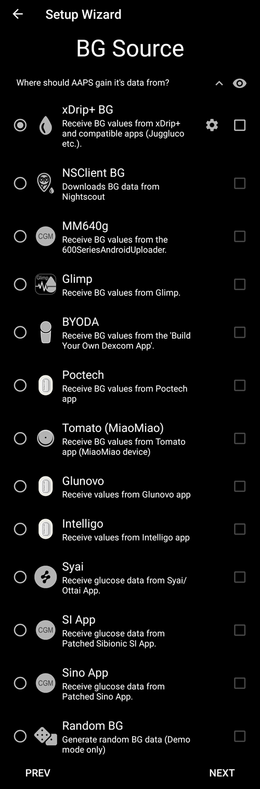


Abilita la visibilità nel menu di primo livello cliccando la casella di controllo sul lato destro.

Dopo aver effettuato la selezione, premi "AVANTI" per andare alla schermata successiva:

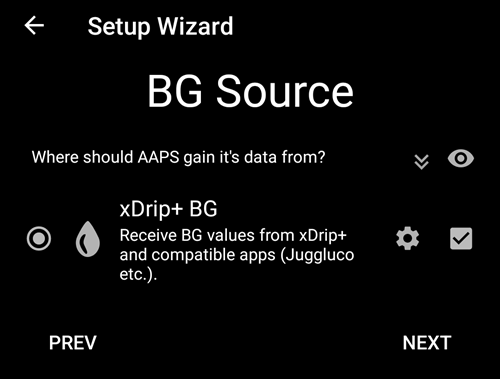


Clicca sul pulsante ingranaggio per accedere alle impostazioni.

Abilita "Carica dati glicemia su NS" e "Registra cambio sensore su NS".

Torna indietro e premi "AVANTI" per andare alla schermata successiva:

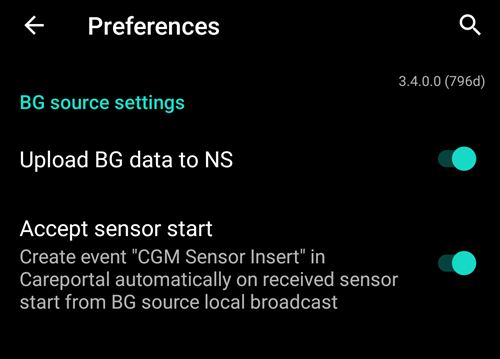

(setup-wizard-profile)=
## Profilo

Ora stiamo entrando in una parte molto importante della Procedura guidata di configurazione.

Leggi la documentazione sui [profili](../SettingUpAaps/YourAapsProfile.md) prima di provare a inserire i dettagli del tuo profilo nella schermata seguente.

```{admonition} Working profile required - no exceptions here !
:class: danger
Un profilo accurato è necessario per controllare l'azione sicura di **AAPS**.

È necessario che tu abbia determinato e discusso il tuo profilo con il tuo medico, e che sia stato dimostrato funzionante da test di successo del tasso basale, ISF e IC!

Se un robot ha un input errato, fallirà - costantemente. **AAPS** può funzionare solo con le informazioni che gli vengono fornite. Se il tuo profilo è troppo forte, rischi l'ipoglicemia; se è troppo debole, rischi l'iperglicemia. 
```

Premi "AVANTI" per andare alla schermata successiva. Inserisci un "nome profilo":


Se necessario, puoi avere diversi profili a lungo termine. Ne creiamo solo uno qui.

```{admonition} Profile only for tutorial - not for your usage
:class: information
Il profilo di esempio qui serve solo per mostrare come inserire i dati.

Non è inteso come profilo accurato o qualcosa di molto ottimizzato, perché le esigenze di ogni persona sono così diverse.

Non usarlo per fare effettivamente il loop!
```

Inserisci la tua [Durata dell'azione insulinica (DIA)](#your-aaps-profile-duration-of-insulin-action) in ore. Poi premi "IC":

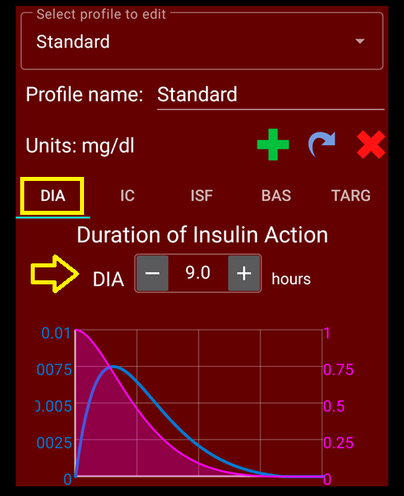

Inserisci i tuoi valori [IC](#your-aaps-profile-insulin-to-carbs-ratio):

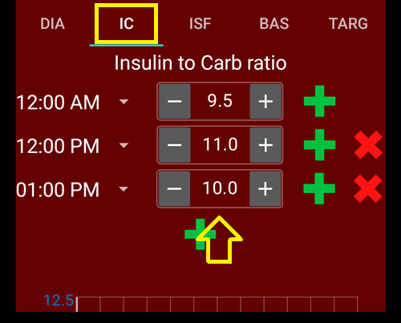

Premi "ISF". Inserisci i tuoi [valori ISF](#your-aaps-profile-insulin-sensitivity-factor):


Premi "BAS". Inserisci i tuoi [valori basali](#your-aaps-profile-basal-rates):


Premi "TARGET". Inserisci i tuoi valori target di glicemia.

Per il loop aperto questo target può essere un intervallo più ampio, altrimenti **AAPS** ti notifica in modo permanente di cambiare il tasso basale temporaneo o un'altra impostazione, il che può essere estenuante.

In seguito, per il loop chiuso, di solito avrai un solo valore per alto e basso. Ciò rende più facile per **AAPS** raggiungere il target e darti un migliore controllo complessivo del diabete.

Inserisci/conferma i valori target:

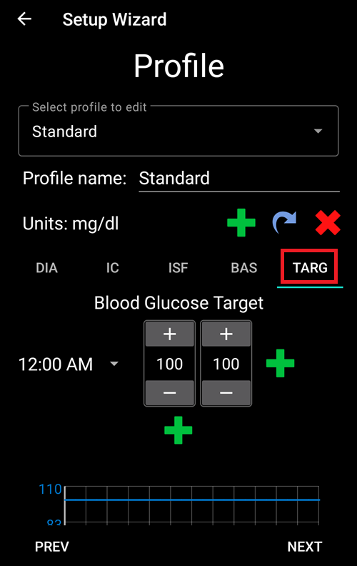

Salva il profilo cliccando su "SALVA":


Dopo il salvataggio, appare un nuovo pulsante "Attiva profilo".

```{admonition} Several defined but only one active profile
:class: information
Puoi avere diversi profili definiti, ma solo un profilo attivato in esecuzione in qualsiasi momento.
```

Premi "Attiva profilo":


Il dialogo del cambio profilo appare. In questo caso lascialo come preimpostato.

```{admonition} Several defined but only one active profile
:class: information
Imparerai in seguito come usare questo dialogo generale per gestire situazioni come malattia o sport, in cui devi cambiare il tuo profilo in modo appropriato alle circostanze.
```


Premi "OK":


Appare un dialogo di conferma per il cambio profilo.

Puoi confermarlo premendo "OK". Premi "AVANTI" per andare alla schermata successiva:


Il tuo profilo è stato ora impostato:


## Microinfusore di insulina


Ora stai selezionando il tuo microinfusore di insulina.

Ricevi un importante dialogo di avviso. Leggilo e premi "OK".

Se hai già configurato il tuo profilo nei passaggi precedenti e sai come connettere il tuo microinfusore, sentiti libero di connetterlo ora.

Altrimenti, esci dalla Procedura guidata di configurazione, usando la freccia nell'angolo in alto a sinistra e lascia che **AAPS** ti mostri prima alcuni valori di glicemia. Puoi tornare in qualsiasi momento o usare una delle opzioni di configurazione diretta (senza usare la Procedura guidata).

Leggi la documentazione per il tuo [microinfusore](../Getting-Started/CompatiblePumps.md).

Premi "AVANTI" per andare alla schermata successiva.

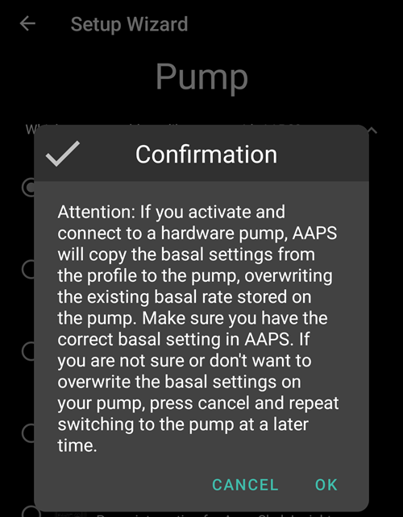

Una volta selezionato un microinfusore che richiede ad AAPS di usare il Bluetooth, vedrai un avviso: AAPS richiede il permesso Bluetooth. Questo verrà gestito dopo aver completato la Procedura guidata.


In questo esempio selezioniamo "Microinfusore virtuale".

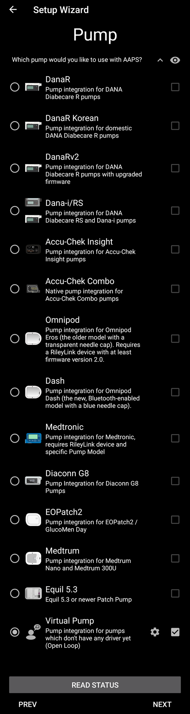

## Algoritmo APS

Use the OpenAPS SMB algorithm as your APS algorithm. OpenAPS SMB is newer and in general better compared to the OpenAPS AMA anyway. Despite the name the SMB feature of the algorithm is disabled until you are familiar with AAPS and already worked through the first objectives.

Il motivo per cui SMB è disabilitato all'inizio è che la funzionalità SMB consente una reazione più rapida all'aumento della glicemia attraverso il Super Micro Bolus invece di aumentare la percentuale del tasso basale. Poiché all'inizio il tuo profilo non è generalmente così buono come dopo un po' di esperienza, la funzionalità è disabilitata all'inizio.

```{admonition} Only use the older algorithm **OpenAPS AMA** if you know what you are doing
:class: information
OpenAPS AMA è l'algoritmo più basilare che non supporta i micro bolus per correggere i valori alti. Potrebbero esserci circostanze in cui è meglio usare questo algoritmo ma non è la raccomandazione.
```

Premi l'ingranaggio per vedere i dettagli:


Leggi solo il testo e non cambiare nulla qui.

A causa delle limitazioni imposte dagli **Obiettivi**, non puoi comunque usare né il "loop chiuso" né le "funzionalità SMB" al momento.

Torna indietro e premi "AVANTI" per andare alla schermata successiva:


## Rilevamento sensibilità

Lascia "Sensitivity Oref1" come standard per i plugin di sensibilità selezionati.

Premi "AVANTI" per andare alla schermata successiva:

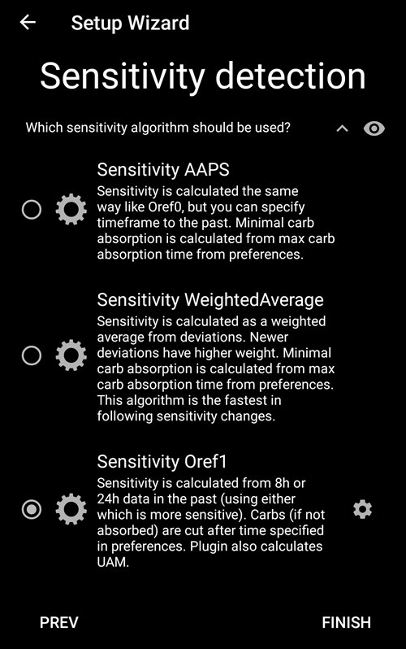

## Avvia Obiettivo 1

Stai entrando ora negli Obiettivi. La qualifica per l'accesso a ulteriori funzionalità di **AAPS**.

Qui avviamo l'Obiettivo 1, anche se al momento la nostra configurazione non è completamente pronta per completare con successo questo Obiettivo.

Ma questo è l'inizio.

Premi il verde "AVVIA" per avviare l'obiettivo 1:

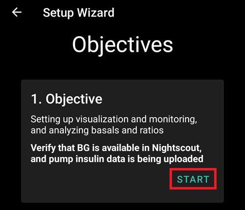

Vedi che hai già fatto alcuni progressi, ma altre aree devono essere completate.

Premi "FINE" per andare alla schermata successiva.


Arrivi alla schermata principale di **AAPS**.

Qui trovi il messaggio informativo in **AAPS** che hai impostato il tuo profilo.

Questo è stato fatto quando siamo passati al nostro nuovo profilo.

Puoi cliccare "SNOOZE" e scomparirà.

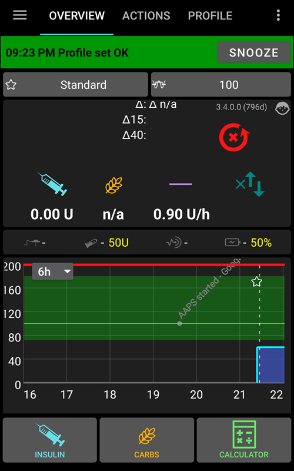

Se esci accidentalmente dalla Procedura guidata di configurazione in qualsiasi punto, puoi semplicemente riavviare la Procedura guidata o modificare la [configurazione del loop AAPS](../SettingUpAaps/ChangeAapsConfiguration.md) manualmente.

## Riavvia AAPS per convalidare le impostazioni

Dal menu in alto a destra, seleziona Esci per forzare il riavvio di AAPS.

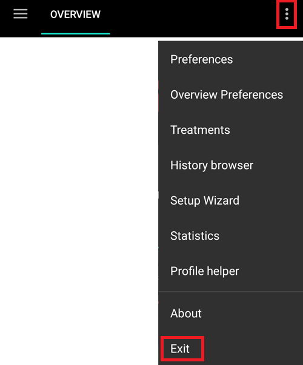

Se hai selezionato un microinfusore connesso tramite Bluetooth, vedrai ora la richiesta di autorizzazione:

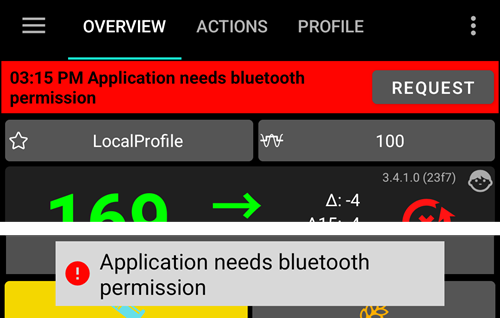

Consenti ad AAPS di connettersi ai dispositivi nelle vicinanze.


Se il tuo loop **AAPS** è ora completamente configurato, vai alla sezione successiva ["Completare gli obiettivi"](../SettingUpAaps/CompletingTheObjectives.md).