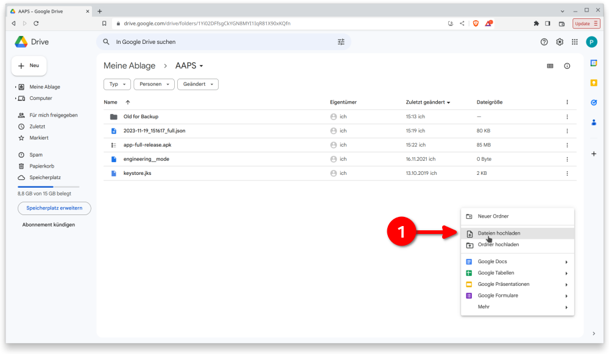
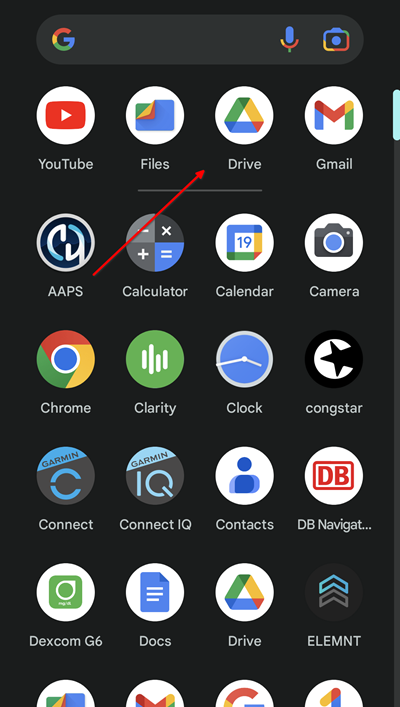
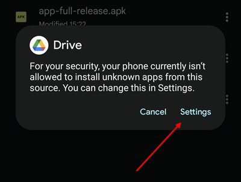
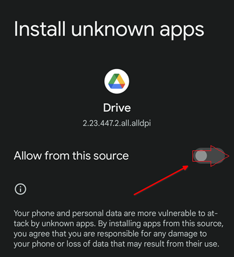

# Trasferire e installare AAPS sullo smartphone

Nella sezione precedente, [costruire **AAPS**](../SettingUpAaps/BuildingAaps.md), hai costruito l'app **AAPS** (che è un file .apk) su un computer.

I passi successivi sono **trasferire** il file APK di **AAPS** (e altre app che potrebbe essere necessario, come BYODA, xDrip+ o un'altra app ricevitore CGM) sul tuo smartphone Android, e poi **installare** le app.

Dopo l'installazione di **AAPS** sullo smartphone, potrai passare alla [**configurazione del loop AAPS**](../SettingUpAaps/SetupWizard.md).

Esistono diversi modi per trasferire il file APK di **AAPS** dal computer allo smartphone. Qui spieghiamo due metodi diversi:

* Opzione 1 - Usa Google Drive (Gdrive)
* Opzione 2 - Usa un cavo USB

Tieni presente che il trasferimento via email potrebbe causare difficoltà e non è consigliato.

## Opzione 1. Usa Google Drive per trasferire i file

Apri [Google.com](https://www.google.com/) nel tuo browser web e accedi al tuo account Google.

In alto a destra seleziona l'app Drive nel menu Google.


Fai clic con il tasto destro nell'area libera sotto i file e le cartelle nell'app Google Drive e seleziona "Carica file".



Il file APK dovrebbe ora essere caricato su Google Drive.


### Usa l'app Google Drive per eseguire il file APK per l'installazione

Passa al tuo smartphone e avvia l'app Google Drive. È un'app preinstallata e si trova dove si trovano le altre app Google oppure cercandola per nome.



Avvia l'installazione dell'APK facendo doppio clic sul nome del file nell'app Google Drive sul cellulare.


Nel caso in cui ricevi un avviso di sicurezza che non ti è attualmente consentito installare app da Google Drive, consentilo per quel breve momento e disabilitalo subito dopo, poiché è un rischio per la sicurezza lasciarlo abilitato in modo permanente.





Al termine dell'installazione hai completato questo passaggio.

Dovresti vedere l'icona di **AAPS** e poter aprire l'app.

```{warning}
**AVVISO IMPORTANTE DI SICUREZZA**
Ricorda di disabilitare l'installazione da Google Drive?
```

Prosegui con la [configurazione del loop AAPS](../SettingUpAaps/SetupWizard.md).

## Opzione 2. Usa un cavo USB per trasferire i file
Il secondo modo per trasferire il file APK di AAPS è con un [cavo USB](https://support.google.com/android/answer/9064445?hl=en).

Trasferisci il file dalla sua posizione sul computer alla cartella "download" del telefono.

Sul tuo telefono, dovrai consentire l'installazione da fonti sconosciute. Le spiegazioni su come farlo si trovano su internet (_es._ [qui](https://www.expressvpn.com/de/support/vpn-setup/enable-apk-installs-android/) o [qui](https://www.androidcentral.com/unknown-sources)).

Dopo aver trascinato il file, per installarlo apri la cartella "download" sul telefono, premi sull'APK di AAPS e seleziona "installa". Puoi poi passare al passo successivo, la [Procedura guidata di configurazione](../SettingUpAaps/SetupWizard.md), che ti aiuterà a configurare l'app **AAPS** e il loop sul tuo smartphone.

Prosegui con la [configurazione del loop AAPS](../SettingUpAaps/SetupWizard.md).