# Il tuo profilo AAPS

Il tuo **Profilo AAPS** è un insieme di cinque parametri chiave che definiscono come **AAPS** deve erogare insulina in risposta ai livelli di glucosio del sensore. Questi sono i parametri principali su cui si basa **AAPS**. Man mano che avanzi attraverso gli **Obiettivi**, sbloccherai parametri aggiuntivi modificabili (come le impostazioni SMB), ma le prestazioni di queste funzionalità si basano sul fatto che il tuo **Profilo** sottostante sia corretto. Il **Profilo** comprende:
* [durata dell'azione insulinica](#your-aaps-profile-duration-of-insulin-action) (DIA),
* [target glicemia](#profile-glucose-targets),
* [tassi basali](#your-aaps-profile-basal-rates) (BR),
* [fattori di sensibilità insulinica](#your-aaps-profile-insulin-sensitivity-factor) (ISF) e
* [rapporti insulina-carboidrati](#your-aaps-profile-insulin-to-carbs-ratio) (IC o ICR).

Come parte della gestione di **AAPS**, gli utenti dovrebbero valutare e verificare continuamente l'accuratezza delle impostazioni del loro **Profilo**. Si raccomanda di prendere le impostazioni nell'ordine in cui sono presentate qui. Cerca di impostare correttamente un parametro prima di cambiarne un altro. Lavora a piccoli passi piuttosto che apportare grandi modifiche tutte in una volta. Non dimenticare di attivare il nuovo profilo dopo ogni modifica. Esegui regolarmente il [backup del tuo **Profilo**](#YourAapsProfile_Profile-backup) esportando le Preferenze.

Le impostazioni del tuo **Profilo** interagiscono tra loro - puoi avere impostazioni 'errate' che funzionano bene insieme in certe circostanze ma non in altre. Ad esempio, se una basale troppo alta capita nello stesso momento in cui il **CR** è troppo alto. Ciò significa che devi considerare le impostazioni individualmente e verificare che funzionino armoniosamente insieme in varie circostanze.

Puoi usare [Autotune](https://autotuneweb.azurewebsites.net/) per orientare il tuo pensiero, anche se non va seguito ciecamente: potrebbe non funzionare bene per te o in tutte le circostanze.

```{admonition} Your diabetes may vary
:class: information
I **Profili** variano significativamente da persona a persona.

Per i tassi basali (BR), i fattori di sensibilità insulinica (ISF) e i rapporti insulina-carboidrati (IC o ICR), i valori assoluti e le tendenze nel fabbisogno di insulina variano significativamente da persona a persona, a seconda della biologia, del sesso, dell'età, del livello di forma fisica ecc., nonché di fattori a breve termine come la malattia e l'esercizio fisico recente. Per ulteriori indicazioni su questo argomento, il libro ["Brights Spots and Landmines"](https://diatribe.org/bright-spots-and-landmines/) di Adam Brown è un'eccellente lettura.

```

Gli ultimi quattro parametri (target glicemia, tassi basali, fattori di sensibilità insulinica e rapporti insulina-carboidrati) possono essere impostati a valori diversi, cambiando ogni ora se necessario, nell'arco di un periodo di 24 ore.


Di seguito sono mostrati gli screenshot di **AAPS** di un profilo _di esempio_. Tieni presente che questo profilo di esempio mostra un gran numero di fasce orarie. Quando inizi con **AAPS**, il tuo profilo sarà probabilmente molto più semplice.

(your-aaps-profile-duration-of-insulin-action)=
## Durata dell'azione insulinica (DIA)

### Descrizione

La durata di tempo che l'insulina impiega per decadere a zero.

La durata dell'azione insulinica viene impostata su un singolo valore in **AAPS**, perché il tuo microinfusore infonderà continuamente lo stesso tipo di insulina.


In combinazione con il [tipo di insulina](#Config-Builder-insulin), questo risulterà nel [profilo insulinico](#AapsScreens-insulin-profile), come mostrato nell'immagine sopra. La cosa importante da notare è che il decadimento ha una **lunga coda**. Se sei abituato alla terapia con microinfusore manuale, probabilmente hai assunto che l'insulina decade in un periodo molto più breve, cioè circa 3,5 ore. Tuttavia, quando si fa loop, la lunga coda è importante perché i calcoli sono molto più precisi e queste piccole quantità si sommano quando vengono soggette ai calcoli ricorsivi nell'algoritmo di **AAPS**. Pertanto, **AAPS** usa un minimo di 5h come **DIA**.

Letture aggiuntive sull'argomento della durata dell'azione insulinica e perché è importante:
* [Understanding the New IOB Curves Based on Exponential Activity Curves](https://openaps.readthedocs.io/en/latest/docs/While%20You%20Wait%20For%20Gear/understanding-insulin-on-board-calculations.html#understanding-the-new-iob-curves-based-on-exponential-activity-curves) nella documentazione OpenAPS.
* [Why we are regularly wrong in the duration of insulin action (DIA) times we use, and why it matters…](https://www.diabettech.com/insulin/why-we-are-regularly-wrong-in-the-duration-of-insulin-action-dia-times-we-use-and-why-it-matters/) su Diabettech.
* [Exponential Insulin Curves + Fiasp](https://web.archive.org/web/20220630154425/http://seemycgm.com/2017/10/21/exponential-insulin-curves-fiasp/) su See My CGM (archivio).
* [Revised Humalog model in a closed loop](https://bionicwookiee.com/2022/04/13/revised-humalog-model-in-a-closed-loop/) e altri articoli su Bionic Wookie, che raccomanda un DIA di 9h per Lyumjev, Fiasp, NovoRapid, Humalog.


### Impact

Un **DIA** troppo breve può portare a glicemie basse. E viceversa.

Se il **DIA** è troppo breve, **AAPS** calcolerà troppo presto che il tuo bolo precedente è stato tutto consumato e, se la tua **glicemia** è ancora alta, somministrerà troppa insulina. (In realtà, non aspetta così a lungo, ma prevede cosa succederebbe e continua ad aggiungere insulina). Questo crea essenzialmente un 'accumulo di insulina' di cui **AAPS** non è a conoscenza. Questo è particolarmente evidente di notte, se si vede un IOB negativo senza altra spiegazione che la coda dell'ultimo bolo.

Un esempio di un **DIA** troppo breve è una **glicemia alta** seguita da **AAPS** che corregge eccessivamente e dà una **glicemia bassa**.

### Come impostarlo

La **figura seguente** mostra un esempio di come il **DIA** viene impostato in un profilo **AAPS**.

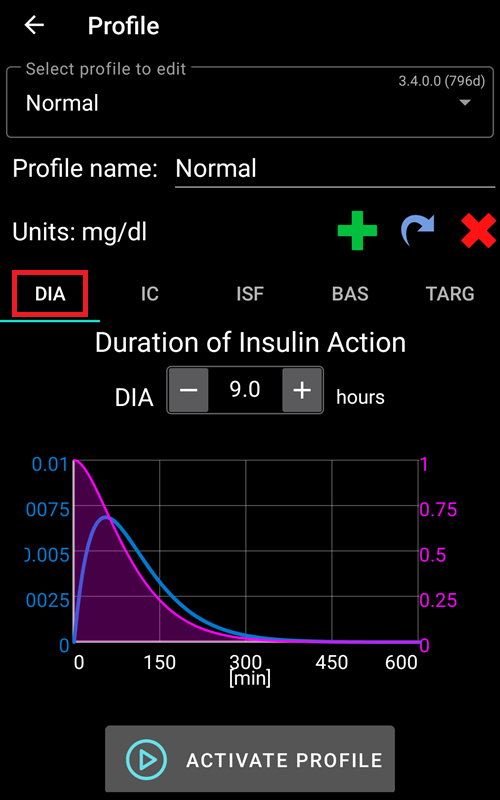

L'impostazione del **DIA** è spesso impostata troppo breve dai nuovi utenti. Un **DIA** di 6 o 7 è probabilmente un buon punto di partenza. Un numero crescente di persone trova che un **DIA** di 8-9 ore funzioni bene per loro. Consulta le letture aggiuntive menzionate sopra.

(profile-glucose-targets)=
## Target glicemia

### Descrizione

Il tuo **target glicemia** è un valore fondamentale e tutti i calcoli di **AAPS** si basano su di esso. È diverso dall'intervallo target in cui di solito cerchi di mantenere i valori della glicemia. Il target viene usato nei calcoli di **AAPS**: se **AAPS** prevede che la tua **glicemia** uscirà dall'intervallo target, interverrà per riportarti nell'intervallo.

I target possono essere definiti entro questi limiti:

|         | Target _basso_        | Target _alto_         |
| ------- | --------------------- | --------------------- |
| Minimo  | 4 mmol/l o 72 mg/dL   | 5 mmol/l o 90 mg/dL   |
| Massimo | 10 mmol/l o 180 mg/dL | 15 mmol/l o 225 mg/dL |

### Impact

Se il target nel tuo **Profilo** è molto ampio (diciamo 3 o più mmol/l [50 mg/dl o più] di larghezza), spesso troverai poca azione da parte di **AAPS**. Questo perché si prevede che la **glicemia** si trovi da qualche parte in quell'ampio intervallo, e quindi è improbabile che **AAPS** intervenga con tassi basali temporanei.

### Come impostarlo

La **figura seguente** mostra un esempio di come il target può essere impostato in un profilo **AAPS**.

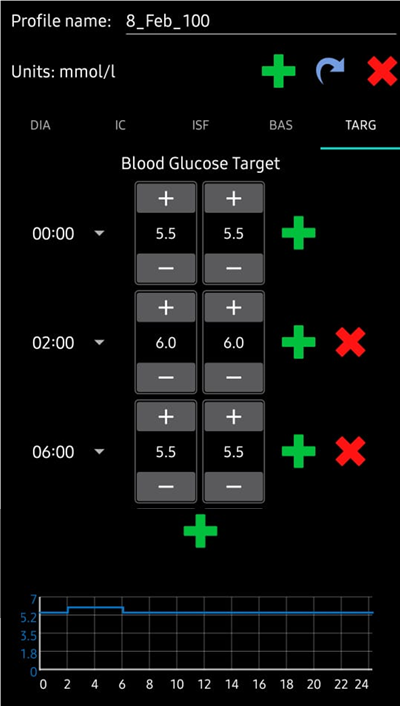

I target di **glicemia** vengono impostati in base alle tue preferenze e requisiti personali. Ad esempio, se sei preoccupato per le ipoglicemie di notte, potresti impostare il tuo target leggermente più alto a 117 mg/dL (6,5 mmol/L) dalle 21:00 alle 7:00. Se vuoi assicurarti di avere abbastanza insulina attiva (IOB) la mattina prima di fare il bolo per la colazione, potresti impostare un target più basso di 81 mg/dL (4,5 mmol/L) dalle 7:00 alle 8:00.

Quando sei in [Loop Aperto](#KeyAapsFeatures-OpenLoop), specialmente durante i [primi obiettivi](../SettingUpAaps/CompletingTheObjectives.md), usare un target con un intervallo ampio può essere una buona opzione mentre stai imparando come si comporta **AAPS** e stai aggiustando il tuo **Profilo**.<br/> Quando sei in [Loop Chiuso](#KeyAapsFeatures-ClosedLoop) (a partire dall'**[Obiettivo 6](#objectives-objective6)**), si raccomanda di ridurre l'intervallo fino ad avere un singolo target per ogni momento della giornata (target _basso_ = target _alto_), per garantire che **AAPS** reagisca prontamente alle fluttuazioni della **glicemia**.

(your-aaps-profile-basal-rates)=

## Basal rates

### Descrizione

Il tuo tasso basale di insulina (Unità/ora) fornisce insulina di fondo, mantenendo stabili i livelli di glucosio in assenza di cibo o esercizio fisico.

Il microinfusore eroga piccole quantità di insulina ad azione rapida ogni pochi minuti, per impedire al fegato di rilasciare troppo glucosio e per spostare il glucosio nelle cellule del corpo. L'insulina basale di solito costituisce tra il 40-50% della dose giornaliera totale (TDD), a seconda della dieta, e segue tipicamente un ritmo circadiano, con un picco e una valle nel fabbisogno di insulina nelle 24 ore. Per ulteriori informazioni, il capitolo 6 di ["Think like a Pancreas"](https://amzn.eu/d/iVU0RGe) di Gary Scheiner è molto utile.

La maggior parte degli educatori diabetici per il diabete di tipo 1 (e le persone con diabete di tipo 1!) concordano che dovresti lavorare per impostare correttamente i tuoi tassi basali prima di tentare di ottimizzare ISF e ICR.

### Impact

I tassi basali accurati ti consentono di svegliarti nell'intervallo e di saltare i pasti - o mangiare - prima o dopo nella giornata, senza andare in iperglicemia o ipoglicemia.

Un tasso basale troppo alto può portare a glicemie basse. E viceversa.

**AAPS** 'si calibra' rispetto al tasso basale predefinito. Se il tasso basale è troppo alto, uno 'zero temp' conterà come un IOB negativo più grande di quanto dovrebbe. Questo porterà **AAPS** a dare più correzioni successive di quanto dovrebbe per portare eventualmente l'IOB a zero.

Quindi, un tasso basale troppo alto creerà **glicemie** basse sia con il tasso predefinito, sia alcune ore dopo mentre **AAPS** si corregge verso il target.

Al contrario, un tasso basale troppo basso può portare a glicemie alte e a un mancato abbassamento dei livelli verso il target.

### Come impostarlo

La **figura seguente** mostra un esempio di come i tassi basali possono essere impostati in un profilo **AAPS**.

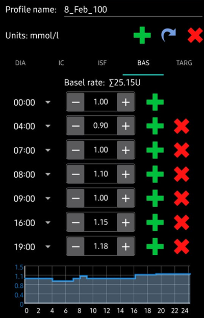

L'impostazione corretta dei tassi basali si fa per tentativi ed errori e dovrebbe essere fatta in consultazione con il team diabetologico.

Esistono metodi di test basale che di solito prevedono l'osservazione dei tassi basali e dei fabbisogni di insulina durante un <u>digiuno intermittente</u> nell'arco di un periodo di 24 ore. Sebbene sia necessario testare i tassi basali per tutta la giornata, non è consigliabile digiunare per 24 ore consecutive. Questo perché il corpo attiva meccanismi come gli ormoni per compensare. Un modo consigliato è digiunare 3 volte per 8 ore.

Il metodo consigliato è sospendere il loop (per sicurezza puoi impostare AAPS su [**LGS**](#KeyAapsFeatures-LGS) per evitare le ipoglicemie, come fatto per raggiungere l'[obiettivo 6](#objectives-objective6)), che tornerà al tasso basale di fondo predefinito. Osserva come cambia la tua **glicemia**: se sta scendendo, il tasso basale è troppo alto. E viceversa.<br/> Un metodo alternativo (può essere più complicato) è mantenere il loop in esecuzione e osservare come cambia l'**IOB**. Se l'**IOB** è negativo, il tuo tasso basale è troppo alto. E viceversa. Tieni presente che questo metodo si basa sull'**ISF** per correggere la **glicemia** e dipende quindi da altre variabili che devono essere impostate ragionevolmente bene affinché sia efficace.<br/> Un altro modo per regolare i tassi basali è osservare l'azione del loop durante la notte, quando tutto il COB è decaduto. Questo metodo è particolarmente utile per i bambini, quando il digiuno è difficile o il fabbisogno di insulina cambia spesso. [Il dott. Saleh Adi di Tidepool](https://www.youtube.com/watch?v=-fpWnGRhLSo) fornisce utili indicazioni su come analizzare le linee di glicemia notturna per ottimizzare i tassi basali.

Vedi [qui](../GettingHelp/ProfileTuning.md) come ottimizzare il tuo profilo basale, analizzando i pattern nel loop chiuso.

Quando si agisce sui risultati del test basale, le modifiche al **Profilo** dovrebbero essere apportate 1-2 ore (a seconda del tipo di insulina) prima dell'aumento/calo. Ripeti il test quanto necessario finché non ti senti a tuo agio con le impostazioni del tuo **tasso basale**.

(your-aaps-profile-insulin-sensitivity-factor)=

## Fattore di sensibilità insulinica (ISF)

### Descrizione

Il fattore di sensibilità insulinica (a volte chiamato fattore di correzione) è una misura di quanto il tuo livello di glicemia verrà ridotto da 1 unità di insulina.

**In unità mg/dL:** Se hai un **ISF** di 40, ogni unità di insulina ridurrà la tua glicemia di circa 40 mg/dL (ad esempio, la tua glicemia scenderà da 140 mg/dL a 100 mg/dL).

**In unità mmol/L:** Se hai un **ISF** di 1,5, ogni unità di insulina ridurrà la tua glicemia di circa 1,5 mmol/L (ad esempio da 8 mmol/L a 6,5 mmol/L).

Da questi esempi puoi vedere che un valore di **ISF** _più piccolo_ significa che sei meno sensibile all'insulina. Quindi se riduci il tuo ISF da 40 a 35 (mg/dl) o da 1,5 a 1,3 (mmol/L), questo viene spesso chiamato rafforzare il tuo **ISF**. Al contrario, aumentare il valore di **ISF** da 40 a 45 (mg/dl) o da 1,5 a 1,8 mmol/L) è indebolire il tuo **ISF**.

### Impact

Un **ICR più basso / più forte** significa meno cibo per unità, cioè si riceve più insulina per una quantità fissa di carboidrati. Può anche essere chiamato 'più aggressivo'. Se il tuo IC è troppo forte, stai ricevendo troppa insulina, questo può portare a **glicemie** basse.

Un **ISF più alto / più debole** (es. 45 invece di 35) significa che l'insulina abbassa la tua **glicemia** di più per unità. Questo porta a una correzione meno aggressiva / più debole dal loop con **meno insulina**. Se il tuo **ISF** è troppo debole (valore grande), questo può portare a **glicemia** alta.

**Esempio:**
* La **glicemia** è 190 mg/dL (10,5 mmol/L) e il target è 100 mg/dL (5,6 mmol/L).
* Quindi, vuoi una correzione di `190 - 110 = 90 mg/dL` o `10,5 - 5,6 = 4,9 mmol/L`
* Se `ISF = 30` -> `90 / 30 = 3` o `ISF = 1,63` -> `4,9 / 1,63 = 3`: 3 unità di insulina
* Se `ISF = 45` -> `90 / 45 = 2` o `ISF = 2,45` -> `4,9 / 2,45 = 2`: 2 unità di insulina

Un **ISF** troppo basso (e quindi più aggressivo, non raro) può risultare in 'sovracorrezioni', perché **AAPS** calcola che l'utente ha bisogno di più insulina per correggere una **glicemia** alta rispetto a quanto effettivamente necessario. Questo può portare a livelli di **glicemia** a 'montagne russe' (specialmente a digiuno), come mostrato nell'immagine qui sotto. In questa circostanza, il valore di **ISF** dovrebbe essere aumentato per rendere **AAPS** meno aggressivo. Questo garantirà che **AAPS** eroghi dosi di correzione più piccole ed eviti di sovracorrere una **glicemia** alta risultando in una **glicemia** bassa.

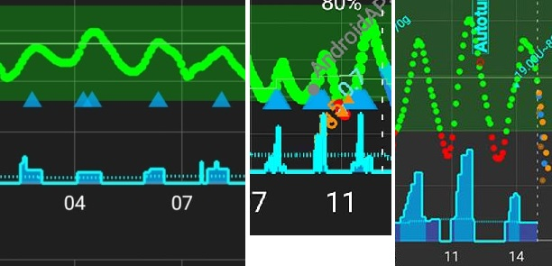

Al contrario, un **ISF** impostato troppo alto può risultare in sottocorrezioni, il che significa che la tua **glicemia** rimane sopra il target - particolarmente evidente durante la notte.

### Come impostarlo

Vedi la **figura seguente** per un esempio di come i valori ISF potrebbero essere impostati in un profilo **AAPS**.

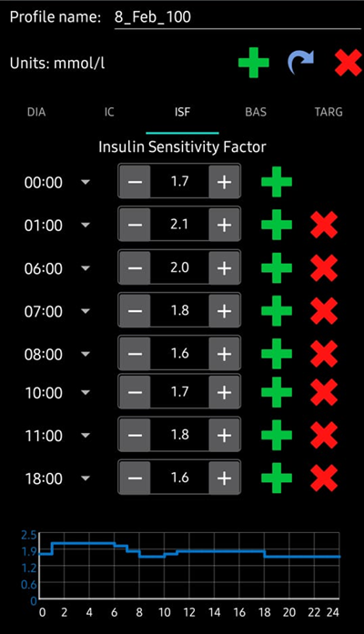

Un punto di partenza di base per determinare il tuo ISF diurno è basarlo sulla dose giornaliera totale (TDD) usando la regola 1700 (94). Ulteriori dettagli sono dati nel capitolo 7 di ["Think like a Pancreas"](https://amzn.eu/d/iVU0RGe) di Gary Scheiner.

| 1700 (se si misura in mg/dl) o 94 (mmol/L) / TDD = ISF approssimativo.<br/><br/>Esempio: TDD = 40 U<br/>ISF approssimativo (mg/dl) = 1700/40 = 43<br/>ISF approssimativo (mmol/L) = 94/40 = 2,4 |
| ----------------------------------------------------------------------------------------------------------------------------------------------------------------------------------------------------------------------- |
|                                                                                                                                                                                                                         |

Assumendo che i tuoi livelli basali siano corretti, puoi testarlo sospendendo il loop, verificando che l'**IOB** sia zero e assumendo qualche compressa di glucosio per raggiungere un livello 'alto' stabile.

Poi somministra una quantità stimata di insulina (in base all'ISF corrente 1/) per raggiungere il tuo target di glicemia.

Fai attenzione perché questo viene spesso impostato troppo basso. Troppo basso significa che 1 U abbassa la glicemia più velocemente del previsto.

(your-aaps-profile-insulin-to-carbs-ratio)=

## Rapporto insulina-carboidrati (ICR)

### Descrizione

L'**ICR** è una misura di quanti grammi di carboidrati sono coperti da una unità di insulina.

Alcune persone usano anche **I:C** come abbreviazione invece di **ICR**, o parlano di rapporto carboidrati: **CR**.

Ad esempio, un rapporto insulina-carboidrati di 1 a 10 (1:10) significa che si assume 1U di insulina per ogni 10 grammi di carboidrati consumati. Un pasto da 25 g di carboidrati richiederebbe 2,5U di insulina.

Se il tuo **ICR** è più debole (valore più alto), ad esempio 1:20, avresti bisogno di soli 0,5U di insulina per coprire 10 g di carboidrati. Un pasto da 25 g di carboidrati richiederebbe 25/20 = 1,25U di insulina.

È comune avere **ICR** diversi in diversi momenti della giornata a causa dei livelli ormonali e dell'attività fisica. Molte persone trovano di avere l'**ICR** più basso/più forte intorno all'ora della colazione perché tendono ad essere più insulino-resistenti. Ad esempio, l'**ICR** di un utente adulto potrebbe essere 1:8 per la colazione, 1:10 per il pranzo e 1:10 per la cena, ma questi schemi non sono universali e alcune persone sono più insulino-resistenti all'ora di cena e richiedono un **ICR** più forte/più piccolo allora.

> **NOTA:**
> 
> In alcuni paesi europei le unità pane venivano usate per determinare quanta insulina è necessaria per il cibo. Inizialmente 1 unità pane era equivalente a 12 g di carboidrati, in seguito alcuni sono passati a 10 g di carboidrati.
> 
> In questo modello la quantità di carboidrati era fissa e la quantità di insulina era variabile. ("Quanta insulina è necessaria per coprire un'unità pane?")
> 
> Quando si usa l'**ICR** la quantità di insulina è fissa e la quantità di carboidrati è variabile. ("Quanti g di carboidrati possono essere coperti da una unità di insulina?")
> 
> Esempio:
> 
> Fattore unità pane (UP = 12g di carboidrati): 2,4 U/UP -> Hai bisogno di 2,4 unità di insulina quando mangi un'unità pane.
> 
> **ICR** corrispondente: 12g / 2,4 U = 5,0 g/U -> 5,0 g di carboidrati possono essere coperti con una unità di insulina.
> 
> Fattore UP 2,4 U / 12g ===> IC = 12g / 2,4 U = 5,0 g/U
> 
> Le tabelle di conversione sono disponibili online es. [qui](https://www.mylife-diabetescare.com/files/media/03_Documents/11_Software/FAS/SOF_FAS_App_KI-Verha%CC%88ltnis_MSTR-DE-AT-CH.pdf).

### Impact

Un **ICR più alto / più debole** = più cibo per unità, cioè si riceve meno insulina per una quantità fissa di carboidrati. Può anche essere chiamato 'meno aggressivo'. Se il tuo IC è troppo debole, stai ricevendo meno insulina di quanto necessario, questo può portare a **glicemie** alte.

Un **ISF più basso / più forte** (es. 40 invece di 50) significa che l'insulina abbassa la tua **glicemia** meno per unità. Questo porta a una correzione più aggressiva / più forte dal loop con **più insulina**. Può anche essere chiamato 'meno aggressivo'. Se il tuo IC è troppo debole, ricevi meno insulina del necessario; questo può portare a **glicemie** elevate.

### Come impostarlo

La **figura seguente** mostra un esempio dell'**ICR** di un utente e come può essere impostato in un **Profilo AAPS**. Quando si inseriscono questi valori, inseriamo solo la parte finale del rapporto, quindi un rapporto insulina-carboidrati di 1:3,5 viene inserito semplicemente come "3,5".

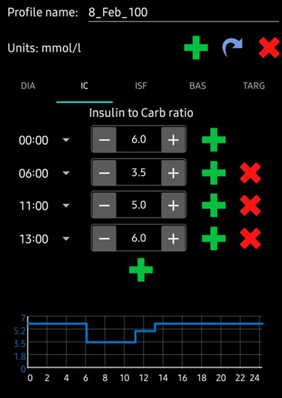

Se dopo che un pasto è stato digerito e l'**IOB** è tornato a zero, la tua **glicemia** rimane più alta di prima del cibo, è probabile che il tuo **ICR** sia troppo debole (cioè il numero è troppo alto e dovrebbe essere gradualmente abbassato). Al contrario, se la tua **glicemia** è più bassa di prima del cibo, l'**ICR** è troppo forte (cioè il numero è troppo piccolo e dovrebbe essere gradualmente aumentato).

Assumendo che i tuoi tassi basali siano corretti, puoi testarlo verificando che l'**IOB** sia zero e che tu sia nell'intervallo, mangiando esattamente carboidrati noti e assumendo una quantità stimata di insulina in base al rapporto insulina-carboidrati corrente. È meglio mangiare cibo che mangi normalmente a quell'ora del giorno e contare i suoi carboidrati con precisione.

## Domande frequenti relative al Profilo

```{contents} Common questions related to the Profile
:depth: 1
:local: true
```

### Sull'importanza di impostare correttamente il profilo

**Perché dovrei cercare di impostare correttamente le impostazioni del mio profilo? Il loop non può semplicemente occuparsene?**

Un loop chiuso ibrido _può_ tentare di apportare aggiustamenti all'erogazione di insulina per minimizzare il controllo glicemico inadeguato che risulta dall'avere valori di **Profilo** errati. Può farlo, ad esempio, trattenendo l'erogazione di insulina se stai per andare in ipoglicemia. Tuttavia, puoi ottenere un controllo glicemico molto migliore se le impostazioni del tuo **Profilo** sono già il più vicino possibile a ciò di cui il tuo corpo ha bisogno. Questo è uno dei motivi per cui **AAPS** usa obiettivi a fasi per passare dal loop aperto al loop chiuso ibrido. Inoltre, ci saranno momenti in cui dovrai aprire il loop (riscaldamento del sensore, guasto del sensore _ecc._), a volte nel mezzo della notte, e vorrai avere le impostazioni giuste per queste situazioni.

Se stai iniziando con **AAPS** dopo aver usato un diverso sistema di pump a loop aperto o chiuso, avrai già un'idea ragionevole di quali valori usare per i tassi basali (**BR**), i fattori di sensibilità insulinica (**ISF**) e i rapporti insulina-carboidrati (**ICR**).

Se stai passando dalle iniezioni (MDI) a **AAPS**, è una buona idea informarsi su come effettuare il passaggio da MDI alla pompa prima, e pianificare e fare il trasferimento con cura in consultazione con il tuo team diabetologico. ["Pumping insulin"](https://amzn.eu/d/iaCsFa2) di John Walsh & Ruth Roberts e ["Think like a Pancreas"](https://amzn.eu/d/iVU0RGe) di Gary Scheiner sono molto utili.

### Cosa causa picchi post-prandiali elevati in loop chiuso?
Prima di tutto, controlla il tuo tasso basale e fai un test basale senza carboidrati. Se è corretto e la tua **glicemia** sta scendendo per raggiungere il target dopo che i carboidrati sono stati completamente assorbiti, prova a impostare un obiettivo temporaneo 'eating soon' in **AAPS** qualche tempo prima del pasto o pensa a un tempo di pre-bolo appropriato con il tuo endocrinologo. <br/> Se la tua **glicemia** è troppo alta dopo il pasto e ancora troppo alta dopo che i carboidrati sono stati completamente assorbiti, considera di ridurre il tuo **ICR** con il tuo endocrinologo. Se la tua **glicemia** è troppo alta mentre il **COB** è presente e troppo bassa dopo che i carboidrati sono stati completamente assorbiti, pensa ad aumentare il tuo **ICR** e a un tempo di pre-bolo appropriato con il tuo endocrinologo.

### Sono bloccato in alto e il loop non mi abbassa
I possibili motivi per cui **AAPS** non dà abbastanza insulina sono:
* L'**ISF** non è abbastanza forte
* La basale potrebbe non essere abbastanza forte
* Potrebbe intervenire un'impostazione di sicurezza, come **maxIOB**. Oppure gli **SMB** sono disabilitati in questo momento, a seconda delle tue impostazioni.
* L'automazione è stata configurata e ha sovrascritto **AAPS**.

### Ho un IOB negativo, è un problema?
L'**IOB** negativo significa che la quantità di insulina assoluta (basale + bolo) nel tuo corpo è inferiore alla basale. Causerà l'invio di più insulina da parte di **AAPS** non appena la **glicemia** inizia a salire, perché considera che l'insulina manca, il che può portare a **glicemia** bassa in seguito.

Ecco alcuni motivi per cui potresti avere un IOB negativo e quale azione intraprendere:
* una basale troppo forte: modifica il tuo **Profilo**
* troppo bolo al pasto precedente: modifica il tuo **Profilo** o controlla se stai facendo il bolo al momento giusto.
* DIA troppo breve, che causa un accumulo di insulina: modifica il tuo **Profilo**
* attività fisica: la prossima volta, considera di usare una [percentuale di Profilo](../DailyLifeWithAaps/ProfileSwitch-ProfilePercentage.md) più bassa durante l'attività per tenere conto della maggiore sensibilità.

## Gestire i tuoi Profili

```{contents} Operations that you can perform on your **Profiles** in **AAPS**
:depth: 1
:local: true
```
(your-aaps-profile-create-and-edit-profiles)=
### Creare e modificare i Profili

La scheda **Profilo** può essere trovata nel menu superiore o nel menu hamburger, a seconda delle [impostazioni del Generatore di configurazione](../SettingUpAaps/ConfigBuilder.md).

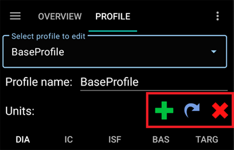

Pulsanti:

- verde più: aggiungi
- X rosso: elimina
- freccia blu: duplica

Se apporti modifiche al tuo **Profilo**, assicurati di modificare il **Profilo** corretto. La scheda **Profilo** potrebbe non mostrare sempre il profilo attuale in uso - ad esempio, se hai effettuato un cambio di profilo usando la scheda profilo nella schermata principale, potrebbe differire dal profilo effettivamente mostrato nella scheda profilo poiché non c'è connessione tra questi.

(your-aaps-profile-profile-from-scratch-for-a-kid)=
### Creare un Profilo da zero per un bambino

La scheda [Assistente Profilo](#aaps-screens-profile-helper) può aiutarti a creare un profilo per un bambino (fino a 18 anni).

**Nota importante:**

**L'assistente profilo è pensato per supportarti nel trovare il profilo iniziale per il tuo bambino. Sebbene si basi su set di dati di due ospedali diversi, discuti sempre con il tuo team medico prima di usare un nuovo profilo!**

L'assistente profilo offre set di dati di due ospedali diversi per i bambini per trovare il profilo iniziale per il tuo bambino fino a 18 anni.

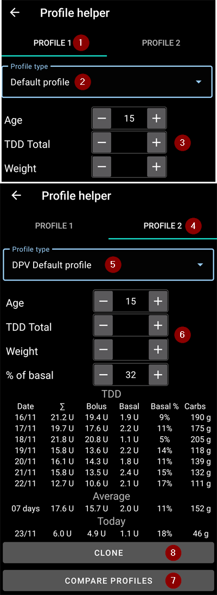

1. Assicurati di essere nel **Profilo 1**.
2. In **Tipo di profilo**, assicurati di avere selezionato "Profilo predefinito".
3. Aggiusta il Profilo predefinito (basato sul set di dati ospedalieri) inserendo l'età del bambino e il TDD Totale **o** il peso.
4. Cambia schermata cliccando su **Profilo 2** a destra.
5. Premi **Tipo di profilo** e seleziona "Profilo DPV predefinito".
6. Aggiusta il Profilo DPV predefinito (basato su un altro set di dati ospedalieri) inserendo l'età del bambino, la percentuale di basale e il TDD Totale **o** il peso.
7. Premi il pulsante **Confronta profili** in fondo alla schermata. Verrà visualizzato il confronto dei due profili regolati (vedi screenshot qui sotto).
8. Se vuoi iniziare ad ottimizzare il tuo profilo basandoti su uno di questi suggerimenti, usa il pulsante **Clona** da **Profilo 1** o **Profilo 2**.

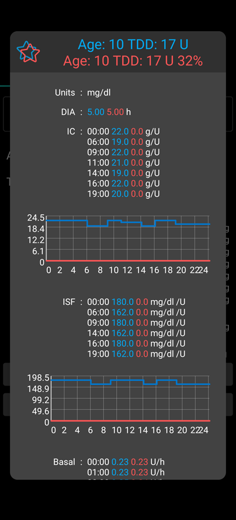

### Cambio Profilo

Vedi [Cambio Profilo e Percentuale Profilo](../DailyLifeWithAaps/ProfileSwitch-ProfilePercentage.md).

(your-aaps-profile-clone-profile-switch)=
### Clonare un Cambio Profilo in un nuovo Profilo

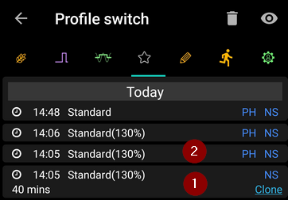

La scheda [Trattamenti](#aaps-screens-treatments) mostra tutti i **Cambi Profilo** passati. Passando alla sotto-scheda **Cambio Profilo**, puoi usare un **Cambio Profilo** passato come base per creare un nuovo **Profilo**. In questo caso, lo spostamento temporale e la percentuale verranno applicati al nuovo profilo locale. Usa il pulsante **Clona** mostrato nella riga **1**.

Ora puoi andare alla [scheda Profilo](#your-aaps-profile-create-and-edit-profiles) per modificare il Profilo appena creato.

(YourAapsProfile_Profile-backup)=
### Backup del Profilo

Essendo un'impostazione fondamentale del tuo sistema di loop, i tuoi **Profili** sono altamente sensibili e qualcosa che davvero non vuoi perdere.

* I tuoi **Profili** sono archiviati nel database di **AAPS**.
* Se abilitato, i **Profili** vengono anche caricati su Nightscout. Le impostazioni si trovano in [Preferenze NSClient > NSClient > Sincronizzazione > Carica dati su NS](#Preferences-nsclient).

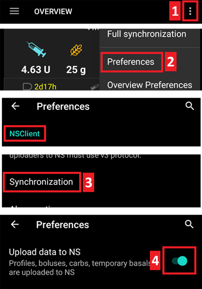

* Fanno anche parte delle [impostazioni esportate](../Maintenance/ExportImportSettings.md). Quindi assicurati di avere un backup in un posto sicuro.

### Modifica dei Profili da Nightscout

Se abilitato, le modifiche al **Profilo** effettuate direttamente in Nightscout possono essere ricevute in **AAPS**. Le impostazioni si trovano in [Preferenze NSClient > NSClient > Sincronizzazione > Ricevi archivio profili](#Preferences-nsclient).

Questo può essere utile quando si stanno per fare modifiche importanti a un **Profilo** più esteso. Possono essere inserite più facilmente tramite l'interfaccia web, _es._ per copiare manualmente dati da un foglio di calcolo.

Per fare ciò, tuttavia, è importante clonare l'intero **record del database** composto da più profili nell'editor di Nightscout (freccia blu nello screenshot qui sotto). Il nuovo record del database porta quindi la data corrente. Dopo il salvataggio, il **Profilo** modificato/nuovo può essere attivato in **AAPS** con un normale [Cambio Profilo](../DailyLifeWithAaps/ProfileSwitch-ProfilePercentage.md).

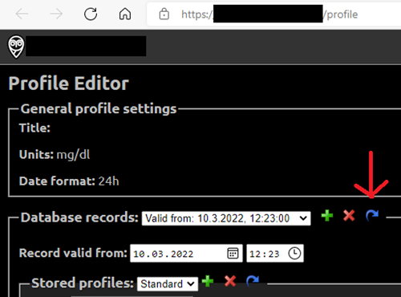

(your-aaps-profile-compare-profiles)=
### Confrontare due Profili

Puoi usare la scheda [Assistente Profilo](#aaps-screens-profile-helper) anche per confrontare due profili diversi o cambi di profilo (percentuale di uno dei tuoi profili usata in un [cambio di profilo](../DailyLifeWithAaps/ProfileSwitch-ProfilePercentage.md) in precedenza).

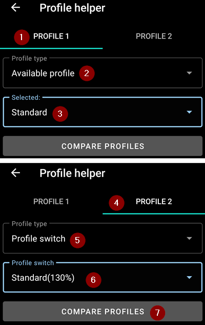

1. Assicurati di essere nel **Profilo 1**.
2. In **Tipo di profilo**, seleziona "Profilo disponibile" per scegliere tra tutti i **Profili** archiviati.
3. Scegli il **Profilo** da cui vuoi confrontare.
4. Cambia schermata cliccando su **Profilo 2** a destra.
5. In **Tipo di profilo**, seleziona "Cambio Profilo" per scegliere nella cronologia di tutti i tuoi **Cambi Profilo**.
6. Scegli il **Cambio Profilo** con cui vuoi confrontare.
7. Premi il pulsante **Confronta profili** in fondo alla schermata. Verrà visualizzato il confronto dei due profili regolati (vedi screenshot qui sotto).

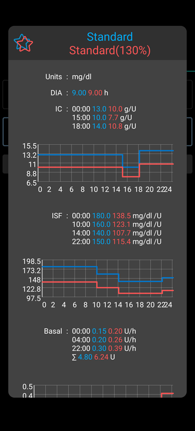
