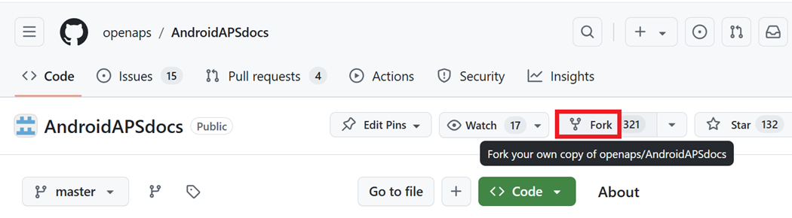
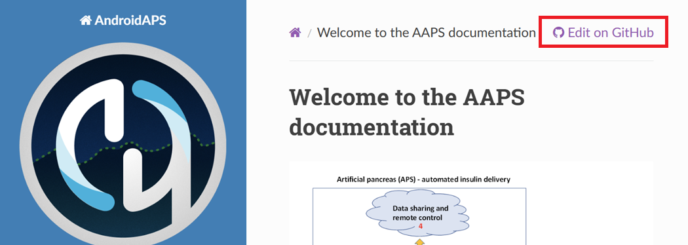
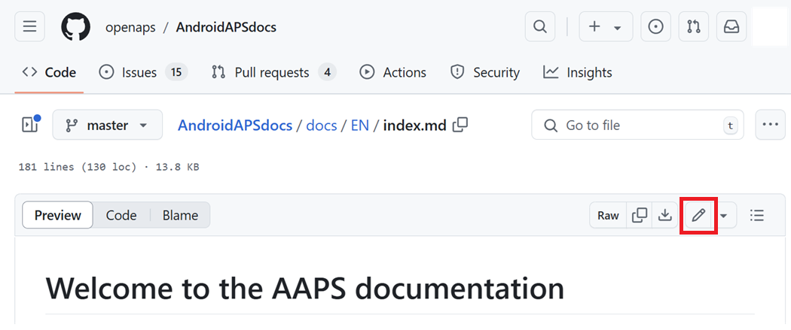
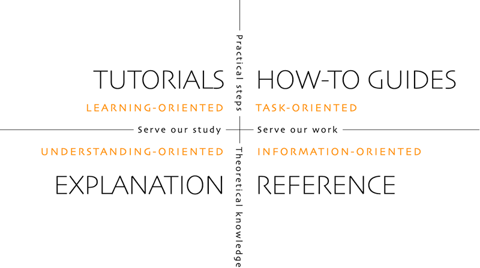

# Come modificare la documentazione

**Questa descrizione è solo per la modifica della documentazione in inglese. Tutte le nuove informazioni devono essere aggiunte prima in inglese. Se vuoi tradurre in altre lingue (grazie), usa [crowdin](https://crowdin.com/project/androidapsdocs).**

Per suggerimenti su come formattare il testo (titolo, grassetto...) e impostare i link consulta la sezione ["sintassi del codice"](#code-syntax) di questa pagina.

## Generale

Per qualsiasi domanda, feedback o nuove idee puoi contattare il team della documentazione tramite [discord](https://discord.gg/4fQUWHZ4Mw).

Ad un certo punto ti verrà suggerito di creare una pull request (PR), che è il modo in cui le tue modifiche alla documentazione vengono effettivamente pubblicate sulle pagine web di AAPS, archiviate su GitHub.  In realtà non è troppo difficile fare una PR ed è un ottimo modo per contribuire. Stai leggendo questa documentazione in questo momento perché persone come te hanno fatto PR. Non preoccuparti di fare un errore o di modificare i documenti sbagliati. Le tue modifiche vengono revisionate prima di essere unite nel repository di documentazione "formale" di AAPS.  Non puoi rovinare gli originali attraverso eventuali errori nel processo. Il processo generale è:

* Fai modifiche e miglioramenti al codice o alla documentazione modificando il contenuto esistente.
* Ricontrolla che le tue modifiche siano soddisfacenti.
* Prendi alcune note di cosa è cambiato in modo che le persone possano capire le modifiche.
* Crea una pull request, che chiede agli amministratori di usare le tue modifiche.
* Loro faranno una revisione e (1) uniranno le tue modifiche, (2) ti commenteranno riguardo alle tue modifiche, o (3) inizieranno un nuovo documento con le tue modifiche.

(Nota: Se sei un apprendista visivo, c'è un video YouTube [qui](https://youtu.be/4b6tsL0_kzg) che mostra il flusso di lavoro PR.)

Per il nostro esempio effettueremo una modifica ad AndroidAPSdocs. Questo può essere fatto su qualsiasi PC Windows, Mac, ecc. (qualsiasi computer con accesso a Internet).

1. Vai su [https://github.com/openaps/AndroidAPSdocs](https://github.com/openaps/AndroidAPSdocs) e clicca su Fork in alto a destra per creare la tua copia del repository.



2. Vai a qualsiasi pagina e naviga alla pagina che vuoi modificare. Puoi cliccare sul link "Modifica su GitHub" nell'angolo in alto a destra. Questo è possibile solo per le pagine in inglese.



   Oppure clicca sull'icona a matita che appare nella barra superiore del contenuto della pagina da modificare. Dovrai aver già effettuato l'accesso al tuo account Github per farlo (se non ne hai uno, sono semplici da configurare).



3. Una o l'altra delle opzioni nel Passaggio 2 creerà un nuovo branch nel TUO repository dove verranno salvate le tue modifiche.  Apporta le tue modifiche al file.

Usiamo markdown per le pagine della documentazione. I file hanno il suffisso ".md". La specifica Markdown non è fissa e al momento usiamo myst_parser per i nostri file markdown. Fai attenzione a usare la sintassi corretta come [descritta di seguito](#code-syntax).


4. Hai lavorato nella scheda "<>Modifica file". Seleziona la scheda "Anteprima modifiche" per un aggiornamento e assicurati che tutto ciò che hai modificato sembri come intendevi (errori di battitura inclusi). Se vedi un miglioramento necessario, torna alla scheda di modifica per apportare ulteriori miglioramenti.


5. Quando hai completato le tue modifiche, scorri fino in fondo alla pagina.  Nella casella in fondo, fornisci i tuoi commenti nel campo di testo che dice "Aggiungi una descrizione estesa opzionale...". Il titolo predefinito ha il nome del file. Prova a includere una frase che spieghi il __motivo__ della modifica. Indicare il motivo aiuta i revisori a capire cosa stai cercando di fare con la PR.


6. Clicca il pulsante verde "Proponi modifiche al file" o "Salva le modifiche". Nella pagina che appare clicca "Crea Pull Request" e di nuovo nella pagina successiva clicca "Crea Pull Request".


7. Questo completa l'apertura di una pull request, PR. GitHub assegna alla PR un numero, situato dopo il titolo e un cancelletto. Torna a questa pagina per controllare i feedback (o, se hai le notifiche GitHub inviate via email, riceverai email che ti informano di qualsiasi attività sulla PR). La modifica sarà ora in un elenco di PR che il team esaminerà e potenzialmente fornirà feedback prima di eseguire il commit nella documentazione principale di AAPS! Se vuoi controllare l'avanzamento della PR, puoi cliccare sul logo della campanella nell'angolo in alto a destra del tuo account GitHub e vedere tutte le tue PR.


PS: Il tuo fork e branch rimarranno nel tuo account GitHub personale. Dopo aver ricevuto una notifica che la tua PR è stata unita, puoi eliminare il tuo branch se hai finito (l'area di notifica del Passaggio 8 fornirà un link per eliminare il branch una volta chiuso o unito). Per le modifiche future, se segui questa procedura le modifiche inizieranno sempre con una versione aggiornata dei repository AndroidAPSdocs.  Se scegli di usare un altro metodo per avviare una richiesta PR (ad esempio, iniziando le modifiche dal branch master del tuo repository forkato come punto di partenza), dovrai assicurarti che il tuo repository sia aggiornato eseguendo prima un "compare" e unendo tutti gli aggiornamenti avvenuti dall'ultima volta che hai aggiornato il tuo fork.  Poiché le persone tendono a dimenticare di aggiornare i loro repository, consigliamo di usare il processo PR descritto sopra fino a quando non hai familiarità con l'esecuzione di "compare".

(edit-the-docs-code-syntax)=
## Sintassi del codice

Usiamo markdown per le pagine della documentazione. I file hanno il suffisso ".md".

Markdown è un linguaggio di formattazione del testo molto semplice che separa il contenuto del testo dalla formattazione del testo.

Lo scrittore ad es. segna un titolo come titolo di livello 1 e il processore markdown genera il codice HTML necessario durante l'elaborazione per visualizzare il titolo in HTML.

L'idea alla base è che:
* lo scrittore deve pensare prima al testo e non alla formattazione,
* il testo markdown è aperto per lo scambio tra diversi strumenti markdown invece di ad es. strumenti proprietari come Microsoft Windows e
* puoi generare diversi formati di output da un unico file markdown.

Markdown non è uno standard fisso al 100% e cerchiamo di rimanere il più possibile vicini allo standard, per
* rimanere flessibili per cambiare gli strumenti markdown se necessario o forzati nell'ulteriore innovazione degli strumenti markdown e dei servizi SaaS markdown e
* consentirci di usare servizi di traduzione per tradurre la lingua inglese in una lingua di destinazione come il francese o il tedesco. Possono lavorare su markdown ma non su codici di formattazione complessi, perché non riescono a separare il contenuto dal layout, il che potrebbe essere fatale.

### Headlines

* Titolo 1: `# titolo`
* Titolo 2: `## titolo`
* Titolo 3: `### titolo`
* Titolo 4: `#### titolo`

Cerchiamo di evitare ulteriori livelli di titoli.

### Formato del testo

* **grassetto**: `**testo**`
* *corsivo*: `*testo*`
* ***grassetto corsivo***: `***testo***`

### Elenco ordinato

```
1. primo
1. secondo
1. terzo
```

1. primo
1. secondo
1. terzo

### Elenco non ordinato

```
- un elemento
- un altro elemento
- e un altro elemento
```

- un elemento
- un altro elemento
- e un altro elemento


### Elenco multilivello

Puoi inserire elenchi negli elenchi rientrando il livello successivo con 4 spazi in più a destra rispetto a quello precedente.

```
1. primo
1. secondo
1. terzo
  1. un elemento
  1. un altro elemento
  1. e un altro elemento
1. quattro
1. cinque
1. sei
```

1. primo
1. secondo
1. terzo
    1. un elemento
    1. un altro elemento
    1. e un altro elemento
1. quattro
1. cinque
1. six

### Immagini

Per includere immagini usa questa sintassi markdown.

* immagini: ``

Il tipo di immagine deve essere PNG o JPEG.

I nomi delle immagini devono essere conformi a una delle seguenti regole di denominazione. Nell'esempio uso png come suffisso. Nel caso in cui usi JPEG usa jpeg come suffisso.

* `nomefile-immagine-xx.png` dove xx è un numero a due cifre univoco per le immagini in questo file.
* `nomefile-immagine-xx.png` dove xx è un nome significativo per l'autore del file md.

Le immagini si trovano nella cartella images per la lingua inglese e vengono propagate automaticamente alle altre lingue da Crowdin. Non devi fare nulla per questo!

Al momento non stiamo traducendo le immagini: le immagini dovrebbero contenere il **minimo testo possibile** per consentire l'accessibilità ai lettori non anglofoni.

(make-a-PR-image-size)= Usa una dimensione ragionevole per le immagini che devono essere leggibili su PC, tablet e cellulari.

* Gli screenshot di pagine web devono avere una larghezza massima di **1050 pixel**.
* I diagrammi di flusso dei processi devono avere una larghezza massima di **1050 pixel**.
* Gli screenshot dell'app devono avere una larghezza massima di **500 pixel**. Non posizionarli fianco a fianco se non necessario.

### Link

#### Link esterni

I link esterni sono link a siti web esterni.

* link esterno: `[testo alternativo](www.url.tld)`

#### Link interni all'inizio di un file md

I link interni alle pagine sono link all'inizio di un file md ospitato sul nostro server.

* link interno a pagina .md: `[testo alternativo](../cartella/file.md)`

#### Link interni a riferimenti inline denominati

I link interni a riferimenti inline denominati sono link a qualsiasi punto di un file md ospitato sul nostro server dove è stato impostato un riferimento a cui collegarsi.

Aggiungi un riferimento denominato nella posizione nel file md di destinazione a cui vuoi saltare.

`(nome-del-mio-file-md-questo-e-il-mio-riferimento-denominato)=`

Il riferimento denominato deve essere univoco in tutti i file md di AndroidAPSDocs e non solo nel file md in cui si trova!

Pertanto è buona pratica iniziare con il nome del file e poi il nome del riferimento che scegli.

Usa solo lettere minuscole e separa le parole con trattini.

Poi collega questo riferimento nel testo che stai scrivendo con il seguente tipo di link.
* Link interni a riferimenti inline denominati: `[testo alternativo](nome-del-mio-file-md-questo-e-il-mio-riferimento-denominato)`

### Note, Avvisi, Note comprimibili

Puoi aggiungere note e riquadri di avviso alla documentazione.

Inoltre puoi aggiungere note comprimibili per informazioni dettagliate che altrimenti indurrebbero gli utenti non interessati ai dettagli a smettere di leggere il testo. Usale con attenzione poiché la documentazione dovrebbe essere il più facile da leggere possibile.

#### Note

````
```{admonition} Titolo nota
:class: note
Questa è una nota.
```
````
```{admonition} Note headline
:class: note
Questa è una nota.
```

#### Avvisi

````
```{admonition} Avviso
:class: warning
Questo è un avviso.
```
````
```{admonition} Warning headline 
:class: warning
Questo è un avviso.
```

#### Note comprimibili

````
```
{admonition} letture dettagliate per lettori interessati
:class: dropdown

Questo admonition è stato compresso,
il che significa che puoi aggiungere contenuto in formato più lungo qui,
senza che occupi troppo spazio sulla pagina.
```
````

```{admonition} further detailed readings for interested readers
:class: dropdown
Questo admonition è stato compresso,
il che significa che puoi aggiungere contenuto in formato più lungo qui,
senza che occupi troppo spazio sulla pagina.


```

## Tabelle

Evita di usare tabelle con testi lunghi poiché il contenuto è difficile da impostare in Markdown, di solito non si adattano alla larghezza dello schermo di un telefono cellulare e probabilmente non verranno visualizzate allo stesso modo dopo la traduzione.

## Guida allo stile

### Contenuti

1.  Consigli di scrittura in lingua inglese

2.  Note di scrittura specifiche per AAPS

3.  Riferimenti utili

###  1\. Consigli di scrittura in lingua inglese

#### Usa un linguaggio appropriato per il lettore

Usa un inglese semplice ovunque possibile. Questo aiuta i lettori non madrelingua e aiuta anche la traduzione dei documenti AAPS in altre lingue. Scrivi in modo colloquiale con l'utente, immagina di essere seduto di fronte alla persona per cui stai scrivendo. Ricorda - la maggior parte degli utenti AAPS non ha background di programmazione. Anche il diabete ha molto gergo e abbreviazioni. Tieni presente che alcune persone potrebbero essere state diagnosticate di recente, potrebbero non essere così esperte come te nel diabete, o potrebbero aver ricevuto una formazione diversa sul diabete. Se usi abbreviazioni o sigle, scrivile per esteso la prima volta che le usi, indicando l'abbreviazione direttamente dopo di essa tra parentesi, come "super micro bolo (SMB)". Collega anche al glossario. I termini tecnici che potrebbero non essere familiari al lettore possono essere aggiunti anche tra parentesi.

Invece di: *"Cosa causa picchi elevati di glicemia postprandiali nel circuito chiuso?"*

Usa: *"Cosa causa un picco glicemia elevato **dopo pranzo** (postprandiale) nel circuito chiuso?"*

##### Usa parole semplici che tutti possono capire

Trova un glossario A-Z di parole alternative per rendere la tua scrittura più facile da capire qui:

[https://www.plainenglish.co.uk/the-a-z-of-alternative-words.html](https://www.plainenglish.co.uk/the-a-z-of-alternative-words.html)

#### Problemi di privacy/licenza:

In particolare se registri video o screenshot, assicurati di non rivelare i tuoi dati privati (chiave API, password). Assicurati che i contenuti YouTube non siano elencati apertamente e richiedano un link dalla documentazione per essere visualizzati. Evita di attirare l'attenzione su materiali protetti da copyright violati (BYODA ecc.).

#### Mantieni le frasi brevi, vai al punto

- Una scrittura chiara dovrebbe avere una lunghezza media delle frasi di 15-20 parole.

- Questo non significa rendere ogni frase della stessa lunghezza. Sii incisivo. Varia la tua scrittura mescolando frasi brevi (come l'ultima) con quelle più lunghe (come questa).

- Mantieni un'idea principale in una frase, più forse un altro punto correlato.

- Potresti comunque trovare frasi lunghe, specialmente quando cerchi di spiegare un punto complicato. Ma la maggior parte delle frasi lunghe può essere suddivisa in qualche modo.

- Rimuovi le parole deboli: "puoi", "c'è/ci sono", "al fine di".

- Posiziona le parole chiave vicino all'inizio di titoli, frasi e paragrafi.

- Sii visivo! Ovunque possibile fornisci un breve diagramma, screenshot o video.


#### Non aver paura di dare istruzioni

I comandi sono il modo più veloce per dare istruzioni, ma gli scrittori a volte temono di dare comandi, scrivendo "dovresti fare questo" invece di semplicemente "fai questo". Forse le persone si preoccupano che i comandi suonino troppo duri. Spesso puoi risolvere questo problema mettendo la parola "per favore" davanti. Tuttavia, se qualcosa deve essere fatto, è meglio non dire "per favore" poiché dà al lettore la possibilità di rifiutare.

Invece di: *"Dovresti solo pensarci come un'affermazione completa."*

Usa: *"Pensaci come un'affermazione completa."*

#### Usa prevalentemente verbi attivi, piuttosto che verbi passivi

Esempio di un **verbo attivo**:

- *"Il microinfusore (soggetto) eroga (verbo) l'insulina (oggetto)."*


"eroga" è un verbo attivo qui. La frase dice chi sta erogando prima di dire cosa viene erogato.

Esempio di un **verbo passivo**:

- *"L'insulina (soggetto) viene erogata (verbo) dal microinfusore (oggetto)"*


*"viene erogata"* è un verbo passivo qui. Il soggetto e l'oggetto vengono scambiati rispetto alla frase con verbo attivo. Abbiamo dovuto allungare la frase introducendo "viene" e "dal".   Considera anche di iniziare con il verbo attivo.

Invece di: *"Puoi connettere il tuo microinfusore al telefono tramite il menu microinfusore di AAPS, e ci sono una serie di microinfusori disponibili con cui connetterti."*

Usa: *"Connetti il microinfusore desiderato al telefono tramite il menu microinfusore di AAPS."*

I verbi passivi possono causare problemi:

- Possono essere confusi.

- Spesso rendono la scrittura più prolissa.

- Rendono la scrittura meno vivace.


##### Buoni usi dei passivi

Ci sono momenti in cui potrebbe essere appropriato usare un passivo.

- Per rendere qualcosa meno ostile - 'questa fattura non è stata pagata' (passivo) è più soft di 'non hai pagato questa fattura' (attivo).

- Per evitare di assumersi la colpa - 'è stato commesso un errore' (passivo) piuttosto che 'hai commesso un errore' (attivo).

- Quando non sai chi o cosa è il soggetto - 'la squadra di calcio è stata selezionata'.

- Se suona semplicemente meglio.


#### Evita le nominalizzazioni

Una nominalizzazione è il nome di qualcosa che non è un oggetto fisico, come un processo, una tecnica o un'emozione.  Le nominalizzazioni sono formate dai verbi.

Ad esempio:

| Verbo      | Nominalizzazione |
| ---------- | ---------------- |
| completare | completamento    |
| introdurre | introduzione     |
| fornire    | fornitura        |
| fallire    | fallimento       |

Vengono spesso usate **invece** dei verbi da cui derivano, ma possono sembrare come se non stesse succedendo nulla. Troppe di esse possono rendere la scrittura molto piatta e pesante.

Invece di: *"L'implementazione del metodo è stata effettuata da un team."*

Usa: *"Un team ha implementato il metodo."*

#### Usa gli elenchi dove appropriato

Gli elenchi sono eccellenti per suddividere le informazioni. Ci sono due tipi principali di elenco:

- Una frase continua con diversi punti elencati all'inizio, nel mezzo o alla fine.

- Punti separati con un'affermazione introduttiva.


Nell'elenco puntato sopra, ogni punto è una frase completa quindi iniziano tutti con una lettera maiuscola e terminano con un punto. Usa i punti elenco piuttosto che i numeri o le lettere, poiché attirano la tua attenzione su ogni punto senza darti ulteriori informazioni da assorbire.

#### Mythbusting

- Puoi iniziare una frase con **e, ma, perché, quindi o tuttavia**.

- Puoi dividere gli infiniti. Quindi puoi dire **"andare audacemente"**.

- Puoi terminare una frase con una preposizione. In effetti, è qualcosa **per cui dovremmo batterci**.

- E **puoi** usare la stessa **parola** due volte in una frase se non riesci a trovare una **parola** migliore.


#### Ottimizzare lo stile di scrittura in base allo scopo

Per mantenere la documentazione chiara e breve, scriviamo diverse sezioni della documentazione in stili diversi.

Uno stile "esplicativo" viene usato per l'introduzione, il background e le sezioni di sviluppo della conoscenza.

Uno stile "Guida pratica" (con spiegazione minima) viene usato per la compilazione, la configurazione di AAPS e alcune delle sezioni di risoluzione dei problemi.

Un tutorial aiuta lo studente ad acquisire competenze di base. L'utente **imparerà facendo**.



#####  Tutorial (es. insegnare a un bambino a montare gli albumi)

- il narratore parla direttamente al lettore: In questo tutorial **tu** (noi) potrebbe essere usato per trasmettere un frame mentale "siamo in questo insieme" in alcuni rari casi

- Tempo futuro -> per mostrare l'obiettivo finale

- Imperativo -> per eseguire i compiti -> Passi concreti - evita i concetti astratti

- Passato -> per mostrare i compiti completati -> Risultati rapidi e immediatamente visibili

- Spiegazioni minime -> strettamente necessarie per completare il compito - **cosa e perché**

- Ignora opzioni/alternative/…. Nessuna ambiguità

- Transizioni di passaggio: termina un passaggio con una frase che porta al passaggio successivo come progressione logica. Esempio: *Hai ora installato il client Let's Encrypt, ma prima di ottenere i certificati, devi assicurarti che tutte le porte richieste siano aperte. Per farlo, aggiornerai le impostazioni del firewall nel passaggio successivo.*

- Titolo **Tutorial** (Intestazione livello 1)

- Introduzione (nessuna intestazione)

- Prerequisiti (Intestazione livello 2)

- Passaggi:

- Passaggio 1 — Fare la prima cosa (Intestazione livello 2)

- Passaggio 2 — Fare la cosa successiva (Intestazione livello 2)

- Passaggio n — Fare l'ultima cosa (Intestazione livello 2)

- Conclusione (Intestazione livello 2)

  - **Il linguaggio dei tutorial**

      *In questo tutorial, tu ...*

      Descrivi ciò che l'apprendista realizzerà (nota - non: "imparerai…").

      *Prima, fai x. Ora, fai y. Ora che hai fatto y, fai z.*

      Nessuno spazio per ambiguità o dubbi.

      *Dobbiamo sempre fare x prima di fare y perché… (vedi Spiegazione per maggiori dettagli).*

      Fornisci una spiegazione minima delle azioni nel linguaggio più semplice possibile. Collega a spiegazioni più dettagliate.

      *L'output dovrebbe assomigliare a qualcosa di simile…*

      Dai all'apprendista aspettative chiare.

      *Nota che… Ricorda che…*

      Fornisci all'apprendista molti indizi per aiutarlo a confermare che è sulla strada giusta e a orientarsi.

      *Hai costruito un motore di stasi ilomorfico a tre strati sicuro…*

      Descrivi (e ammira, in modo mite) ciò che il tuo apprendista ha realizzato (nota - non: "hai imparato…")


#####  Guide pratiche (es. una ricetta)

Lo scopo di una guida pratica è aiutare l'utente già competente a svolgere correttamente un compito particolare.

- COME fare

- il narratore parla direttamente al lettore: In questo tutorial **tu** farai

- Tempo futuro -> per mostrare l'obiettivo finale

- Imperativo condizionale -> per ottenere X fare y -> Passi concreti - evita i concetti astratti

- Spiegazioni minime -> strettamente necessarie per completare il compito -> **cosa e perché**

- Ignora opzioni/alternative/…. Nessuna ambiguità, ma puoi collegarti alla voce di riferimento o alla voce di spiegazione

- **Guida pratica**: Titolo (Intestazione livello 1)

- Paragrafo di introduzione

- Prerequisiti opzionali (paragrafo o Intestazione livello 2 se più di 1)

- Passaggi:

- Passaggio 1 — Fare la prima cosa (Intestazione livello 2)

- Passaggio 2 — Fare la cosa successiva (Intestazione livello 2)

- Passaggio n — Fare l'ultima cosa (Intestazione livello 2)

- Paragrafo di conclusione

  - **Il linguaggio delle Guide pratiche**

      *Questa guida ti mostra come…*

      Descrivi chiaramente il problema o il compito che la guida mostra all'utente come risolvere.

      *Se vuoi x, fai y. Per ottenere w, fai z.*

      Usa gli imperativi condizionali.

      *Fare riferimento alla guida di riferimento x per un elenco completo delle opzioni.*

      Non inquinare la tua guida pratica con tutto ciò che l'utente potrebbe fare in relazione a x.


#####  Explanation (e.g. Science behind why egg whites stiffen when you beat them)

Una spiegazione chiarisce, approfondisce e amplia la comprensione di un argomento da parte del lettore.

- PERCHÉ

- Inizia con **Informazioni su**

- Fornisci contesto, collega TUTTI i riferimenti rilevanti

- Discuti opzioni/alternative

- Non istruire o fornire riferimento (collegati a essi)

- Indica l'incognito/gli obiettivi mobili ecc…

- Titolo **Informazioni su** (Intestazione livello 1)

- Introduzione (nessuna intestazione)

- Prerequisiti opzionali (Intestazione livello 2)

- Sottotema 1 (intestazione livello 2)

- Conclusione (Intestazione livello 2)

  - **Il linguaggio della spiegazione**

    *Il motivo di x è perché storicamente, y…*

    Spiega.

    *W è meglio di z, perché…*

    Offri giudizi e anche opinioni dove appropriato.

    *Un x nel sistema y è analogo a un w nel sistema z. Tuttavia…*

    Fornisci contesto che aiuta il lettore.

    *Alcuni utenti preferiscono w (perché z). Questo può essere un buon approccio, ma…*

    Valuta le alternative.

    *Un x interagisce con un y come segue:…*

    Svela i segreti interni della macchina, per aiutare a capire perché qualcosa fa ciò che fa.


### 2\. Note di scrittura/aggiornamento specifiche per AAPS

#### Autore e editor

Per la scrittura/aggiornamento della documentazione AAPS, considera il processo come composto da due fasi. Queste possono essere eseguite dalla stessa persona in momenti diversi, o da più persone.

Un **autore (es. tu!)** scrive/modifica una sezione della documentazione in un tono colloquiale conciso, poi la passa all'editor.

L'**editor (es. un collega utente AAPS, o la persona che riceve la pull request)** rivede l'aderenza alla guida allo stile, modifica la sezione per chiarezza e accessibilità, rimuovendo il maggior numero possibile di parole (specialmente per le sezioni tutorial/guida pratica). Leggere il testo ad alta voce può essere utile.

#### Punti generali AAPS

- Per i valori di glucosio, indica sia mg/dl che mmol/l in ogni occorrenza (considera anche questo per gli screenshot, se possibile).

- Per coerenza, usa "AAPS" piuttosto che "Android APS".

- Indica chiaramente la versione di Android Studio/AAPS per cui stai scrivendo, o da cui sono stati presi gli screenshot.


### 3\. Riferimenti utili

[https://dev.readthedocs.io/en/latest/style-guide.html](https://dev.readthedocs.io/en/latest/style-guide.html)

[Diátaxis (diataxis.fr)](https://diataxis.fr/)

[Technical Writer Style Guide Examples  | Technical Writer HQ](https://technicalwriterhq.com/writing/technical-writing/technical-writer-style-guide/)

[DigitalOcean's Technical Writing Guidelines | DigitalOcean](https://www.digitalocean.com/community/tutorials/digitalocean-s-technical-writing-guidelines)

[Top 10 tips for Microsoft style and voice - Microsoft Style Guide | Microsoft Learn](https://learn.microsoft.com/en-us/style-guide/top-10-tips-style-voice?source=recommendations)

[https://www.plainenglish.co.uk/how-to-write-in-plain-english.html](https://www.plainenglish.co.uk/how-to-write-in-plain-english.html)

[https://developers.google.com/style](https://developers.google.com/style)

[https://www.mongodb.com/docs/meta/style-guide/screenshots/screenshot-guidelines/](https://www.mongodb.com/docs/meta/style-guide/screenshots/screenshot-guidelines/)
