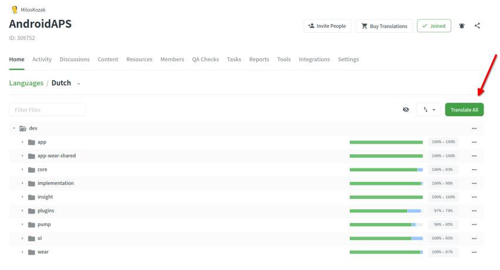
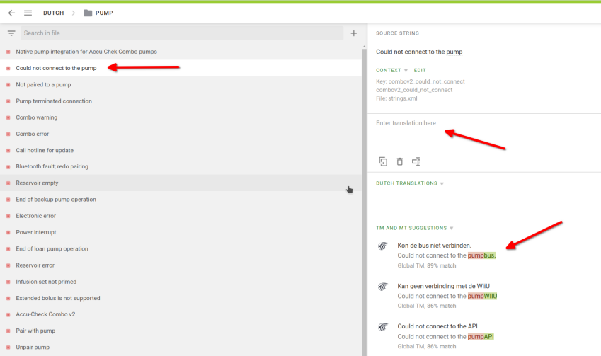
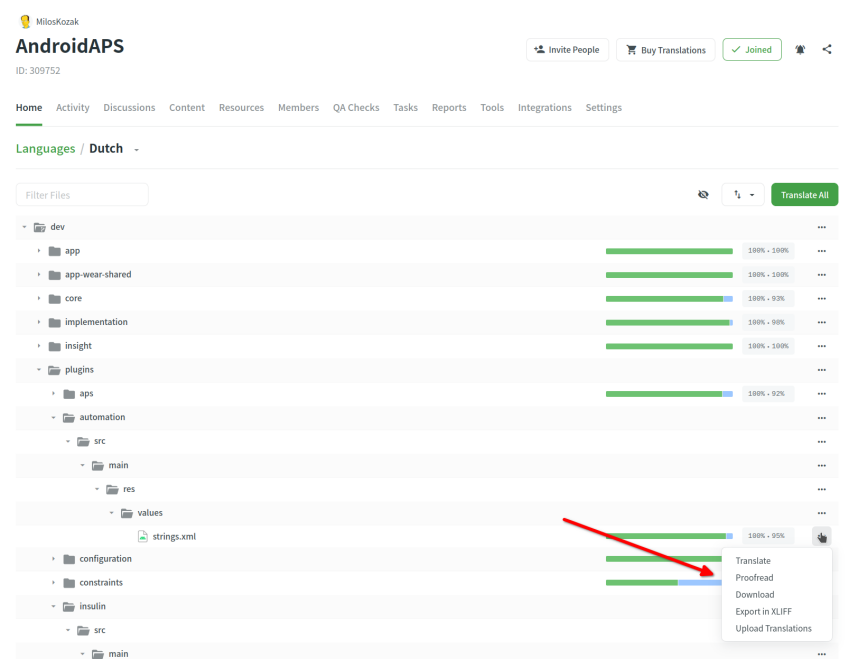
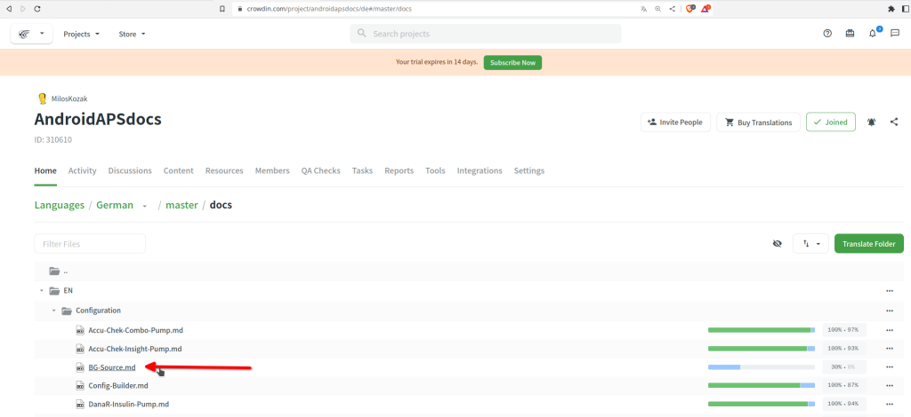
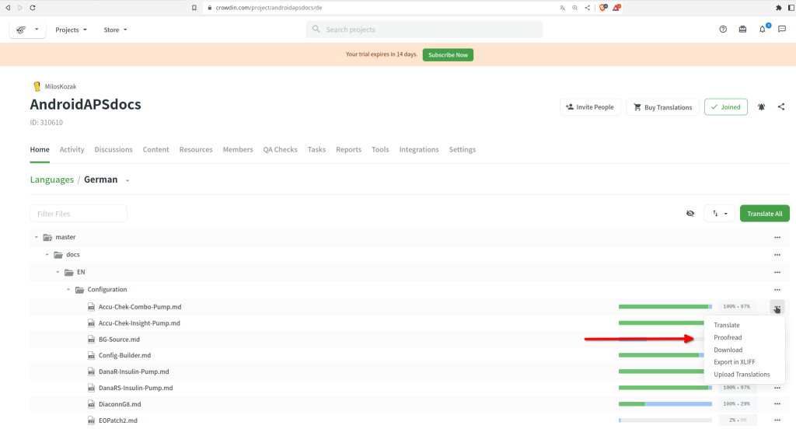

# Come tradurre le stringhe per l'app AAPS o la documentazione

* Per le stringhe usate nell'app vai su [https://crowdin.com/project/androidaps](https://crowdin.com/project/androidaps) e accedi con il tuo account GitHub
* Per la documentazione visita [https://crowdin.com/project/androidapsdocs](https://crowdin.com/project/androidapsdocs) e accedi con il tuo account GitHub

* Invia una richiesta di adesione al team della documentazione. Per farlo clicca sulla bandiera della lingua desiderata e poi sul pulsante "Join" in alto a destra nella pagina successiva. Specifica la lingua, fornisci alcune informazioni su di te e sulla tua esperienza con AAPS e se vuoi essere traduttore o revisore (solo persone esperte in traduzione + utenti AAPS avanzati).

```{admonition} Time for Approval
:class: note

L'approvazione è un passaggio manuale. In quanto organizzazione no-profit non forniamo SLA, ma in generale l'approvazione verrà effettuata in meno di 1 giorno. In caso contrario contatta il team di documentazione tramite Facebook o Discord.
```

* Quando vieni approvato, clicca sulla bandiera 

## Traduzione dell'app

(translations-translate-strings-for-AAPS-app)=
### Tradurre le stringhe per l'app AAPS

* Se non hai preferenze per le stringhe da tradurre clicca semplicemente sul pulsante "Traduci tutto" per iniziare. Ti mostrerà le stringhe che necessitano di traduzione.

   

* Se vuoi tradurre un file specifico cerca il file tramite la finestra di dialogo di ricerca o la struttura ad albero e clicca sul nome del file per iniziare il lavoro di traduzione delle stringhe in quel file.

   

* Traduci le frasi sul lato sinistro aggiungendo il nuovo testo tradotto o usa e modifica i suggerimenti

   


### Revisione delle stringhe per l'app AAPS

* I revisori iniziano selezionando "Revisione" dalla schermata principale della lingua.

   


  e approvano i testi tradotti

   

Quando un revisore approva una traduzione, questa verrà aggiunta alla versione successiva di AAPS.

(translations-translation-of-the-documentation)=
## Traduzione della documentazione

* Clicca sul nome della pagina della documentazione che vuoi tradurre




* Traduci frase per frase

    1. Il testo giallo è il testo su cui stai lavorando al momento.

    1. Il testo verde è già tradotto. Non è necessario rifarlo.

    1. Il testo rosso è il testo rimanente che deve essere tradotto.

    1. Questo è il testo sorgente su cui stai lavorando al momento

    1. Questa è la traduzione che stai preparando. Puoi copiare il testo dall'alto o selezionare uno dei suggerimenti qui sotto.

    1. Questi sono i suggerimenti per una traduzione. In particolare puoi vedere quanto Crowdin valuta questo come corrispondente o se era già presente in passato e emerge attraverso riorganizzazioni del testo ma senza cambiamento di contenuto.
    1. Premi il pulsante "salva" per salvare una proposta di traduzione. Verrà quindi promossa a un revisore per il controllo finale.


* Una pagina tradotta non verrà pubblicata nella documentazione prima che:

    1. la traduzione sia stata revisionata

    1. la sincronizzazione tra Crowdin e Github sia completata (una volta all'ora) creando una PR per Github.

    1. la PR in Github sia stata approvata.

In generale questo richiede 1-3 giorni, ma durante le vacanze potrebbe richiedere un po' di più.

### Traduzione dei link

```{admonition} Links are not translated anymore
:class: note

I link non vengono più tradotti. In passato avevamo un argomento qui, ma è scomparso perché con la migrazione a Markdown e myst_parser creiamo esplicitamente etichette nel testo inglese e propaghiamo queste etichette automaticamente alle lingue.

```

Stai traducendo il testo che rappresenta il link. Devi fare attenzione a **non** rimuovere il link che è rappresentato da una coppia di tag `<0></0>` o, se ce ne sono più in un paragrafo, da altri numeri.

È compito dei revisori prestare particolare attenzione a questo!

### Proofreading

* I revisori devono passare alla modalità di revisione

   


  e approvare i testi tradotti

   

* Quando un revisore approva una traduzione, questa verrà aggiunta alla build successiva della documentazione, che avviene senza un calendario fisso su richiesta ma circa una volta alla settimana, eccetto durante le vacanze. Per accelerare il processo puoi informare il team della documentazione sulle nuove traduzioni.
