# Un account Google dedicato per AAPS (opzionale)

Alcuni utenti di **AAPS** preferiscono usare il proprio account email principale anche per **AAPS**. In alternativa, alcuni utenti di **AAPS** (o i loro caregiver) configurano un account email **AAPS** dedicato — questo è opzionale; di seguito diamo un esempio su come farlo.

Se non si vuole configurare un account Gmail dedicato ad **AAPS**, si può passare direttamente alla sezione successiva, [compilazione di AAPS](../SettingUpAaps/BuildingAaps.md).

```{admonition} Advantages of a dedicated Google account for AAPS
:class: dropdown

- Lo spazio Google Drive dedicato significa che non si rischia di riempire il limite del Google Drive personale con le **Esportazioni Preferenze**.
- Ogni versione di **AAPS** (e delle app di supporto come xDrip+, BYODA, ecc.) sarà archiviata in un unico posto indipendente dall'hardware del computer. Se il PC o il telefono vengono rubati/persi/rotti, si avrà ancora accesso a tutto.
- Armonizzando la configurazione, il supporto online sarà più semplice tra utenti con strutture di cartelle simili.
- A seconda della configurazione (vedere di seguito), si avrà un'identità separata come alias per comunicare all'interno della comunità che può proteggere la privacy. 
- I bambini con T1D possono preservare il proprio account email "quotidiano" da minorenni, utilizzando **AAPS** e le funzionalità associate che richiedono un account adulto.
- Gmail consente di registrare fino a 4 account con lo stesso numero di telefono.
```

## Come configurare un account Google dedicato per AAPS

(⌛Circa 10 minuti)

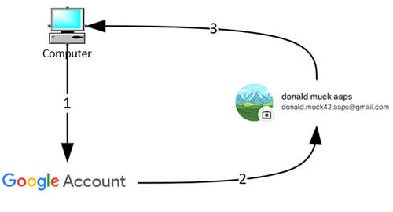

Requisiti:

* Si dispone di un PC Windows (Windows 10 o versione successiva) e di uno smartphone Android (Android 9 o versione successiva) che ospiterà l'app **AAPS**. Entrambi hanno tutti gli ultimi aggiornamenti di sicurezza, accesso a Internet e privilegi di amministratore, poiché alcuni passaggi richiedono il download e l'installazione di programmi.
* Lo smartphone Android è già configurato con il proprio indirizzo email personale "quotidiano", ad esempio un account Gmail.

```{admonition} Things to consider when setting up your new account
:class: dropdown
- Si potrebbe usare un nome diverso dal proprio, che abbia rilevanza per l'account (come t1dsuperstar) per ragioni di privacy. È quindi possibile usarlo nei forum pubblici di **AAPS** mantenendo privata la propria identità. Poiché Google richiede un'email e un numero di telefono di recupero, è ancora tracciabile.
- Il nuovo account **AAPS** utilizzerà lo stesso numero di telefono per la verifica del proprio account "_quotidiano_". Utilizzerà l'indirizzo email "quotidiano" per la verifica;
- Verrà configurato l'inoltro delle email in modo che qualsiasi email inviata al nuovo account AAPS dedicato venga inoltrata a quello principale (quindi non è necessario controllare due caselle di posta diverse);
- Usare password separate per il proprio account Gmail _quotidiano_ e per l'account Gmail dedicato ad AAPS
- Se si usa l'autenticazione "a 2 passaggi" di Google (nota come multifactore) per un account Gmail, è conveniente farlo per entrambi gli account Gmail.
- Se si prevede di usare le "Passkey" di Google, assicurarsi di registrare più dispositivi. Questo per non bloccarsi fuori. Farlo solo su dispositivi a cui nessun altro può accedere (_ovvero_ non su un PC con un account condiviso che altre persone possono sbloccare).
```


```{admonition}  Video Walkthrough! 
:class: Note
Clicca [qui](<https://drive.google.com/file/d/1dMZTIolO-kd2eB0soP7boEVtHeCDEQBF/view?usp=drive_link>) per una guida video su come configurare un account Google dedicato.
```

 Questi sono i passaggi descritti nel video:

In questo esempio: 
- Il tuo account Google "_Quotidiano_" esistente è <donald.muck42@gmail.com> ; 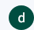
- Il tuo nuovo account Gmail "_AAPS_" sarà: <donald.muck42.aaps@gmail.com>; 


### Vai su <https://account.google.com> 

 Se sei già connesso a Google, si verrà indirizzati alla pagina "My Account" "_Quotidiana_". (1) Fai clic in alto a destra della pagina sulla foto del profilo (in questo caso, un semplice  (2) seleziona "_aggiungi un altro account_".

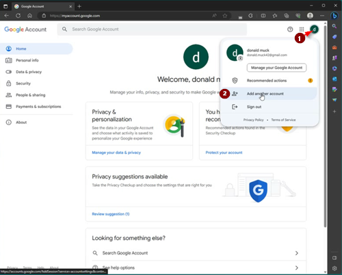


### Inserisci i dettagli del NUOVO account dedicato: 

- Inserisci il nuovo account: 
- Crea Account
- per uso personale. 


### Inserisci il tuo personaggio:
 - Inserisci nome
 - cognome
 - data di nascita (deve essere un'età adulta)

### Scegli il tuo NUOVO indirizzo email e password

Questo esempio aggiunge ".AAPS" a quello esistente di Donald Muck…\
Imposta una password

### Inserisci un numero di telefono che può ricevere la verifica SMS

Gmail ti invierà ora un codice univoco da inserire per la convalida.

### Inserisci l'indirizzo email di recupero

In questo caso sarà il tuo indirizzo email "_quotidiano_" esistente…

### Finisci di configurare l'account

Gmail mostrerà il nome dell'account. Ti chiederà di accettare i termini e le condizioni di Gmail e di confermare le impostazioni di personalizzazione.

### Personalizza la visualizzazione del nuovo profilo

A questo punto dovresti essere sulla pagina MyAccount di Gmail che mostra il tuo nuovo account email dedicato ad **AAPS**. La foto del profilo verrà impostata per impostazione predefinita sulla prima lettera del tuo nome. Cambiala con qualcosa di unico per evitare confusione… in questo esempio, Donald.Muck.AAPS ha sostituito  con 

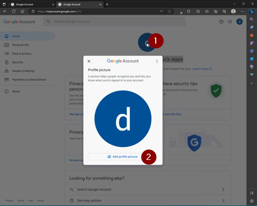\
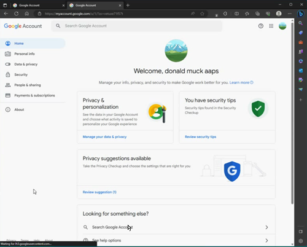

### Apri il sito web di Gmail in entrambe le finestre per configurare il nuovo account

Per non dover monitorare un account email separato, inoltra tutte le email dal nuovo account dedicato ad **AAPS** al tuo account quotidiano.\
Questa parte può essere un po' confusa, poiché dovrai passare avanti e indietro tra i due account. Per semplificare, apri 2 finestre del browser separate una sull'altra:

1. Sposta il browser esistente nella parte superiore dello schermo e ridimensionalo in modo che occupi solo circa la metà superiore dello schermo…
2. Fai clic con il pulsante destro del mouse sull'icona del browser nella barra delle applicazioni
3. Dal menu seleziona "Nuova finestra"... e regolala in modo che occupi solo la metà inferiore dello schermo.

Apri <https://gmail.com> in ogni finestra del browser. Assicurati che il tuo account personale sia in alto e il nuovo account **AAPS** dedicato sia in basso, facilmente identificabile dalla foto del profilo nell'angolo in alto a destra. (se necessario è sempre possibile cambiare account facendo clic sulla foto del profilo e selezionando quello corretto.)

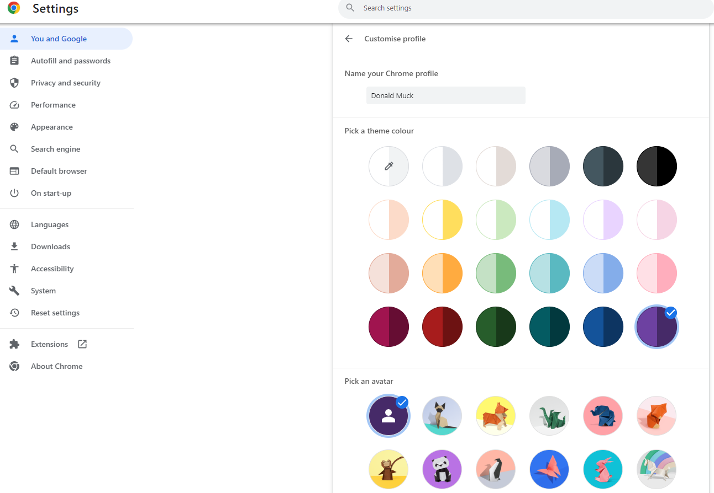

La schermata principale di Gmail dovrebbe apparire così:\
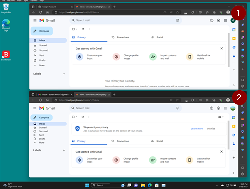

 ### Nel nuovo account Gmail (finestra in basso), apri le impostazioni Gmail…

- Fai clic sull'ingranaggio a sinistra della foto del profilo
- poi seleziona "**Visualizza tutte le impostazioni**"

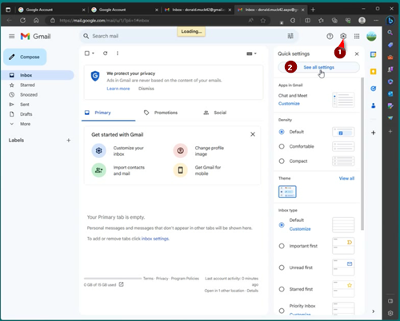

### Configura l'inoltro…

- Fai clic sulla scheda delle impostazioni "Inoltro e POP/IMAP"
- Fai clic su "aggiungi un indirizzo di inoltro"
- Aggiungi il tuo indirizzo email "quotidiano"
- Gmail invierà un codice di verifica al tuo indirizzo email "quotidiano".
- Tornerai al tuo profilo quotidiano e farai clic sul link per verificare di accettare l'inoltro (o prenderai il codice dall'email di verifica di Gmail nella finestra Gmail "quotidiana" e lo incollerai nella finestra Gmail "nuovo AAPS dedicato").

C'è un bel po' di passaggi avanti e indietro tra le finestre, ma questo garantirà che quando controlli le email del tuo account "quotidiano", vedrai anche le email inoltrate dal tuo account AAPS dedicato, come gli avvisi Gmail.

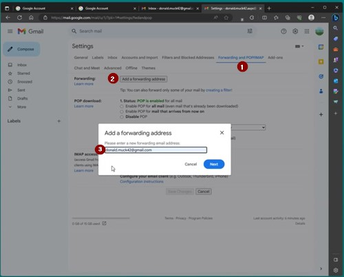

### Verifica l'indirizzo email inoltrato

- Nella Gmail "Quotidiana" (finestra in alto), riceverai l'email "Conferma inoltro Gmail".
- Aprila e "fai clic sul link per confermare la richiesta"

### Archivia le email inoltrate nel nuovo account Gmail dedicato (finestra in basso)

<!---->

1. Aggiorna la finestra in basso
2. Spunta "inoltra le email in arrivo"
3. E archivia la copia di Gmail (per mantenere pulita la nuova casella di posta dedicata)
4. Scorri fino in fondo per salvare le modifiche\
   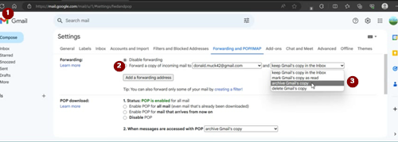

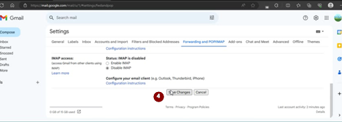

Congratulazioni! Hai creato un account Google dedicato ad AAPS. Il passo successivo è [compilare l'app AAPS](../SettingUpAaps/BuildingAaps.md).