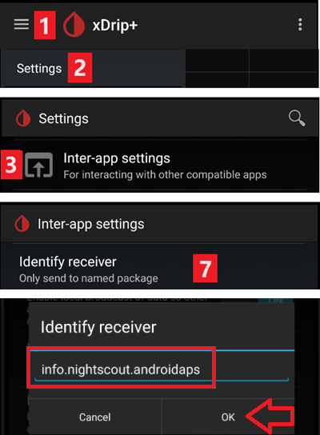

# FAQ per i loopers

Come aggiungere domande alle FAQ: Seguire queste [istruzioni](../SupportingAaps/HowToEditTheDocs.md)

## Generale

### Posso semplicemente scaricare il file di installazione di AAPS?

No. Non esiste un file apk scaricabile per AAPS. Devi [compilarlo](../SettingUpAaps/BuildingAaps.md) tu stesso. Ecco il motivo:

AAPS viene usato per controllare il microinfusore e somministrare insulina. Secondo le normative vigenti in Europa, tutti i sistemi classificati come IIa o IIb sono dispositivi medici che richiedono l'approvazione normativa (marchio CE) che richiede vari studi e approvazioni. Distribuire un dispositivo non regolamentato è illegale. Normative simili esistono in altre parti del mondo.

Questa regolamentazione non è limitata solo alle vendite (nel senso di ricevere denaro per qualcosa) ma si applica a qualsiasi distribuzione (anche gratuita). Costruire un dispositivo medico per se stessi è l'unico modo per utilizzare l'app nel rispetto di queste normative.

Per questo motivo gli apk non sono disponibili.

(FAQ-how-to-begin)=
### Come iniziare?
Prima di tutto, devi **procurarti i componenti hardware compatibili con il loop**:

* Un [microinfusore di insulina supportato](../Getting-Started/CompatiblePumps.md),
* uno [smartphone Android](../Getting-Started/Phones.md) (Apple iOS non è supportato da AAPS - puoi verificare [iOS Loop](https://loopkit.github.io/loopdocs/)) e
* un [sistema di monitoraggio continuo del glucosio](../Getting-Started/CompatiblesCgms.md).

In secondo luogo, devi **configurare i componenti software**: [AAPS](../SettingUpAaps/BuildingAaps.md), [sorgente CGM/FGM](../Getting-Started/CompatiblesCgms.md) e un [server di reporting](../SettingUpAaps/SettingUpTheReportingServer.md).

In terzo luogo, devi imparare e **comprendere il progetto di riferimento OpenAPS per verificare i fattori di trattamento**. Il principio fondante del loop chiuso è che la [velocità basale e il rapporto carboidrati](../SettingUpAaps/YourAapsProfile.md) siano accurati. Tutte le raccomandazioni assumono che le tue necessità basali siano soddisfatte e che eventuali picchi o cali che stai vedendo siano il risultato di altri fattori che quindi richiedono alcune correzioni occasionali (esercizio fisico, stress ecc.). Le correzioni che il loop chiuso può apportare per sicurezza sono state limitate (vedere la velocità basale temporanea massima consentita nel [Progetto di riferimento OpenAPS](https://openaps.org/reference-design/)), il che significa che non vuoi sprecare il dosaggio consentito per correggere una basale di fondo errata. Se ad esempio frequentemente hai basale bassa in avvicinamento a un pasto, è probabile che la tua basale necessiti di aggiustamento. Puoi usare [Autotune](https://openaps.readthedocs.io/en/latest/docs/Customize-Iterate/autotune.html#phase-c-running-autotune-for-suggested-adjustments-without-an-openaps-rig) per analizzare un ampio insieme di dati per suggerire se e come le basali e/o l'ISF debbano essere aggiustate, e anche se il rapporto carboidrati debba essere modificato. Oppure puoi testare e impostare la basale nel [modo tradizionale](https://integrateddiabetes.com/basal-testing/).

### Quali sono le implicazioni pratiche del loop?

#### Protezione con password
Se non vuoi che le tue preferenze vengano modificate facilmente, puoi proteggere con password il menu delle preferenze selezionando in esso "password per le impostazioni" e digitando la password scelta. La prossima volta che accedi al menu delle preferenze, chiederà quella password prima di procedere. Se in seguito vuoi rimuovere l'opzione password, vai in "password per le impostazioni" ed elimina il testo.

#### Smartwatch Android Wear
Se prevedi di usare l'app Android Wear per fare boli o modificare le impostazioni, devi assicurarti che le notifiche di AAPS non siano bloccate. La conferma dell'azione avviene tramite notifica.

(FAQ-disconnect-pump)=
#### Disconnect pump
Se togli il microinfusore per fare la doccia, il bagno, nuotare, praticare sport o per altre attività, devi comunicare ad AAPS che non viene erogata insulina per mantenere corretto l'IOB.

Il microinfusore può essere disconnesso usando l'icona di Stato Loop nella [Schermata principale di AAPS](#AapsScreens-loop-status).

#### Le raccomandazioni non si basano su una sola lettura CGM
Per sicurezza, le raccomandazioni si basano non su una sola lettura CGM ma sulla media delta.  Pertanto, se si perdono alcune letture, potrebbe volerci un po' di tempo dopo aver ricevuto di nuovo i dati prima che AAPS riprenda il loop.

#### Ulteriori letture
Ci sono diversi blog con buoni consigli per aiutarti a capire le implicazioni pratiche del loop:
  * [Ottimizzazione delle impostazioni](https://seemycgm.com/2017/10/29/fine-tuning-settings/) See my CGM
  * [Perché il DIA è importante](https://seemycgm.com/2017/08/09/why-dia-matters/) See my CGM
  * [Limitare i picchi post-pasto](https://diyps.org/2016/07/11/picture-this-how-to-do-eating-soon-mode/) #DIYPS
  * [Ormoni e autosens](https://seemycgm.com/2017/06/06/hormones-2/) See my CGM

### Qual è l'equipaggiamento di emergenza consigliato da portare con sé?
Devi avere con te lo stesso equipaggiamento di emergenza come ogni altro T1D con terapia con microinfusore.  Quando si fa loop con AAPS, si consiglia vivamente di avere il seguente equipaggiamento aggiuntivo con sé o nelle vicinanze:

* Batteria esterna e cavi per caricare lo smartphone, l'orologio e (se necessario) il lettore BT o il dispositivo Link
* Pump batteries
* [APK](../SettingUpAaps/BuildingAaps.md) attuale e [file delle preferenze](../Maintenance/ExportImportSettings.md) per AAPS e qualsiasi altra app in uso (ad es. xDrip+, BYO Dexcom) sia localmente che nel cloud (Dropbox, Google Drive).

### Come si può attaccare il CGM/FGM in modo sicuro?
Si può usare il nastro adesivo.  Ci sono diversi "sovrapatch" pre-forati per i comuni sistemi CGM disponibili (cerca su Google, eBay o Amazon). Alcuni loopers usano il meno costoso nastro kinesiologico standard o rocktape.

Si può fissare.  Si possono anche acquistare braccialetti per il braccio superiore che fissano il CGM/FGM con una fascia (cerca su Google, eBay o Amazon).

## Algoritmo APS
### Perché mostra "dia:3" nella scheda "OPENAPS AMA" anche se ho un DIA diverso nel mio profilo?

In AMA, il DIA in realtà non significa la 'durata dell'azione dell'insulina'. È un parametro che in passato era collegato al DIA. Ora significa 'in quale tempo la correzione dovrebbe essere completata'. Non ha nulla a che fare con il calcolo dell'IOB. In OpenAPS SMB, questo parametro non è più necessario.

## Altre impostazioni

### Impostazioni Nightscout

#### AAPSClient dice 'non consentito' e non carica i dati. Cosa posso fare?
In AAPSClient controlla le 'Impostazioni di connessione'. Forse non sei effettivamente in una WLAN consentita o hai attivato 'Solo se in carica' e il cavo di ricarica non è collegato.

### Impostazioni CGM

#### Perché AAPS dice 'La sorgente BG non supporta il filtraggio avanzato'?
Se si usa un CGM/FGM diverso da Dexcom G5 o G6 in modalità nativa xDrip, si riceverà questo avviso nella scheda AAPS OpenAPS. Vedere [Uniformazione dei dati di glicemia](../CompatibleCgms/SmoothingBloodGlucoseData.md) per maggiori dettagli.

### Pump

#### Dove posizionare il microinfusore?
Ci sono innumerevoli possibilità di posizionare il microinfusore. Non importa se si fa loop o no.

#### Batterie
Il loop può scaricare la batteria del microinfusore più velocemente del normale perché il sistema interagisce tramite Bluetooth molto di più rispetto a un utente manuale.  È consigliabile cambiare la batteria al 25% poiché la comunicazione diventa difficile in quel momento.  È possibile impostare avvisi di avvertimento per la batteria del microinfusore usando la variabile PUMP_WARN_BATT_P nel sito Nightscout.  Consigli per aumentare la durata della batteria includono:
* ridurre il tempo in cui l'LCD rimane acceso (nel menu delle impostazioni del microinfusore)
* ridurre il tempo in cui la retroilluminazione rimane accesa (nel menu delle impostazioni del microinfusore)
* selezionare le impostazioni di notifica con un segnale acustico anziché vibrazione (nel menu delle impostazioni del microinfusore)
* premere i pulsanti sul microinfusore solo per ricaricare, usare AAPS per visualizzare tutta la cronologia, il livello della batteria e il volume del serbatoio.
* L'app AAPS potrebbe essere spesso chiusa per risparmiare energia o liberare RAM su alcuni telefoni. Quando AAPS viene reinizializzato a ogni avvio, stabilisce una connessione Bluetooth con il microinfusore e rilegge la velocità basale corrente e la cronologia dei boli. Ciò consuma batteria. Per vedere se questo sta accadendo, vai a Preferenze > NSClient e abilita 'Registra avvio app su NS'. Nightscout riceverà un evento ad ogni riavvio di AAPS, il che rende facile tracciare il problema.  Per ridurre questo accadimento, metti in whitelist l'app AAPS nelle impostazioni della batteria del telefono per impedire al monitor di risparmio energetico dell'app di chiuderla.

   Ad esempio, per mettere in whitelist su un telefono Samsung con Android Pie:
   * Vai a Impostazioni -> Assistenza dispositivo -> Batteria
   * Scorri finché non trovi AAPS e selezionalo
   * Deseleziona "Metti app in sospensione"
   * VAI ANCHE a Impostazioni -> App -> (Simbolo dei tre cerchi in alto a destra dello schermo) seleziona "accesso speciale" -> Ottimizza utilizzo batteria
   * Scorri fino ad AAPS e assicurati che sia deselezionato.

* pulire i terminali della batteria con un tampone di alcol per garantire che non rimangano cera/grasso di fabbricazione.
* per i [microinfusori Dana R/RS](../CompatiblePumps/DanaRS-Insulin-Pump.md) la procedura di avvio attira una corrente elevata attraverso la batteria per rompere intenzionalmente il film di passivazione (previene la perdita di energia durante lo stoccaggio) ma non sempre funziona per romperlo al 100%.  Rimuovere e reinserire la batteria 2-3 volte finché non mostra il 100% sullo schermo, o usare la chiave della batteria per cortocircuitarla brevemente prima dell'inserimento applicandola su entrambi i terminali per un istante.
* vedere anche più consigli per [particolari tipi di batteria](#Accu-Chek-Combo-Tips-for-Basic-usage-battery-type-and-causes-of-short-battery-life)

#### Cambio di serbatoio e cannula
Il cambio della cartuccia non può essere effettuato tramite AAPS ma deve essere eseguito come prima direttamente tramite il microinfusore.
* Tieni premuto su "Loop Aperto"/"Loop Chiuso" nella scheda Home di AAPS e seleziona 'Sospendi Loop per 1h'
* Ora disconnetti il microinfusore e cambia il serbatoio come da istruzioni del microinfusore.
* Anche il riempimento del tubo e della cannula può essere eseguito direttamente sul microinfusore. In questo caso usa il [pulsante INNESCO/RIEMPI](#screens-action-tab) nella scheda azioni solo per registrare il cambio.
* Una volta riconnesso al microinfusore, continua il loop tenendo premuto su 'Sospeso (X m)'.

Il cambio di una cannula tuttavia non usa la funzione "riempi set di infusione" del microinfusore, ma riempie il set di infusione e/o la cannula usando un bolo che non appare nella cronologia dei boli. Ciò significa che non interrompe una basale temporanea attualmente in corso.  Nella scheda Azioni (Azi), usa il [pulsante INNESCO/RIEMPI](#screens-action-tab) per impostare la quantità di insulina necessaria per riempire il set di infusione e iniziare il riempimento. Se la quantità non è sufficiente, ripeti il riempimento.  Puoi impostare i pulsanti di quantità predefinita in Preferenze > Altro > Quantità insulina standard riempimento/innesco.  Consulta il libretto delle istruzioni nella scatola della cannula per quante unità devono essere innestate in base alla lunghezza dell'ago e alla lunghezza del tubo.

### Sfondo

Puoi trovare lo sfondo AAPS per il tuo telefono nella [pagina dei telefoni](#Phones-phone-wallpaper).

### Utilizzo quotidiano

#### Hygiene

##### Cosa fare quando si fa la doccia o il bagno?
Puoi rimuovere il microinfusore mentre fai la doccia o il bagno. Per questo breve periodo potresti non averne bisogno, ma dovresti dire ad AAPS che ti sei disconnesso in modo che i calcoli IOB siano corretti. Vedi [la descrizione sopra](#FAQ-disconnect-pump).

#### Lavoro
A seconda del tuo lavoro, potresti scegliere di usare diversi fattori di trattamento nei giorni lavorativi. Come looper dovresti considerare un [cambio profilo](../DailyLifeWithAaps/ProfileSwitch-ProfilePercentage.md) per la tipica giornata lavorativa.  Ad esempio, potresti passare a un profilo superiore al 100% se hai un lavoro meno impegnativo (ad es. seduto a una scrivania), o inferiore al 100% se sei attivo e in piedi tutto il giorno.  Potresti anche considerare un target temporaneo alto o basso o uno [spostamento temporale del profilo](#ProfileSwitch-ProfilePercentage-time-shift-of-the-circadian-percentage-profile) quando lavori molto prima o dopo il solito, o se lavori su turni diversi. Puoi anche creare un secondo profilo (ad es. 'casa' e 'giorno lavorativo') e fare un cambio profilo quotidiano verso il profilo di cui hai effettivamente bisogno.

### Attività ricreative

(FAQ-sports)=
#### Sport
Devi rielaborare le tue vecchie abitudini sportive dai tempi pre-loop. Se consumi semplicemente uno o più carboidrati sportivi come prima, il sistema a loop chiuso li riconoscerà e li correggerà di conseguenza.

Quindi, avresti più carboidrati attivi, ma allo stesso tempo il loop contrerebbe erogando insulina.

Quando si fa loop, dovresti provare questi passaggi:
* Effettua un [cambio profilo](../DailyLifeWithAaps/ProfileSwitch-ProfilePercentage.md) < 100%.
* Imposta un [target temporaneo di attività](#TempTargets-activity-temp-target) superiore al target standard.
* Se stai usando SMB, assicurati che ["Abilita SMB con target temporanei alti"](#Open-APS-features-enable-smb-with-high-temp-targets) e ["Abilita sempre SMB"](#Open-APS-features-enable-smb-always) siano disabilitati.

La pre e post-elaborazione di queste impostazioni è importante. Apporta le modifiche in tempo prima dello sport e considera l'effetto del riempimento muscolare.

Se fai sport regolarmente alla stessa ora (cioè lezione di sport in palestra) puoi considerare di usare le [automazioni](../DailyLifeWithAaps/Automations.md) per il cambio profilo e TT. Anche l'automazione basata sulla posizione potrebbe essere un'idea ma rende la pre-elaborazione più difficile.

La percentuale del cambio profilo, il valore per il target temporaneo di attività e il momento migliore per le modifiche sono individuali. Inizia dal lato sicuro se stai cercando il valore giusto per te (inizia con una percentuale più bassa e un TT più alto).

#### Sesso
Puoi rimuovere il microinfusore per essere 'libero', ma dovresti dirlo ad AAPS in modo che i calcoli IOB siano corretti.  Vedi [la descrizione sopra](#FAQ-disconnect-pump).

#### Consumo di alcol
Il consumo di alcol è rischioso in modalità loop chiuso perché l'algoritmo non riesce a prevedere correttamente l'influenza dell'alcol sulla glicemia. Devi trovare il tuo metodo per gestire questo usando le seguenti funzioni in AAPS:

* Disattivare la modalità loop chiuso e trattare il diabete manualmente oppure
* impostare target temporanei alti e disattivare UAM per evitare che il loop aumenti l'IOB a causa di un pasto non annunciato oppure
* effettuare un cambio profilo a notevolmente meno del 100%

Quando si consuma alcol, è sempre necessario tenere d'occhio il CGM per evitare manualmente un'ipoglicemia mangiando carboidrati.

#### Dormire

##### Come posso fare loop durante la notte senza radiazioni da cellulare e WIFI?
Molti utenti mettono il telefono in modalità aereo di notte. Se vuoi che il loop ti supporti mentre dormi, procedi come segue (funzionerà solo con una sorgente BG locale come xDrip+ o ['Costruisci la tua app Dexcom'](#DexcomG6-if-using-g6-with-build-your-own-dexcom-app), NON funzionerà se ricevi le letture glicemia tramite Nightscout):

1. Attiva la modalità aereo sul cellulare.
2. Attendi che la modalità aereo sia attiva.
3. Attiva il Bluetooth.

Non stai ricevendo chiamate e non sei connesso a Internet. Ma il loop è ancora in esecuzione.

Alcune persone hanno riscontrato problemi con la trasmissione locale (AAPS non riceve valori glicemia da xDrip+) quando il telefono è in modalità aereo. Vai a Impostazioni > Impostazioni inter-app > Identifica il ricevitore e inserisci `info.nightscout.androidaps`.

#### Viaggi

##### Come gestire i cambi di fuso orario?
Con Dana R e Dana R Korean non devi fare nulla. Per altri microinfusori vedere la pagina [viaggi con cambi di fuso orario](../DailyLifeWithAaps/TimezoneTraveling-DaylightSavingTime.md) per maggiori dettagli.

### Argomenti medici

#### Ospedalizzazione
Se vuoi condividere alcune informazioni su AAPS e il loop fai-da-te con i tuoi clinici, puoi stampare la [guida ad AAPS per clinici](../UsefulLinks/ClinicianGuideToAaps.md).

#### Visita medica con il tuo endocrinologo

##### Reportistica
Puoi mostrare i tuoi report Nightscout (https://IL-TUO-SITO-NS.com/report) o controllare [Nightscout Reporter](https://nightscout-reporter.zreptil.de/).

## Domande frequenti su Discord e relative risposte...

### Il mio problema non è elencato qui.

[Informazioni su come ottenere aiuto.](../GettingHelp/WhereCanIGetHelp.md)

### Il mio problema non è elencato qui ma ho trovato la soluzione

[Informazioni su come ottenere aiuto.](../GettingHelp/WhereCanIGetHelp.md)

**Ricordaci di aggiungere la tua soluzione a questo elenco!**

### AAPS si interrompe ogni giorno circa alla stessa ora.

Ferma Google Play Protect. Controlla le app di "pulizia" (es. CCleaner ecc.) e disinstallale. AAPS / menu a 3 punti / Informazioni / segui il link "Mantieni l'app in esecuzione in background" per interrompere tutte le ottimizzazioni della batteria.

### Come organizzare i miei backup?

Esporta le impostazioni molto regolarmente: dopo ogni cambio pod, dopo aver modificato il profilo, quando hai convalidato un obiettivo, se cambi il microinfusore… Anche se non cambia nulla, esporta una volta al mese. Mantieni diversi vecchi file di esportazione.

Copia su un'unità internet (Dropbox, Google ecc.): tutti gli apk usati per installare le app sul telefono (AAPS, xDrip, BYODA, LibreLink patchato…) nonché i file delle impostazioni esportati da tutte le app.

### Ho problemi, errori durante la compilazione dell'app.

Per favore

* controlla [Risoluzione dei problemi di Android Studio](../GettingHelp/TroubleshootingAndroidStudio) per errori tipici e
* i consigli con una [guida passo passo](https://docs.google.com/document/d/1oc7aG0qrIMvK57unMqPEOoLt-J8UT1mxTKdTAxm8-po).

### Sono bloccato su un obiettivo e ho bisogno di aiuto.

Fai uno screenshot della domanda e delle risposte. Pubblicalo nel canale Discord AAPS. Non dimenticare di dire quali opzioni hai scelto (o no) e perché. Riceverai suggerimenti e aiuto, ma dovrai trovare le risposte da solo.

### Come reimpostare la password in AAPS v2.8.x?

Apri il menu hamburger, avvia la Procedura guidata di configurazione e inserisci la nuova password quando richiesto. Puoi uscire dalla procedura guidata dopo la fase della password.

### Come reimpostare la password in AAPS v3.x

Trovi la documentazione [qui](#Update3_0-reset-master-password).

### Il mio link/microinfusore/pod non risponde (RL/OL/EmaLink…)

Con alcuni telefoni, ci sono disconnessioni Bluetooth dai Link (RL/OL/EmaL...).

Alcuni hanno anche Link non responsivi (AAPS dice che sono connessi ma i Link non riescono a raggiungere o comandare il microinfusore.)

Il modo più semplice per far funzionare insieme tutte queste parti è: 1/ Elimina il Link da AAPS 2/ Spegni il Link 3/ Menu a 3 punti AAPS, esci da AAPS 4/ Tieni premuta l'icona AAPS, menu Android, informazioni sull'app AAPS, Forza arresto AAPS e poi Elimina memoria cache (Non eliminare la memoria principale!) 4bis/ Raramente alcuni telefoni potrebbero richiedere un riavvio qui. Puoi provare senza riavvio. 5/ Accendi il Link 6/ Avvia AAPS 7/ Scheda Pod, menu a 3 punti, cerca e connetti il Link

### Errore di compilazione: nome file troppo lungo

Mentre cerco di compilare ottengo un errore che indica che il nome del file è troppo lungo. Possibili soluzioni: Sposta i tuoi sorgenti in una directory più vicina alla directory radice del tuo drive (ad es. "c:\src\AndroidAPS-EROS").

Da Android Studio: assicurati che "Gradle" abbia finito di sincronizzarsi e indicizzarsi dopo aver aperto il progetto e fatto il pull da GitHub. Esegui Build->Pulisci progetto prima di fare una Ricostruzione del progetto. Esegui File->Invalida cache e riavvia Android Studio.

### Avviso: Versione dev in esecuzione. Loop chiuso disabilitato

AAPS non è in esecuzione in "modalità sviluppatore". AAPS mostra il seguente messaggio: "versione dev in esecuzione. Loop chiuso disabilitato".

Assicurati che AAPS sia in esecuzione in "modalità sviluppatore": posiziona un file denominato "engineering_mode" nella posizione "AAPS/extra". Qualsiasi file andrà bene purché sia nominato correttamente. Assicurati di riavviare AAPS affinché trovi il file e entri in "modalità sviluppatore".

Suggerimento: fai una copia di un file di log esistente e rinominalo in "engineering_mode" (nota: nessuna estensione del file!).

### Dove posso trovare i file delle impostazioni?

I file delle impostazioni saranno archiviati nella memoria interna del telefono nella directory "/AAPS/preferences". ATTENZIONE: Assicurati di non perdere la password perché senza di essa non potrai importare un file delle impostazioni crittografato!

### Come configurare il risparmio batteria?

Configurare correttamente la gestione dell'alimentazione è importante per impedire al sistema operativo del telefono di sospendere AAPS e le app e i servizi correlati quando il telefono non viene utilizzato. Di conseguenza AAPS non può svolgere il suo lavoro e/o le connessioni Bluetooth per il sensore e Rileylink (RL) potrebbero essere interrotte causando avvisi "microinfusore disconnesso" ed errori di comunicazione. Sul telefono, vai alle impostazioni -> App e disabilita il risparmio batteria per: AAPS, xDrip o l'app BYODA/Dexcom, L'app di sistema Bluetooth (potrebbe essere necessario selezionare prima la visualizzazione delle app di sistema). In alternativa, disabilita completamente tutto il risparmio batteria sul telefono. Di conseguenza la batteria potrebbe scaricarsi più velocemente, ma è un buon modo per scoprire se il risparmio batteria sta causando il problema. Il modo in cui viene implementato il risparmio batteria dipende molto dalla marca, dal modello e/o dalla versione del sistema operativo del telefono. Per questo motivo è quasi impossibile fornire istruzioni per impostare correttamente il risparmio batteria per la tua configurazione. Sperimenta quali impostazioni funzionano meglio per te. Per ulteriori informazioni, vedi anche Don't kill my app

### Avvisi di microinfusore non raggiungibile più volte al giorno o di notte.

Il telefono potrebbe sospendere i servizi AAPS o anche il Bluetooth causando la perdita di connessione con RL (vedi risparmio batteria). Considera di configurare gli avvisi di non raggiungibilità a 120 minuti andando al menu a tre punti in alto a destra, selezionando Preferenze -> Avvisi locali -> Soglia microinfusore non raggiungibile [min].

### Dove posso eliminare i trattamenti in AAPS v3?

Menu a 3 punti, seleziona trattamenti, poi di nuovo menu a 3 punti e hai diverse opzioni disponibili.

### Configurazione e utilizzo dell'app remota AAPSClient

AAPS può essere monitorato e controllato da remoto tramite l'app AAPSClient e opzionalmente tramite l'app Wear associata in esecuzione su orologi Android Wear. Nota che l'app AAPSClient (remota) è distinta dalla configurazione NSClient in AAPS, e l'app AAPSClient (remota) Wear è distinta dall'app AAPS Wear — per chiarezza le app remote saranno denominate 'AAPSClient remoto' e app 'AAPS remote Wear'.

Per abilitare la funzionalità remota di AAPSClient devi: 1) Installare l'app remota AAPSClient (la versione dovrebbe corrispondere alla versione di AAPS in uso) 2) Eseguire l'app remota AAPSClient e procedere attraverso la procedura guidata di configurazione per concedere le autorizzazioni richieste e configurare l'accesso al tuo sito Nightscout. 3) A questo punto potresti voler disabilitare alcune opzioni di Allarme e/o impostazioni avanzate che registrano l'avvio dell'app remota AAPSClient sul tuo sito Nightscout. Una volta fatto ciò, AAPSClient remoto scaricherà i dati del Profilo dal tuo sito Nightscout, la scheda 'Panoramica' mostrerà i dati CGM e alcuni dati AAPS, ma potrebbe non mostrare i dati del grafico e indicherà che un profilo non è ancora impostato. 4) Per attivare il profilo:
- Abilita la sincronizzazione del profilo remoto in AAPS > NSClient > Opzioni
- Attiva il profilo in NSClient remoto > Profilo. Dopo averlo fatto, il profilo verrà impostato e AAPSClient remoto dovrebbe mostrare tutti i dati da AAPS. Suggerimento: se il grafico è ancora mancante, prova a cambiare le impostazioni del grafico per attivare un aggiornamento. 5) Per abilitare il controllo remoto da parte di AAPSClient, abilita selettivamente gli aspetti di AAPS (Cambi Profilo, Target Temporanei, Carboidrati, ecc.) che desideri poter controllare da remoto tramite AAPS > NSClient > Opzioni. Una volta apportate queste modifiche, potrai controllare AAPS da remoto tramite Nightscout o AAPSClient remoto.

Se desideri monitorare/controllare AAPS tramite l'app AAPSClient remote Wear, avrai bisogno sia di AAPSClient remoto che dell'app Wear associata installata. Per compilare l'app AAPSClient remote Wear, segui le istruzioni standard per l'installazione/configurazione dell'app AAPS wear, eccetto quando la compili, scegli la variante AAPSClient.

### Ho un triangolo rosso / AAPS non abilita il loop chiuso / Il loop rimane in LGS / Ho un triangolo giallo

I triangoli rossi e gialli sono una funzione di sicurezza in AAPS v3.

Il triangolo rosso significa che hai glicemie duplicate e AAPS non riesce a calcolare con precisione i delta. Non puoi chiudere il loop. È necessario eliminare una glicemia di ciascun valore duplicato per cancellare il triangolo rosso. Vai alla scheda BYODA o xDRIP, tieni premuta una riga che vuoi eliminare, spunta una di ciascuna riga duplicata (o tramite il menu a 3 punti ed Elimina, a seconda della versione di AAPS). Potrebbe essere necessario reimpostare i database AAPS se ci sono troppe glicemia doppie. In questo caso, perderai anche le statistiche, IOB, COB, il profilo selezionato.

Possibile origine del problema: xDrip e/o NS che riempiono le glicemia retroattivamente.

Il triangolo giallo significa ritardo instabile tra ogni lettura glicemia. Non ricevi glicemia ogni 5 minuti regolarmente o mancano glicemia. È spesso un problema di Libre. Accade anche quando si cambia il trasmettitore G6. Se il triangolo giallo è correlato al cambio del trasmettitore G6, scomparirà da solo dopo alcune ore (circa 24 ore). In caso di Libre, il triangolo giallo rimarrà. Il loop può essere chiuso e funziona correttamente.

### Posso spostare un Pod DASH attivo su altro hardware?
Questo è possibile. Nota che poiché lo spostamento è "non supportato" e "non testato" c'è qualche rischio. È meglio provare la procedura quando il Pod sta per scadere, così se le cose vanno storte non si perde molto.

La cosa critica è che lo "stato" del microinfusore (che include il suo indirizzo MAC) in AAPS e DASH corrispondano alla riconnessione.

### Procedura che seguo in questo:

1) Sospendi il microinfusore DASH. Ciò garantisce che non ci siano comandi in esecuzione o in coda attivi quando DASH perde la connessione 2) Metti il telefono in modalità aereo per disabilitare BT (così come WiFi e dati mobili). In questo modo è garantito che AAPS e DASH non possano comunicare. 3) Esporta le impostazioni (che includono lo stato DASH) 4) Copia il file delle impostazioni appena esportato dal telefono (poiché è in modalità aereo e non vogliamo cambiare questo, il modo più semplice è usare il cavo USB) 5) Copia il file delle impostazioni sul telefono alternativo. 6) Importa le impostazioni sull'AAPS del telefono alternativo. 7) Controlla la scheda DASH per verificare che stia vedendo il Pod. 8) Riprendi la sospensione del Pod. 9) Controlla la scheda DASH e conferma che sta comunicando con il Pod (usa il pulsante di aggiornamento)

Congratulazioni: ce l'hai fatta!

_Aspetta!_ Hai ancora il telefono principale che pensa di potersi riconnettere allo stesso DASH:

1) Sul telefono principale scegli "disattiva". Questo è sicuro perché il telefono non ha modo di comunicare con DASH per disattivare effettivamente il Pod (è ancora in modalità aereo) 2) La disattivazione risulterà in un errore di comunicazione - questo è previsto. 3) Premi "riprova" un paio di volte finché AAPS non offre l'opzione di "Scartare" il Pod.

Quando scartato, verifica che AAPS riporti "Nessun Pod Attivo". Ora puoi disabilitare la modalità aereo in sicurezza.

### Come importo le impostazioni da versioni precedenti di AAPS in AAPS v3?

Puoi solo importare impostazioni (in AAPS v3) che sono state esportate usando AAPS v2.8x o v3.x. Se stavi usando una versione di AAPS precedente alla v2.8x o hai bisogno di usare esportazioni di impostazioni precedenti alla v2.8x, allora devi installare prima AAPS v2.8. Importa le impostazioni precedenti della v2.x nella v2.8. Dopo aver verificato che tutto è OK, puoi esportare le impostazioni dalla v2.8. Installa AAPS v3 e importa le impostazioni v2.8 in v3.

Se usi la stessa chiave per compilare v2.8 e v3, non dovrai nemmeno importare le impostazioni. Puoi installare v3 sopra v2.8.

Sono stati aggiunti alcuni nuovi obiettivi. Dovrai validarli. 

