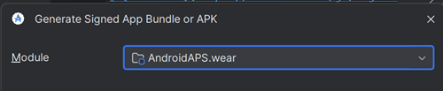
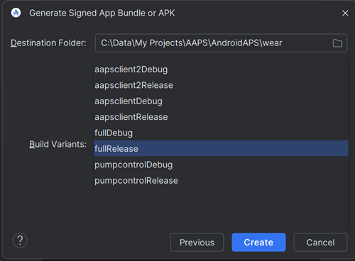

# Compilare l'app Wear AAPS

L'app Wear OS di **AAPS** ("Wear OS apk") necessaria per lo smartwatch è stata separata dalla build "completa" di **AAPS** per il telefono Android. Pertanto è necessario generare un secondo file di installazione, o apk, per installare **AAPS** wear sull'orologio (operazione eseguita tramite side-loading dal telefono). Si raccomanda vivamente di compilare il file **AAPS** Wear apk immediatamente dopo aver compilato per la prima volta il full **AAPS** apk per il telefono. Non solo è molto rapido da fare se stai [compilando **AAPS** per la prima volta](../SettingUpAaps/BuildingAaps.md), ma eviterà potenziali problemi di compatibilità quando tenterai di configurare la comunicazione orologio-telefono. L'**AAPS** Wear apk sull'orologio difficilmente sarà compatibile con l'**AAPS** phone apk se sono stati compilati con versioni diverse di Android Studio, o se sono passati mesi dalla build iniziale di **AAPS**.

Se stai già usando **AAPS** su un telefono e non hai compilato entrambi gli apk per telefono e orologio (wear) contemporaneamente, per garantire il successo è meglio effettuare una nuova compilazione di entrambi i file apk contemporaneamente. Compila gli apk per telefono e orologio AAPS allo stesso tempo, usando lo stesso **file keystore**.

## Versioni Wear OS supportate

AAPS richiede almeno Wear OS API level 28 (Android 9).

```{warning}
I quadranti AAPS sono disponibili per gli smartwatch Wear OS con API level da 28 a 33.<br>
Wear OS 5 ha [limitazioni](BuildingAapsWearOs-WearOS5).
```

## Compilare l'**AAPS** Wear apk

Il processo di compilazione per il Wear apk è simile a quello per il phone apk "completo".

- Segui le istruzioni per [Compilare AAPS](../SettingUpAaps/BuildingAaps.md).
- Quando raggiungi la [selezione del modulo](#Building-APK-wearapk) in "Compila l'AAPS signed apk", assicurati di selezionare **`AndroidAPS.wear`**.



Seleziona "**fullRelease**" per generare il file **AAPS** Wear apk.



Se preferisci, puoi compilare **"pumpcontrolRelease"** dal menu a tendina, che ti permetterà di controllare il microinfusore da remoto ma senza il loop.

## Risoluzione dei problemi

Nel processo di compilazione dell'app **AAPS** 3.2 completa (e in realtà di qualsiasi app firmata), Android Studio genera un file .json nella stessa cartella. Questo causa poi errori con [modifiche non salvate (uncommitted changes)](#troubleshooting_androidstudio-uncommitted-changes) quando tenti di compilare la prossima app firmata, come l'app **AAPS** wear. Il modo più rapido per risolvere questo problema è navigare nella cartella in cui è stata compilata l'app AAPS completa; la tua cartella probabilmente è qualcosa come:

`C:\Users\Il Tuo Nome\AndroidStudioProjects\AndroidAPS\app\aapsclient\release.`

Elimina o sposta il file .json non necessario dalla cartella. Poi prova a compilare di nuovo l'app **AAPS** wear. Se non funziona, la [guida alla risoluzione dei problemi](../GettingHelp/TroubleshootingAndroidStudio.md) più dettagliata ti aiuterà a identificare il file specifico che causa il problema, che potrebbe essere anche il tuo file keystore. 