# Configurare AAPS sul tuo orologio Wear OS

Le istruzioni seguenti si applicano all'apk **AAPS Wear** che devi compilare. Se non lo hai ancora fatto, consulta la guida collegata [qui](../WearOS/BuildingAapsWearOS.md). Durante la compilazione, assicurati di usare lo stesso file keystore che hai usato per il telefono **AAPS** apk.

For example: the **AAPSClient Wear** app can be used to display **AAPSClient** data and not **AAPS** data. You can also use some of the information for the **AAPSClient** and **PumpControl** **Wear** apk. Each **Wear** app will communicate with it's matching phone app.

## Versioni Wear OS e compatibilità

### Wear OS 3

Nel terminale digita: <br>`adb devices`.<br> Dovresti vedere qualcosa come:<br> `List of devices attached`<br> `10.10.1.125:36299  offline`<br> `adb-RFAW20LMKJY-eh5zBj._adb-tls-connect._tcp   device`

(BuildingAapsWearOs-WearOS5)=

### Wear OS 4 e Galaxy Watch aggiornato a Wear OS 5

Esempio: GW4, GW5, GW6

In the terminal: `adb pair ipaddress:port` E.g. `adb pair 10.10.1.125:36299` `adb pair 10.10.1.125:36299` `adb pair 10.10.1.125:36299`

```{admonition} Android Wear OS 5
:class: warning
**GLI AGGIORNAMENTI DEL FIRMWARE MOLTO PROBABILMENTE ROMPERANNO I QUADRANTI AAPS: DISABILITA GLI AGGIORNAMENTI DELL'OROLOGIO**.
```

### Galaxy Watch con Wear OS 5 installato di fabbrica

 Esempio: GW7, GW Ultra

```{admonition} Android Wear OS 5
:class: warning
L'installazione del quadrante AAPS deve essere eseguita con [Wear Installer 2](https://www.youtube.com/watch?v=yef_qGvcCnk) dopo aver installato l'app Wear.<br>
Un cambio accidentale del quadrante con un altro richiede di ripetere la procedura sopra.<br>
La modifica dei parametri del quadrante dedicato come: Scuro, Divisore orologio, ecc. non è possibile.<br><br>
**GLI AGGIORNAMENTI DEL FIRMWARE MOLTO PROBABILMENTE ROMPERANNO I QUADRANTI AAPS: DISABILITA GLI AGGIORNAMENTI DELL'OROLOGIO**.
```

Considera in alternativa [GlucoDataHandler](https://play.google.com/store/apps/details?id=de.michelinside.glucodatahandler) con una complicazione.

### Pixel watch con Wear OS 5

Non compatibile con il quadrante AAPS. Considera [GlucoDataHandler](https://play.google.com/store/apps/details?id=de.michelinside.glucodatahandler) con una complicazione.

## Come configurare un Samsung Galaxy 4 smartwatch con **AAPS**

Questa sezione presuppone che tu sia completamente nuovo agli smartwatch e ti fornisce un orientamento di base su un orologio popolare, il **Galaxy Watch 4**, seguito da una guida passo-passo per configurare **AAPS** sull'orologio.

_Questa guida presuppone che il Samsung Galaxy Watch che stai configurando stia eseguendo Wear OS versione 3 o inferiore._ Se stai configurando un orologio con Wear OS 4/OneUI 5 o successivo, dovrai usare un nuovo processo di abbinamento ADB, spiegato nel software Samsung sul tuo telefono e che verrà aggiornato qui a tempo debito.

Ecco le guide di configurazione base per [Galaxy Watch 5](https://www.youtube.com/watch?v=Y5upzOIxwTU) e [Galaxy Watch 6](https://www.youtube.com/watch?v=D6bq20KzPW0)

## Familiarità base con lo smartwatch

Dopo la configurazione base del tuo orologio secondo il video sopra, vai al Play Store sul telefono e scarica le seguenti app: "Galaxy Wearable", "Samsung" e "Easy Fire tools" o "Wear Installer 2".

Ci sono molti video YouTube di terze parti che ti aiuteranno a familiarizzare con il tuo nuovo smartwatch, ad esempio:

[https://www.youtube.com/watch?v=tSVkqWNmO2c](https://www.youtube.com/watch?v=tSVkqWNmO2c)

L'app "Galaxy Wearable" ha anche una sezione di manuale di istruzioni. Apri Galaxy Wearable sul telefono, cerca l'orologio, tenta di abbinarlo al telefono. A seconda della tua versione, potrebbe chiederti di installare un'ulteriore terza app "galaxy watch 4 plugin" dal Play Store (richiede un po' di tempo per il download). Installala sul telefono e poi tenta di abbinare di nuovo orologio e telefono nell'app wearable. Segui una serie di menu e spunta varie preferenze.

## Configurare un account Samsung

Devi assicurarti che l'account email che usi per configurare l'account Samsung abbia una data di nascita tale che l'utente abbia più di 13 anni, altrimenti le autorizzazioni Samsung sono molto difficili da approvare. Se hai dato a tuo figlio under 13 un account Gmail e stai usando quell'indirizzo email, non puoi semplicemente cambiarlo in un account adulto. Un modo per aggirare questo problema è modificare la data di nascita corrente per rendere l'età corrente di 12 anni e 363 giorni. Il giorno seguente, l'account verrà convertito in account adulto e potrai procedere con la configurazione dell'account Samsung.

(remote-control-transferring-the-aaps-wear-app-onto-your-aaps-phone)=

## Trasferire l'app **AAPS** Wear sul tuo telefono **AAPS**

Il caricamento di Wear.apk da Android Studio al telefono può essere eseguito tramite:

a)  usando un cavo USB per mettere il file **AAPS** wear apk sul telefono, e poi fare il "side-loading" sull'orologio. Trasferisci Wear.apk sul telefono via USB nella cartella dei download; oppure

b)  taglia e incolla Wear.apk da Android Studio sul tuo Google Drive.


Per il side-loading di AAPS sull'orologio puoi usare: 1) Wear Installer 2, 2) Easy Fire Tools, 3) Android Debug Bridge (ADB). Raccomandiamo Wear Installer 2, perché le istruzioni e il processo nel video sono così chiari e ben spiegati. Se Wear Installer 2 non funziona per te, prova tramite

### Usare Wear Installer 2 per il side-load di **AAPS** Wear dal telefono all'orologio

 

Wear Installer 2, sviluppato da [Malcolm Bryant](https://www.youtube.com/@Freepoc) può essere scaricato da Google Play sul tuo telefono e usato per il side-loading dell'app AAPS wear sull'orologio. L'app include un pratico [video](https://youtu.be/abgN4jQqHb0?si=5L7WUeYMSd_8IdPV) su "come fare il sideload".

```{tip}
Per gli orologi Wear OS 5 segui [questo video](https://www.youtube.com/watch?v=yef_qGvcCnk).
Vedi i suggerimenti per la risoluzione dei problemi [di seguito](#BuildingAapsWearOs-WearOS5-TShoot).
```

Questo fornisce tutti i dettagli necessari (è meglio aprire il video su un dispositivo separato per poterlo guardare mentre configuri il telefono).

Come menzionato nel video, una volta completato, disattiva il debug ADB sull'orologio per evitare di scaricare la batteria dello smartwatch.

In alternativa, ma non per Wear OS 5, puoi:

### Usare Easy Fire Tools per il side-load di **AAPS** wear sull'orologio

1)   Scarica _[Easy Fire Tools](https://play.google.com/store/apps/details?id=de.agondev.easyfiretools&hl=en)_ dal Play Store sul telefono


2)  Abilitati come sviluppatore sull'orologio (una volta configurato e connesso al telefono):

Vai in impostazioni > informazioni sull'orologio (opzione in fondo) -> informazioni software -> versione software.

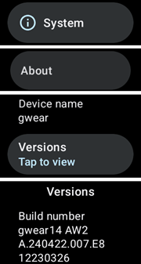

Tocca rapidamente "versione software" fino a quando appare una notifica che l'orologio è ora in "modalità sviluppatore".

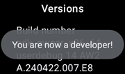

Torna in cima al menu impostazioni, scorri verso il basso e vedi "opzioni sviluppatore" sotto "informazioni sull'orologio".

In "opzioni sviluppatore", attiva "Debug ADB" e "Debug wireless". Quest'ultima opzione rivela l'indirizzo IP dell'orologio, le ultime due cifre del quale cambiano ogni volta che l'orologio viene abbinato a un nuovo telefono. Note that the last two digits (here, “20”) of this address will change every time you change to a new phone handset for AAPS. It will be something like: **192.168.1.214**.5555 (ignore the last 4 digits).

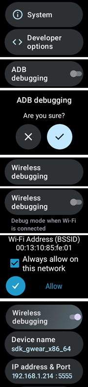

PASSAGGIO 3)     Inserisci l'indirizzo IP _es._ **192.168.1.214** in Easy Fire Tools sul telefono (vai nel menu hamburger a sinistra, impostazioni e inserisci l'indirizzo IP).

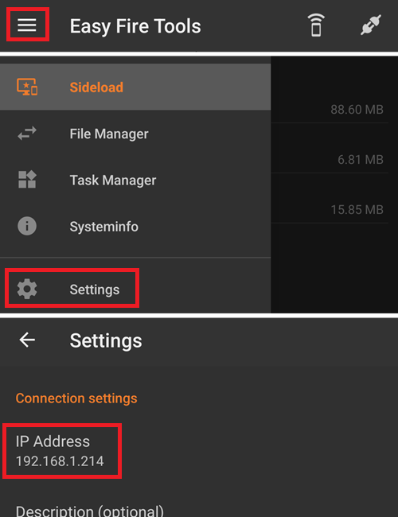

Poi clicca sull'icona della presa nella parte in alto a destra. Diventerà verde quando connessa.

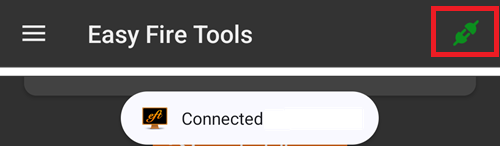


PASSAGGIO 4) Segui le istruzioni [qui](https://wearablestouse.com/blog/2022/01/04/install-apps-apk-samsung-galaxy-watch-4/?utm_content=cmp-true) per il side-load (cioè il trasferimento) di aaps-wear.apk sullo smartwatch usando Easy Fire Tools


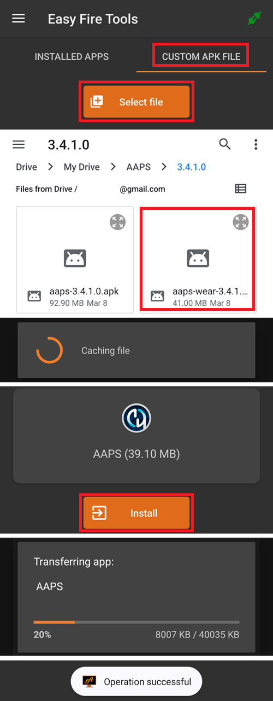


(BuildingAapsWearOs-WearOS5-TShoot)=

### Usare il terminale
Connetti il tuo smartwatch e il computer alla stessa rete Wi-Fi.

- Per installare ADB scaricalo da: https://developer.android.com/tools/releases/platform-tools
- Apri un terminale.
- Per Windows, crea una nuova cartella denominata `adb` sotto il disco `C:`. Apri il file `platform-tools-latest-windows.zip` scaricato sopra. Copia tutti i file all'interno di `platform-tools` in `C:\adb` e apri questa cartella con un prompt dei comandi (clic destro e Apri nel Terminale). Digita il comando seguente per impostare il percorso alla cartella dove si trova ADB: `setx PATH "%PATH%;C:\adb"`
- Per Mac invece di installarlo manualmente puoi usare homebrew: `brew install android-platform-tools`

Sull'orologio:
- Vai in Impostazioni → Informazioni sull'orologio → **Informazioni software**
- Tocca Versione software 7 volte fino a vedere Modalità sviluppatore abilitata.
- Vai in Impostazioni → Opzioni sviluppatore. Abilita **Debug ADB**
- Vai in Impostazioni → Opzioni sviluppatore → Debug wireless → **Abbina nuovo dispositivo**

Vedrai apparire un codice di abbinamento Wi-Fi, indirizzo IP e porta: 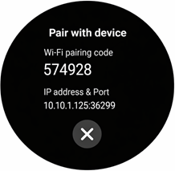

- In the terminal: `adb pair ipaddress:port` E.g. `adb pair 10.10.1.125:36299` In the terminal: `adb pair ipaddress:port` E.g. `adb pair 10.10.1.125:36299` `adb pair 10.10.1.125:36299` `adb pair 10.10.1.125:36299` `adb pair 10.10.1.125:36299` `adb pair 10.10.1.125:36299`
- Ti verrà chiesto il codice di abbinamento. Enter it.
- You will see a response:<br> `Successfully paired to 10.10.1.125:36299 [guid=adb-RXXXW20LMKJY-eh5zBj]`<br>
- - In the terminal type: <br>`adb devices`.<br> You should see something like:<br> `List of devices attached`<br> `10.10.1.125:36299  offline`<br> `adb-RFAW20LMKJY-eh5zBj._adb-tls-connect._tcp   device`<br>

- Ora vai nella cartella del tuo computer dove si trova il Wear apk e digita<br> `adb install wear-full.apk` <br>sostituendo wear.apk con il nome del tuo file apk.
- Vedrai:<br> `Performing Streamed Install`<br> `Success`


### Raccomandazioni generali per la risoluzione dei problemi con Wear OS 5

- Non usare il Tethering Wi-Fi. Non funzionerà.
- Non è necessario abilitare il debug adb sul telefono (solo sull'orologio). Disabilita il debug adb sul telefono.
- Assicurati di connetterti alla tua rete locale dove telefono e orologio possono vedersi (non usare la tua rete Wi-Fi ospite per connetterti).
- Per GW7 devi installare usando Wear Installer 2 poiché ti dà la possibilità di selezionare il quadrante AAPS (Custom) durante l'installazione.
- Assicurati che sia orologio che telefono siano sulla stessa rete e dispositivo Wi-Fi. Specialmente i ripetitori Wi-Fi o i punti di accesso possono creare problemi.
- Assicurati di essere vicino al tuo router principale, poi riavvia sia telefono che orologio.

**Abbinamento:**

- Orologio: Debug wireless: nota l'indirizzo IP.
- Wear Installer: inserisci l'IP nell'app Wear Installer.
- Seleziona Abbina nuovo, nota il codice di abbinamento e il numero di porta visualizzati.
- Wear Installer: inserisci il codice di abbinamento + spazio + numero di porta.
- Wear Installer dovrebbe segnalare che l'abbinamento è avvenuto con successo. In caso contrario, esci da Wear Installer e riprova.

Una volta abbinato dovresti essere in grado di installare l'apk AAPS wear:

- Esci/chiudi, poi riavvia Wear Installer.
- Nel debug wireless, nota l'IP e il numero di porta e assicurati di controllare/inserire l'IP e il numero di porta in Wear Installer.
- Nota: il numero di porta è diverso da quello usato per l'abbinamento!

## Configurare la connessione tra l'orologio e il telefono da **AAPS**

Il passaggio finale è configurare **AAPS** sul telefono per interagire con **Wear.apk** sull'orologio. Per farlo, abilita il plugin Wear nel Costruttore di configurazione:

* Vai all'app **AAPS** sul telefono

* Seleziona > Costruttore di configurazione nella scheda Hamburger sinistra

* Spunta la selezione Wear sotto Sincronizzazione


Per cambiare un diverso quadrante **AAPS**, premi sulla schermata principale dell'orologio e si aprirà "personalizza". Poi scorri a destra fino a trovare tutti i quadranti **AAPS**.

Se l'**AAPS** Wear.apk è stato installato con successo tramite side-loading sullo smartwatch, apparirà così:


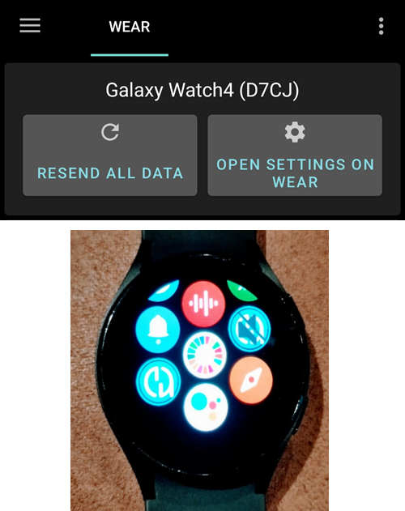


Per alcuni smartwatch, come il Samsung Galaxy, la "Connessione remota" nelle Funzionalità avanzate del Samsung Galaxy deve essere **attivata** per usare **Wear.apk** e **AAPS** da remoto via Wi-Fi.


### Risoluzione dei problemi di comunicazione tra orologio **AAPS** e telefono **AAPS**

1.  Se EasyFire Tools non si connette o se ricevi 'autorizzazione negata' > verifica che l'indirizzo IP sia stato inserito correttamente.
2.  Verifica che lo smartwatch sia connesso a Internet (e non solo collegato al telefono tramite Bluetooth).
3.  Verifica che il telefono **AAPS** e lo smartwatch siano abbinati o collegati nell'app Samsung.
4.  Potrebbe anche essere utile eseguire un riavvio forzato del telefono e dello smartwatch (spegnere e riaccendere il telefono).
5.  Supponendo che tu abbia riuscito a scaricare Wear.apk sul tuo telefono ma non stai ricevendo dati glicemia, _verifica_ di aver installato tramite side-loading la versione corretta dell'**AAPS** apk sull'orologio. Se la versione wear.apk di AAPS è elencata come uno dei seguenti: a) "wear-AAPSClient-release"; b) "wear-full-release.aab"; o c) la parola "debug" appare nel titolo, non hai selezionato la versione corretta di Wear OS apk durante la compilazione.
6.  Verifica che il tuo router non isoli i dispositivi l'uno dall'altro.

Ulteriori suggerimenti per la risoluzione dei problemi possono essere trovati [qui](https://freepoc.org/wear-installer-help-page/#:~:text=If%20you%20are%20having%20problems,your%20phone%20and%20your%20watch.).

(WearOS_changing-to-AAPS-watchface)=

## Cambiare al quadrante AAPS sul tuo orologio WearOS

Nella build standard dell'AAPS Wear OS APK sono disponibili diversi quadranti. Una volta installato l'AAPS Wear APK sull'orologio, saranno disponibili. Ecco i passaggi per selezionarne uno:

1. Sul tuo orologio (con WearOS), tieni premuto il quadrante corrente per aprire la schermata di selezione dei quadranti e scorri tutto a destra fino a vedere il pulsante "Aggiungi quadrante" e selezionalo

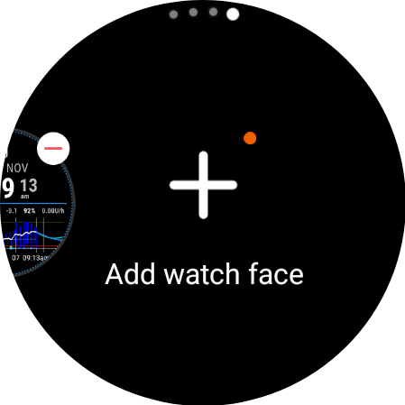

2. Scorri fino in fondo all'elenco fino a vedere la sezione "Scaricati" e trova "AAPS (Custom)" e clicca al centro dell'immagine per aggiungerlo alla tua lista rapida di quadranti correnti. Non preoccuparti dell'aspetto attuale del quadrante "AAPS (Custom)", selezioneremo il tuo skin preferito nel prossimo passaggio.

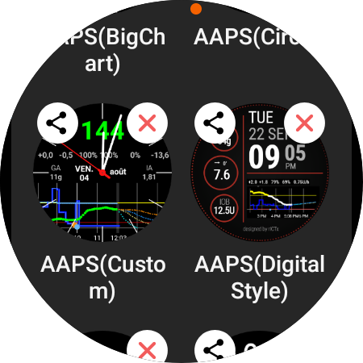

3. Ora apri AAPS sul tuo telefono e vai al plugin Wear (abilitalo nel Costruttore di configurazione (sotto Sincronizzazione) se non lo vedi tra i tuoi plugin correnti in cima).

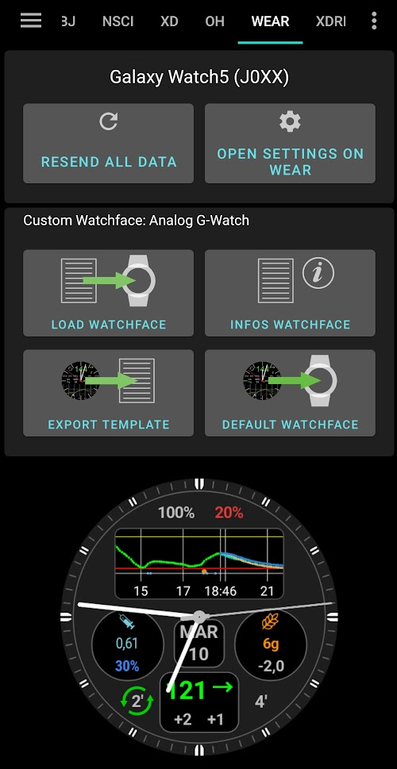

4. Clicca sul pulsante "Carica quadrante" e seleziona il quadrante che ti piace

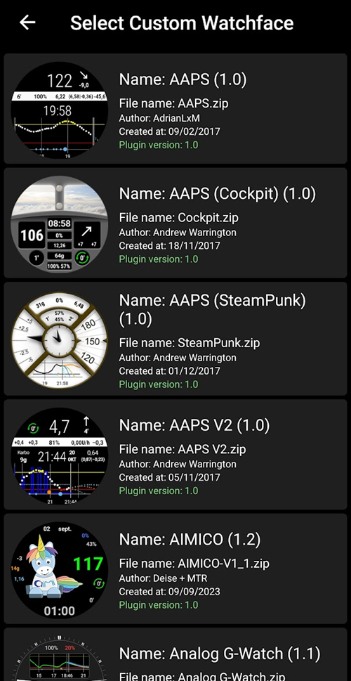

5. Controlla il tuo orologio, il quadrante "AAPS (Custom)" dovrebbe ora mostrare lo skin che hai selezionato. Attendi qualche secondo per l'aggiornamento. Puoi ora personalizzare le complicazioni, ecc. tenendo premuto il quadrante e poi premendo il pulsante "Personalizza" sull'immagine del quadrante.

## Legenda del quadrante AAPSv2


A - tempo dall'ultimo ciclo del loop

B - lettura CGM

C - minuti dall'ultima lettura CGM

D - variazione rispetto all'ultima lettura CGM (in mmol o mg/dl)

E - variazione media lettura CGM negli ultimi 15 minuti

F - batteria del telefono

G - velocità basale (mostrata in U/h durante la velocità standard e in % durante TBR)

H - BGI (blood glucose interaction) -> il grado in cui la glicemia "dovrebbe" salire o scendere basandosi solo sull'attività dell'insulina.

I - carboidrati (carboidrati attivi | e-carbs in futuro)

J - insulina attiva (da bolo | da basale)
