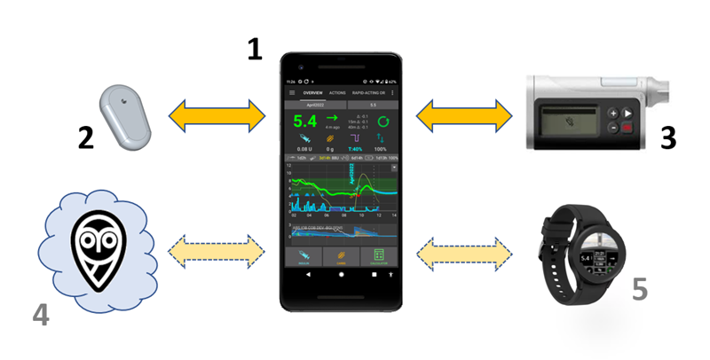

# Benvenuto nella documentazione di AAPS



```{admonition} Latest Release
:class: note

14/08/2025 : Version 3.3.2.1 is out. Check the [Release Notes](#latestrelease) to see what's new and get update instructions.

```

Android APS (**AAPS**) è un'applicazione open source per le persone che vivono con il diabete insulino-dipendente. Si tratta di un sistema pancreas artificiale (APS) che funziona su smartphone Android. **AAPS** utilizza un algoritmo software OpenAPS e mira a fare ciò che fa un vero pancreas: mantenere i livelli di zucchero nel sangue entro limiti sani utilizzando il dosaggio automatico dell'insulina. Per utilizzare **AAPS** hai bisogno di **tre** dispositivi compatibili: **(1)** un telefono Android, **(2)** un sistema di monitoraggio continuo del glucosio (CGM), e **(3)** un microinfusore per insulina approvato FDA/CE. Opzionalmente avrai bisogno di servizi cloud **(4)** per il controllo remoto **AAPS**, condividere i tuoi dati e memorizzarli in un server di rendicontazione, quindi anche **(5)** uno smartwatch.

Questa documentazione spiega come configurare e utilizzare **AAPS**. Puoi navigare attraverso la documentazione **AAPS** sia attraverso il menu a sinistra (e la comoda funzione "**Cerca documenti**"), o usando l'indice [](#index-aaps-documentation-index) in fondo a questa pagina.

## Panoramica della documentazione AAPS ("The docs")

Sezione **2) Per Iniziare**, l' [Introduzione](Getting-Started/Introduction.md) spiega il concetto generale di ciò che un sistema pancreas artificiale (APS) è progettato per fare. Descrive lo sfondo del loop in generale, perché è stato sviluppato **AAPS**, confronta **AAPS** con altri sistemi e affronta la sicurezza. Fornisce suggerimenti su come parlare con il tuo team clinico di **AAPS**, spiega perché devi costruire tu stesso l'app **AAPS** piuttosto che semplicemente scaricarla, e fornisce una panoramica della connettività tipica di un sistema **AAPS**. Riguarda anche l'accessibilità e chi potrebbe beneficiare di **AAPS**.

[Preparazione per AAPS](./Getting-Started/PreparingForAaps.md) fornisce maggiori dettagli sulle considerazioni di sicurezza e sui telefonini, CGM (sistemi di monitoraggio continuo del glucosio) e microinfusori per insulina compatibili con **AAPS**. Fornisce una panoramica del processo che seguirai, e una linea temporale approssimativa per ottenere la piena funzionalità di **AAPS**. Questa sezione ti prepara tecnicamente a assemblare la tua configurazione **AAPS** nel modo più rapido ed efficiente possibile. La sottosezione [Configurazione CGM](./Getting-Started/CompatiblesCgms.md) spiega come ottimizzare le impostazioni del tuo CGM e quali opzioni di lisciatura sono migliori.

Ora che hai una solida comprensione del processo, puoi iniziare a assemblare il tuo loop **AAPS**.

Sezione **3) Impostare AAPS** contiene le istruzioni passo-passo per farlo. It covers choosing and [setting up your reporting server](./SettingUpAaps/SettingUpTheReportingServer.md) (Nightscout or Tidepool) so you can review and share your data, getting ready for building the AAPS app, building the AAPS app and transferring the AAPS app to your phone. Copre anche la configurazione dell'app **AAPS** utilizzando la procedura guidata di configurazione, collegarla con la tua app CGM, e un microinfusore reale o virtuale, oltre a collegare **AAPS** al tuo server di rendicontazione. Sei quindi lentamente introdotto al pieno utilizzo di ciò che **AAPS** ha da offrire tramite un processo passo dopo passo sicuro e accuratamente calibrato, progettato per assicurarsi che te/il tuo bambino siate completamente familiari e confortevoli navigando tutti i diversi livelli e configurazioni del menu prima di "diplomarti" nella fase successiva, comunemente indicato come il prossimo "Obiettivo", fino a quando non avrai esperienza sufficiente per iniziare a utilizzare le opzioni più avanzate disponibili all'interno dell'app. Questi Obiettivi sono appositamente progettati in modo tale da sbloccare gradualmente più possibilità di **AAPS** e passare dal circuito aperto al circuito chiuso.

Sezione **4) Vita quotidiana con AAPS** copre le funzionalità chiavi di **AAPS**, per aiutarti a utilizzare (e personalizzare) **AAPS**. Include la comprensione degli schermi, CHO a bordo, sensibilità, cambio del profilo, target temporanei, CHO estesi (eCarbs), automazioni e sensibilità insulinica dinamica. Copre anche argomenti frequenti come: gestire diversi tipi di pasti, cambiare la cannula e il sensore, aggiornamenti dello smartphone, cambio dell'ora, [viaggiare con AAPS](DailyLifeWithAaps/TimezoneTraveling-DaylightSavingTime.md) e lo sport. Domande e risposte comuni si trovano nella sezione risoluzione dei problemi.

Sezione **5) [Le funzioni AAPS remote](./RemoteFeatures/RemoteControl.md)** evidenziano un punto di forza di **AAPS**. C'è una vasta gamma di possibilità per inviare comandi in remoto verso, o semplicemente seguire i dati da **AAPS**. Questo è altrettanto utile per chi si prende cura di un minore con il quale vuole utilizzare **AAPS**, e per gli adulti con diabete che vogliono monitorare la loro glicemia (e altri dati) più comodamente che solo sul loro telefono (su un orologio, nell'auto _ecc._), o desiderano avere altre persone che monitorano i loro dati. Questa sezione fornisce anche indicazioni per l'utilizzo di Android Auto in modo da poter visualizzare la glicemia in auto.

Sezione **6) Wear OS smartwatches** fornisce informazioni e procedure per utilizzare uno smartwatch Android **Wear OS** con quadranti **AAPS** dedicati o personalizzati, come telecomando del telefono o semplicemente come indicatore di visualizzazione.


Sezione **7) La manutenzione di AAPS** spiega come esportare e eseguire il backup delle impostazioni (che è molto importante nel caso in cui si perde/rompe il telefono), e fornisce le ultime release note e i dettagli su come aggiornare **AAPS**. Ci si può aspettare che ci sarà una nuova versione e 2-3 aggiornamenti richiesti per anno. Sei tenuto a fare questi aggiornamenti come con tutti i software, quando i bug minori sono risolti, e sono stati apportati miglioramenti a **AAPS**. C'è una sezione dedicata "aggiornamenti" per la risoluzione dei problemi, con le domande frequente.

Sezione **8) [Ottenere Aiuto](GettingHelp/WhereCanIGetHelp.md)** dovrebbe indirizzarti verso i posti migliori per trovare un aiuto generico con **AAPS**. Questo è molto importante in modo da poter entrare in contatto con gli altri il più rapidamente possibile, chiarire le domande e risolvere i soliti trabocchetti. Molte persone stanno già utilizzando **AAPS** con successo, ma tutti, a un certo punto, hanno una domanda che non sono riusciti a risolvere da soli. Grazie al gran numero di utenti, i tempi di risposta alle domande sono solitamente molto veloci, in genere solo poche ore. Non preoccuparti di chiedere aiuto, non esiste una domanda stupida! Incoraggiamo gli utenti di qualsiasi livello di esperienza, a porre tutte le domande che ritengono necessarie, per aiutarli a fare funzionare AAPS in modo sicuro. Questa sezione include la risoluzione generale dei problemi per **AAPS** e **AAPSClient** (un app per seguire AAPS) e spiega come inviare i dati di **AAPS** (file di log) agli sviluppatori per indagare, se pensi che un problema tecnico con **AAPS** debba essere esaminato.

La sezione **9)** copre le **opzioni avanzate di AAPS** come il modo di progredire dall'utilizzo di **AAPS** come circuito ibrido (bolo per i pasti) _ecc._ al circuito chiuso completo (senza bolo), e dettaglia le modalità sviluppo e ingegneria. La maggior parte degli utenti si trova bene con la versione principale o "Master" di **AAPS** senza considerare queste opzioni. Questa sezione è per gli utenti che hanno già un buon controllo e stanno cercando di migliorare ulteriormente la loro configurazione.

Nella sezione **10) [Come supportare AAPS](SupportingAaps/HowToEditTheDocs.md)** forniamo informazioni per supportare questo progetto. Puoi donare denaro, attrezzature o competenze. Puoi suggerire/apportare modifiche alla documentazione, aiutarci con la [traduzione della documentazione](SupportingAaps/Translations) e donare i tuoi dati attraverso il progetto Open Humans.

Sezione **11) Risorse**, contiene documentazione archiviata o aggiuntiva, includendo una sottosezione per i [medici](UsefulLinks/ClinicianGuideToAaps.md) che hanno espresso interesse per la tecnologia del pancreas artificiale open source come **AAPS**, o per i pazienti che vogliono condividere tali informazioni con i loro medici. Questo argomento è anche affrontato nell'introduzione. In questa sezione ci sono altri contenuti sul diabete e il circuito chiuso, riferimenti e risorse. Include il [glossario](./UsefulLinks/Glossary.md), un elenco degli acronimi (o abbreviazioni) utilizzati in **AAPS**. Questo è dove andare per scoprire cosa vogliono dire i termini ISF o TT, per esempio.


 ### Vuoi iniziare con **AAPS**? Leggi di più su **AAPS** nell' [Introduzione](Getting-Started/Introduction.md).

```{admonition} SAFETY NOTICE
:class: danger
La sicurezza di **AAPS** si basa sulle caratteristiche di sicurezza del tuo materiale (telefono, microinfusore, sensore). Usa solo un microinfusore per insulina approvato FDA/CE e un sensore CGM pienamente funzionanti. Non utilizzare sensori e microinfusori per insulina rotti, modificati o autocostruiti. Usare solo materiale di consumo originale (inseritori, cannule e serbatoi di insulina) approvati dal produttore per l'uso con il microinfusore e il sensore. L’uso di forniture non testate o modificate può causare imprecisioni e errori di dosaggio dell’insulina, con un conseguente rischio significativo per l’utilizzatore. 

Non usare **AAPS** se prendi degli inibitori SGLT-2 (Gliflozine), poiché abbassano i livelli di zucchero nel sangue. Aumenti il rischio di chetoacidosi diabetica (DKA) a causa della riduzione della somministrazione di insulina e dell’ipoglicemia dovuta alla riduzione dei livelli di zucchero nel sangue. 
```

```{admonition} Disclaimer
:class: nota

- L’utilizzo è soggetto all’assunzione di esclusiva responsabilità personale. L'uso di [Nightscout](https://nightscout.github.io/) e **AAPS** è a esclusivo rischio dell'utente. Non utilizzare le informazioni o il codice per prendere decisioni mediche. Nightscout attualmente non fa alcun tentativo di conformità alla privacy HIPAA. 
- L'uso di codice da github.com è senza garanzia o supporto formale di qualsiasi tipo. Controlla la LICENZA di questo repository per i dettagli.
- Tutti i nomi di prodotti e aziende, marchi, servicemarks, marchi registrati e servizi registrati sono di proprietà dei rispettivi titolari. Il loro uso è a scopo informativo e non implica alcuna affiliazione o approvazione da parte loro.

**AAPS** non ha alcuna associazione con, e non è approvata da: [SOOIL](http://www.sooil.com/eng/), [Dexcom](https://www.dexcom.com/), [Accu-Chek, Roche Diabetes Care](https://www.accu-chek.com/), [Insulet](https://www.insulet.com/) o [Medtronic](https://www.medtronic.com/).

```

(index-aaps-documentation-index)=

## Indice Documentazione AAPS

```{toctree}
:caption: 1) Cambia lingua

Cambia lingua <./NavigateDoc/ChangeLanguage.md>
Cambia la versione <./NavigateDoc/ChangeVersion.md>
```
```{toctree}
:caption: 2) Per iniziare

Introduzione ad AAPS <./Getting-Started/Introduction.md>
Preparazione ad AAPS <./Getting-Started/PreparingForAaps.md>
Panoramica componenti <./Getting-Started/ComponentOverview.md>
- Microinfusori compatibili <./Getting-Started/CompatiblePumps.md>
- Sensori compatibili <./Getting-Started/CompatiblesCgms.md>
- Telefonini compatibili  <./Getting-Started/Phones.md>
- Smartwatch compatibili  <./Getting-Started/Watches.md>
```

```{toctree}
:caption: 3) Setting up AAPS

Setting up the reporting server <./SettingUpAaps/SettingUpTheReportingServer.md>
- Nightscout <./SettingUpAaps/Nightscout.md>
- Tidepool <./SettingUpAaps/Tidepool.md>
Building AAPS <./SettingUpAaps/BuildingAaps.md>
- Browser Build <./SettingUpAaps/BrowserBuild.md>
- Computer Build <./SettingUpAaps/ComputerBuild.md>
Transferring and Installing AAPS <./SettingUpAaps/TransferringAndInstallingAaps.md>
Setup Wizard <./SettingUpAaps/SetupWizard.md>
Your AAPS Profile <./SettingUpAaps/YourAapsProfile.md>
Change AAPS configuration <./SettingUpAaps/ChangeAapsConfiguration.md>
- Config Builder <./SettingUpAaps/ConfigBuilder.md>
- Preferences <./SettingUpAaps/Preferences.md>
Completing the objectives <./SettingUpAaps/CompletingTheObjectives.md>
```

```{toctree}
:caption: 4) Vita giornaliera con AAPS

Schermate AAPS <./DailyLifeWithAaps/AapsScreens.md>
Funzioni chiavi di AAPS <./DailyLifeWithAaps/KeyAapsFeatures.md>
Calcolo di CHO a bordo <./DailyLifeWithAaps/CobCalculation.md>
Rilevamento sensibilità <./DailyLifeWithAaps/SensitivityDetectionAndCob.md>
Cambio profilo & Percentuale profilo <./DailyLifeWithAaps/ProfileSwitch-ProfilePercentage.md>
Target Temporanei <./DailyLifeWithAaps/TempTargets.md>
CHO estesi <./DailyLifeWithAaps/ExtendedCarbs.md>
Automazioni <./DailyLifeWithAaps/Automations.md>
Sensibilità Insulinica Dinamica <./DailyLifeWithAaps/DynamicISF.md>
AAPS per i bambini <./DailyLifeWithAaps/AapsForChildren.md>
Micro e cannule <./DailyLifeWithAaps/PumpsAndCannulas.md>
Viaggi, fuso orario & Ora legale <./DailyLifeWithAaps/TimezoneTraveling-DaySavingTime.md>

```

```{toctree}
:caption: 5) Funzioni AAPS a distanza

Monitoraggio remoto <./RemoteFeatures/RemoteMonitoring.md>
Telecomando <./RemoteFeatures/RemoteControl.md>
Comandi SMS <./RemoteFeatures/SMSCommands.md>
Soltanto follower <./RemoteFeatures/FollowingOnly.md>
Android Auto <./RemoteFeatures/AndroidAuto.md>

```
```{toctree}
:caption: 6) Smartwatch Wear OS

AAPS per Wear OS <./WearOS/BuildingAapsWearOS.md>
Usa lo smartwatch <./WearOS/WearOsSmartwatch.md>
Telecomando <./RemoteFeatures/RemoteControlWearOS.md>
Riferimento per quadranti personalizzati <./ExchangeSiteCustomWatchfaces/CustomWatchfaceReference.md>
Scambio di quadranti personalizzati <./ExchangeSiteCustomWatchfaces/index.md>

```

```{toctree}
:caption: 7) Maintenance of AAPS

Export/Import Settings <./Maintenance/ExportImportSettings.md>
Reviewing your data <./Maintenance/Reviewing.md>
AAPS Release Notes <./Maintenance/ReleaseNotes.md>
Documentation updates <./Maintenance/DocumentationUpdate.md>
Updating to a new version of AAPS <./Maintenance/UpdateToNewVersion.md>
- Browser Update <./Maintenance/UpdateBrowserBuild.md>
- Computer Update <./Maintenance/UpdateComputerBuild.md>

```

```{toctree}
:caption: 8) Getting Help

Where can I get help with AAPS <./GettingHelp/WhereCanIGetHelp.md>
General troubleshooting <./GettingHelp/GeneralTroubleshooting.md>
- Bluetooth troubleshooting <./GettingHelp/BluetoothTroubleshooting.md>
Troubleshooting Android Studio <./GettingHelp/TroubleshootingAndroidStudio.md>
Accessing logfiles <./GettingHelp/AccessingLogFiles.md>
```

```{toctree}
:caption: 9) Opzioni AAPS avanzate

Circuito chiuso completo <./AdvancedOptions/FullClosedLoop.md>
Ramo sviluppatori <./AdvancedOptions/DevBranch.md>
Autotune <./AdvancedOptions/Autotune.md>

```
```{toctree}
:caption: 10) Come supportare AAPS

Come aiutare <./SupportingAaps/HowCanIHelp.md>
Modificare la documentazione <./SupportingAaps/HowToEditTheDocs.md>
Tradurre l'app e la documentazione <./SupportingAaps/Translations.md>
Stato delle traduzioni <./SupportingAaps/StateOfTranslations.md>
Uploader Open Humans <./SupportingAaps/OpenHumans.md>

```
```{toctree}
:caption: 11) Risorse

Glossario <./UsefulLinks/Glossary.md>
FAQ <./UsefulLinks/FAQ.md>
Risorse generale diabete e looping <./UsefulLinks/BackgroundReading.md>
Account Google dedicato per AAPS (facoltativo)<./UsefulLinks/DedicatedGoogleAccountForAaps.md>
Per i medici (obsoleto) <./UsefulLinks/ClinicianGuideToAaps.md>
```
