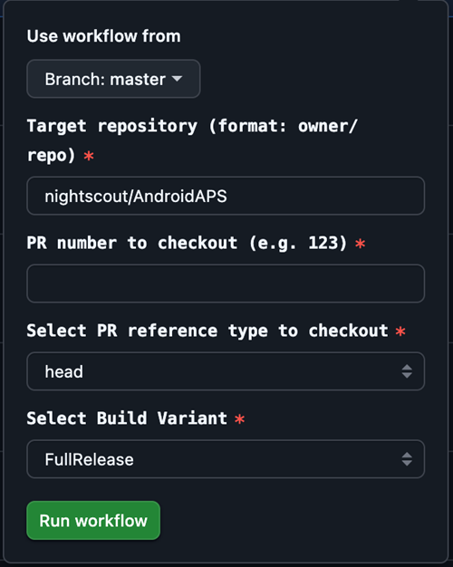

# Development branch

<font color="#FF0000"><strong>Attention:</strong></font>
Dev branch is for the further development of AAPS only. Ele deve ser utilizado num telefone separado para teste <font color="#FF0000"><strong>não para looping real!</strong></font>

The most stable version of AAPS to use is that in the [Master branch](https://github.com/nightscout/AndroidAPS/tree/master). Recomenda-se ficar na branch principal para loop real.

The dev version of AAPS is only for developers and testers comfortable dealing with stacktraces, looking through log files and maybe firing up the debugger to produce bug reports that are helpful to the developers (in short: people that know what they are doing without being assisted!). Portanto, muitos recursos não acabados estão desativados. To enable these features enter **Engineering Mode** by creating a file named `engineering_mode` in directory /AAPS/extra . Ativar o modo de engenharia pode quebrar totalmente o loop.

No entanto, a branch Dev é um boa para ver que recursos estão sendo testados e para ajudar a detetar os bugs e dar feedback sobre como os novos recursos funcionam na prática. Muitas vezes as pessoas vão testar a Dev branch num telefone antigo e bomba até que estejam confiantes de que ele é estável-qualquer uso dele é por sua conta e risco. Ao testar quaisquer novos recursos, lembre-se de que está a optar por testar um recurso de ainda em desenvolvimento. Faça isso por seu próprio risco & com o devida cuidado para se manter seguro.

Se você encontrar um bug ou achar que algo errado aconteceu ao usar a Dev branch, então visualize o separador[questões](https://github.com/nightscout/AndroidAPS/issues) para verificar se alguém mais o encontrou, ou, caso contrário, adicioná-lo você mesmo. The more information you can share here the better (don't forget you may need to share your [log files](../GettingHelp/AccessingLogFiles.md). The new features can also be discussed on [discord](https://discord.gg/4fQUWHZ4Mw).

A dev version has an expiration date. This seems inconvenient when using it satisfactorily, but serves a purpose. When a single dev version doing the rounds, it is easier to keep track of bugs that people are reporting. The developers do not want to be in a position where there are three versions of dev in the wild where bugs are fixed in some and not others, and people continue to report the fixed ones.

(github-pr-test)=

## Test items in a pull request (GitHub CI actions deploy)

Available from 3.3.2.1.dev

- Suitable for testers or those helping with testing.

```{eval-rst}
.. raw:: html

    <!--crowdin: exclude-->
    <div align="center" style="max-width: 360px; margin: auto; margin-bottom: 2em;">
      <div style="position: relative; width: 100%; aspect-ratio: 9/16;">
        <iframe
          src="https://www.dailymotion.com/embed/video/x9rdx1q"
          style="position: absolute; top: 0; left: 0; width: 100%; height: 100%;"
          frameborder="0"
          allowfullscreen>
        </iframe>
      </div>
    </div>
```



- PR number: Please enter the PR number that you want to test.

- PR reference types: PR reference types include two options:
    
    - head:
    - Fetches the actual content from the PR author’s branch (i.e., the original commit history without any merge operations).
    - This is equivalent to the original state of the PR branch, as if it were fetched directly from a fork or feature branch.
    
    - merge:
    
    - Fetches the result of GitHub’s pre-simulated merge of the PR into the target branch (e.g., dev).
    - This is a virtual merge commit automatically created by GitHub.
    - This commit only exists when the PR has no conflicts and is mergeable.
    
    - variant:
    
    - Please refer to <variant>