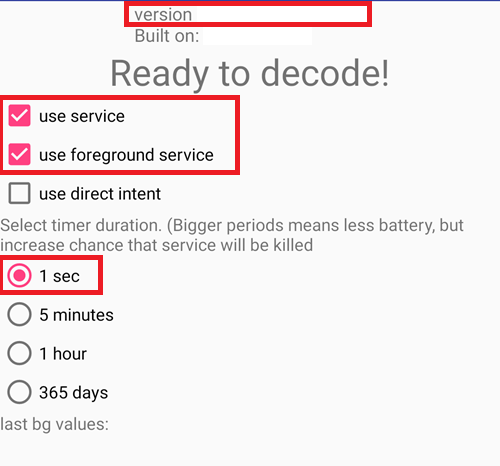
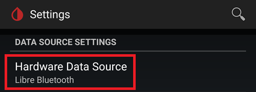
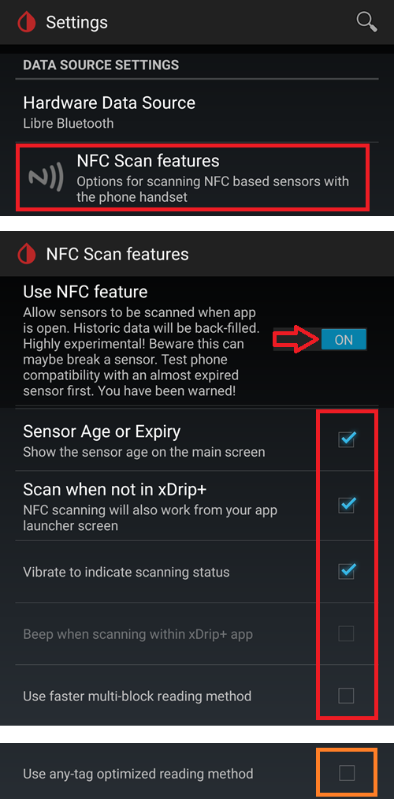
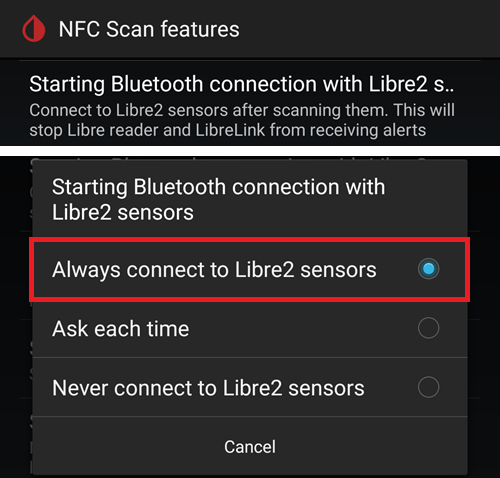
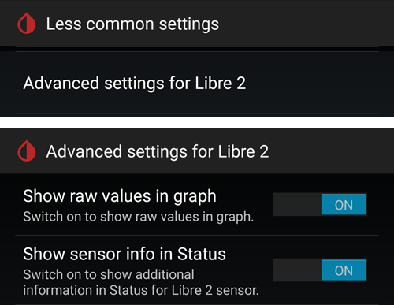
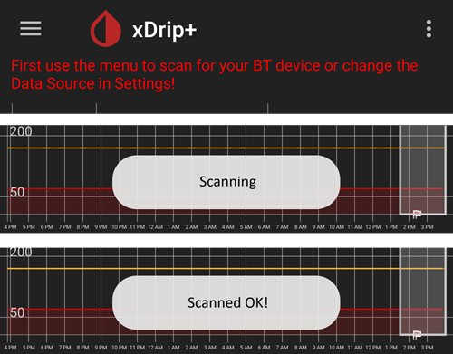
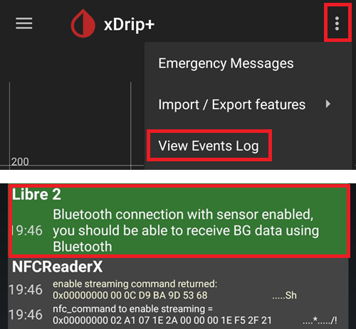
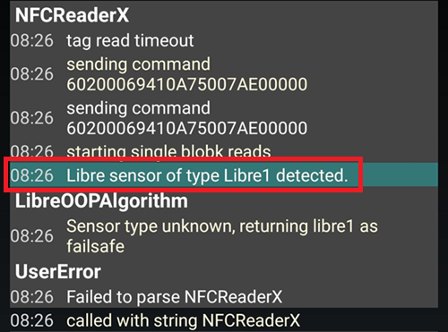
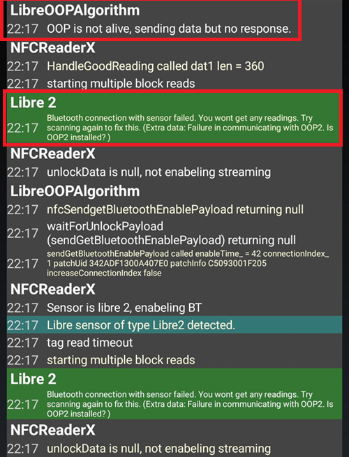

# How to setup FSL 2 and OOP2 to use a native Bluetooth connection in xDrip+

Transferred from [MinimalL00per](https://www.minimallooper.com/post/how-to-setup-freestyle-libre-2-and-oop2-to-use-a-native-bluetooth-connection-in-xdrip) to markdown and **revised/updated**: Aug 25, 2025 psonnera

A list of definitions exists at the bottom of this document. If you are unfamiliar with any terms or abbreviations feel free to *[jump below](#minimallooper-definitions)* for clarification.

 

## Configuration

### Hardware

- *FSL2 and 2+* **NOTE: US, CAN, NZ, AUS versions are NOT supported**

**(OPTIONAL) Reader** (not compatible with FSL2+)

- Reader 1 (with updated firmware)

- Reader 2

*NOTE: If you plan to use the Reader in this solution, you MUST START the sensor with the READER FIRST. If you do not do this you will not be able to use the reader to gather readings from the activated sensor. After the sensor has warmed up, you can then take readings from the LL application or xDrip+.*

### Software

**OOP** - Out of Process Algorithm, an external Android APK application that assists in retrieving raw sensor data to obtain blood glucose values. xDrip+ sends gathered FSL2 BT raw data to OOP and blood glucose values are returned to xDrip+.

- **OOP2**

  - **Works with European FSL2/2+ sensors only**

  - Closed source (not available on GitHub)

  - Purpose is to decrypt the encrypted raw sensor values and return them to xDrip+. Then xDrip+ can be used with either raw data, requiring calibration, or provide glucose values similar to the Reader 1.

[***xDrip +***](https://jamorham.github.io/)

- [*Nightly*](https://github.com/NightscoutFoundation/xDrip/releases) latest source code built each night. Not thoroughly tested

- [*Stable*](https://xdrip-plus-updates.appspot.com/stable/xdrip-plus-latest.apk) latest stable tested release.

- **NOTE: new sensors require updated an OOP2 app, for this it is recommended to use at least the latest xDrip+ release (Stable) version, matching the latest OOP2.**

 

## Process

- *First download and install the apps below*
- *Uninstall Possible Conflicting Apps*
- *How to Start a FSL2 Sensor in Bluetooth Native mode using LL and xDrip+
  - [*Step 1: Application Installation and Configuration*](#minimallooper-step1)
  - [*Step 2: xDrip+ Settings Configuration*](#minimallooper-step2)
  - [*Step 3: Physically insert the sensor*](#minimallooper-step3)
  - [*Step 4: Start the LL App and start sensor with very first NFC Scan*](#minimallooper-step4)
  - [*Step 5: Open xDrip+ and NFC SCAN the FSL2 sensor*](#minimallooper-step5)
  - [*Step 6: Start the new sensor in xDrip+*](#minimallooper-step6)
  - [*Step 7: Wait 60 seconds and NFC Scan the sensor again*](#minimallooper-step7)
  - [*Step 8: Data Collection between 3 and 15 Minutes*](#minimallooper-step8)
  - [*Step 9: Verify Sensor is connected and delivering data*](#minimallooper-step9)

- *[Notes](#minimallooper-notes)*
- *[Преимущества](#minimallooper-advantages)*
- *[Недостатки](#minimallooper-disadvantages)*
- <u>*\[Troubleshooting\](#minimallooper-troubleshooting)*</u>

## Before You Start

It is strongly recommended to follow this process with a **new sensor**. While it has been reported that a connection can be made with a running sensor (***see [below](#minimallooper-started-sensor)***), the chance that the LL app or the Reader will create a new private share key for communication during connection is highly likely. This means that after bonding, xDrip+ is not aware of the new key and will not be able to communicate with the sensor. Attempt a connection with a running sensor at your own risk, preferably towards the end of the sensor's life.

### First download and install the apps below

(Libre2_OOP2)=

- **OOP2** - Versions of the oop2 can be found at:

  (*Note: you need to be logged in Google to access the link.*)

*[oop2.apk](https://drive.google.com/file/d/1106h2s12b3Ev9gKCTU2G75q8h9ChHjcz/view?usp=sharing)* - OOP2_21_09_25 (05d1989) **2025.09.21** (latest version)

- **xDrip+** - **<u>latest version</u>** (minimum version 2025.09.26) can be found at:

[*xDrip+.apk*](https://github.com/NightscoutFoundation/xDrip/releases)

(minimallooper-started-sensor)=

### What if my sensor is already started? Can I still get reading in xDrip+? YES!

Many people have asked if this method can be used with an already active sensor and I can say with a resounding **YES**, you can start an actively running sensor.

1.  **FIRST**, make sure you have made the configuration changes and settings to xDrip+ and installed and configured OOP2 as shown below.

2.  **THEN**, proceed to *Step 5* and **MAKE SURE** you have force closed LL before you start. Then follow the process to completion.

*NOTE: You will not be able to use your activated FSL2 sensor with the FSLReader IF IT was not started with the FSLReader first. If it WAS started with the FSLReader first, then you will be able to **scan** the sensor and retrieve readings from BOTH the sensor and apps like LL and xDrip+.*

## How to Start a FSL2 Sensor in Bluetooth Native mode using LL and xDrip+

*NOTE: If there are settings in the screenshots that are not called out with a BOX specifically and are UNCHECKED (IE, disabled) then PLEASE KEEP THEM DISABLED. The screenshots are reflective of a working configuration for ALL settings shown. If you want to experiment turning other features on/off after you have a working sensor, you are free do to so at your own risk.*

(minimallooper-step1)=

### **Step 1: Application Installation and Configuration**

**Install and configure OOP2** and see that it works by just opening the app.


**Настройки**

- *Use service* **on**

- *Use foreground service* **on**

- *Timer Duration* **5 min**

  - Change to 1 sec if you are not getting results fast enough.

**Version 2: 93e5cac-2020.12.08 (latest version)**



**Install xDrip+** minimum version: latest release. Further documentation on xDrip+ installation and setup can be found [*here*](https://androidaps.readthedocs.io/en/latest/Configuration/xdrip.html).

(minimallooper-step2)=

### **Step 2: xDrip+ Settings Configuration**

**Hardware Data Source**: Libre Bluetooth



**NFC Scan features**: *settings not mentioned are assumed to be turned off.*

- *Use NFC feature*: **on**
- *Sensor Age or Expiry*: **on**
- *Scan when not in xDrip+*: **on**
- *Use Any-tag optimized reading method*: **off** but try **on** in case of difficulties to scan



- *Starting Bluetooth connection with FSL2 sensor*: **Always connect to libre2 sensors**



- *Smooth libre 3 data when using xxx method*: leave default. Increase the value for noisy sensors, decrease when stable.


**Less Common Settings -\> Bluetooth Settings** (*these are important and can vary with your phone/setup*)

- *Turn Bluetooth on*: **on**
- *Trust Auto-Connect*: **on**
- *Use Background Scans*: **on**
- *Always discover services*: **on**

You can setup xDrip+ using the QR code below. You need to scan it (or load the picture) in xDrip+ -> Auto Configure.

```{admonition} QR Code
:class: dropdown


```


Once scanned the QR code above, if you have a Samsung phone (but this is also useful for many Chinese brands), scan the other QR code below to change the settings for a more reliable connection:

- *Trust Auto-Connect*: **off**
- *Use Background Scans*: **off**

```{admonition} QR Code
:class: dropdown


```


**Advanced settings for FSL2** (*optional but helpful*)

- *show Raw values in Graph*: **on**

- *show Sensor info in Status*: **on**



**Extra Logging Settings** (*needed to debug if not working correctly*)

- *Extra tags for logging*: enter this value

`BgReading:d,jamorham librereceiver:v,LibreOOPAlgorithm:v,jamorham nsemulator:v,DexCollectionService:v`


(minimallooper-OOPsettings)=

**Less Common Settings -\> Other misc options**

> **Settings for OOP2 Configuration**

- *Out of process Libre algorithm*: **OFF**

(*MAKE SURE THIS IS **OFF** FOR OOP2 OTHERWISE YOU WILL NOT GET READINGS!*)


(minimallooper-step3)=

### **Step 3: Physically insert the sensor**

(minimallooper-step4)=

### **Step 4: Start the LL App and start sensor with very first NFC Scan**

Start the LL app, then scan the newly inserted sensor, then close and disable or uninstall the LL app. **You still need to wait for the sensor to warm-up the full 60 minutes before proceeding and starting the sensor in xDrip+**. Do not rely on the readings before as the sensor is still internally calibrating and the values vary wildly.

#### **Step 4a (OPTIONAL, Use FSLReader):**

**Start the FSL2 (not 2+) sensor by scanning it with the FSLReader with very first NFC Scan**

If you want to be able to use the **FSLReader** as well as the LL app or xDrip+ to read values from the FSL2 sensor, then **you will need to scan the newly inserted FSL2 sensor with the FSL Reader FIRST.** After the sensor warmup is complete you can then use the LL app or xDrip+ to scan readings.

*NOTE: The LL app is only needed for the VERY FIRST NFC scan after sensor insertion. It serves to send the warmup initialization signal, afterwards the app MUST be disabled (app settings-\>force close) or uninstalled. You can use the Patched 2.3 app or Official versions, it does not matter. The main thing is to prevent the LL app from running when xDrip+ is trying to start the BT bonding process with the sensor as the LL app interferes with the Bluetooth reconnection process by disrupting communication.*

*It has been reported that simply turning off the **location permission** in the LL app Android system settings is enough to prevent it from interfering with the connection. This has been reported by a few users to be successful. Again **I recommend disabling or uninstalling the app** but you can try this if you want to experiment.*

(minimallooper-step5)=

### **Step 5: Open xDrip+ and NFC SCAN the FSL2 sensor**

(*Reminder! Ensure LL is disabled (location turned off) or uninstalled AND you have waited the entire 60 minutes for the sensor to warmup and internally calibrate.*)

**NFC SCAN** the FSL2 sensor with xDrip+. This sends a signal to the sensor to turn on Bluetooth pairing in order to start the bonding process. A small notification will appear briefly on the bottom of the xDrip+ Overview screen with the text **Scanning** followed by the notification **Scanned OK!** upon a successful NFC scan of the FSL 2 sensor.



(minimallooper-step6)=

### **Step 6: Start the new sensor in xDrip+**

In the **xDrip+ Overview screen** press the **hamburger menu** in the upper left corner. Then choose **Start Sensor**.

On the **Start New Sensor** screen press **Start Sensor**. A prompt will ask **Did you insert it today?** Respond by pressing **NOT TODAY**.


*NOTE: If you accidentally clicked "YES, TODAY" then you will need to "stop sensor" from the xDrip+ main menu followed by "start sensor" by proceeding with Step 5 again.*

(minimallooper-step7)=

### **Step 7: Wait 60 seconds and NFC Scan the sensor again**

A second NFC scan is needed in order to **ADD** the sensor as the Bluetooth device from which xDrip+ will use to retrieve the readings. Once complete you will see a notification stating **NEW SENSOR STARTED**.


A 60 second waiting period is enforced because the sensor can’t be scanned during this process more than once per minute. If the sensor is scanned too early the warning **Not so quickly, wait 60 seconds** is displayed in the xDrip Overview screen.


Open xDrip+ event logs and check the sensor paired correctly with xDrip+.



(minimallooper-step8)=

### **Step 8: Data Collection between 3 and 15 Minutes**

Between 3 and 15 minutes enough data is collected to display the first values. *If you are still not receiving readings at this time, sometimes it helps to reboot the phone.*

If you use a Samsung (or many Chinese brand phones) and have issues receiving data, scan the QR code below, in xDrip+ -> Auto Configure.

```{admonition} QR Code
:class: dropdown


```

It will change xDrip+ Bluetooth settings to:

- *Trust Auto-Connect*: **off**
- *Use Background Scans*: **off**

(minimallooper-step9)=

### **Step 9: Verify Sensor is connected and delivering data**

Press the Hamburger menu in the upper left of the xDrip+ Overview screen and select **System Status**. On the System Status screen the active **Bluetooth Device:** field displays the FSL2 Bluetooth naming convention of **ABB___XXXXXXXXXXX**, where the XXX’s represent the sensor serial number. The **Connection Status** field displays **Connected** and the **Sensor Start:** field displayed the time the sensor was started.


On the **BT Device** (swipe left) screen you can verify further connection details of the sensor as well as use this screen for troubleshooting connections. Below is a list of fields and their purposes to assist in connection troubleshooting.

*NOTE: **<u>DO NOT TOUCH</u> AND CHANGE Bluetooth Pairing from <u>Disabled</u>** in this window. Doing so will attempt a direct pair, it will fail (Not bonded) and you will have to start the process from Step 5 all over again.*


- **Phone Service State:** The last time the phone made a BT connection to the sensor (it should be less than 5 minutes ago)
- **Bluetooth Device:** Displays current status of the connection (either **Connected** or **Disconnected**)
- **Device Mac Address**: This is the hardware ID of the sensor
- **Bluetooth Pairing**:  This should be **<u>Disabled, tap to enable</u>**. Be careful to NOT tap this. If you tap it by mistake, tap it again until it returns to disabled.
- **Slowest wake up**: You can ignore this. xDrip+ doesn't spend its time waiting for readings: it will start expecting them at after a certain time (traditionally 5 minutes). If no data arrives at that time, you'll see "Woke up early" meaning xDrip+ was expecting data to be ready but there's none. Slowest wake up is the highest delay encountered before receiving data normally.
- **Next Wake up**: Should say 5 minutes


(minimallooper-notes)=

### **Notes**

- **Using LL NFC Scans AFTER bonding/pairing in xDrip+ is completed**: You can conduct NFC scans but the bonding/pairing process with xDrip+ needs to be completed first. Always look at xDrip+ and see if it is close to the 5 minute reading (i.e. 4 minutes ago), if it is near 5 min, wait for the new BT reading to come in and then conduct the NFC scan. If you catch it at the wrong time it will disturb the BT process in xDrip+ and not receive BT readings, which can take a while to re-bond and transmit again and sometimes a sensor BT connection can be “stolen” by LL. However between these BT readings I have not had any problems executing an NFC scan followed by immediately disabling the app. I am not sure if LL needs to be disabled each time but I disable it to be on the safe side.

- - **What is going on?** When a Bluetooth connection is made a private shared key is created that is needed to allow communication between the sensor and the calling application/device. There is a high probability that the LL app or the Reader creates a new private shared key for communication during the connection. This means that after bonding, xDrip+ is not aware of the new key and will not be able to communicate with the sensor.

  - Several users have reported that the LL app can be restarted after successfully starting the sensor and receiving readers in xDrip+. In the LL app Android permission you simply need to turn off the **Allow Location** setting. Once this is done you should be able to use the LL app and xDrip+ simultaneously. I would recommend that you don't select a default app for NFC scanning and pick which app you want to read the sensor for an NFC scan. Also, DON'T FORGET, on your next sensor change to force close the LL app after the initial warmup NFC scan on the new sensor. After the sensor is configured and receiving readings in xDrip+ you can then start the LL app again.

&nbsp;

- **Rebooting your phone**: After the reboot, and after disabling or force closing the app, REMEMBER to check that the LL app is NOT running. I suggest testing a reboot to see if LL starts again automatically. You can look in the LL app settings under Android Application settings on your phone. If it is still enabled, then disable the LL app again, uninstalling the LL app may be the only way to avoid this. This is to prevent LL from accidentally stealing the BT bond. Also, after rebooting it will take the same 3-15 minutes to get BT readings from the sensor so be patient and plan for this if you are rebooting close to times you require a BG reading in order to bolus, meals, etc.

&nbsp;

- **Battery Optimization settings**: Make sure you EXCLUDE these apps from your phone’s battery optimization settings

  - xDrip +

  - OOP 2

  - LL

  - AndroidAPS

&nbsp;

- **Using Flight Mode:** There are some situations which call for turning on flight mode (when taking a flight ;-), sleeping at night and you do not wish to have WIFI or Mobile connection signals operating with your phone in close range of your head) and this can cause issues with the Bluetooth communication during activation of Flight mode. When switching on flightmode on the phone followed by activating Bluetooth, blood glucose readings will be lost. The only workaround is to restart the collector in xdrip+ -\> System Status -\> Classic Status Page. After restarting the collector the blood glucose readings appeared again.

 

(minimallooper-advantages)=

### **Преимущества**

- **LL patched app no longer required** You no longer need a patched version of the LL app to retrieve values from the FSL2 sensor. While you can use the LL patched app, the official versions of the LL app can start the first NFC initialization scan in the same manner as the patched app. There is no difference as far as NFC initialization scanning to start the sensor is concerned.

&nbsp;

- **3rd party NFC scanning device no longer required** 3rd party NFC scanning devices such as (Miaomiao, Bubble or Blucon) are no longer needed *(but can still be used)* to collect readings as the sensor alone can deliver them now via Bluetooth. Less hardware means less things to go wrong, less devices to charge and a more minimalistic setup.

&nbsp;

- **You will still be able to NFC scan readings with the FSL2 Reader (version 1 with updated FW or version 2) WHEN the FSL2 sensor has been started with the FSL Reader FIRST.** The FSL2 standalone reader can still be used to scan readings on the active sensor once it is bonded via Bluetooth to xDrip+.

  - You **MUST** start the sensor with the version first NFC scan to initiate sensor warmup **with the FSL Reader FIRST**. After this point other software applications will also be able to take NFC readings from the now activated sensor.
- It is my understanding that the FSL2 sensor (as long as it has not established or is not trying to establish a connection) will always advertise its presence (and availability) over BLE exactly every 2 minutes (visible on any Bluetooth device that has the ability to scan for Bluetooth devices). Whichever device is first to respond to this advertisement wins the race and is the *only* device allowed to connect and read the sensor as a private shared key is created during the NFC scan connection process which is used to decrypt FSL 2 communication. The sensor is then unavailable to other devices that do not have this private share key and might also be trying to connect. It seems that the FSL 2 reader always wins this race whatever the “opponent”.

&nbsp;

- **Minimal hardware device setup** My goal has always been to keep the medical devices attached to my body at a minimum. The FSL2 in combination with the Omnipod system accomplished this goal. This point is even more crucial when I travel (both short and long distances) because the number of items and set changes for those items becomes fewer, which means I have more room for other items in my luggage. Hopefully in the future there will be a patch pump that just has a replaceable reservoir and the chip and motor system can be packaged as a retainable/reusable piece. This would cut down on waste and decrease packaging for site changes which again leads to more room in my suitcase for other things.

&nbsp;

- **No more hour gaps when changing sensors** Because you can start another sensor with the LL app using an initial NFC scan, the current sensor can keep running and delivering readings by Bluetooth at the same time. After 20 minutes you can get readings from the new sensor but it is best to wait 1 hour for the sensor to properly internally calibrate. This means you can stop the current sensor and start up the new one (after it has been set and warmed up with the LL NFC scan an hour earlier) and within 3 to 15 minutes you will have your initial calibrations and readings.

&nbsp;

(minimallooper-disadvantages)=

### **Недостатки**

- **Phone Reboot:** Because the Bluetooth process has to start again when your phone reboots, you have to first ensure that you manually disable the LL app (if you did not uninstall it) and be patient for the first readings to come in (3 to 15 min). This means timing phone reboots so they do not occur during critical times like correction boluses or meal and snack times.

&nbsp;

- **You can't run LL and xDrip+ in parallel together for Bluetooth readings**. LL will always try to "steal" the Bluetooth connection to the sensor and bond. If that happens, you are stuck with LL for the rest of the life of the sensor. So running the apps simultaneously does not work all the time. As I mention below, you can enable the LL app and do an NFC scan to get the LL reading (if you need to compare, want to retrieve history for yourself or endocrinologist reports) however you should disable it as soon as you have your reading and not try to attempt this within a minute of when xDrip+ is going to retrieve its Bluetooth reading. I am not sure how using the FSL2 reader works while doing this but I will test that at a later point.
- Several users have reported that the LL app can be restarted after successfully starting the sensor and receiving readers in xDrip+. In the LL app Android permission you simply need to turn off the **Allow Location** setting. Once this is done you should be able to use the LL app and xDrip+ simultaneously. I would recommend that you don't select a default app for NFC scanning and pick which app you want to read the sensor for an NFC scan. Also, DON'T FORGET, on your next sensor change to force close the LL app after the initial warmup NFC scan on the new sensor. After the sensor is configured and receiving readings in xDrip+ you can then start the LL app again.

&nbsp;

- **3rd Party NFC Scanning Devices can still be used**. Yes, I listed this as a disadvantage but I also wanted to point out that if something goes wrong with the sensor and LL captures control of it, you can always fall back to placing an NFC scanning device on the sensor to get readings in xDrip+. You can also use this device instead of a direct Bluetooth connection if you are more comfortable with a setup consisting of a 3rd party NFC scanning device (Miaomiao, Bubble, Blucon). Sometimes certain phones do not operate well with the native Bluetooth sensor bonding and data retrieval. You can use these devices as a backup or as normal usage, either way you still have this as an option.
- If you are planning on using the **FSL Reader** as an NFC scanning device to take readings, you MUST start the FSL2 sensor with the **VERY FIRST NFC scan** to warm up the senor with the **READER FIRST**.

&nbsp;

- **LV data will not be uploaded automatically** Since the LL app does not have a constant Bluetooth connection (because LL should not be running simultaneously with xDrip+ once the sensor is actively sending Bluetooth readings) then it is not receiving readings automatically from the sensor. This means that blood glucose data is not automatically being uploaded to LV and by extension other phones with LL. I mark this as a disadvantage as I know many parents rely on this functionality as well as those that are forced to use the LV reporting for their healthcare provider. You can still open the LL app and scan every 8 hours to get the back-filled data from the sensor into LL (3 times every day, at least every 8 hours, but more scans would likely be needed to capture all 24 hours of data) but again this is a manual process.

&nbsp;

(minimallooper-definitions)=

### **Definitions**

- **BT** - Bluetooth

- **BLE** - Bluetooth Low Energy

- **FSL** - FreeStyle Libre
  - **Libre 1 (FSL1)** - NFC only. First version of the sensor

  - **FSL2 (FSL2)** - Bluetooth and NFC. Second version of the sensor.

  - **Libre 3 (FSL3)** - Bluetooth and NFC. Third smaller version of the sensor. Not supported by OOP2 (see Juggluco).

- **LL** - LibreLink, **application** used to start the sensor with initial NFC scan

- **LV** - LibreView, cloud service for sharing data with your endo team (consider using Tidepool or Nightscout)

- **MM** - MiaoMiao, name and manufacturer of a 3rd party NFC scanning device that delivers readings via Bluetooth to xDrip+.

- **NFC** - Near Field Communication, a physical operation in which you bring the NFC sensor on your phone close to your sensor to start a reading. This is often referred to as “scanning the sensor”, a “sensor scan” or “NFC scan”. This process in no way uses Bluetooth.

- **OOP1** - Out of Process Algorithm version 1, the 3rd party app that receives raw values (delivered to xDrip+ from the sensor by Bluetooth or NFC scan) and then uses an algorithm (very similar to the hardware algorithm on the sensor chip) to process the raw values and returns a calibrated (by the OOP1 algorithm, not by xDrip+’s native calibrations) blood sugar back to xDrip+ to either display or be further processed with xDrip+’s calibration (with a finger pick blood calibration) if needed.

- **OOP2** - Out of Process Algorithm version 2, the 3rd party app that receives encrypted data delivered to from the FSL 2 sensor (by Bluetooth or NFC scan) and then decrypts the encrypted data. Once decrypted, the data is then sent to xDrip+.

 

(minimallooper-troubleshooting)=

### Устранение неполадок

#### Failure to scan the sensor with NFC

- Make sure your phone NFC reader is enabled in Android settings.
- The NFC reader must be compatible with **ISO 15693** tags. Some Cubot phones are very difficult to use.
- Look into you phone documentation to identify the NFC antenna position. Bring it to the sensor and stay on it for 10 seconds: xDrip+ NFC reading takes longer than the vendor app or the reader.
- Try to close xDrip+ before scanning the sensor.
- Make sure no other app wants to read the sensor (you might see a selection with different app choices when scanning: select xDrip+ but don't move the phone).
- Try all combinations of xDrip+ NFC settings *Use faster multi-block reading method* and *Use Any-tag optimized reading method* knowing that NFC scans are usually more reliable with both these options **off**.

#### Stuck on collecting initial readings

*Note: FSL 2 is not recognized as a trusted data source when calibrated manually.*

Set [OOP2 calibration](#minimallooper-OOPsettings) strategy to "No calibration" until you have everything working.

Then you can decide to calibrate or not.


#### Sensor is reported as FSL1



Make sure you are running the latest versions of xDrip+ and OOP2.

#### Connection to the sensor fails

- Verify OOP1 is disabled (see [here](#minimallooper-OOPsettings))



- Verify OOP2 is not put to sleep by the phone battery savings apps and settings
- Verify Google Play protect is disabled as it will kill OOP2
- Did you change Bluetooth Pairing in System Status? Touch it back to bring it back to **<u>Disabled</u>**


#### Missed readings

Make sure OOP2 shows values that are not 0 or -1, it might be a sign your sensor is failing (example below in mmol/l).


Sensor age has not advanced might also be a sign your sensor has issues. This means xDrip+ received a value, but discarded it as it was not acceptable (sensor error).


#### Restart from scratch sensor pairing

1. xDrip+ menu -> Stop sensor (it won't stop the FSL2, just change xDrip+ state to not started)
2. xDrip+ menu -> System status -> Forget device
3. Scan the sensor with xDrip+ NFC. Wait at least one minute
4. xDrip+ menu -> Start sensor. Wait at least one minute
5. Scan the sensor with xDrip+ NFC, a few times,  always waiting at least one minute between two scans
