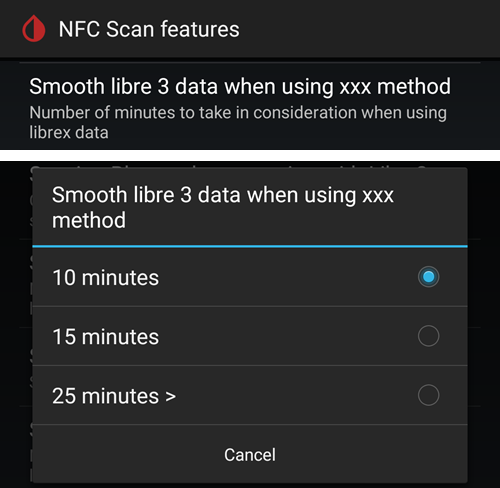
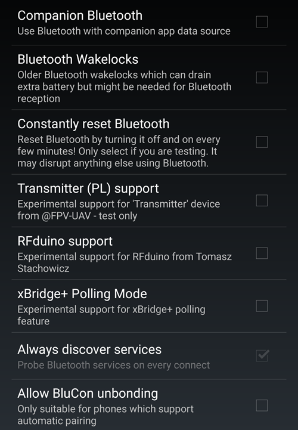
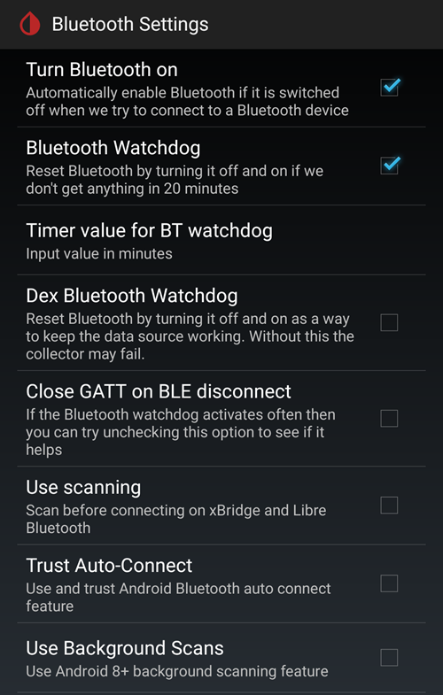
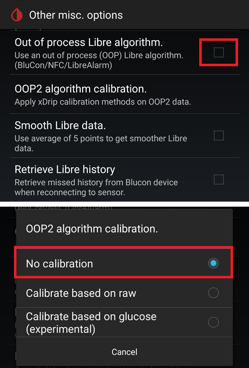
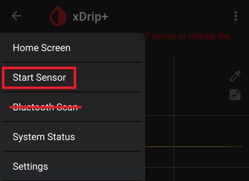
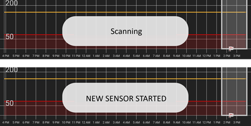
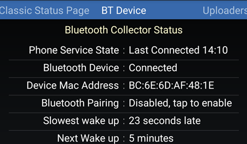
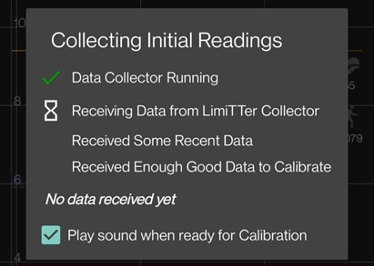
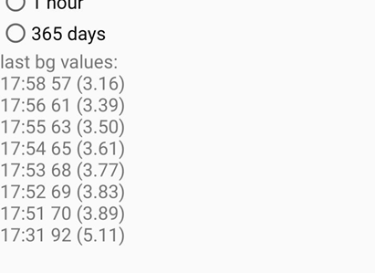
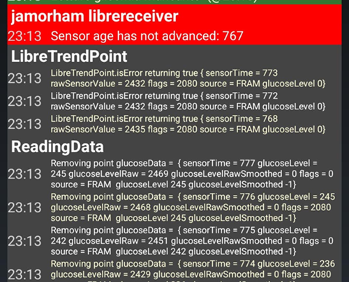

# 如何在 xDrip+ 中設置 FSL 2 和 OOP2 使用原生藍牙連線

由 [MinimalL00per](https://www.minimallooper.com/post/how-to-setup-freestyle-libre-2-and-oop2-to-use-a-native-bluetooth-connection-in-xdrip) 轉換至 markdown 並進行 **修訂/更新**：2025 年 8 月 25 日 psonnera

本文件底部包含定義列表。 如果您對任何術語或縮寫不熟悉，可以隨時 *[移至下方](#minimallooper-definitions)* 以獲取資訊。

 

## 設定

### 硬體

- *FSL2 和 2+* **注意：美國、加拿大、新西蘭、澳大利亞版本不受支援**

**(可選) 讀取器**（與 FSL2+ 不相容）

- 讀取器 1（帶有更新的韌體）

- 讀取器 2

*注意：如果您計劃在此解決方案中使用讀取器，您必須首先使用讀取器啟動傳感器。 如果不這樣做，您將無法使用讀取器從已註冊傳感器收集讀取值。 感測器預熱完成後，您可以從 LL 應用程式或 xDrip+ 中進行讀取。*

### 軟體

**OOP** - 進程外演算法，一個外部的 Android APK 應用程式，幫助提取原始傳感器資料以獲得血糖值。 xDrip+ 將收集到的 FSL2 藍牙原始資料發送到 OOP，血糖值返回到 xDrip+。

- **OOP2**

  - **僅與歐洲 FSL2/2+ 傳感器相容**

  - 封閉源碼（在 GitHub 上無法獲取）

  - 目的在於解密加密的原始傳感器值並將其返回給 xDrip+。 然後 xDrip+ 可以使用原始資料（需要校準），或提供類似於讀取器 1 的血糖值。

[***xDrip+***](https://jamorham.github.io/)

- [*Nightly*](https://github.com/NightscoutFoundation/xDrip/releases) 每晚建置的最新源碼。 尚未徹底測試

- [*Stable*](https://xdrip-plus-updates.appspot.com/stable/xdrip-plus-latest.apk) 最新的穩定測試版本。

- **注意：新傳感器需要更新的 OOP2 應用程式，建議至少使用最新的 xDrip+ 版本（穩定），以對應最新的 OOP2。**

 

## 過程

- *首先下載並安裝以下應用程式*
- *移除可能衝突的應用程式*
- *如何在 Bluetooth 原生模式下使用 LL 和 xDrip+ 啟動 FSL2 傳感器
  - [*步驟 1：應用程式安裝與設定*](#minimallooper-step1)
  - [*步驟 2：xDrip+ 設定配置*](#minimallooper-step2)
  - [*步驟 3：物理插入傳感器*](#minimallooper-step3)
  - [*步驟 4：啟動 LL 應用程式並使用第一次 NFC 掃描啟動傳感器*](#minimallooper-step4)
  - [*步驟 5：打開 xDrip+ 並對 FSL2 傳感器進行 NFC 掃描*](#minimallooper-step5)
  - [*步驟 6：在 xDrip+ 中啟動新的傳感器*](#minimallooper-step6)
  - [*步驟 7：等待 60 秒，再次對傳感器進行 NFC 掃描*](#minimallooper-step7)
  - [*步驟 8：收集資料的時間介於 3 到 15 分鐘之間*](#minimallooper-step8)
  - [*步驟 9：驗證傳感器已連線並傳送資料*](#minimallooper-step9)

- *[註釋](#minimallooper-notes)*
- *[優點](#minimallooper-advantages)*
- *[缺點](#minimallooper-disadvantages)*
- <u>*\[疑難排解\](#minimallooper-troubleshooting)*</u>

## 在你開始之前

強烈建議在使用 **新傳感器** 時遵循此過程。 雖然有報告指出可以與運行中的傳感器建立連線 (***見 [下方](#minimallooper-started-sensor)***)，但是 LL 應用程式或讀取器在連線期間創建新的私人共享金鑰的可能性相當高。 這意味著在配對後，xDrip+ 無法識別新金鑰，因此無法與傳感器通信。 如果您要嘗試與運行中的傳感器連線，風險自負，最好是在傳感器壽命結束時進行。

### 首先下載並安裝以下應用程式

(Libre2_OOP2)=

- **OOP2** 的版本可以在以下網址找到：

  （*注意：您需登入 Google 才能訪問該連結。*）

*[oop2.apk](https://drive.google.com/file/d/1106h2s12b3Ev9gKCTU2G75q8h9ChHjcz/view?usp=sharing)* - OOP2_21_09_25 (05d1989) **2025.09.21** (最新版本)

- **xDrip+** - **<u>最新版本</u>** (最低版本 2025.09.26) 可於以下位置取得 :

[*xDrip+.apk*](https://github.com/NightscoutFoundation/xDrip/releases)

(minimallooper-started-sensor)=

### 如果我的傳感器已經啟動怎麼辦? 我還能在 xDrip+ 中獲得讀取值嗎? 是的！

許多人詢問此方法是否可以與已經啟動的傳感器一起使用，我可以明確地說**是的**，您可以啟動正在運行的傳感器。

1.  **首先**，確保您已根據下述說明對 xDrip+ 進行了配置更改和設置，並安裝及配置 OOP2。

2.  **然後**，繼續進行 *步驟 5*，並**確保**在開始之前已強制關閉 LL。 然後按照過程完成所有步驟。

*注意：如果您的 FSL2 傳感器不是先用 FSLReader 啟動，就無法與 FSLReader 一起使用。 如果是先用 FSLReader 啟動的話，您將能夠**掃描**傳感器並從傳感器及像 LL 與 xDrip+ 的應用程式中獲取讀取值。*

## 如何使用 LL 和 xDrip+ 在藍牙原生模式下啟動 FSL2 傳感器

*注意：如果截圖中有設定沒有用框框特別標註且為未勾選（例如，停用），那麼請保持這些設定為停用狀態。 這些截圖反映了所有顯示設定的工作配置。 如果您想在傳感器正常工作後嘗試開啟或關閉其他功能，會有一些風險，請自行承擔。*

(minimallooper-step1)=

### **步驟 1：應用程式安裝與設定**

**安裝及配置 OOP2**，只需開啟應用程式即可確認其運作正常。


**設定**

- *使用服務* **開啟**

- *使用前景服務* **開啟**

- *計時器持續時間* **5 分鐘**

  - 如果您沒有快速獲得結果，請將其改為 1 秒。

**版本 2: 93e5cac-2020.12.08（最新版本）**


**安裝 xDrip+** 最低版本：最新釋出版本。 有關 xDrip+ 安裝和設置的進一步文檔可以在[*這裡*](https://androidaps.readthedocs.io/en/latest/Configuration/xdrip.html)找到。

(minimallooper-step2)=

### **步驟 2：xDrip+ 設定配置**

**硬體資料來源**：Libre 藍牙


**NFC 掃描功能**: *未提及的設定預設為關閉。*

- *使用 NFC 功能*：**開啟**
- *傳感器時間或過期指示*：**開啟**
- *在不使用 xDrip+ 時掃描*：**開啟**
- *使用任何標籤優化讀取方法*: **關閉**，但在掃描困難的情況下可嘗試 **開啟**


- *與 FSL2 傳感器啟動藍牙連線*：**始終連接到 libre2 傳感器**


- *平滑使用 xxx 方法的 libre 3 資料*: 保持預設。 對於干擾較多的感測器，請提高該數值，而當感測器穩定時，則降低該數值。



**較不常用的設定 -\> 藍牙設定**（*這些設定很重要，且可能會因您的手機/設置而有所不同*）

- *開啟藍牙*：**開啟**
- *信任自動連接*：**開啟**
- *使用背景掃描*：**開啟**
- *永遠探索服務*：**開啟**

您可以使用下面的 QR Code 設置 xDrip+。 您需要在 xDrip+ 中掃描它（或載入圖片） -> 自動配置。

```{admonition} QR Code
:class: dropdown


```




掃描上方的 QR Code 後，如果你有 Samsung 手機（許多中國品牌也有用），請掃描下方的另一個 QR Code 以更改設定，獲得更穩定的連線：

- *信任自動連接*: **關閉**
- *使用背景掃描*: **關閉**

```{admonition} QR Code
:class: dropdown


```



**FSL2 進階設定**（*可選但有幫助*）

- *在圖表中顯示原始值*：**開啟**

- *在狀態中顯示傳感器資訊*: **開啟**


**額外記錄設定**（*如果運作不正常，需進行除錯*）

- *額外標籤用於記錄*：請輸入此值

`BgReading:d,jamorham librereceiver:v,LibreOOPAlgorithm:v,jamorham nsemulator:v,DexCollectionService:v`


(minimallooper-OOP設定)=

**較不常用的設定 -\> 其他雜項選項**

> **OOP2 配置的設定**

- *非進程的 Libre 算法*：**關閉**

（*確保對於 OOP2 這一項**關閉**，否則您將無法獲得讀取值！*）



(minimallooper-step3)=

### **步驟 3：物理插入傳感器**

(minimallooper-step4)=

### **步驟 4：啟動 LL 應用程式並使用第一次 NFC 掃描啟動傳感器**

啟動 LL 應用程式，然後掃描新插入的傳感器，接著關閉並停用或移除 LL 應用程式。 **在繼續進行和啟動 xDrip+ 傳感器之前，您仍需等待傳感器完全加熱 60 分鐘。** 在傳感器內部仍在調整期間，請勿依賴之前的讀取值，因為數值會有很大變化。

#### **步驟 4a（選用，使用 FSLReader）：**

**通過使用 FSLReader 首次 NFC 掃描啟動 FSL2（不是 2+）傳感器。**

如果您希望能夠同時使用 **FSLReader** 以及 LL 應用程式或 xDrip+ 從 FSL2 傳感器中讀取數值，那麼 **您需要首先用 FSL Reader 掃描新插入的 FSL2 傳感器。** 傳感器加熱完成後，您就可以使用 LL 應用程式或 xDrip+ 來掃描讀取值。

*注意：LL 應用程式僅在傳感器插入後進行首次 NFC 掃描時需要。 這用於發送加熱初始化信號，之後必須停用（應用程式設置 -> 強制結束）或移除應用程式。 您可以使用修補的 2.3 版本應用程式或官方版本，這沒有關係。 最重要的是防止 LL 應用程式在 xDrip+ 嘗試啟動與傳感器的藍牙配對過程時執行，因為 LL 應用程式會通過干擾通訊來影響藍牙重新連線過程。*

*有用戶報告，僅在 LL 應用程式 Android 系統設置中關閉 **位置權限** 就足以防止其干擾連線。 這被一些用戶報告為成功。 再次 **我建議停用或移除應用程式**，但如果您想實驗，您可以嘗試這樣做。*

(minimallooper-step5)=

### **步驟 5：打開 xDrip+ 並對 FSL2 傳感器進行 NFC 掃描**

（*提醒！ 確保 LL 被停用（位置已關閉）或已解除安裝，並且你已經等待傳感器完全暖機和內部校準 60 分鐘。*)

**NFC 掃描** FSL2 傳感器與 xDrip+。 這會向傳感器發送信號，打開藍牙配對以啟動配對過程。 在 xDrip+ 總覽螢幕底部會出現一個小提示，文本為 **掃描中**，隨後在成功掃描 FSL 2 傳感器後顯示通知 **掃描成功！**


(minimallooper-step6)=

### **步驟 6：在 xDrip+ 中啟動新的傳感器**

在 **xDrip+ 總覽** 左上角按下 **漢堡選單**。 然後選擇 **啟動傳感器**。

在 **啟動新傳感器** 螢幕上按下 **啟動傳感器**。 系統會彈出提示 **您今天有插入嗎？** 回應時按下 **今天沒有**。




*注意：如果您不小心點擊了 "是，今天" 那麼您需要從 xDrip+ 主選單中 "停止傳感器"，然後再依照步驟 5 重新啟動傳感器。*

(minimallooper-step7)=

### **步驟 7：等待 60 秒，再次對傳感器進行 NFC 掃描**

需要進行第二次 NFC 掃描以 **添加** 傳感器作為 xDrip+ 將使用的藍牙設備來檢索讀取值。 完成後，您將看到一個通知，顯示 **新傳感器已啟動**。



因為傳感器在此過程中無法每分鐘掃描超過一次，所以會強制實施 60 秒的等待期。 如果傳感器掃描過早，xDrip 總覽螢幕將顯示警告 **不要這麼快，請等 60 秒**。


打開 xDrip+ 事件日誌並檢查傳感器是否正確配對 xDrip+。


(minimallooper-step8)=

### **步驟 8：收集資料的時間介於 3 到 15 分鐘之間**

在 3 到 15 分鐘之間會收集足夠的資料以顯示首個數值。 *如果此時仍未收到讀取值，有時重啟手機會有所幫助。*

如果您使用的是三星（或許多中國品牌手機）且在接收資料時遇到問題，請掃描下面的 QR Code，在 xDrip+ -> 自動配置。

```{admonition} QR Code
:class: dropdown


```

這會將 xDrip+ 的藍牙設定更改為：

- *信任自動連接*: **關閉**
- *使用背景掃描*: **關閉**

(minimallooper-step9)=

### **步驟 9：驗證傳感器已連線並傳送資料**

在 xDrip+ 總覽螢幕的左上角按下漢堡選單，並選擇 **系統狀態**。 在系統狀態螢幕上，活動中的 **藍牙設備：** 欄位顯示 FSL2 藍牙命名慣例 **ABB___XXXXXXXXXXX**，其中 XXX 代表傳感器序號。 在 **連線狀態** 欄位顯示 **已連線**，而 **傳感器啟動：** 欄位顯示傳感器啟動的時間。


在 **BT 設備**（向左滑動）螢幕上，您可以查驗傳感器的進一步連線詳情，並使用此螢幕進行連線故障排除。 以下是各欄位及其用途的列表，以協助連線故障排除。

*注意：**<u>請勿更改</u> 藍牙配對型態為 <u>停用</u>** 在此視窗中。 這樣做會嘗試直接配對，但會失敗（未配對），您必須從第 5 步重新開始這個流程。*


- **手機服務狀態：** 最後一次手機與傳感器建立藍牙連線的時間（應該在 5 分鐘以內）。
- **藍牙設備：** 顯示連線的當前狀態（**已連線** 或 **已中斷連線**）
- **裝置 Mac 位址**: 這是傳感器的硬體識別碼。
- **藍牙配對**：這應該顯示為 **<u>停用，點選以啟用</u>**。 請小心不要點選這個。 如果不小心點選了，請再次點選它直到返回停用狀態。
- **最慢喚醒**：您可以忽略這個。 xDrip+ 不會花時間等待血糖機的數值讀取：它會在特定時間後（通常是 5 分鐘）開始預期收到讀數。 如果在那個時間沒有資料到達，你會看到「提前醒來」，意思是 xDrip+ 預期資料已經準備好，但實際上沒有。 最慢喚醒是收到正常資料之前遇到的最大延遲。
- **下一次喚醒**：應該顯示為 5 分鐘。



(minimallooper-notes)=

### **註釋**

- **在配對/連線完成後使用 LL NFC 掃描**: 您可以進行 NFC 掃描，但需要先完成與 xDrip+ 的配對/連線過程。 請隨時查看 xDrip+，看看它是否接近 5 分鐘的讀取值（例如 4 分鐘前），如果接近 5 分鐘，請等待新的藍牙讀取值進入，然後進行 NFC 掃描。 如果您在錯誤的時機捕捉到它，會干擾 xDrip+ 中的藍牙流程而無法接收藍牙讀取值，這可能需要一段時間才能重新配對並再次傳輸，有時傳感器的藍牙連線可能會被 LL "竊取"。 然而，在這些藍牙讀取值之間，我運行 NFC 掃描後立即停用應用程式並沒有遇到任何問題。 我不確定是否每次都需要停用 LL，但我為了安全起見會停用它。

- - **發生了什麼事情?** 當藍牙連線建立時，會創建一個私有共享密鑰，這是允許傳感器與呼叫應用程式/裝置之間進行通信所需的。 LL 應用程式或讀取器在連接期間高機率會創建一個新的私有共享密鑰來進行通信。 這意味著在配對後，xDrip+ 無法識別新金鑰，因此無法與傳感器通信。

  - 幾位使用者報告說，成功啟動傳感器並在 xDrip+ 中接收讀取器後，可以重新啟動 LL 應用程式。 在 LL 應用程式的 Android 權限中，您只需關閉**允許定位**設定。 完成後，您應該能夠同時使用 LL 應用程式和 xDrip+。 我建議您不要為 NFC 掃描選擇預設應用程式，而是選擇您想要用於掃描傳感器的應用程式。 另外，別忘了，在下一次更換傳感器時，請在新的傳感器初始的暖機 NFC 掃描後強制關閉 LL 應用程式。 在傳感器配置並在 xDrip+ 中接收讀取值後，您可以再重新啟動 LL 應用程式。

&nbsp;

- **重新啟動您的手機**: 重新啟動後，在停用或強制關閉應用程式後，記得檢查 LL 應用程式是否未在運行。 我建議測試重新啟動，看 LL 是否會自動再次啟動。 您可以在手機的 LL 應用程式設定中查看 Android 應用程式的設定。 如果仍然啟用，則再次停用 LL 應用程式，移除 LL 應用程式可能是避免此問題的唯一方法。 這是為了防止 LL 意外搶走藍牙連線。 此外，重新啟動後，從傳感器獲取藍牙讀取值仍需 3-15 分鐘，因此如果您在接近需要血糖讀取值的時間重新啟動，請耐心等待並做好這方面的計畫。

&nbsp;

- **電池優化設定**: 確保在手機的電池優化設定中將這些應用程式排除。

  - xDrip+

  - OOP 2

  - LL

  - AndroidAPS

&nbsp;

- **使用飛行模式:** 在某些情況下需要開啟飛行模式（例如，搭乘飛機 ;-)，晚上睡覺時不希望在靠近頭部的地方有 WIFI 或移動網路信號），但在啟用飛行模式時，可能會導致藍牙通訊出現問題 當在手機上開啟飛行模式後再啟用藍牙，血糖讀取值會丟失。 唯一的解決方法是重新啟動 xdrip+ 中的收集器 -\> 系統狀態 -\> 經典狀態頁面。 重新啟動收集器後，血糖讀取值再次出現。

 

(minimalooper-advantages)=

### **優點**

- **不再需要 LL 修補程式應用程式** 您不再需要修補版本的 LL 應用程式來從 FSL2 傳感器檢索數值。 雖然您可以使用 LL 修補程式應用程式，但 LL 應用程式的官方版本可以以與修補程式應用程式相同的方式啟動第一個 NFC 初始化掃描。 就 NFC 初始化掃描來啟動傳感器而言，沒有區別。

&nbsp;

- **不再需要第三方 NFC 掃描裝置** 像 (Miaomiao, Bubble 或 Blucon)的第三方 NFC 掃描裝置不再需要 *(但仍可使用)* 來收集讀取值，因為現在傳感器可以透過藍牙自己傳送讀取值。 更少的硬體意味著更少的故障，更少的設備需要充電，搭配更簡約的設置。

&nbsp;

- **當 FSL2 傳感器已經先用 FSL 讀取器啟動時，您仍然可以使用 FSL2 讀取器（版本 1 與更新的韌體或版本 2）進行 NFC 掃描讀取值。** FSL2 獨立讀取器在與 xDrip+ 通過藍牙配對後，仍然可以用來掃描正在使用中的傳感器的讀取值。

  - 您**必須**用版本的第一次 NFC 掃描來啟動傳感器，以與 FSL 讀取器**首先**進行傳感器暖機。 在這一點之後，其他軟體應用程式也能夠從現在啟用的傳感器中獲取 NFC 讀取值。
- 據我了解，FSL2 傳感器（只要它尚未建立或不在嘗試建立連接的狀態）將會每 2 分鐘宣告其存在（和可用性），可在任何能夠掃描藍牙裝置的藍牙設備上可見。 無論哪個設備最先對這個廣播訊號回應，就能成並*唯一*能夠連線和讀取傳感器的裝置，因為在NFC掃描連線過程中會創建一個私有共享金鑰，用來解密FSL 2通訊。 然後，這個傳感器對於其他沒有這個私有共享金鑰且可能也在嘗試連線的設備將無法使用。 看起來 FSL 2 讀取器無論對上哪個「競爭裝置」，都會是最先回應的那一個。

&nbsp;

- **最少化硬體裝置設定** 我的目標一直是盡量減少附著在身上的醫療裝置。 FSL2 結合 Omnipod 系統實現了這個目標。 這一點在我旅行（無論是短途還是長途）時更為重要，因為物品的數量和設置變更會減少，這意味著我的行李中有更多的空間放其他物品。 希望將來會有一種藥盒幫浦，僅需更換儲液槽，而芯片和馬達系統可以作為可保留/可重複使用的部件包裝。 這將減少浪費，並減少更換位置的包裝，進一步為行李中的其他物品提供更多空間。

&nbsp;

- **更換傳感器時不再有小時的間隔** 由於您可以使用LL應用程式通過初步的NFC掃描啟動另一個傳感器，當前傳感器可以繼續運行並通過藍牙傳送讀取值。 20分鐘後，您可以從新傳感器獲取讀取值，但最好等待1小時以讓傳感器內部進行正確的校正。 這代表您可以停止當前傳感器並啟動新的傳感器（在它已經通過LL NFC掃描設定和預熱一小時後），在3至15分鐘內將獲得初步的校正和讀取值。

&nbsp;

(minimallooper-disadvantages)=

### **缺點**

- **手機重啟：** 由於當您的手機重啟時藍牙過程必須重新開始，因此您必須首先確保手動停用LL應用程式（如果您沒有移除它），並耐心等待第一次讀取值的到來（3到15分鐘）。 這代表需要安排手機重啟的時間，避免在關鍵時刻，比如修正注射或用餐和小吃時間時發生。

&nbsp;

- **您無法同時運行LL和xDrip+以獲得藍牙讀取值**。 LL將始終嘗試“搶佔”與傳感器的藍牙連接並進行綁定。 如果發生這種情況，您將無法在傳感器其餘的使用時間中避免使用LL。 所以，同時執行這些應用程式並不一定每次都能正常運作。 如我在下文中提到的，您可以啟用LL應用程式並進行NFC掃描以獲取LL讀取值（如果您需要比較，想要為自己或內分泌科醫生報告檢索歷史）但是在獲取讀取值後應立即停用它，而不是在xDrip+即將獲取其藍牙讀取值的一分鐘內進行此操作。 我不確定在這種情況下使用FSL2讀取器如何運作，但我稍後會測試。
- 幾位使用者報告說，成功啟動傳感器並在 xDrip+ 中接收讀取器後，可以重新啟動 LL 應用程式。 在 LL 應用程式的 Android 權限中，您只需關閉**允許定位**設定。 完成後，您應該能夠同時使用 LL 應用程式和 xDrip+。 我建議您不要為 NFC 掃描選擇預設應用程式，而是選擇您想要用於掃描傳感器的應用程式。 另外，別忘了，在下一次更換傳感器時，請在新的傳感器初始的暖機 NFC 掃描後強制關閉 LL 應用程式。 在傳感器配置並在 xDrip+ 中接收讀取值後，您可以再重新啟動 LL 應用程式。

&nbsp;

- **第三方NFC掃描設備仍然可以使用**。 是的，我將其列為缺點，但我也想指出，如果傳感器出現問題且LL控制了它，您始終可以使用NFC掃描設備放在傳感器上獲取xDrip+中的讀取值。 如果您更喜歡使用第三方NFC掃描設備（如MiaoMiao、Bubble、Blucon）組成的設置，而非直接的藍牙連接，也可以使用此裝置。 有時某些手機與原生藍牙傳感器的綁定和資料檢索不良。 您可以將這些設備作為備用或正常使用，無論如何您仍然有這個選項。
- 如果您計劃使用**FSL讀取器**作為NFC掃描設備進行讀取值，您 MUST 在**非常第一個NFC掃描**時啟動FSL2傳感器，並先使用**讀取器**預熱傳感器。

&nbsp;

- **LV資料不會自動上傳** 由於LL應用程式沒有持續的藍牙連接（因為LL在傳感器積極傳送藍牙讀取值時不應與xDrip+同時運行），因此它不會自動接收來自傳感器的讀取值。 這意味著血糖資料不會自動上傳至LV，並進一步限制到其他使用LL的手機。 我將這標記為缺點，因為我知道許多父母依賴此功能，以及那些被迫為其醫療保健提供者使用LV報告的人。 您仍然可以打開LL應用程式並每8小時掃描一次，以將傳感器中的資料回填至LL（每天至少3次，每8小時一次，但可能需要更多掃描以捕捉所有24小時的資料），但這再次是一個手動過程。

&nbsp;

(minimallooper-definitions)=

### **定義**

- **BT** - 藍牙

- **BLE** - 低功耗藍牙

- **FSL** - FreeStyle Libre
  - **Libre 1 (FSL1)** - 僅支援 NFC。 第一版的傳感器

  - **FSL2 (FSL2)** - 藍牙和NFC。 第二版的傳感器。

  - **Libre 3 (FSL3)** - 藍牙和NFC。 第三個更小的版本的傳感器。 不支援OOP2（請參閱Juggluco）。

- **LL** - LibreLink，**應用程式**用於通過初始NFC掃描啟動傳感器

- **LV** - LibreView，雲端服務用於與您的內分泌科醫療團隊共享資料（考慮使用Tidepool或Nightscout）

- **MM** - MiaoMiao(喵喵)，第三方NFC掃描設備的名稱和製造商，通過藍牙傳送讀取值至xDrip+。

- **NFC** - 近場通訊，是一種操作方式，您需要將手機上的NFC傳感器靠近傳感器以開始讀取。 這通常稱為“掃描傳感器”、“傳感器掃描”或“NFC掃描”。 該過程完全不使用藍牙。

- **OOP1** - 外部程式演算法 1，第三方應用程序接收原始值（由傳感器通過藍牙或NFC掃描傳遞到xDrip+）然後使用演算法（與傳感器晶片上的硬體演算法非常類似）來處理原始值並將校正後的（由OOP1演算法校正，而非xDrip+的本地校正）血糖值返回給xDrip+，以便顯示或根據需要進一步用xDrip+的校正進行處理（也可用手指刺血校正）。

- **OOP2** - 外部程式演算法 2，第三方應用程序接收從FSL 2傳感器（透過藍牙或NFC掃描）傳送的加密資料，然後解密這些加密的資料。 一旦解密後，資料將被發送至xDrip+。

 

(minimallooper-故障排除)=

### 問題排除

#### 無法使用 NFC 掃描傳感器

- 確保你的手機 NFC 閱讀器在 Android 設定中已啟用。
- NFC 閱讀器必須與 **ISO 15693** 標籤相容。 某些 Cubot 手機使用起來非常困難。
- 查看手機說明書以識別 NFC 天線位置。 將其帶到傳感器上，並保持 10 秒鐘：xDrip+ NFC 讀取比供應商應用程式或讀取器更耗時。
- 在掃描傳感器之前，盡量關閉 xDrip+。
- 確保沒有其他應用程式想要讀取傳感器（掃描時可能會出現多個應用選擇，請選擇 xDrip+，但不要移動手機）。
- 嘗試所有 xDrip+ NFC 設定的組合 *使用更快的多區塊讀取方法* 和 *使用任何標籤優化讀取方法*，因為通常這兩個選項 **關閉** 會讓 NFC 掃描更可靠。

#### 卡在收集初始讀數

*注意：FSL 2 在手動校準時不被視為可信的資料來源。*

將 [OOP2 校準](#minimallooper-OOP設定) 策略設置為「不校準」，直到一切正常運作。

然後你可以決定是否要校準。



#### 傳感器報告為 FSL1


確保你正在運行最新版本的 xDrip+ 和 OOP2。

#### 與傳感器的連線失敗

- 驗證 OOP1 是否已停用（請見 [這裡](#minimallooper-OOP設定)）


- 驗證 OOP2 是否未被手機的省電應用和設定讓其進入待機狀態
- 驗證 Google Play 保護已停用，因為這會影響 OOP2
- 您是否在系統狀態中更改了藍牙配對？ 點選它以將其恢復為 **<u>停用</u>**。


#### 讀數遺失

確保 OOP2 顯示的數值不是 0 或 -1，這可能是你的傳感器有故障的徵兆（下方以 mmol/l 為例）。



傳感器年限未增長也可能是你的傳感器出現問題的跡象。 這意味著 xDrip+ 收到了數值，但因為不合格而被丟棄（傳感器錯誤）。



#### 從頭開始重新配對傳感器

1. xDrip+ 選單 -> 停止傳感器（不會停止 FSL2，只是改變 xDrip+ 狀態為未開始）
2. xDrip+ 選單 -> 系統狀態 -> 忘記設備
3. 使用 xDrip+ NFC 掃描傳感器。 等待至少一分鐘
4. xDrip+ 選單 -> 啟動傳感器。 等待至少一分鐘
5. 使用 xDrip+ NFC 掃描傳感器幾次，兩次掃描之間總是等待至少一分鐘
