- - -
orphan: true
- - -

### 在您的 Google 雲端硬碟中複製您的 Android Studio 金鑰。

在您的電腦上，搜尋您用於構建 AAPS 的金鑰儲存檔。 它的檔名後綴為 `.jks`。

將它拖入 [您的 Google 雲端硬碟](https://drive.google.com/drive/my-drive)，不論是在瀏覽器內部還是您映射的 Google 雲端硬碟中。

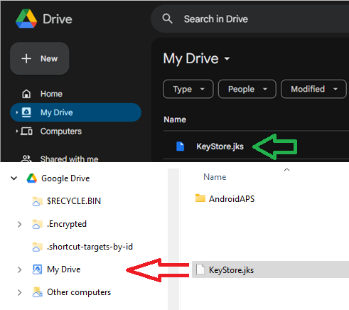

打開文件管理器 Plus 並選擇雲端。

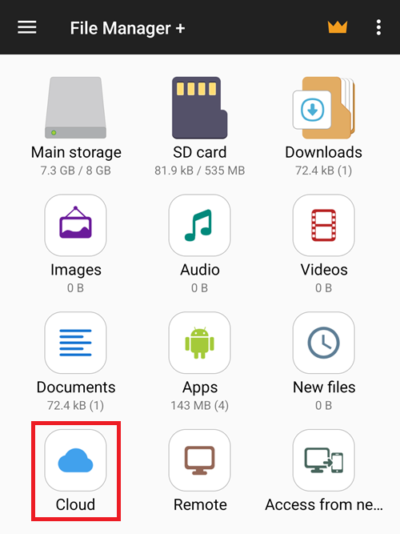

新增雲端位置。

選擇 Google 雲端硬碟。

選擇您的 Google 雲端硬碟帳號電子郵件。 點擊確定。

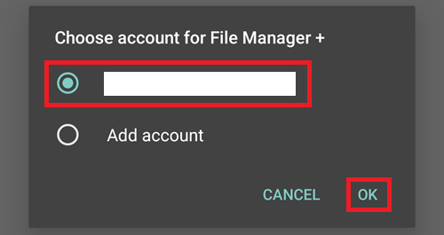

您的 Google 雲端硬碟應顯示其內容。 現在返回應用程式主頁。

### 打開 aaps-ci-preparation.html 檔案

打開您上面下載的檔案 `aaps-ci-preparation-html`。

選擇下載。

並搜尋這個檔案，點擊它以打開，選擇使用 Chrome 打開，然後點擊僅一次。

將會這樣打開。

向下捲動到選項 2：上傳現有的 JKS。 展開介面。

選擇選擇檔案。

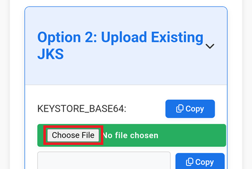

從您的 Google 雲端硬碟中選擇您的金鑰儲存檔。

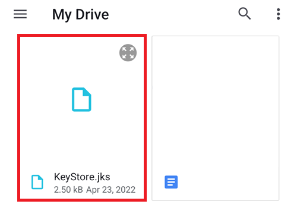

下面的欄位將會填入。

保持此頁面開啟。

### 在 GitHub 中建立一個新的「secret」

返回您的 GitHub 瀏覽器頁面：您自己的 AndroidAPS 複製版。

1. 右上角，點擊 `...` 按鈕
2. 在列表中選擇設定

向下捲動到安全性並選擇「secrets and variables」。

現在選擇動作

向下捲動到儲存庫「secret」並點擊「New repository secret」

您將看到此對話框（如果不顯示，請向下捲動）。

保持此頁籤頁如這樣開啟。

切換到 File Explorer Plus 頁籤。

點擊上方的複製按鈕。

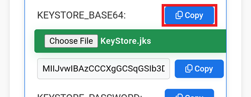

切換回 GitHub 頁籤。

在名稱欄位中，貼上您剛才複製的文字。 在文字框上長按以顯示「貼上」選單。

切換到 File Explorer Plus 頁籤。

點擊第二個複製按鈕。

切換回 GitHub 頁籤。

1. 在「secret」」欄位中，貼上您剛才複製的文字。 在文字框上長按以顯示「貼上」選單。

2. 點擊「Add secret」。

檢查欄位是否已經添加，向下捲動來確認。

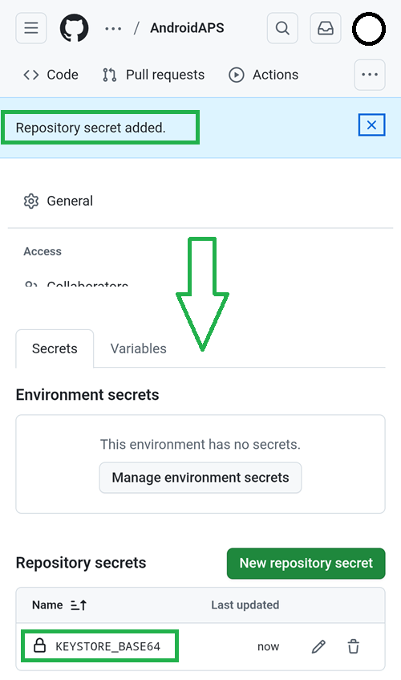

新增一個「secret」：點擊「New repository secret」按鈕。

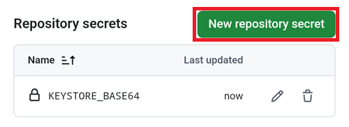

切換到 File Explorer Plus 頁籤。

點擊上方的複製按鈕以複製 `KEYSTORE_PASSWORD`。

注意：如果您習慣直接在 GitHub 中輸入金鑰名稱則不需要複製/貼上。 如果您不確定是否會完全輸入相同的金鑰名稱，請繼續這樣做。 請注意，金鑰名稱的末尾不應留下 `:`。

切換回 GitHub 頁籤。

1.  貼上新的金鑰名稱。
2. 在「secret」欄位中，輸入您的金鑰儲存密碼（不要留空）。
3. 點擊「Add secret」。

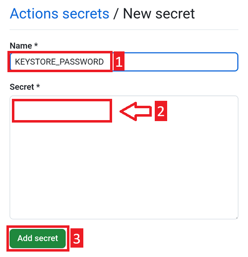

檢查欄位是否已經添加，向下捲動來確認。

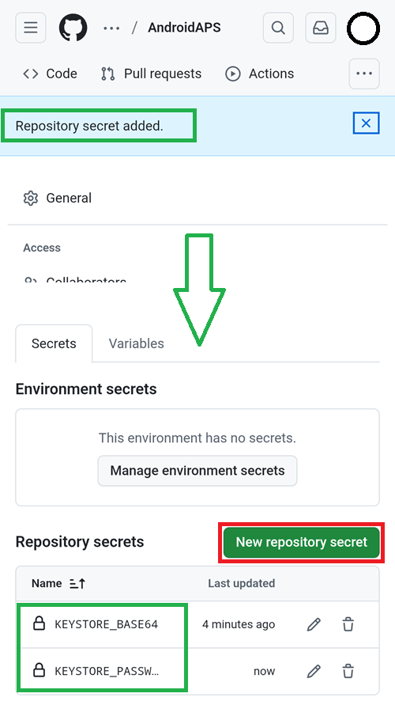

點擊上面顯示的「New repository secret」按鈕。

切換到 File Explorer Plus 頁籤。

點擊上方的複製按鈕以複製 `KEYSTORE_ALIAS`。

切換回 GitHub 頁籤。

1.  貼上新的金鑰名稱。
2. 在「secret」欄位中，輸入您的金鑰儲存別名（通常是 `key0`，小寫的數字零，而不是字母 O）。 不要讓 Android 自動修正它。
3. 點擊「Add secret」。

檢查欄位是否已經添加，向下捲動來確認。

點擊上面顯示的「New repository secret」按鈕。

切換到 File Explorer Plus 頁籤。

點擊上方的複製按鈕以複製 `KEY_PASSWORD`。

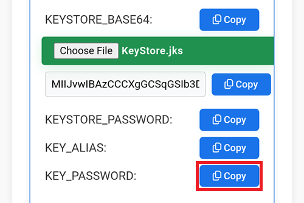

切換回 GitHub 頁籤。

1.  貼上新的金鑰名稱。
2. 在「secret」欄位中，輸入您的金鑰密碼（不要留空）。 通常它與您的金鑰儲存密碼相同。
3. 點擊「Add secret」。

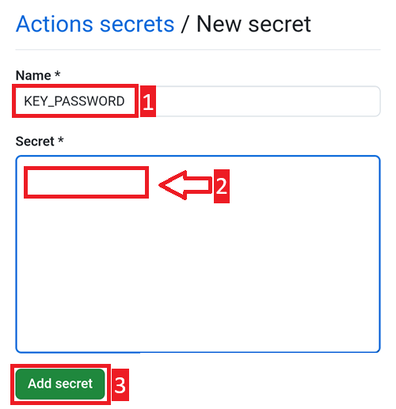

檢查欄位是否已經添加，向下捲動來確認。
