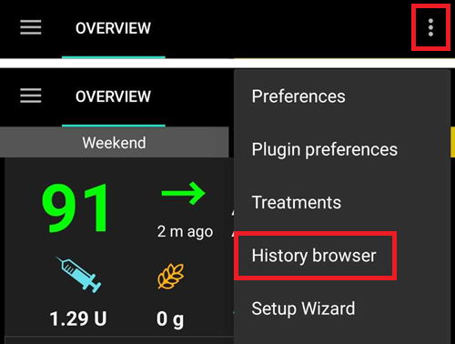
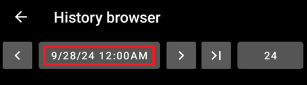
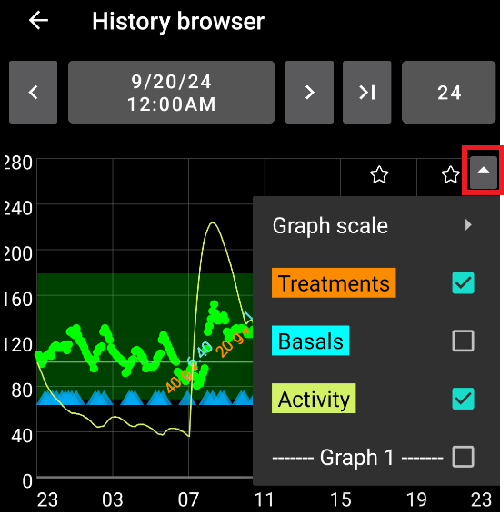
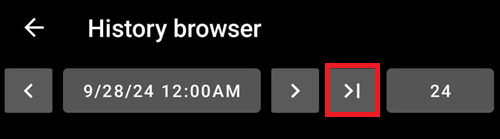
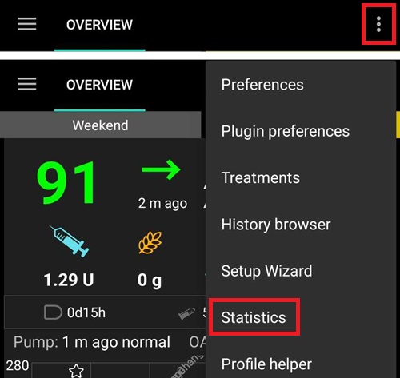
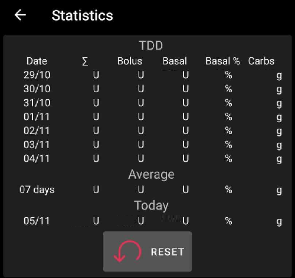
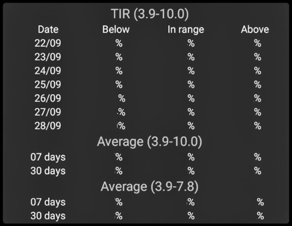
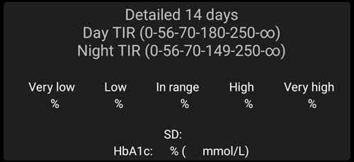
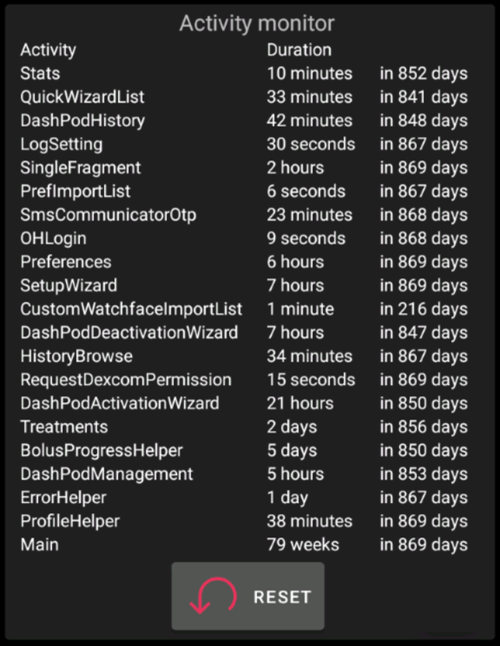

# Reviewing your data

## AAPS History Browser

AAPS stores all history (BG, treatments, basal, targets, profile switch,...) in its own database, that cannot be exported or copied and might require cleanup after a while. In order to review older history, uploading to Nightscout is recommended.

History can be reviewed using History browser, from the Overview menu.



Select the date you want to review.



Display options are available like in the Overview [main graph](../Getting-Started/Screenshots.md#section-f-main-graph).



History browser menu allows the selection of the time scale to be displayed. 6, 12, 18 or 24 hours.


History browser forward and backwards arrows display the history prior or after the current time frame, shifting it by the amount selected in the time scale.


Return to today with this button:




## AAPS Statistics

AAPS provides basic statistics.

Most values are referenced by ADA 2023 [recommendations](https://diabetesjournals.org/care/article/46/Supplement_1/S97/148053/6-Glycemic-Targets-Standards-of-Care-in-Diabetes).



TDD displays one week information on:

- Σ: the Total Daily Dose of insulin (TDD), the sum of bolus and basal insulin delivered during the day.
- Bolus: the sum of bolus treatments and SMBs
- Basal: only basal
- Basal%: the proportion of basal insulin in the sum (TDD)
- Carbs: declared carbs and eCarbs treatments



Time In Range (TIR): 70-180 mg/dl or 3.9-10 mmol/l.

TIR information is available for 7 and 30 days, depending on the amount of data available in AAPS database.

Time In Tight Range (TITR) 70-140 mg/dl or 3.9-7.8 mmol/l statistics are available below.

```{admonition} Discuss targets with your endo
Your diabetes may vary. Discuss targets with your endo.
Statistics are a great tool to follow trends and progress. Use them keeping in mind diabetes management burden and quality of life.
```



Detailed 14 days TIR statistics.

SD: Standard Deviation, an [indicator](https://www.ncbi.nlm.nih.gov/pmc/articles/PMC3125941/) of BG variability (the highest the worst).

HbA1c: the estimate of the resulting glycated hemoglobin, based on the average of CGM measurements. This is an indicative value that might not match blood HbA1c tests.



Activity monitor shows the time spent on each AAPS activity.



## Nightscout

Nightscout allows storage of years of data and offers a wide range of [reporting tools](https://nightscout.github.io/nightscout/reports/).

## Tidepool

Tidepool allows you to [review your data](https://www.tidepool.org/viewing-your-data) and provides [simple sharing with your endo team](https://www.tidepool.org/providers/how-it-works#tidepool-data-platform).
